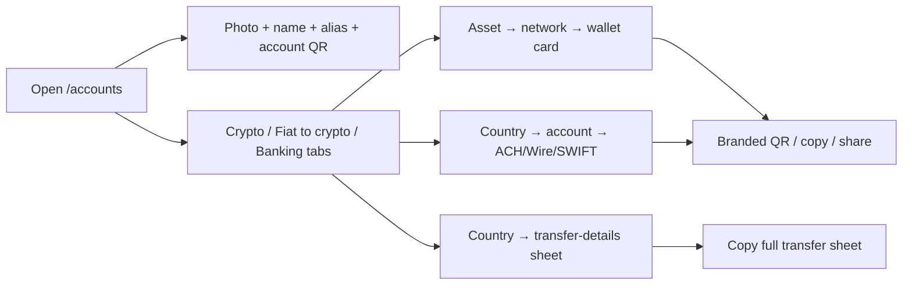

import { EnvUrls } from "/snippets/env-urls.jsx";

<EnvUrls lang="en" />

## One place for your receiving details

The **My accounts** page is the account portal's directory of destinations
that can receive money for you. Open `/accounts` from the sidebar, directly
below **Deposit**. The page keeps your account identity, crypto deposit
wallets, fiat receiving accounts and Banking destinations in one visual
directory.

It does not merge balances that have different financial meanings. A bank
account remains a bank account, a virtual IBAN remains a routing instrument,
and a crypto deposit wallet remains a blockchain address. Use the existing
product pages for sending money, withdrawals and statements.

If a destination or read operation returns an error, use the public
[error catalog](/en/errors) for the code and recovery action.

## CBPAY hero and three account tabs

The page opens with a **CBPAY** hero for your account. It shows the account
owner's photo and name when available, plus the permanent alias and the
account QR. The hero uses the existing `GET /v1/me/qr` response; it does not
invent a QR when the account has none.

Below the hero, the page has three tabs:

- **Crypto** (`?tab=crypto`): choose a crypto asset, then a network, and view
  only the selected deposit wallet with a branded QR.
-  Deposit crypto straight to your wallet on each network.
- **Fiat to crypto** (`?tab=fiat`): choose a country and view the receiving
  **transfer-details sheet** for each account in that country. Fiat sheets
  never show a QR.
-  Deposit fiat to your details and it converts to crypto in your balance.
- **Banking** (`?tab=banking`): choose a country and view Banking accounts.
  United States accounts have the **ACH**, **Wire** and **SWIFT** sub-tabs;
  Europe shows Banking virtual IBANs and company wallets.
-  Bank accounts in your name with a balance in local fiat currency.

**These accounts are yours alone: unique, not shared.**

Where an icon denotes a network, the page uses the network icon: the red TRON
mark for TRON and the blue Ethereum diamond for Ethereum. Token icons continue
to denote assets.

The selected tab and instrument are reflected in the URL. Examples:

- `/accounts?tab=crypto&sel=USDT:tron`
- `/accounts?tab=fiat&sel=BO`
- `/accounts?tab=banking&sel=US:<account_id>:ach`
- `/accounts?tab=banking&sel=EU`

Unknown or malformed values fall back to the safe default; they never expose
another account or create a destination.



<Steps>
<Step title="Open My accounts">
Select **My accounts** from the portal sidebar. The **Wallets** label is the
new name for the area previously shown as **My wallets**; the underlying
wallets and addresses are unchanged.
</Step>
<Step title="Choose a tab and selection">
Select **Crypto**, **Fiat to crypto** or **Banking**, then choose the asset, country,
account or US rail shown by the page. You can bookmark the current view with
its `?tab=&sel=` deep-link.
</Step>
<Step title="Copy or share the right details">
Crypto and Banking cards can display a QR with the organization's branding
symbol, copy individual values or share the selected rail. Fiat to crypto cards have no
QR: use **Copy all** to copy the complete transfer-details sheet, including
the holder, bank, NIT when supplied and receiving number.
</Step>
</Steps>

## What each tab shows

| Tab | What it contains | What you can share |
|---|---|---|
| **Crypto** | Pick an asset and then a network. The selected card shows only that wallet, its address, network, receive-only status and creation time. Supported pairs include TRON/USDT, Ethereum/USDT, Ethereum/USDC and Bitcoin/BTC. | The selected blockchain address or a QR with the organization symbol. |
| **Fiat to crypto** | Pick **MX**, **BO** or **EU**. MX/BO accounts show a transfer-details sheet with the holder, `bank_name` when returned, `merchant_nit` for BO when returned, and the CLABE or account number. EU shows the funding virtual IBAN (`purpose: funding_usdt`). The Fiat to crypto tab has **no QR**. | The complete transfer-details sheet, copied with **Copy all**, or the funding IBAN after checking its status. |
| **Banking** | Pick **US** or **EU**. US accounts are grouped under ACH, Wire and SWIFT sub-tabs using the available receiving fields. EU shows Banking virtual IBANs (`purpose: banking_eur`) and EUR company wallets. Cards show account/IBAN, routing or SWIFT, status and activation details when available. | The selected Banking rail, including its branded QR when available, or the active EUR destination. |

The QR and alias remain available in the CBPAY hero above the tabs. The QR
identifies your account to receive transfers and the alias is optional. A
field is shown only when the API returns it; the page never fabricates a
holder, bank, NIT or account value.

The page uses the same account-scoped resources as the rest of the portal:
`GET /v1/me/qr`, `GET /v1/payins/deposit-accounts`,
`GET /v1/banking/accounts`, `GET /v1/banking/virtual-ibans`,
`GET /v1/banking/company-wallets` and `GET /v1/crypto/wallets`. It is a
navigation and sharing surface, not a new API contract.

## Honest empty and pending states

- **No hero QR:** the account has no QR token available. The page does not
  invent a QR or display a placeholder as if it could receive money.
- **Fiat to crypto has no QR by design:** use the transfer-details sheet and **Copy
  all**. The absence of a QR in Fiat is not a provisioning error.
- **No CLABE or BOB account:** local deposit destinations are provisioned only
  after the account's KYC (person) or KYB (company) is approved. A pending
  approval, an unavailable corridor or an existing claim can leave this
  section empty until reconciliation finishes.
- **Banking USD is empty:** create or complete the Banking profile and
  verification first, then wait for an enabled USD account to become visible.
  A missing account is not a zero balance.
- **EUR shows `pending_approval` or `pending`:** the request is still being
  reconciled. Do not create another virtual IBAN or company wallet just
  because the first read is not active yet.
- **Crypto has fewer addresses than expected:** a newly approved account can
  still be provisioning its deposit wallets. Refresh the page; use the
  existing destination once its address is present. Additional operating
  wallets belong to the separate segregated-wallets product.

If a card shows a temporary read error, refresh the card and keep the existing
request or destination. Do not create a second account, wallet or virtual IBAN
to guess the outcome of an ambiguous operation.

## FAQ

<AccordionGroup>
<Accordion title="Are all the entries on this page wallets?">
No. The page groups different receiving instruments: a QR identity, bank
accounts, virtual IBANs, a company Banking wallet and on-chain deposit
addresses. Their balances and operating rules remain separate.
</Accordion>
<Accordion title="Why did my CLABE or BOB account not appear at registration?">
Registration alone does not provision these destinations. The account must
first reach approved KYC or KYB. After approval, provisioning is triggered
through the normal approval flow and existing accounts can be reconciled by
operations.
</Accordion>
<Accordion title="Can I share the values shown here?">
Yes, share the selected crypto or Banking QR, or the Fiat transfer-details
sheet copied with **Copy all**. Never share session tokens, internal IDs or a
destination copied from another CBPay account. Verify the country, currency
and method before the payer sends.
</Accordion>
<Accordion title="Why does a destination say pending?">
Provisioning or provider reconciliation is still in progress. Keep the
destination request; do not create a second one with a new key. The page will
show the receiving value only once it is available.
</Accordion>
<Accordion title="Does renaming My wallets to Wallets change my addresses?">
No. It is only a portal label change. The wallet IDs, addresses, assets and
receive-only behavior remain the same.
</Accordion>
<Accordion title="Why is a bank name or BO merchant NIT missing?">
Those are optional fields. `bank_name` is shown when the MX receiving rail
returns it, and `merchant_nit` is shown when the BO/BOB rail returns it. A
missing optional field is not replaced with a guessed value; copy the fields
that the API returned.
</Accordion>
</AccordionGroup>

## Disputed balance

The USDT item in `GET /v1/balances` can include `disputed`, the exact amount
currently reserved by open dispute holds:

```json
{ "asset": "USDT", "available": "900.000000", "held": "100.000000", "disputed": "100.000000" }
```
