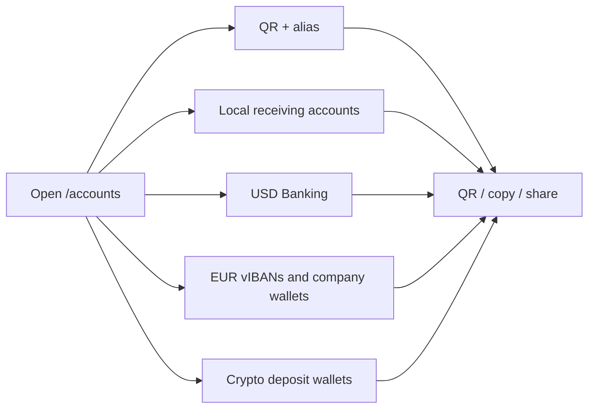

import { EnvUrls } from "/snippets/env-urls.jsx";

<EnvUrls lang="en" />

## One place for your receiving details

The **My accounts** page is the account portal's directory of destinations
that can receive money for you. Open `/accounts` from the sidebar, directly
below **Deposit**. The page groups your QR payment identity, local receiving
accounts, Banking destinations, EUR instruments and crypto deposit wallets.

It does not merge balances that have different financial meanings. A bank
account remains a bank account, a virtual IBAN remains a routing instrument,
and a crypto deposit wallet remains a blockchain address. Use the existing
product pages for sending money, withdrawals and statements.

If a destination or read operation returns an error, use the public
[error catalog](/en/errors) for the code and recovery action.

<Steps>
<Step title="Open My accounts">
Select **My accounts** from the portal sidebar. The **Wallets** label is the
new name for the area previously shown as **My wallets**; the underlying
wallets and addresses are unchanged.
</Step>
<Step title="Choose the receiving destination">
Open the section that matches the payer's rail. Each card shows the
destination's status and the details that can safely be shared with the payer.
</Step>
<Step title="Copy, show or share">
Use the card actions to display a QR code, copy the destination value or share
the receiving details. Share only the destination intended for that payment:
an account or address is bound to your CBPay account and is not interchangeable
with another account's destination.
</Step>
</Steps>

## What each section shows

| Section | What you see | When it is useful |
|---|---|---|
| **QR and alias** | Your branded QR image, payment payload and optional account alias. The QR identifies your account to receive transfers. | Show the QR to a payer who is using the CBPay QR flow. |
| **Local receiving accounts** | Country, currency, method, receiving instrument, status and creation time. This includes MXN CLABE and BOB bank-transfer destinations when enabled. | Copy the CLABE or BOB account number for a bank transfer. |
| **Banking USD** | The enabled USD bank account, its name, currency and status, plus the receiving requirements supplied in its details (for example account number, routing or SWIFT data). | Send wire or SWIFT receiving instructions to a payer. |
| **EUR virtual IBANs** | Purpose (`funding_usdt` or `banking_eur`), currency, status and the IBAN once assigned. A Banking EUR instrument can also show its reconciled `received_total`. | Route EUR funds to the correct purpose without confusing a funding address with a spendable balance. |
| **Company wallets** | For verified companies: reservation status, order reference, wallet UUID, IBAN and activation time when available. The detail view provides the live balance and dated operations. | Use the dedicated EUR company wallet for business Banking activity. |
| **Wallets** | Network, asset, address, wallet type, receive-only status and creation time. Supported deposit pairs include TRON/USDT, Ethereum/USDT, Ethereum/USDC and Bitcoin/BTC. | Copy a blockchain address or display its QR code before sending an on-chain deposit. |

The page uses the same account-scoped resources as the rest of the portal:
`GET /v1/me/qr`, `GET /v1/payins/deposit-accounts`,
`GET /v1/banking/accounts`, `GET /v1/banking/virtual-ibans`,
`GET /v1/banking/company-wallets` and `GET /v1/crypto/wallets`. It is a
navigation and sharing surface, not a new API contract.

## Honest empty and pending states

- **No QR:** the account has no QR token available. The page does not invent a
  QR or display a placeholder as if it could receive money.
- **No CLABE or BOB account:** local deposit destinations are provisioned only
  after the account's KYC (person) or KYB (company) is approved. A pending
  approval, an unavailable corridor or an existing claim can leave this
  section empty until reconciliation finishes.
- **Banking USD is empty:** create or complete the Banking profile and
  verification first, then wait for an enabled USD account to become visible.
  A missing account is not a zero balance.
- **EUR shows `pending_approval` or `pending`:** the request is still being
  reconciled. Do not create another virtual IBAN or company wallet just
  because the first read is not active yet.
- **Crypto has fewer addresses than expected:** a newly approved account can
  still be provisioning its deposit wallets. Refresh the page; use the
  existing destination once its address is present. Additional operating
  wallets belong to the separate segregated-wallets product.

If a card shows a temporary read error, refresh the card and keep the existing
request or destination. Do not create a second account, wallet or virtual IBAN
to guess the outcome of an ambiguous operation.

## FAQ

<AccordionGroup>
<Accordion title="Are all the entries on this page wallets?">
No. The page groups different receiving instruments: a QR identity, bank
accounts, virtual IBANs, a company Banking wallet and on-chain deposit
addresses. Their balances and operating rules remain separate.
</Accordion>
<Accordion title="Why did my CLABE or BOB account not appear at registration?">
Registration alone does not provision these destinations. The account must
first reach approved KYC or KYB. After approval, provisioning is triggered
through the normal approval flow and existing accounts can be reconciled by
operations.
</Accordion>
<Accordion title="Can I share the values shown here?">
Yes, share the QR or the receiving details for the payment you expect. Never
share session tokens, internal IDs or a destination copied from another CBPay
account. Verify the country, currency and method before the payer sends.
</Accordion>
<Accordion title="Why does a destination say pending?">
Provisioning or provider reconciliation is still in progress. Keep the
destination request; do not create a second one with a new key. The page will
show the receiving value only once it is available.
</Accordion>
<Accordion title="Does renaming My wallets to Wallets change my addresses?">
No. It is only a portal label change. The wallet IDs, addresses, assets and
receive-only behavior remain the same.
</Accordion>
</AccordionGroup>
