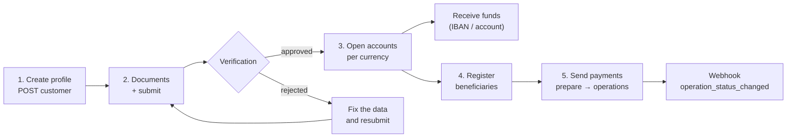
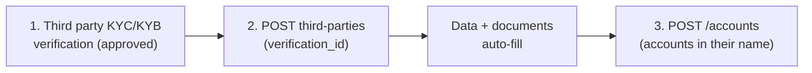

import { EnvUrls } from "/snippets/env-urls.jsx";

<EnvUrls lang="en" />

Banking gives you **real bank accounts** in the name of your verified
profile: you receive funds over international rails (SEPA, SWIFT, ACH
depending on the currency), hold fiat balances and send payments to third
parties. It is a separate product from your USDT balance: **banking money
lives in your bank accounts**, not in the CBPay balance.

| Concept | Where it lives | Queried with |
|---|---|---|
| CBPay USDT balance | CBPay ledger | `GET /v1/balances` |
| Bank balances | Your bank accounts | `GET /v1/banking/accounts/{id}/balance` |

<Note>
Banking fees come in two shapes. **Standalone fixed fees**
(`banking_customer`, `banking_account`, `banking_operation`) are debited
from your **USDT balance** when each operation executes and **refunded
automatically** if it fails. **Transactional rail fees**
(`banking_deposit`, `banking_transfer_ach`, `banking_transfer_swift`,
`banking_transfer_wire`, `banking_transfer_sepa`) are a percentage plus a
fixed amount charged **in the operation currency** (your `BANK_USD` /
`BANK_EUR` balance) — see [rail fees](#rail-fees-deposits-and-transfers).
With a fee of 0 (the default) the service is free. The `banking_fee` and
`banking_fee_asset` fields on each response show what was charged and in
which currency.
</Note>

## The full flow



1. **Create your banking profile** (`POST /v1/banking/customer`) — once.
2. **Upload verification documents** and **submit for review**.
3. Once `approved`, **open accounts** per currency.
4. **Register beneficiaries** (counterparties) for third-party payments.
5. **Send payments**: quote with `prepare`, execute with `operations`.

State changes arrive through the `banking_customer_status_changed` and
`banking_operation_status_changed` webhooks ([webhooks](/en/webhooks)).

## 1. Create your banking profile

Once per account. If you omit `type`, `name` or `email`, they are filled
from your CBPay account:

```bash
curl -X POST https://api.qbank.cl/platform/v1/banking/customer \
  -H "Authorization: Bearer <token>" \
  -H "Content-Type: application/json" \
  -d '{
    "currency": "USD",
    "address": { "countryIso": "CL", "city": "Santiago" }
  }'
```

Response `201`:

```json
{
  "customer_id": "9f2b…",
  "provider_id": "…",
  "status": "draft",
  "data": { "item": { "…": "…" } },
  "created_at": "2026-07-07T12:00:00Z",
  "banking_fee": "5.000000"
}
```

If your account already has a banking profile —
`409 banking_customer_exists`.

<Note>
**Durable idempotency.** The platform derives a deterministic core claim for
this account/profile. The first successful request returns `201`. Repeating
the same request returns `201` with `idempotency_hit: true` and never creates
a second profile or charges the profile fee twice. A different payload for
the same account returns `409 idempotency_conflict`. If the upstream/core
outcome is ambiguous, the API returns `503 banking_recovery_pending`; do not
retry with a new key. Operations must reconcile the durable claim first.
</Note>


<Note>
**Application review.** If your organization enabled banking application review, this request can answer **`202 Accepted`** with `{"status":"in_review","kind":"banking_application","review_id":"…"}` instead of `201` — the profile is created only when compliance approves the review. The banking profile fee is charged when the application is held and **refunded automatically if it is rejected**. Track the result with the webhook `txn_review_status_changed` or in [Transaction reviews](/en/guides/transaction-reviews).
</Note>

Check the state at any time:

```bash
curl https://api.qbank.cl/platform/v1/banking/customer \
  -H "Authorization: Bearer <token>"
```

## 2. Documents and verification

Upload each document as base64 (free):

```bash
curl -X POST https://api.qbank.cl/platform/v1/banking/customer/documents \
  -H "Authorization: Bearer <token>" \
  -H "Content-Type: application/json" \
  -d '{
    "type": "PASSPORT",
    "filename": "passport.pdf",
    "attach": "<base64 content>"
  }'
```

Then submit the profile for review (free):

```bash
curl -X POST https://api.qbank.cl/platform/v1/banking/customer/submit \
  -H "Authorization: Bearer <token>"
```

Profile states: `draft` → `submitted` → `under_review` → **`approved`** or
`rejected`. The `banking_customer_status_changed` webhook notifies each
change — for your own profile (`customer_kind: self`) and for the third
parties you register (`customer_kind: third_party`, with their
`third_party_id`):

```json
{
  "account_id": "…",
  "customer_id": "9f2b…",
  "customer_kind": "self",
  "kyc_status": "approved"
}
```

## 3. Open bank accounts

With the profile `approved`, create one account per currency. Available
currencies: **USD** (ACH/Fedwire/SWIFT rails) and **EUR** (SEPA/SWIFT):

```bash
curl -X POST https://api.qbank.cl/platform/v1/banking/accounts \
  -H "Authorization: Bearer <token>" \
  -H "Content-Type: application/json" \
  -d '{ "currency": "USD", "name": "Operating USD" }'
```

Response `201` — `data` carries the details to **receive** funds (account
number/IBAN, routing, bank):

```json
{
  "account_id": "c4d1…",
  "provider_id": "…",
  "status": "active",
  "data": { "…": "…" },
  "banking_fee": "1.000000"
}
```

List your accounts, fetch the detail of a specific account, and check
balances:

```bash
curl https://api.qbank.cl/platform/v1/banking/accounts \
  -H "Authorization: Bearer <token>"

curl https://api.qbank.cl/platform/v1/banking/accounts/c4d1… \
  -H "Authorization: Bearer <token>"

curl https://api.qbank.cl/platform/v1/banking/accounts/c4d1…/balance \
  -H "Authorization: Bearer <token>"
```

The detail endpoint (`GET /v1/banking/accounts/{id}`) returns the account
LIVE — name, currency, status, and under `data` the **requirements to
receive funds** (wire and local rails: bank, account number/IBAN,
routing). Use it to show the deposit instructions of a specific account
without walking the list:

```json
{
  "account_id": "c4d1…",
  "provider_id": "…",
  "source": "live",
  "data": {
    "name": "Operating USD",
    "currencyCode": "USD",
    "status": "ACCEPT",
    "requisites": [
      { "type": "SWIFT", "…": "…" },
      { "type": "LOCAL", "…": "…" }
    ]
  }
}
```

`source` tells you where the detail came from: `live` (the bank answered
in real time) or `mirror` (the bank could not serve the account at that
moment and the last known snapshot is returned — deposit requirements
remain available).

<Note>
The list exposes only the accounts **enabled for your operation**
according to the corridor configuration. A non-enabled account does not
appear in the list and its by-id queries respond `404 not_found`.
</Note>

<Note>
**Limit for person accounts**: a person account can hold **at most 1 bank
account**. Attempting a second one returns `409 banking_account_limit`.
Company accounts have no limit.
</Note>

## Third-party users (companies only)

If your account is a **company**, besides your own accounts you can
register **third-party banking users** — your end clients (persons or
companies) — each with their own identity and verification and **bank
accounts in their name**. No limit on third parties or accounts per third
party.



### Registering the third party

Registration requires the `verification_id` of an [**approved** KYC/KYB
verification](/en/guides/kyc) of the third party — their single identity
inside CBPay. The type comes from the verification kind (KYC ⇒
`INDIVIDUAL`, KYB ⇒ `COMPANY`), the data (name, email, address) auto-fills
from the verified profile (whatever you send explicitly wins), and the
**already-validated documents are re-delivered automatically** to the
banking provider. The banking profile fee is charged (refunded if the
registration fails):

```bash
curl -X POST https://api.qbank.cl/platform/v1/banking/third-parties \
  -H "Authorization: Bearer <token>" \
  -H "Content-Type: application/json" \
  -d '{
    "verification_id": "c3d4e5f6-a7b8-4c9d-0e1f-2a3b4c5d6e7f"
  }'
```

Response `201`:

```json
{
  "third_party_id": "7f2a…",
  "customer_id": "…",
  "kind": "third_party",
  "status": "pending",
  "verification_id": "c3d4e5f6-a7b8-4c9d-0e1f-2a3b4c5d6e7f",
  "documents_synced": 2,
  "registered_at": "2026-07-10T15:00:00Z",
  "banking_fee": "1.000000"
}
```

<Note>
`documents_synced` counts the verification documents that were loaded
automatically into the third party's banking profile. If one could not be
synced (or the bank requests additional categories), upload it through the
manual document flow below and then `submit`.
</Note>

<Note>
**Application review.** With banking application review enabled, registering a third party can also answer **`202 Accepted`** (`kind: banking_application`): the third party is registered only when the review is approved, and the registration fee is refunded automatically on rejection. Track it via `txn_review_status_changed` or [Transaction reviews](/en/guides/transaction-reviews).
</Note>

Save the `third_party_id`: every third-party route uses it. List and fetch
(the GET carries the live verification status):

```bash
curl "https://api.qbank.cl/platform/v1/banking/third-parties?page=1&page_size=50" \
  -H "Authorization: Bearer <token>"

curl https://api.qbank.cl/platform/v1/banking/third-parties/7f2a… \
  -H "Authorization: Bearer <token>"
```

### Third-party verification (free)

Same as your own profile, but on the third party:

```bash
curl -X POST https://api.qbank.cl/platform/v1/banking/third-parties/7f2a…/documents \
  -H "Authorization: Bearer <token>" \
  -H "Content-Type: application/json" \
  -d '{ "type": "PASSPORT", "file_base64": "…" }'

curl -X POST https://api.qbank.cl/platform/v1/banking/third-parties/7f2a…/submit \
  -H "Authorization: Bearer <token>"
```

### Third-party accounts

Once the third party is approved, open accounts for them (same
`banking_account` fee) and operate just like your own:

```bash
curl -X POST https://api.qbank.cl/platform/v1/banking/third-parties/7f2a…/accounts \
  -H "Authorization: Bearer <token>" \
  -H "Content-Type: application/json" \
  -d '{ "currency": "USD", "name": "Carlos account" }'

curl https://api.qbank.cl/platform/v1/banking/third-parties/7f2a…/accounts \
  -H "Authorization: Bearer <token>"

curl https://api.qbank.cl/platform/v1/banking/third-parties/7f2a…/accounts/{bankAccountID}/balance \
  -H "Authorization: Bearer <token>"
```

- Each third party belongs to you and only you: another CBPay account can
  never see or operate it (it gets `404`).
- A **person** account attempting to create third parties receives
  `403 company_required`.
- Without `verification_id` (or with a non-approved verification) the
  registration answers `422 verification_required` /
  `422 verification_not_approved`. If you send a `type` that does not match
  the verification kind, `422 verification_kind_mismatch`. Third parties
  created before this rule keep operating normally.
- Registered third parties feed the "new users" metric of your
  [account summary](/en/guides/analytics).

## 4. Register beneficiaries

To pay third parties, first register the beneficiary with their banking
details (free; it goes through moderation before it can be used):

```bash
curl -X POST https://api.qbank.cl/platform/v1/banking/counterparties \
  -H "Authorization: Bearer <token>" \
  -H "Content-Type: application/json" \
  -d '{
    "description": "ACME supplier",
    "profile": {
      "name": "ACME LLC",
      "address": { "addressLine1": "1 Main St", "city": "New York", "stateIso": "NY", "countryIso": "US", "postalCode": "10001" },
      "additionalInfo": { "type": "CORPORATION" }
    },
    "accounts": [
      {
        "currencyCode": "USD",
        "bank": { "name": "Test Bank", "number": "011000138" },
        "fiat": {
          "number": "0532013000",
          "routingNumber": "011000138",
          "additionalInformation": { "type": "TYPE_FIAT_US", "accountType": "CHECKING", "supportedRails": ["ACH"] }
        }
      }
    ]
  }'
```

List yours with `GET /v1/banking/counterparties` and attach more accounts
to an existing beneficiary with
`POST /v1/banking/counterparties/{id}/accounts`.

## 5. Send payments

Two operation types:

| `type` | What it does | `paymentType` |
|---|---|---|
| `TRANSFER` | Between your own bank accounts | `EMPTY` |
| `WITHDRAW` | To a registered beneficiary | Per rail (e.g. `SEPA_CT`) |

Quote first (free, moves no money):

```bash
curl -X POST https://api.qbank.cl/platform/v1/banking/operations/prepare \
  -H "Authorization: Bearer <token>" \
  -H "Content-Type: application/json" \
  -d '{
    "currency": "USD",
    "type": "WITHDRAW",
    "paymentType": "SEPA_CT",
    "sourceRequisit": { "account": "c4d1…" },
    "destinationRequisit": { "beneficiar": "<beneficiary account>" },
    "amount": { "currencyCode": "USD", "units": "250", "nanos": 0 }
  }'
```

Execute with an idempotency key (the rail fee — or the legacy
`banking_operation` fee when the rail has no configuration — is charged
here):

<CodeGroup>

```bash WITHDRAW (to a beneficiary)
curl -X POST https://api.qbank.cl/platform/v1/banking/operations \
  -H "Authorization: Bearer <token>" \
  -H "Idempotency-Key: acme-payment-0071" \
  -H "Content-Type: application/json" \
  -d '{
    "currency": "USD",
    "type": "WITHDRAW",
    "paymentType": "SEPA_CT",
    "sourceRequisit": { "account": "c4d1…" },
    "destinationRequisit": { "beneficiar": "<beneficiary account>" },
    "amount": { "currencyCode": "USD", "units": "250", "nanos": 0 },
    "comment": "Invoice 8841"
  }'
```

```bash TRANSFER (between your accounts)
curl -X POST https://api.qbank.cl/platform/v1/banking/operations \
  -H "Authorization: Bearer <token>" \
  -H "Idempotency-Key: internal-move-0012" \
  -H "Content-Type: application/json" \
  -d '{
    "currency": "USD",
    "type": "TRANSFER",
    "paymentType": "EMPTY",
    "sourceRequisit": { "account": "c4d1…" },
    "destinationRequisit": { "account": "<another account of yours>" },
    "amount": { "currencyCode": "USD", "units": "100", "nanos": 0 }
  }'
```

</CodeGroup>

Response `202`:

```json
{
  "operation_id": "7e8a…",
  "provider_id": "…",
  "status": "pending",
  "idempotency_key": "platform:…:acme-payment-0071",
  "data": { "…": "…" },
  "banking_fee": "2.000000",
  "banking_fee_asset": "BANK_USD"
}
```

`banking_fee` and `banking_fee_asset` only appear when a fee was charged.
With a per-rail fee the asset is the operation currency (`BANK_USD` /
`BANK_EUR`); with the legacy fallback it is `USDT`.

- The final state arrives through the `banking_operation_status_changed`
  webhook (`completed` / `failed`); you can also poll
  `GET /v1/banking/operations/{id}`. Once the operation reaches a final
  state, the webhook includes its `receipt_url` and you can download the
  PDF receipt with `GET /v1/banking/operations/{id}/receipt`
  ([receipts](/en/guides/receipts)).
- Retries with the same `Idempotency-Key` return the original operation
  (`idempotency_hit: true`) **without charging the fee again**.

<Note>
**Complete traceability.** Every banking operation is recorded on your
account: it shows up in the `banking_operations` section of the
[statement](/en/guides/statement), its money reconciles in the
`BANK_USD`/`BANK_EUR` mirror balances (`assets` section), and its volume
adds to the `gross_volume` in [analytics](/en/guides/analytics). The
authoritative balance remains the bank's: the mirror is reconciled
periodically.
</Note>

The full history, with filters:

```bash
curl "https://api.qbank.cl/platform/v1/banking/operations?from=2026-07-01&to=2026-07-08&status=completed&type=WITHDRAW&page_size=50" \
  -H "Authorization: Bearer <token>"
```

```json
{
  "items": [
    {
      "id": "7e8a…",
      "type": "withdraw",
      "status": "completed"
    }
  ],
  "meta": { "page": 1, "page_size": 50, "retrieved": 1 }
}
```

<Note>
Every banking operation — including inbound deposits and bank fees
discovered automatically from the bank — exposes its `direction` (`in` /
`out`), net `amount`, `currency`, `counterparty` and `reference` whenever
the bank reports them. These fields are optional and appear in
`GET /v1/banking/operations` and `GET /v1/banking/operations/{id}`.
</Note>

The `banking_operation_status_changed` webhook stays lightweight by design:
it carries the identifiers and the new status only, never the enriched
fields. When it fires, fetch the operation detail to read the direction,
amount, counterparty and reference. See [webhooks](/en/webhooks).

## Rail fees (deposits and transfers)

On top of the standalone fixed fees, banking supports **transactional fees
per rail** — a percentage plus a fixed amount, always charged **in the
operation currency** (`BANK_USD` / `BANK_EUR`), never in USDT:

| Service | Applies to | When it is charged |
|---|---|---|
| `banking_deposit` | Incoming deposits (USD/EUR) | When the deposit is credited — **capped at the deposit amount** (`fee = min(fee, amount)`), so a small deposit never goes negative |
| `banking_transfer_ach` | Outgoing ACH transfers | At dispatch, with a fail-closed balance check |
| `banking_transfer_swift` | Outgoing SWIFT transfers | At dispatch, with a fail-closed balance check |
| `banking_transfer_wire` | Outgoing wire transfers (FEDWIRE) | At dispatch, with a fail-closed balance check |
| `banking_transfer_sepa` | Outgoing SEPA transfers | At dispatch, with a fail-closed balance check |

For **transfers** the available balance must cover `amount + fee` — if it
does not, the API answers `402 insufficient_funds` and the operation is
**not created**. If the operation is definitively rejected right after
dispatch, the fee is **refunded automatically** (same discipline as the
legacy fee).

**Fallback:** if the rail has no specific configuration (neither at account
nor at platform level), the legacy `banking_operation` fee (fixed, in USDT)
applies. A rail configured with 0% + 0 fixed is **explicitly free** — it
does *not* fall back to the legacy fee.

## Operation statuses

| Status | Meaning |
|---|---|
| `pending` | Accepted, awaiting processing |
| `processing` | Executing on the banking rail |
| `completed` | The money arrived — final |
| `failed` | Failed; the operation fee (if any) was refunded |
| `cancelled` | Cancelled before execution |

## Errors

| HTTP | `error` | What to do |
|---|---|---|
| 400 | `idempotency_key_required` | Send the key in body or header |
| 402 | `insufficient_funds` | Not enough balance: with a per-rail fee the check is `balance ≥ amount + fee` in the **operation currency** (`BANK_USD`/`BANK_EUR`); with the legacy fallback it is your USDT balance |
| 403 | `account_blocked` | The account is not active; contact the CBPay team |
| 409 | `banking_customer_exists` | Your account already has a banking profile (`GET /v1/banking/customer`) |
| 409 | `idempotency_conflict` | The same banking profile claim is still pending or the payload changed — keep the same request data and do not create a second profile |
| 503 | `banking_recovery_pending` | The customer creation outcome is ambiguous — operations must reconcile the durable claim before retrying with a new key |
| 409 | `no_banking_customer` | Create your profile first (`POST /v1/banking/customer`) |
| 409 | `banking_account_limit` | Person accounts can hold at most 1 bank account |
| 403 | `company_required` | Third-party users are available for company accounts only |
| 422 | `verification_required` | Third-party registration requires the `verification_id` of an approved verification ([verify first](/en/guides/kyc)) |
| 422 | `verification_not_approved` | The referenced verification is not approved yet; wait for approval |
| 422 | `verification_kind_mismatch` | The `type` sent does not match the verification kind (KYC ⇒ INDIVIDUAL, KYB ⇒ COMPANY) |
| 422 | `verification_invalid` | You referenced your onboarding verification; the third party needs their own |
| 404 | `not_found` | The third party (or the verification) does not exist or does not belong to your account |
| 502 | `banking_request_failed` | Banking corridor error; the fee was refunded — retry |

The general error catalog lives in [Errors](/en/errors).

## FAQ

<AccordionGroup>
<Accordion title="Does banking money show up in my USDT balance?">
A `funding_usdt` inbound converts into USDT through the funding payin chain. A `banking_eur` inbound is credited to the Banking EUR mirror after the terminal event and ledger processing. The provider remains authoritative for the bank balance. **Per-rail fees** are charged in the
operation currency (your `BANK_USD`/`BANK_EUR` balance); only the legacy
`banking_operation` fallback fee is debited from your USDT balance.
</Accordion>
<Accordion title="What happens to the fee if an operation fails?">
It is refunded automatically — profile, account and operation fees alike,
including per-rail fees (refunded on the definitive synchronous rejection).
A retry with the same `Idempotency-Key` returns the original operation
(`idempotency_hit: true`) and never charges twice.
</Accordion>
<Accordion title="How many bank accounts can I open?">
One per currency (USD, EUR). Additionally, **person** accounts can hold at
most 1 bank account in total (`409 banking_account_limit`); company
accounts have no limit.
</Accordion>
<Accordion title="Why doesn't one of my accounts appear in the list?">
The list only exposes accounts **enabled for your operation** per the
corridor configuration. A non-enabled account does not appear and its
by-id queries answer `404 not_found` — contact your CBPay team if you need
it enabled.
</Accordion>
<Accordion title="Can a person account register third-party users?">
No — third parties are a company feature (`403 company_required`).
Registration also requires the `verification_id` of an **approved** KYC/KYB
verification of the third party.
</Accordion>
<Accordion title="How do I know when a payment reached its final state?">
Subscribe to `banking_operation_status_changed`: it fires on `completed` /
`failed` and includes the `receipt_url` once final. You can also poll
`GET /v1/banking/operations/{id}`.
</Accordion>
</AccordionGroup>

## Banking creation claims and recovery

Creation claims are durable records, not permission to send a second provider
request. The platform stores `banking_creation_claims` with `kind`,
`idempotency_key`, `request_hash`, status, attempts and refund state. Migration
105 creates this table and its single-flight lock; migration 106 stores
transaction-firewall fee-refund recovery. Migration 074 persists the resolved
core provider on customer idempotency claims.

### Recovery rules

- A completed account recovery compares the provider account ownership with
  the claimed customer's `ProviderID`.
- A terminal provider authentication response (`401` or `403`) does not by
  itself prove that the creation failed; the claim remains recoverable.
- Reusing the same idempotency key with a different request hash is rejected.
- A completed claim can be replayed with HTTP `200` and `idempotency_hit: true`;
  recovery does not call the provider again.
- `POST /v1/org/banking/creation-claims/refund` retries a pending fee refund
  for `kind=customer` or `kind=account`.
- `POST /v1/org/txn-firewall/fee-refunds/{resourceID}/retry` retries the
  durable firewall-fee refund. A completed refund replays as HTTP `200`.

The core admin route
`POST /v1/ops/banking/account-creations/reconcile` verifies the provider
account and finalizes the local mirror. The org-admin routes list claims,
reconcile customer claims, and retry refunds. These operations are locked so
concurrent reconciliation cannot originate duplicate money movement.

## EUR virtual IBANs

The platform can request a virtual IBAN for an active, verified account. A
virtual IBAN is an addressing and routing instrument; it is not a separate
provider balance. The account surface exposes the durable request and its
status. Inbound processing and returns/recalls are implemented for both
purposes below; provider customer-onboarding and production activation details
remain outside the public contract.

Two purposes are supported:

| Purpose | Default | Meaning |
|---|---:|---|
| `funding_usdt` | Yes | EUR funding address associated with the USDT funding product. |
| `banking_eur` | No | EUR banking address. The account must also have the Banking product enabled. |

Request the default funding address with an idempotency key:

```bash
curl -X POST https://api.qbank.cl/platform/v1/banking/virtual-ibans \
  -H "Authorization: Bearer <token>" \
  -H "Idempotency-Key: viban-funding-2026-001" \
  -H "Content-Type: application/json" \
  -d '{"purpose":"funding_usdt"}'
```

The request is accepted into the manual approval queue:

```json
{
  "virtual_iban": {
    "id": "2f8c1d4e-1111-4b22-8a33-000000000001",
    "owner_account_id": "9b1deb4d-3b7d-4bad-9bdd-2b0d7b3dcb6d",
    "manager_account_id": "",
    "purpose": "funding_usdt",
    "currency": "EUR",
    "iban": "",
    "iban_country": "",
    "status": "pending_approval",
    "client_order": "platform:virtual-iban:org:account:funding_usdt:viban-funding-2026-001",
    "order_reference": "",
    "created_at": "2026-09-10T12:00:00Z",
    "updated_at": "2026-09-10T12:00:00Z"
  },
  "status": "pending_approval"
}
```

`banking_eur` is requested explicitly:

```bash
curl -X POST https://api.qbank.cl/platform/v1/banking/virtual-ibans \
  -H "Authorization: Bearer <token>" \
  -H "Idempotency-Key: viban-eur-2026-001" \
  -H "Content-Type: application/json" \
  -d '{"purpose":"banking_eur"}'
```

List the account's requests with the mandatory date window:

```bash
curl "https://api.qbank.cl/platform/v1/banking/virtual-ibans?page=1&page_size=50&from=2026-09-01&to=2026-09-11&purpose=funding_usdt" \
  -H "Authorization: Bearer <token>"
```

The list shape is `{page, page_size, virtual_ibans}`. Supported statuses are
`pending_approval`, `pending`, `active`, `rejected`, `failed`, `disabled` and
`closed`. Account-level responses show the full IBAN when one has been
assigned; the organization-admin read surface masks it.

<Warning>
The banking corridor may require operations approval and a verified customer
profile before an EUR virtual IBAN can become active. Production host,
certificate/mTLS, limits, commercial fees and activation details are
configuration concerns and are not part of this provider-agnostic contract.
Never infer them from examples.
</Warning>

### Errors

| HTTP | Code | Action |
|---:|---|---|
| 400 | `invalid_json` | Send a JSON object. |
| 400 | `invalid_purpose` | Use `funding_usdt` or `banking_eur`. |
| 400 | `idempotency_key_required` | Send `Idempotency-Key` or `idempotency_key`. |
| 403 | `verification_required` / service-gate error | Complete account verification and enable the required product. |
| 409 | `virtual_iban_conflict` | Reuse the original request; do not create a second allocation. |
| 503 | `banking_recovery_pending` | The durable request could not be checked or persisted; reconcile before retrying. |

### FAQ

<AccordionGroup>
<Accordion title="Does requesting a virtual IBAN create a BANK_EUR balance?">
No. The purpose is recorded on the request, but a virtual IBAN is not an
independent provider balance. The balance and financial treatment are
documented only when the corresponding Banking EUR ledger flow is enabled.
</Accordion>
<Accordion title="Can I retry after a timeout?">
Retry with the same idempotency key. A new key can create a new request and
must not be used to guess the result of an ambiguous provider call.
</Accordion>
<Accordion title="Why is the status pending_approval?">
Every allocation is manually approved by organization operations before the
core calls the banking rail.
</Accordion>
</AccordionGroup>

## Verified inbound processing

When the banking provider sends a terminal inbound event, the core normalizes
it into `banking_virtual_iban_inbound`. The platform resolves the owning
vIBAN and applies its purpose:

- `funding_usdt` creates a `banking_funding` payin in EUR, applies the marked
  EUR→USDT rate and the configured funding fee/spread, then follows the normal
  payin firewall and credit chain.
- `banking_eur` creates an inbound Banking mirror in `BANK_EUR`, uses the
  Banking ledger path, emits KYT/operation status and queues the banking
  receipt email.

Only terminal statuses (`completed`, `success`, `settled`, `credited` or
`succeeded`) apply the financial effect. Pending or unknown statuses remain
reconcilable and do not credit a balance.

`failed` and `rejected` are terminal negative outcomes. They do not create a
credit; an uncredited funding payin is marked failed without a refund loop.

<Note>
Returns and recalls are handled as terminal `returned`, `recalled` or
`reversed` events. A return before credit prevents a later completion replay
from crediting. A credited `funding_usdt` payin creates the deterministic
chargeback/refund path; a ledgered `banking_eur` operation receives an
append-only reverse entry. A later completion event cannot resurrect a returned
operation.
</Note>

## EUR inbound traceability

EUR virtual-IBAN inbound operations preserve their rail and product purpose
through the banking mirror, statement and analytics. The account operation
detail can expose `payment_rail: "SEPA_INSTANT"`, `purpose` (`funding_usdt` or
`banking_eur`) and the associated virtual IBAN reference when reported by the
banking rail. A `funding_usdt` terminal event enters the normal payin credit
chain; a `banking_eur` terminal event is recorded as a `BANK_EUR` banking
operation and receipt.

## Virtual IBANs for third parties

Company accounts can request a `banking_eur` vIBAN for an owned third party
after the third party has accepted the invitation and completed approved
KYC/KYB. The third party is the balance owner; the company remains the
relationship manager:

```bash
curl -X POST https://api.qbank.cl/platform/v1/banking/third-parties/7f2a0000-0000-4000-8000-000000000001/virtual-ibans   -H "Authorization: Bearer <token>"   -H "Idempotency-Key: third-party-viban-2026-001"   -H "Content-Type: application/json"   -d '{}'
```

The resulting request is `banking_eur` and follows the same manual approval
and status lifecycle as an account-owned request.

### BANK_EUR balance

For a `banking_eur` request, query the reconciled balance explicitly:

```bash
curl https://api.qbank.cl/platform/v1/banking/virtual-ibans/2f8c1d4e-1111-4b22-8a33-000000000001/balance   -H "Authorization: Bearer <token>"
```

```json
{
  "virtual_iban_id": "2f8c1d4e-1111-4b22-8a33-000000000001",
  "currency": "EUR",
  "asset": "BANK_EUR",
  "available": "80.00",
  "held": "0.00",
  "purpose": "banking_eur",
  "source": "platform_ledger_reconciled_to_banking_provider"
}
```

The route returns `409 balance_not_available` for `funding_usdt`, because that
purpose converts through the USDT payin chain instead of holding `BANK_EUR`.
