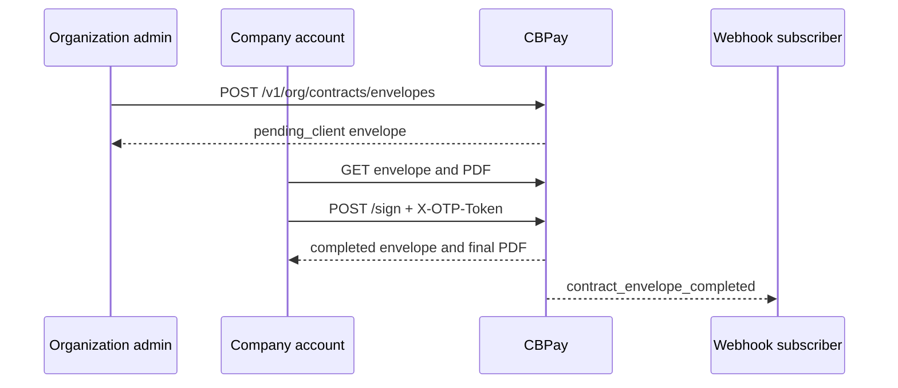

The Grupo CB framework agreement is a pre-filled document issued by CBPay for
a verified company account. CBPay resolves the company's legal identity,
verified address, active services, fees and its current CBPay signature before
creating the envelope. If a required value has no verified source, the
envelope is not created.

The ceremony is completed by a human owner or operator of the company account.
It requires explicit consent and a fresh, single-use OTP. API keys cannot sign.

For test requests, use `https://cryptobank.qbank.cl/platform`; use
`https://api.qbank.cl/platform` only for production.



## Eligibility and states

The account must be an active company account with approved KYB. The envelope
is scoped to the organization and the account; a foreign ID returns
`404 not_found`.

| State | Meaning | Next action |
|---|---|---|
| `pending_client` | CBPay has pre-signed the frozen document and the client has not completed the ceremony. | Review and sign, or ask the organization admin to void/reissue it. |
| `completed` | The client signature, consent and OTP claim succeeded; the final PDF was generated. | Read or download the final document. It cannot be voided. |
| `voided` | An organization admin cancelled the pending envelope with a reason. | Issue a new envelope if the agreement must be corrected. |

There is no `draft` or generic `pending` state.

For `lang=en`, the organization must have the platform setting
`contract_counsel_approved_en=true`. Spanish issuance does not require that
English-counsel gate. The document template is version `v13.3`; its hash and
the CBPay signature version are frozen in the envelope snapshot.

## Pricing coverage and displayed amounts

The organization issue endpoint checks pricing coverage before creating the
envelope. If an enabled service has no effective fee row, it returns HTTP 422
`contract_unfillable` with a `missing` array containing values in the form
`pricing:<flag>`. An explicit zero-percent, zero-fixed row is a valid free
configuration. `transfers` and `swaps` are exempt from this fee-row gate.

Operationally, the v13.3 agreement body no longer embeds a flat fixed-price
table. Appendix A points to the current Client Fee Schedule/Program, and its
applicable entries are grouped with localized pricing labels matching the
portal/admin pricing board, including Fiat payments, Compliance, Cards,
Banking, Wallets and Other. The effective configuration captured at issue
governs; an organization administrator must repair missing pricing and issue a
new envelope.

The internal margins `fx_spread`, `settlement_spread` and `swap_spread` do not
appear in the account-facing `fill_snapshot` or the PDF pricing appendix. The
organization-admin view retains the complete pricing snapshot for audit.

## Ceremony

<Steps>
  <Step title="List and open the envelope">
    Use `GET /v1/me/contracts/envelopes` and then
    `GET /v1/me/contracts/envelopes/{envelopeID}`. The list uses `page` and
    `page_size` (default 50, maximum 200). The list response uses `items`;
    the detail response includes append-only `events`, with each event name in
    `event`.

```bash
curl "https://api.qbank.cl/platform/v1/me/contracts/envelopes?page=1&page_size=50" \
  -H "Authorization: Bearer <CBPAY_TOKEN>"
```
  </Step>

  <Step title="Download the document before signing">
    `GET /v1/me/contracts/{envelopeID}/pdf` returns PDF bytes. Save the file
    and make sure the legal name, address, service schedule and fee schedule
    are correct. The document is pre-signed by CBPay, but remains
    `pending_client` until the ceremony is completed.

```bash
curl -o contrato-marco.pdf \
  "https://api.qbank.cl/platform/v1/me/contracts/envelopes/<ENVELOPE_ID>/pdf" \
  -H "Authorization: Bearer <CBPAY_TOKEN>"
```
  </Step>

  <Step title="Provide signer identity and consent">
    Send the signer's name and title in the JSON body. Consent must be the
    JSON boolean `true`. Include the client's handwritten signature as
    `signature_png`, a Base64-encoded PNG. The optional
    `data:image/png;base64,` prefix is accepted. The OTP is **not** a JSON
    `code` field: send the fresh single-use token in the `X-OTP-Token` header.

```bash
curl -X POST \
  "https://api.qbank.cl/platform/v1/me/contracts/envelopes/<ENVELOPE_ID>/sign" \
  -H "Authorization: Bearer <CBPAY_TOKEN>" \
  -H "Content-Type: application/json" \
  -H "X-OTP-Token: <FRESH_SINGLE_USE_OTP_TOKEN>" \
  -d '{
    "signer_name": "Jordan Lee",
    "signer_title": "Chief Executive Officer",
    "consent": true,
    "signature_png": "<PNG_BASE64_SIGNATURE>"
  }'
```
  </Step>

  <Step title="Confirm completion">
    A successful response returns the envelope in `completed`. Read the
    resource again and download the PDF so your system stores the final
    `final_hash`. The `contract_envelope_completed` event is delivered to the
    organization-admin audience. The completed client claim also automatically
    records the Client Journey milestone `contract_signed` with actor
    `system:contract-ceremony`; this is not a manual admin milestone.
  </Step>
</Steps>

## Client signature image

`signature_png` is required on every client signing request. The API accepts a
Base64-encoded PNG with or without the `data:image/png;base64,` prefix. Before
claiming the envelope, it decodes and validates the image: at most 700,000
Base64 characters, at most 512 KiB decoded, minimum dimensions of 64×16
pixels, and at least 200 ink pixels. A failure returns HTTP 422
`invalid_signature_image`; the message identifies the validation cause.

After a successful claim, the PNG is embedded in the Client signature block
of the final PDF. List and detail responses expose only the boolean
`has_client_signature`; the signature bytes and storage key are never returned.
Earlier envelopes without a stored image continue to render the textual
signature block.

## Signing notification

When an envelope is issued or reissued, the account receives a notification
email with the pre-signed PDF attached. When the portal URL is configured, the
email includes a **Review and sign** button and the same `/contracts/{id}`
deep-link as plain text. Email delivery is best-effort; use the envelope
resource and its events as the source of truth.

## Response examples

List response:

```json
{
  "items": [
    {
      "id": "7c9e2f1a-4b3c-4d5e-8f60-1a2b3c4d5e6f",
      "account_id": "8d0f1a2b-3c4d-4e5f-9012-6a7b8c9d0e1f",
      "template_version": "v13.3",
      "lang": "en",
      "status": "pending_client",
      "has_client_signature": false,
      "doc_hash": "sha256-of-the-presigned-pdf",
      "cb_signature_id": "a1b2c3d4-e5f6-4a7b-8c9d-0e1f2a3b4c5d",
      "created_at": "2026-10-01T14:00:00Z",
      "updated_at": "2026-10-01T14:00:00Z"
    }
  ],
  "page": 1,
  "page_size": 50
}
```

Completed response:

```json
{
  "id": "7c9e2f1a-4b3c-4d5e-8f60-1a2b3c4d5e6f",
  "account_id": "8d0f1a2b-3c4d-4e5f-9012-6a7b8c9d0e1f",
  "template_version": "v13.3",
  "lang": "en",
  "status": "completed",
  "has_client_signature": true,
  "doc_hash": "sha256-of-the-presigned-pdf",
  "final_hash": "sha256-of-the-final-pdf",
  "signer_name": "Jordan Lee",
  "signer_title": "Chief Executive Officer",
  "signer_email": "jordan@example.com",
  "signed_at": "2026-10-01T14:03:12Z",
  "otp_channel": "otp",
  "created_at": "2026-10-01T14:00:00Z",
  "updated_at": "2026-10-01T14:03:12Z",
  "events": [
    {
      "event": "completed",
      "actor": "jordan@example.com",
      "created_at": "2026-10-01T14:03:12Z",
      "detail": {
        "final_hash": "sha256-of-the-final-pdf"
      }
    }
  ]
}
```

## Completion event

Subscribe to `contract_envelope_completed` to update an organization-admin
queue. The event is organization-admin only; the account receives the final
PDF by email and can read it through its own envelope endpoints.

The current platform payload is:

```json
{
  "event_type": "contract_envelope_completed",
  "account_id": "8d0f1a2b-3c4d-4e5f-9012-6a7b8c9d0e1f",
  "payload": {
    "envelope_id": "7c9e2f1a-4b3c-4d5e-8f60-1a2b3c4d5e6f",
    "final_hash": "sha256-of-the-final-pdf",
    "signer": "Jordan Lee"
  }
}
```

The signed timestamp and language remain available from the envelope detail.
Do not infer completion from email delivery: use the event and the resource
state.

## Errors and solutions

| HTTP | Code | Cause and solution |
|---|---|---|
| 400 | `idempotency_key_required` | The org-admin issuer did not send a body key or `Idempotency-Key`; provide one and retry the same request. |
| 400 | `invalid_idempotency_key` | The key exceeds 256 characters; use a shorter stable key. |
| 403 | `contract_counsel_required` | English counsel approval is absent; approve the English template or issue `lang=es`. |
| 403 | `human_session_required` | Signing with an API key is not allowed; use a human member session. |
| 403 | `account_blocked` | The account is not active; resolve the account status with an organization admin. |
| 401 | `invalid_otp` | The OTP is missing, expired or already consumed; request a fresh token and send it in `X-OTP-Token`. |
| 404 | `not_found` | The envelope is unknown or belongs to another account; use the account's own list and ID. |
| 409 | `contract_invalid_state` | The envelope is already completed or voided; do not retry the ceremony. |
| 422 | `invalid_lang` | Use `es` or `en` exactly. |
| 422 | `contract_account_ineligible` | The account is not an active company with approved KYB. |
| 422 | `contract_unfillable` | A verified identity, address, signature or pricing value is missing; inspect `missing` for `pricing:<flag>`, fix the source data and issue a new envelope. |
| 422 | `invalid_consent` | The JSON body must contain `"consent": true`. |
| 422 | `invalid_signer` | Send a non-empty signer name and title, each no longer than 120 characters. |
| 422 | `invalid_signature_image` | `signature_png` is not a valid non-blank PNG, exceeds the encoded or decoded size limit, or is below the minimum dimensions; send a valid signature image and retry with a fresh OTP. |
| 502 | `storage_failed` | Private document storage failed; do not create a new ceremony key until the envelope is read and reconciled. |
| 503 | `storage_unavailable` | Private storage is not configured or reachable; retry after operations restores it. |

## FAQ

<AccordionGroup>
  <Accordion title="Can a person account sign the agreement?">
    No. The account must be an active company account with approved KYB, and
    the signer must be an owner or operator member.
  </Accordion>
  <Accordion title="Can I submit an OTP code in the JSON body?">
    No. The current handler consumes a fresh single-use token from the
    `X-OTP-Token` header. A JSON `code` property is not the signing contract.
  </Accordion>
  <Accordion title="What happens if the PDF has a blank field?">
    The envelope is rejected with `contract_unfillable`; CBPay never issues a
    signed PDF with an unresolved required field.
  </Accordion>
  <Accordion title="Can an organization void a completed envelope?">
    No. `completed` is terminal. Void only while the envelope is
    `pending_client`, with a reason; then issue a new envelope if needed.
  </Accordion>
  <Accordion title="Can I retry the sign request?">
    Yes, but use the same envelope and a fresh OTP. The atomic claim prevents
    a second signature; a completed envelope returns `contract_invalid_state`.
  </Accordion>
</AccordionGroup>

