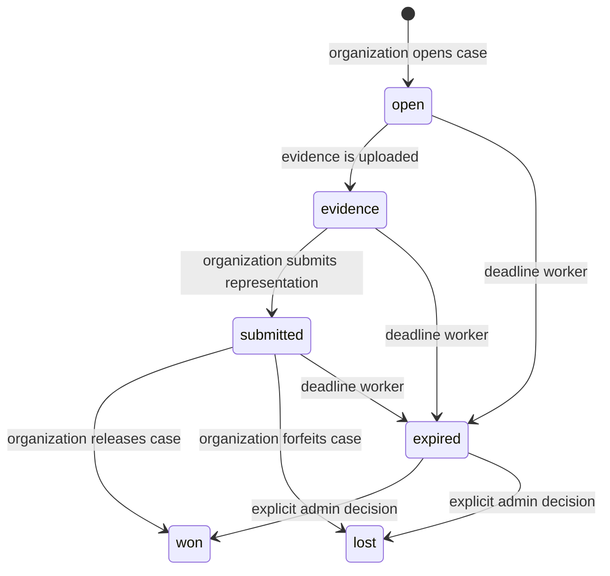

import { EnvUrls } from "/snippets/env-urls.jsx";

<EnvUrls lang="en" />

CBPay exposes card dispute and fraud-case information to the account that owns
the payment. The account can read the case, follow the append-only timeline,
upload evidence and download the evidence pack generated by the organization.
Only organization administrators can open, submit or resolve a case.

<Note>
The account API is read-only for case decisions. A successful upload does not
change the decision; it adds an immutable evidence version to the case.
</Note>

## Open cases by identifiers

Organization administrators can open several cases from a pasted list of
identifiers. This workflow accepts 1–100 unique, non-empty values after
trimming and de-duplicating exact repeats. An identifier can be a payin ID,
an idempotency key, a short reference, a `qbank_reference` or a
`qbank_payin_id`.

Both calls require the organization `disputes:write` permission. Preview is
read-only: it does not create a case, hold funds or send a webhook.

### 1. Preview the list

```bash
curl -X POST "https://api.qbank.cl/platform/v1/org/disputes/batch-preview" \
  -H "Authorization: Bearer $ADMIN_TOKEN" \
  -H "Content-Type: application/json" \
  -d '{
    "identifiers": [
      "9b8a7c6d-5e4f-4a3b-8c2d-1e0f9a8b7c6d",
      "payin-reference-2026-00041",
      "copied-value-with-no-match"
    ]
  }'
```

The response separates exact matches from values that cannot resolve to one
payin. An `ambiguous` value includes up to five candidates; the candidate
contains `payin_id`, `currency`, `local_amount` and `credited_at`.

```json
{
  "matched": [
    {
      "input": "9b8a7c6d-5e4f-4a3b-8c2d-1e0f9a8b7c6d",
      "payin_id": "9b8a7c6d-5e4f-4a3b-8c2d-1e0f9a8b7c6d",
      "account_id": "5c4b3a29-1111-4222-8333-444455556666",
      "method": "card",
      "currency": "USD",
      "local_amount": "100.00",
      "credited_usdt": "100.000000",
      "status": "credited",
      "has_open_case": false
    }
  ],
  "unmatched": [
    {
      "input": "copied-value-with-no-match",
      "reason": "not_found"
    }
  ]
}
```

Preview matches can still show a payin that is not eligible to open yet. Use
`status` and `has_open_case` before confirming: batch-open only opens credited
payins without an open case.

Single-case opening and manual import-row binding are also credited-only
operations. A non-`credited` payin returns `409 payin_not_credited` and creates
no hold; batch and import workflows report the condition per item or row
instead of failing the whole request.

### 2. Confirm the opening

Send the same identifiers, or the full pasted list, with one batch
idempotency key. `kind` defaults to `dispute` and can also be `fraud_hold`.

```bash
curl -X POST "https://api.qbank.cl/platform/v1/org/disputes/batch-open" \
  -H "Authorization: Bearer $ADMIN_TOKEN" \
  -H "Content-Type: application/json" \
  -H "Idempotency-Key: disputes-batch-2026-09-19-001" \
  -d '{
    "identifiers": [
      "9b8a7c6d-5e4f-4a3b-8c2d-1e0f9a8b7c6d",
      "payin-reference-2026-00041",
      "copied-value-with-no-match"
    ],
    "kind": "dispute",
    "idempotency_key": "disputes-batch-2026-09-19-001"
  }'
```

The server resolves every identifier again. It never trusts a payin or
account ID supplied by the client. Each matched credited payin is opened with
its own idempotent key derived from the batch key and payin ID.

```json
{
  "results": [
    {
      "input": "9b8a7c6d-5e4f-4a3b-8c2d-1e0f9a8b7c6d",
      "payin_id": "9b8a7c6d-5e4f-4a3b-8c2d-1e0f9a8b7c6d",
      "status": "opened",
      "dispute_id": "7c9e6679-7425-40de-944b-e07fc1f90ae7"
    },
    {
      "input": "payin-reference-2026-00041",
      "payin_id": "6d5c4b3a-2f1e-4d3c-8b2a-1e0f9a8b7c6d",
      "status": "skipped",
      "reason": "case_already_open"
    },
    {
      "input": "copied-value-with-no-match",
      "status": "skipped",
      "reason": "not_found"
    }
  ],
  "summary": {
    "opened": 1,
    "skipped": 2,
    "failed": 0
  }
}
```

The batch response is `200` after the request is valid. `case_already_open`,
`not_found`, `ambiguous` and `not_credited` are item-level `skipped` results;
an amount or opening failure is an item-level `failed` result. Replaying the
same batch key returns the original item as `opened` with
`idempotency_hit: true` and does not create a second hold.

The API returns `invalid_payload` for an empty list, empty values, an invalid
`kind` or more than 100 unique identifiers. There is no separate top-level
`too_many` response code. Missing idempotency returns
`idempotency_key_required`; a missing organization scope returns
`org_required`.

## Lifecycle



An expired case keeps its preventive hold. Expiration is an operational signal,
not an automatic money movement.

## List your cases

```bash
curl "https://api.qbank.cl/platform/v1/disputes?from=2026-09-01&to=2026-09-30&page=1&page_size=50&status=open"   -H "Authorization: Bearer $ACCOUNT_TOKEN"
```

The account scope is applied server-side. Supported filters are `status` and
`kind`; `from` and `to` are inclusive organization dates.

```json
{
  "page": 1,
  "page_size": 50,
  "disputes": [
    {
      "dispute_id": "7c9e6679-7425-40de-944b-e07fc1f90ae7",
      "account_id": "5c4b3a29-1111-4222-8333-444455556666",
      "kind": "dispute",
      "status": "evidence",
      "currency": "USD",
      "disputed_usdt": "100.000000",
      "held_usdt": "100.000000",
      "underfunded": false,
      "case_number": "CASE-2026-00041",
      "source": "import",
      "opened_by": "admin:2c1...",
      "created_at": "2026-09-19T12:00:00Z",
      "updated_at": "2026-09-19T12:05:00Z",
      "deadline_at": "2026-10-01T00:00:00Z"
    }
  ]
}
```

## Read one case

```bash
curl "https://api.qbank.cl/platform/v1/disputes/7c9e6679-7425-40de-944b-e07fc1f90ae7"   -H "Authorization: Bearer $ACCOUNT_TOKEN"
```

The detail adds the linked payins, append-only timeline and evidence metadata.
Evidence content is never inlined in JSON.

```json
{
  "dispute_id": "7c9e6679-7425-40de-944b-e07fc1f90ae7",
  "account_id": "5c4b3a29-1111-4222-8333-444455556666",
  "kind": "dispute",
  "status": "evidence",
  "currency": "USD",
  "disputed_usdt": "100.000000",
  "held_usdt": "100.000000",
  "underfunded": false,
  "case_number": "CASE-2026-00041",
  "source": "import",
  "opened_by": "admin:2c1...",
  "created_at": "2026-09-19T12:00:00Z",
  "updated_at": "2026-09-19T12:05:00Z",
  "items": [
    { "payin_id": "9b8a7c6d-5e4f-4a3b-8c2d-1e0f9a8b7c6d", "amount_usdt": "100.000000" }
  ],
  "timeline": [
    { "event_id": "4d2...", "event": "opened", "actor": "admin:2c1...", "created_at": "2026-09-19T12:00:00Z" }
  ],
  "evidence": [
    {
      "evidence_id": "1f2...",
      "version": 1,
      "kind": "merchant_doc",
      "sha256": "a3f1...",
      "bytes": 482110,
      "created_by": "account:5c4...",
      "created_at": "2026-09-19T12:04:00Z"
    }
  ]
}
```

## Evidence

List evidence versions:

```bash
curl "https://api.qbank.cl/platform/v1/disputes/7c9e6679-7425-40de-944b-e07fc1f90ae7/evidence"   -H "Authorization: Bearer $ACCOUNT_TOKEN"
```

Upload one PDF, PNG or JPG (maximum 10 MB). The request body is multipart with
the field name `file`:

```bash
curl -X POST "https://api.qbank.cl/platform/v1/disputes/7c9e6679-7425-40de-944b-e07fc1f90ae7/evidence"   -H "Authorization: Bearer $ACCOUNT_TOKEN"   -F "file=@purchase-receipt.pdf;type=application/pdf"
```

```json
{
  "evidence_id": "1f2...",
  "version": 2,
  "kind": "merchant_doc",
  "sha256": "b4e2...",
  "bytes": 482110,
  "created_at": "2026-09-19T12:10:00Z"
}
```

Download a version as the original binary:

```bash
curl "https://api.qbank.cl/platform/v1/disputes/7c9e6679-7425-40de-944b-e07fc1f90ae7/evidence/2/download"   -H "Authorization: Bearer $ACCOUNT_TOKEN"   -o evidence-v2.pdf
```

The response is authenticated binary content with its stored content type.
Do not expose the URL without the account authorization header.

## Webhook

Subscribe to `dispute_status_changed` through the normal webhook flow. The
payload is account-scoped and contains the neutral case state:

```json
{
  "event": "opened",
  "dispute_id": "7c9e6679-7425-40de-944b-e07fc1f90ae7",
  "kind": "dispute",
  "status": "open",
  "account_id": "5c4b3a29-1111-4222-8333-444455556666",
  "disputed_usdt": "100.000000",
  "held_usdt": "100.000000",
  "case_number": "CASE-2026-00041",
  "deadline_at": "2026-10-01T00:00:00Z"
}
```

Deduplicate deliveries by the webhook event ID. The event reports a state
change; it never approves or rejects a case for the account.

## Errors

| HTTP | Code | What to do |
|---:|---|---|
| 400 | `invalid_range` | Send `from` and `to` as `YYYY-MM-DD`. |
| 400 | `invalid_payload` | Send the required multipart file and an allowed content type. |
| 404 | `not_found` | Confirm the case belongs to the authenticated account. |
| 409 | `invalid_state` | The case is closed or cannot accept evidence. |
| 503 | `storage_unavailable` | Retry the upload later; do not create a second case. |

See the [error catalog](/en/errors) for the common response envelope.

## FAQ

<AccordionGroup>
<Accordion title="Can I release or forfeit a case from the account API?">
No. Decisions are organization-admin actions protected by `disputes:write` and
maker-checker rules.
</Accordion>
<Accordion title="Does an expired case release the hold?">
No. The deadline worker only changes the case to `expired` and records an
event. An administrator must make the explicit decision.
</Accordion>
<Accordion title="Can I upload after the case is submitted?">
Yes. `open`, `evidence` and `submitted` accept account evidence. Won, lost and
expired cases are closed to account uploads.
</Accordion>
</AccordionGroup>
