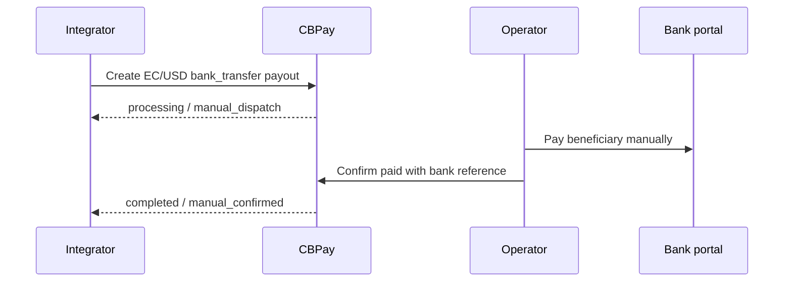

import { EnvUrls } from "/snippets/env-urls.jsx";

<EnvUrls lang="en" />

## Scope

This corridor is limited to `country=EC`, `currency=USD`, and
`method=bank_transfer`. It uses the manual dispatch mode:
the payout remains `processing` with `status_code=manual_dispatch` until an
authorized operator pays it in the bank portal and confirms the result.
CBPay does not call or reconcile a bank automatically for this route.

Provider selection and credentials are deployment concerns; they are not part
of the public CBPay contract.

## Environment sequence

Test this corridor in staging first, using its simulated rails and synthetic
beneficiaries. Only after staging passes should you verify the same integration
in production. Production verification requires operational data and explicit
authorization for the environment and test scope.

## Flow



## Create and read a payout

Use the normal payout endpoints with a synthetic beneficiary:

```http
POST /v1/payouts
Authorization: Bearer <API_KEY>
Content-Type: application/json
Idempotency-Key: ec-manual-<unique-key>
```

```json
{
  "country": "EC",
  "currency": "USD",
  "method": "bank_transfer",
  "amount": "125.00",
  "beneficiary": {
    "name": "Example Recipient",
    "document_value": "0900000000",
    "bank_code": "000000",
    "account_number": "0000000000",
    "account_type": "CACC",
    "country_code": "EC",
    "sender_name": "Example Sender"
  },
  "description": "Invoice 1001",
  "idempotency_key": "ec-manual-<unique-key>"
}
```

Amounts are USD `1.00` through `10000.00`, inclusive, with at most two
decimal places by value. Use decimal strings, never floating point.

```http
GET /v1/payouts/{payoutID}
Authorization: Bearer <API_KEY>
```

The manual Ecuador corridor generates a bank reference as `ECM` followed by 13
sequential digits. This is a corridor reference format, not a general
restriction on all bank references.
The create response normally includes:

```json
{
  "payout_id": "00000000-0000-4000-8000-000000000001",
  "status": "processing",
  "status_code": "manual_dispatch",
  "idempotency_hit": false
}
```

## Confirm the bank result

The core operator confirms the manually paid payout:

```http
POST /v1/ops/payouts/{payoutID}/confirm-manual-paid
Authorization: Bearer <CORE_ADMIN_KEY>
Content-Type: application/json
Idempotency-Key: confirm-ec-<unique-key>
```

Platform admins use the corresponding core proxy:

```http
POST /v1/admin/core/payouts/{payoutID}/confirm-manual-paid
Authorization: Bearer <PLATFORM_ADMIN_KEY>
Content-Type: application/json
Idempotency-Key: confirm-ec-<unique-key>
```

Org admins use the organization proxy:

```http
POST /v1/org/treasury/manual-payouts/{payoutID}/confirm-manual-paid
Authorization: Bearer <ORG_ADMIN_KEY>
Content-Type: application/json
Idempotency-Key: confirm-ec-<unique-key>
```

The request contains `bank_reference`, `paid_amount`, and `reason`. The
`POST /v1/ops/payouts/{payoutID}/confirm-manual-paid` confirmation requires an
`Idempotency-Key`; the header is recommended, or provide `idempotency_key` in
the JSON body. Without a key, the endpoint returns `400
idempotency_key_required`. The confirmation is idempotent: after a timeout,
read the payout first. If the result is still unknown, retry the same
confirmation with the exact same key and identical evidence. The replay
returns the original with `idempotency_hit: true`; different evidence returns
`409 idempotency_conflict`. Never use a new key for the same bank action.

## Manual payins

Confirming receipt of an already announced `EC/USD/push/bank_transfer`
payin is a two-person operation (maker-checker). No money moves until the
second approval. No client idempotency key is used on any step: the caller
identifies the operation by the payin ID and the bank evidence, and honest
replays return the original with `idempotency_hit: true`.

**Step 1 — request (maker).** An authorized org operator with
`org_operations`/`ops:write` and a human admin session records the bank
evidence. The payin stays `pending`; nothing is credited yet:

```http
POST /v1/payins/{payinID}/confirm-received
Authorization: Bearer <ORG_ADMIN_KEY>
Content-Type: application/json
```

```json
{
  "bank_reference": "ECM0000000000001",
  "received_amount": "125.00"
}
```

The response is the confirmation request (`id`, `status`, `bank_reference`,
`received_amount`, `account_id`, `maker`, `created_at`). Retrying the same
maker request with identical evidence replays the original request with a
hit; different evidence returns `409 invalid_state`. The request has no
expiry: it stays open until a checker approves it or the maker (or a god
admin) cancels it.

**Step 2 — approve (checker).** A second, named god admin who is different
from the maker approves the open request. The request carries no body:

```http
POST /v1/payins/{payinID}/confirm-approve
Authorization: Bearer <GOD_ADMIN_KEY>
Content-Type: application/json
```

Approval credits the payin immediately through the normal pricing, firewall
and credit chain. The same admin cannot approve their own request
(`409 second_approver_required`). If the payin details changed since the
request (`confirm_account_mismatch`, `bank_ref_conflict`), or the reference
belongs to a treasury settlement (`deposit_settled_treasury_trade`), the
approval fails honestly and the payin stays `pending`; read both resources
before retrying.

**Cancel.** The maker or any god admin can cancel an open request with
`POST /v1/payins/{payinID}/confirm-cancel` (also bodiless). A cancelled
request never credits; confirming requires a new request.

After any timeout, read the payin first. If it is credited with the same
evidence, the replay returns the original result; if it is still pending,
re-read the confirmation request and retry the same step. Never attempt a
confirmation with different evidence to "push it through."

## Deposit instructions

Read the instructions for the existing payin instrument:

```http
GET /v1/payins/deposit-instructions
Authorization: Bearer <API_KEY>
```

The response is provider-clean and contains only the instructions applicable
to the account and corridor. Do not infer bank details from a payout.

For Ecuador bank codes, use the live catalog:

```http
GET /v1/payouts/banks?country=EC
Authorization: Bearer <API_KEY>
```

It returns `{ "items": [{ "code": "...", "name": "..." }], "meta": {
"retrieved": 1 } }`, where `retrieved` is the number of items returned. Use a
returned `code` as `beneficiary.bank_code`.

## Operational rules

- The operator pays in the bank portal and records the bank reference.
- Do not retry or resend an ambiguous bank action with a new key.
- For manual payin confirmation, the request and the approval are two separate
  steps by two different admins; after a timeout, read the payin and the
  confirmation request before retrying the same step.
- Examples above are synthetic; replace placeholders only with authorized
  operational data.

## States and errors

| State or code | Meaning | Action |
|---|---|---|
| `processing` + `manual_dispatch` | The payout is waiting for the operator to complete the bank action. | Pay once in the bank portal, then confirm the existing payout. |
| `completed` + `manual_confirmed` | The operator confirmed the bank payment. | Re-read the payout and retain the bank reference. |
| `invalid_payload` | A required field, amount, account value, or confirmation field is invalid. | Correct the request; do not create a replacement for the same operation. |
| `idempotency_conflict` | The same key was reused with different data or an incompatible existing state. | Read the original resource and use a new key only for a genuinely new operation. |
| `second_approver_required` | The approver must be a different admin from the maker. | A second, named god admin approves the open request; the maker cannot approve it. |
| `confirm_account_mismatch` | The payin account changed since the confirmation request. | Read the payin and the request; cancel and start a new request with fresh evidence. |
| `confirm_request_conflict` | A different confirmation is already open for this payin. | Read the existing request and approve or cancel it before raising another. |
| `treasury_check_unavailable` | The payin ownership or treasury conflict check could not complete. | Do not credit the payin; retry after the dependency recovers. |
| `deposit_settled_treasury_trade` | The bank reference belongs to a treasury settlement. | Do not assign or credit it as a customer payin. |

See the [complete error catalog](/en/errors) for the shared response format
and error handling rules.

## FAQ

<AccordionGroup>
  <Accordion title="Does CBPay send the Ecuador bank transfer automatically?">
    No. The operator completes the bank action and confirms the existing
    payout in CBPay.
  </Accordion>
  <Accordion title="What does `manual_dispatch` mean?">
    It means the payout is still processing and is waiting for an authorized
    operator to complete and confirm the bank action.
  </Accordion>
  <Accordion title="What should I do after a timeout?">
    Read the payout first. If its outcome is still unknown, retry the same
    request with the same idempotency key. Never submit the bank transfer again
    with a new key without confirming what happened.
  </Accordion>
</AccordionGroup>
