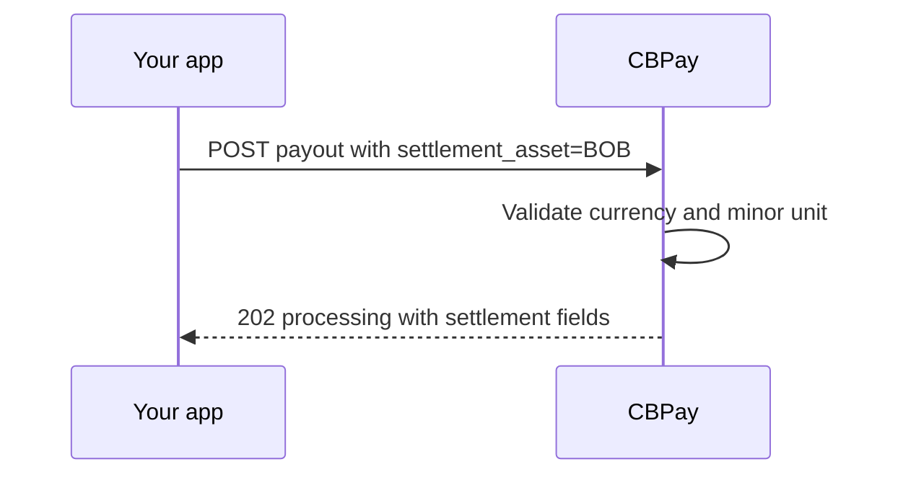

import { EnvUrls } from "/snippets/env-urls.jsx";

<EnvUrls lang="en" />

<Note>
This page covers same-currency settlement for BOB, MXN and ARS. It does not
convert one fiat balance into another.
</Note>

Payouts can debit a local-fiat balance when the payout currency and
`settlement_asset` are the same. The settlement rate is `"1"` and settlement
spreads are zero. Fees configured in USDT are converted using the locked quote
and rounded up to the smallest unit of the payout currency.



```bash
curl -X POST https://api.qbank.cl/platform/v1/payouts \
  -H "Authorization: Bearer <token>" \
  -H "Content-Type: application/json" \
  -H "Idempotency-Key: payout-bob-001" \
  -d '{
    "country": "BO",
    "currency": "BOB",
    "method": "bank_transfer",
    "local_amount": "100.00",
    "settlement_asset": "BOB",
    "beneficiary": {
      "name": "Ana Pérez",
      "country_code": "BO",
      "bank_code": "0016",
      "account_number": "1234567890",
      "account_type": "checking"
    },
    "idempotency_key": "payout-bob-001"
  }'
```

```json
{
  "payout_id": "7b2e…",
  "country": "BO",
  "currency": "BOB",
  "local_amount": "100.00",
  "settlement_asset": "BOB",
  "settlement_amount": "100.01",
  "settlement_rate": "1",
  "settlement_spread": "0",
  "platform_settlement_spread": "0",
  "status": "processing",
  "funds_debited": true
}
```

The beneficiary receives `100.00 BOB`; the extra `0.01 BOB` is the configured
fee converted and rounded up in local currency. The exact
`settlement_amount` is held and is refunded unchanged if the payout fails.

`GET /v1/rates` marks local-fiat assets with `same_currency_only: true`:

```json
{
  "settlement": {
    "default_asset": "USDT",
    "assets": [
      {
        "asset": "BOB",
        "available": true,
        "settlement_rate": "1",
        "same_currency_only": true
      }
    ]
  }
}
```

Cross-fiat settlement is rejected. For example, a MXN payout cannot debit a
BOB balance:

```json
{
  "error": "pricing_unavailable",
  "message": "fiat settlement is only available in the payout currency"
}
```

For BOB, MXN and ARS, amounts with more than two decimal places are rejected:
`"100.001"` returns `400 invalid_amount`. Use the payout currency's minor
unit; CBPay does not silently round the requested local amount.

See [Errors](/en/errors) for the public error contract.

<AccordionGroup>
<Accordion title="Can I debit BOB for an MXN payout?">
No. Cross-fiat settlement is not an FX conversion path in this release.
Choose the payout currency or use a supported non-fiat settlement asset.
</Accordion>
<Accordion title="Are settlement spreads applied to same-currency fiat?">
No. Same-currency fiat settlement uses an identity rate and zero settlement
spreads. Configured fees are still charged and converted into fiat.
</Accordion>
</AccordionGroup>
