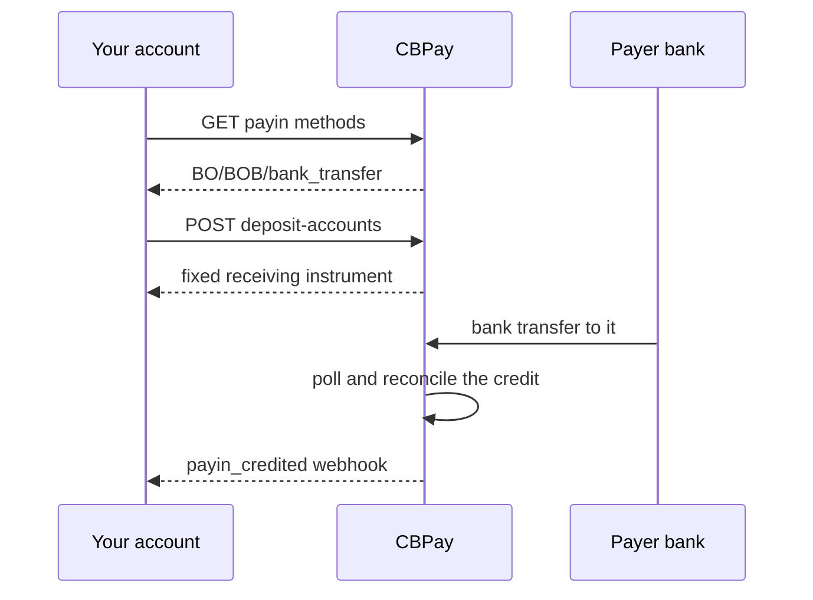

import { EnvUrls } from "/snippets/env-urls.jsx";

<EnvUrls lang="en" />

A **funding account** is a deposit destination in a local currency whose
only job is to receive money: every credit converts automatically to USD,
your principal balance. It is the default `purpose: "fondeo"` of a deposit
account — create one per corridor and share its instrument (account number,
CLABE, alias, IBAN) with your payers.

If you need to **hold** local fiat for payouts instead of converting it,
that is [Banking](/en/guides/banking): create a second destination with
`purpose: "banking"`. Funding converts; Banking retains.

## Funding vs Banking

For local fiat corridors (`BO/BOB`, `MX/MXN`, `AR/ARS`), every payin
destination carries a `purpose` that decides where inbound money lands:

| Purpose | Meaning |
|---|---|
| `fondeo` (default) | **Funding account.** Everything received converts automatically to USD, your principal balance. |
| `banking` | **Banking account.** Inbound fiat is retained in its local currency for payouts, with individual balances per currency. |

Destinations created without a purpose keep the historical `fondeo`
behavior. Banking purpose is only supported in `BO/BOB/bank_transfer`,
`MX/MXN/bank_transfer` and `AR/ARS/bank_transfer`; everything else is
always funding.

## Funding by currency

### 🇦🇷 ARS — Argentine peso

Receive pesos through a dedicated CVU. The CVU is created with the bank
alias **you choose** at creation time (`bank_alias` is required). Inbound
pesos convert automatically to USD, your principal balance.

For the full deposit-account contract see [payins](/en/guides/payins); to
send pesos out, see [payouts](/en/guides/payouts).

### 🇧🇴 BOB — Bolivian boliviano

Receive bolivianos through a dedicated bank-transfer account. Inbound BOB
converts automatically to USD, your principal balance.

To send bolivianos out (bank transfer in BOB or USD, plus QR), see the
Bolivia tab in [payouts](/en/guides/payouts).

### 🇲🇽 MXN — Mexican peso

Receive pesos through a dedicated CLABE. Inbound MXN converts automatically
to USD, your principal balance.

For the full deposit-account contract see [payins](/en/guides/payins); to
send pesos out, see [payouts](/en/guides/payouts).

### 🇪🇺 EUR — euro

Receive euros through a `funding_usdt` virtual IBAN: inbound euros convert
automatically to USD, your principal balance. (A `banking_eur` IBAN instead
holds `BANK_EUR` for SEPA payouts — that is [Banking](/en/guides/banking).)

Request and read IBANs in [Banking](/en/guides/banking); to send euros out,
see [SEPA Instant payouts](/en/guides/sepa-instant-payouts).

## The funding flow



1. **Discover the corridor** (`GET /v1/payins/methods`) — always read the
live catalog before offering a payment option.
2. **Create or repair the deposit account**
(`POST /v1/payins/deposit-accounts`) — verified accounts get their first
destination automatically; companies can add more on enabled corridors.
3. **Share the instrument** — your payer sends an ordinary bank transfer.
4. **Receive the credit** — CBPay reconciles the bank credit and emits
`payin_credited`; the net lands in USD, your principal balance.

No announcement step exists in this mode: the payer never fills a
`POST /v1/payins` reference.

## 1. Discover the available corridors

Always read the live catalog before offering a payment option in your app:

```bash
curl https://api.qbank.cl/platform/v1/payins/methods \
  -H "Authorization: Bearer <token>"
```

A representative record:

```json
{
  "country": "BO",
  "currency": "BOB",
  "method": "bank_transfer",
  "delivery": "polling"
}
```

The catalog is the single source of truth. A corridor can exist in the API
contract and still be disabled for your organization.

## 2. Create or repair a deposit account

The platform provisions the initial funding instrument only after the
account's own verification passes: KYC for persons, KYB for companies.
Registration alone never creates a funding account. A verified account that
is missing its instrument can repair it with the same call:

```bash
curl -X POST https://api.qbank.cl/platform/v1/payins/deposit-accounts \
  -H "Authorization: Bearer <token>" \
  -H "Content-Type: application/json" \
  -d '{
    "country": "BO",
    "currency": "BOB",
    "method": "bank_transfer"
  }'
```

A `201` response:

```json
{
  "instrument_id": "1f4a…",
  "account_id": "9b1d…",
  "country": "BO",
  "currency": "BOB",
  "method": "bank_transfer",
  "instrument": "<receiving-account-number>",
  "details": {
    "account_number": "<receiving-account-number>",
    "alias": "CBPay Example BOB 20260919",
    "merchant_nit": "123456789",
    "bank_name": "Example Receiving Bank",
    "status": "ACTIVA"
  },
  "status": "active",
  "created_at": "2026-09-09T20:00:00Z"
}
```

Share `instrument` with your payers as the receiving account.
`instrument_id` is CBPay's stable identifier; never substitute a UUID for
the receiving account. On return, `details.alias`,
`details.merchant_nit` and `details.bank_name` are the display fields for
the transfer card; missing optional fields are never inferred.

Person accounts keep at most one active funding account per
country/currency/method. Company accounts can create additional immutable
destinations only in enabled corridors; the currently supported additional
corridors are `MX/MXN/bank_transfer`, `BO/BOB/bank_transfer`, and `AR/ARS/bank_transfer`. Every
destination stays bound to the same CBPay account, and credits match by
destination instrument.

Verification provisions the first corridor instrument automatically for a
verified account. The call above also repairs a missing instrument after
verification. Deposit-account display fields are optional and never
inferred. This funding flow never creates a user-chosen bank alias;
AR/ARS bank aliases are a separate contract in the payins guide. When a
company creates an additional BOB destination, each destination must use a
new idempotency key:

```bash
curl -X POST https://api.qbank.cl/platform/v1/payins/deposit-accounts \
  -H "Authorization: Bearer <token>" \
  -H "Idempotency-Key: company-bob-001" \
  -H "Content-Type: application/json" \
  -d '{
    "country": "BO",
    "currency": "BOB",
    "method": "bank_transfer",
    "idempotency_key": "company-bob-001"
  }'
```

A new key returns `201` and a new destination. Replaying the same completed
key returns `200` with the original instrument and `idempotency_hit: true`;
a concurrent replay of an in-flight one may return
`409 idempotency_conflict`. When the rail answers missing or ambiguous, the
system keeps a reconcilable state instead of retrying silently.

## 3. List deposit instruments

The list is paged and hides provisioning claims that have not received a
real receiving number yet:

```bash
curl "https://api.qbank.cl/platform/v1/payins/deposit-accounts?page=1&page_size=50" \
  -H "Authorization: Bearer <token>"
```

```json
{
  "page": 1,
  "page_size": 50,
  "deposit_accounts": [
    {
      "instrument_id": "1f4a…",
      "account_id": "9b1d…",
      "country": "BO",
      "currency": "BOB",
      "method": "bank_transfer",
      "instrument": "<receiving-account-number>",
      "status": "active",
      "created_at": "2026-09-09T20:00:00Z"
    }
  ]
}
```

## 4. Receive and reconcile the transfer

This mode never uses `POST /v1/payins` announcements. The payer transfers
BOB to your `instrument`. The system polls the bank inside a bounded date
window; completed credits deduplicate by bank reference, ACH order number
or a deterministic fallback key.

Once the credit matches, subscribe to `payin_credited` and read the final
amounts and status from the payin resource:

```bash
curl "https://api.qbank.cl/platform/v1/payins?country=BO&status=credited&from=2026-09-01&to=2026-09-10&page=1&page_size=50" \
  -H "Authorization: Bearer <token>"
```

Standard payin fee and rate rules apply. The public API never exposes
bank-rail-specific objects.

### Instrument and payer fields on credited pushes

A credited payin stays available through the ordinary list/detail
resources. When the credit lands on a dedicated account, reconcile with
`instrument_id` and `instrument` (`account_number`, `purpose`, `status`)
and filter history with `?instrument_id=<uuid>`. New credits may also carry
`payer_source: "bank_event"` with the bank-reported `payer` block. Data the
bank does not report is omitted, historical payers are never backfilled,
and an existing screening can hold the credit for review.

## Statuses

| Status | Meaning | Action |
|---|---|---|
| `active` | The deposit account can be shared with payers | Use `instrument` |
| `pending` | Provisioning or reconciliation still running | Do not create a second account |
| `credited` | The transfer matched and credited | Handle `payin_credited` |
| `unassigned` | The credit cannot be routed to a single account | Handle it in the operations view |

After a timeout, read the list first. Even when the response is lost, the
rail may already have accepted the first request.

## Errors

| HTTP | Code | Action |
|---:|---|---|
| 400 | `payin_corridor_unsupported` | Re-read `GET /v1/payins/methods`; the corridor is not enabled |
| 401 | `unauthorized` | Refresh the account credentials |
| 403 | `account_blocked` | Have the org operator activate the account |
| 422 | `deposit_account_limit_reached` | Use the existing instrument; one destination per corridor |
| 502 | `deposit_account_failed` | Read the list before retrying; do not assume the rail created nothing |
| 502 | `core_unavailable` | Retry the same logical operation once the service recovers |
| 502 | `core_invalid_response` | Keep the claim for reconciliation and contact operations if it persists |

## FAQ

<AccordionGroup>
<Accordion title="Can one account serve several CBPay accounts?">
No. A destination is bound to one CBPay account and one organization. Only
share each instrument with that account's payers.
</Accordion>
<Accordion title="Does the payer need a CBPay account?">
No. Payers use their own bank transfer flow. CBPay only needs the
instrument active and the bank reporting the credit.
</Accordion>
<Accordion title="Can I delete or rotate an account?">
No. Corridor instruments are immutable. If the bank reports an anomaly,
contact operations instead of creating a substitute blindly.
</Accordion>
<Accordion title="When is the transfer credited?">
This corridor polls. Final timing depends on when the bank posts the
movement; the webhook fires only after reconciliation.
</Accordion>
<Accordion title="Funding or Banking — which one do I need?">
Choose funding (default) when every deposit should land in USD, your
principal balance. Choose [Banking](/en/guides/banking) with
`purpose: "banking"` when you need to keep BOB, MXN or ARS balances
locally for payouts.
</Accordion>
</AccordionGroup>
