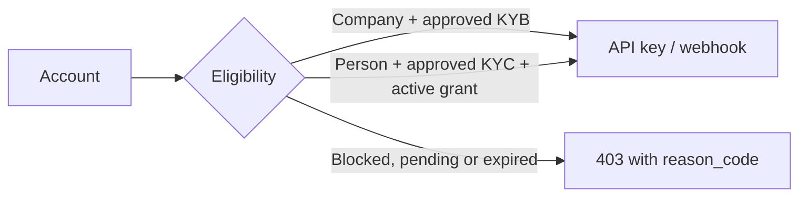

Account-level integrations are deliberately gated. A company can use API
keys and account webhooks after its KYB is approved. A person can use them
only when an organization administrator has issued an active integration
grant; the person must also have approved KYC.

<Note>
Use `https://cryptobank.qbank.cl/platform` with `pk_test_...` credentials while
building. Switch to `https://api.qbank.cl/platform` and live credentials only
after the flow is verified.
</Note>



## Check eligibility before creating credentials

Use the account session or an account API key to inspect the current
decision. The response intentionally exposes the grant timestamps but not
the administrator's internal reason.

```bash
curl https://api.qbank.cl/platform/v1/integration-status \
  -H "Authorization: Bearer <account-token>"
```

Eligible company:

```json
{ "eligible": true }
```

Eligible person with a grant:

```json
{
  "eligible": true,
  "grant": {
    "granted_at": "2026-09-18T14:00:00Z",
    "expires_at": "2026-12-31T23:59:59Z"
  }
}
```

An account without a grant, or with an inactive/expired grant, returns a
stable reason code:

```json
{ "eligible": false, "reason_code": "integration_company_only" }
```

`integration_kyb_required` means the account exists but its own identity
verification is not approved. `account_blocked` means the account status is
not `active`.

## Email-domain blocklist during onboarding

Active blocked domains are rejected by:

- `POST /v1/auth/register` for password registration;
- `POST /v1/auth/oauth` when a new account would be created from a verified
  provider email; and
- `POST /v1/me/email/change` before the pending email is stored.

The API normalizes the domain (lowercase, trailing-dot removal and IDN
conversion) and matches the complete domain, never a substring. A blocked
domain returns:

```json
{
  "error": "email_domain_blocked",
  "message": "this email domain is not allowed for registration"
}
```

An already-linked OAuth identity logs in normally; the block applies to the
new-account path, not to an existing identity.

## Issue an account API key

The account-level endpoint requires a human JWT session. An API key cannot
mint another API key. OTP may be required by the organization policy through
`X-OTP-Token`; complete the `api_key_create` challenge first when the API
returns `otp_required`.

```bash
curl -X POST https://api.qbank.cl/platform/v1/api-keys \
  -H "Authorization: Bearer <human-session-token>" \
  -H "X-OTP-Token: <otp-token>" \
  -H "Content-Type: application/json" \
  -d '{ "label": "production-backend" }'
```

```json
{
  "api_key_id": "7f6e5d4c-3b2a-1908-a7b6-c5d4e3f2a1b0",
  "key_id": "a1b2c3d4e5f60718",
  "token": "pk_a1b2c3d4e5f60718.k9J2mX4pQ7wR5tY8uZ0aB3cD6eF1gH2i",
  "label": "production-backend",
  "note": "store this token now; it cannot be retrieved again"
}
```

The plaintext token is returned once. Store it in a secrets manager, never in
browser code or source control.

## Create and manage an account webhook

Account webhook creation uses the same eligibility gate and requires
`webhook_manage` OTP:

```bash
curl -X POST https://api.qbank.cl/platform/v1/webhooks/subscriptions \
  -H "Authorization: Bearer <human-session-token>" \
  -H "X-OTP-Token: <otp-token>" \
  -H "Content-Type: application/json" \
  -d '{
    "event_type": "payout_status_changed",
    "callback_url": "https://api.example.com/webhooks/cbpay",
    "secret": "a-secret-of-at-least-16-chars"
  }'
```

```json
{
  "id": "5f3a1b2c-4d5e-6f70-8192-a3b4c5d6e7f8",
  "event_type": "payout_status_changed",
  "callback_url": "https://api.example.com/webhooks/cbpay",
  "status": "active",
  "created_at": "2026-09-18T14:05:00Z",
  "secret_stored": true
}
```

List subscriptions with `GET /v1/webhooks/subscriptions`. The secret is
never returned. Disable or reactivate one with:

```bash
curl -X PATCH https://api.qbank.cl/platform/v1/webhooks/subscriptions/{subscriptionID} \
  -H "Authorization: Bearer <human-session-token>" \
  -H "X-OTP-Token: <otp-token>" \
  -H "Content-Type: application/json" \
  -d '{ "status": "active" }'
```

Disabling is always allowed for the owning account. Reactivating requires
current eligibility and `webhook_manage` OTP. The toggle is idempotent and
only affects future events; queued deliveries remain queued.

Organization-wide subscriptions and the administrative grant/reconcile
operations are documented in the private admin and internal Qbank guides.

## Integration errors

| HTTP | `error` | What to do |
|---:|---|---|
| 400 | `email_domain_blocked` | Use a permitted email domain or ask the platform administrator to review the blocklist. |
| 400 | `invalid_secret` | Use a webhook secret containing 16 to 256 characters. |
| 403 | `session_required` | Use a human JWT session for account API-key/webhook creation; API keys cannot create credentials. |
| 403 | `integration_company_only` | Complete the person grant flow, or use a company account with approved KYB. |
| 403 | `integration_kyb_required` | Finish and approve KYC/KYB before creating or reactivating an integration. |
| 403 | `account_blocked` | Ask the organization administrator to restore the account to `active`. |
| 403 | `otp_required` | Verify the `api_key_create` or `webhook_manage` OTP challenge and retry. |

See the [complete error catalog](/en/errors) and [security and 2FA](/en/security-2fa).

<AccordionGroup>
<Accordion title="Can a person use an API key?">
Yes, but only after an org administrator creates an active integration grant
for that person. The grant also requires approved KYC and an active account.
</Accordion>
<Accordion title="Does a company need a grant?">
No. A company becomes eligible from approved KYB (`kyc_status: approved`);
the organization does not need to create a person-style grant.
</Accordion>
<Accordion title="What happens when KYB is rejected or the account is blocked?">
Account-level API keys are revoked and account webhook subscriptions are
disabled automatically. Read the integration status and use the org
reconciliation endpoint if you need to verify the current state.
</Accordion>
<Accordion title="Can I retrieve an API-key token later?">
No. The plaintext token is returned exactly once. Issue a replacement and
revoke the old credential if it is lost.
</Accordion>
</AccordionGroup>
