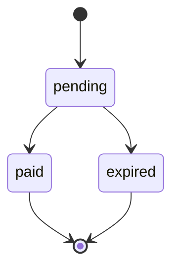

import { EnvUrls } from "/snippets/env-urls.jsx";

<EnvUrls lang="en" />

QR payins let you create a charge that a customer completes with their banking
app. Use an idempotency key whenever a client may retry after a timeout or
ambiguous network response.



## Create a QR payin

Send `method: "qr"` to `POST /v1/payins`. The key is optional and can be sent
in the JSON body or in the `Idempotency-Key` header.

```bash
curl -X POST https://api.qbank.cl/platform/v1/payins \
  -H "Authorization: Bearer <token>" \
  -H "Content-Type: application/json" \
  -d '{
    "country": "BO",
    "currency": "BOB",
    "method": "qr",
    "amount": "700.00",
    "description": "App top-up",
    "idempotency_key": "qr-bo-700-20261002-001",
    "expires_in": 3600
  }'
```

Response `201`:

```json
{
  "payin_id": "9c2a1b2c-3d4e-5f60-7a8b-9c0d1e2f3a4b",
  "status": "pending",
  "charge": {
    "charge_id": "c9d8e7f6-a5b4-c3d2-e1f0-a9b8c7d6e5f4",
    "our_reference": "QR-778812",
    "qr_payload": "<QR content>",
    "status": "pending"
  }
}
```

Display the QR payload or the `qr_image_url` returned by the API. When the
customer pays, the account is credited automatically. Read the current status
with `GET /v1/payins/{payinID}`.

## Idempotent retries

`idempotency_key` is optional for QR payins. Send it in the JSON body or as the
`Idempotency-Key` header. If both are present, the body value is used. The
platform namespaces the key by account internally; the integrator sends the
key exactly as provided.

The request identity includes country, currency, method and the numeric amount.
For example, `"100"` and `"100.00"` are equivalent. `description` is display
text and is not part of replay identity. The QR channel is not part of the
replay identity: the same key replays the same charge regardless of channel.

The first request creates one charge. A retry with the same key and equivalent
payload returns the original object with `idempotency_hit: true`; it does not
create another charge:

```json
{
  "payin_id": "9c2a1b2c-3d4e-5f60-7a8b-9c0d1e2f3a4b",
  "status": "pending",
  "charge": {
    "charge_id": "c9d8e7f6-a5b4-c3d2-e1f0-a9b8c7d6e5f4",
    "status": "pending"
  },
  "idempotency_hit": true
}
```

The header form is equivalent:

```bash
curl -X POST https://api.qbank.cl/platform/v1/payins \
  -H "Authorization: Bearer <token>" \
  -H "Idempotency-Key: qr-bo-700-20261002-001" \
  -H "Content-Type: application/json" \
  -d '{"country":"BO","currency":"BOB","method":"qr","amount":"700.00","description":"App top-up"}'
```

If the same key is reused with a different country, currency, method or amount,
the API returns `409 idempotency_conflict`:

```json
{
  "error": "idempotency_conflict",
  "message": "this idempotency key was used with a different payload"
}
```

An expired or paid charge is replayed as-is. The replay response preserves the
original object; use `GET /v1/payins/{payinID}` to read its live status.

Both the core and the platform return `400 invalid_idempotency_key` when the
integrator key is longer than 256 characters or contains carriage-return/
line-feed characters. The platform also rejects the request with the same code
if its server-side account namespace would make the resulting core key exceed
256 characters. That namespace is invisible to the integrator: send the key
unchanged.

## Errors

| HTTP | Code | What to do |
| --- | --- | --- |
| 400 | `invalid_idempotency_key` | Trim the key to 256 characters or fewer and remove control characters. |
| 409 | `idempotency_conflict` | Reuse the original payload, or generate a new key for a new charge. |

## FAQ

<AccordionGroup>
<Accordion title="Can I change the description when retrying?">
Yes. The description is display text and is not part of the replay identity.
</Accordion>

<Accordion title="What if the customer paid while my request timed out?">
Retry with the same idempotency key, then read the returned `payin_id` with
`GET /v1/payins/{payinID}`. Do not create a new key for the same operation.
</Accordion>
</AccordionGroup>
