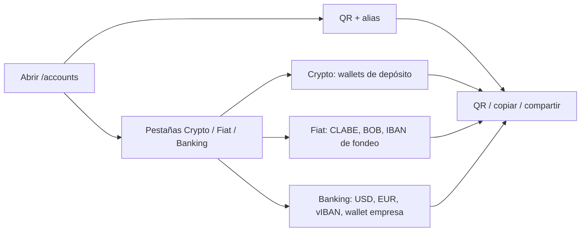

import { EnvUrls } from "/snippets/env-urls.jsx";

<EnvUrls lang="es" />

## Un solo lugar para tus datos de recepción

La página **Mis cuentas** es el directorio del portal con los destinos que
pueden recibir dinero para ti. Ábrela en `/accounts` desde la barra lateral,
justo debajo de **Depositar**. La página agrupa tu identidad de cobro por QR,
las cuentas receptoras locales, los destinos de Banking, los instrumentos EUR
y las wallets crypto de depósito.

No mezcla saldos con significados financieros distintos. Una cuenta bancaria
sigue siendo una cuenta bancaria, un vIBAN sigue siendo un instrumento de
ruteo y una wallet crypto de depósito sigue siendo una dirección blockchain.
Usa las páginas de cada producto para enviar dinero, retirar y consultar la
cartola.

Si un destino o una lectura devuelve un error, usa el [catálogo público de
errores](/es/errores) para revisar el código y la acción de recuperación.

## Hero CBPAY y tres pestañas de cuentas

La página abre con un hero **CBPAY** para tu cuenta. Mantiene disponibles las
acciones de QR y alias: mostrar el QR, copiar el payload receptor o compartir
la identidad de recepción de la cuenta.

Debajo del hero hay tres pestañas:

- **Crypto** (`?tab=crypto`): wallets crypto de depósito on-chain.
- **Fiat** (`?tab=fiat`): instrumentos fiat como MX/CLABE y BO/BOB, además de
  los vIBANes EUR de fondeo.
- **Banking** (`?tab=banking`): cuentas Banking USD/EUR, vIBANes Banking y
  wallets EUR de empresa.

La pestaña seleccionada queda reflejada en la URL. Puedes enlazar
directamente a `/accounts?tab=crypto`, `/accounts?tab=fiat` o
`/accounts?tab=banking`. Sin `tab`, la página abre su pestaña por defecto y
mantiene disponibles las tres agrupaciones.

<Steps>
<Step title="Abre Mis cuentas">
Selecciona **Mis cuentas** en la barra lateral del portal. La etiqueta
**Wallets** reemplaza a **Mis wallets**; las wallets y direcciones subyacentes
no cambian.
</Step>
<Step title="Elige una pestaña">
Selecciona **Crypto**, **Fiat** o **Banking**. Puedes guardar la vista actual
con su deep-link `?tab=` para volver directamente al grupo que necesitas.
</Step>
<Step title="Copia, muestra o comparte">
Usa las acciones de la tarjeta para mostrar un QR, copiar el valor receptor o
compartir los datos. Comparte solo el destino destinado a ese pago: una cuenta
o dirección queda vinculada a tu cuenta CBPay y no se puede intercambiar con
el destino de otra cuenta.
</Step>
</Steps>

## Qué muestra cada pestaña

| Pestaña | Qué contiene | Qué puedes compartir |
|---|---|---|
| **Crypto** | Wallets de depósito con red, activo, dirección, tipo, estado de solo recepción y fecha de creación. Incluye TRON/USDT, Ethereum/USDT, Ethereum/USDC y Bitcoin/BTC. | Una dirección blockchain o su código QR. |
| **Fiat** | Instrumentos receptores con país, moneda, método, instrumento, estado y fecha de creación. Incluye CLABE MXN, destinos BO/BOB y vIBANes EUR de fondeo (`purpose: funding_usdt`). | La CLABE, el número de cuenta BOB o el IBAN de fondeo, después de revisar su estado. |
| **Banking** | Cuentas bancarias USD/EUR habilitadas con sus requisitos de recepción, vIBANes Banking (`purpose: banking_eur`) y wallets EUR de empresa. El detalle puede incluir cuenta/IBAN, routing o SWIFT, estado, UUID y activación. | Los datos de la cuenta bancaria, el IBAN Banking EUR o el destino activo de la wallet de empresa. |

El QR y el alias siguen disponibles en el hero CBPAY sobre las pestañas. El
QR identifica tu cuenta para recibir transferencias y el alias es opcional.

La página usa los mismos recursos acotados a la cuenta que el resto del
portal: `GET /v1/me/qr`, `GET /v1/payins/deposit-accounts`,
`GET /v1/banking/accounts`, `GET /v1/banking/virtual-ibans`,
`GET /v1/banking/company-wallets` y `GET /v1/crypto/wallets`. Es una
superficie de navegación y compartir, no un contrato API nuevo.

## Estados vacíos y pendientes honestos

- **Sin QR:** la cuenta no tiene un token QR disponible. La página no inventa
  un QR ni muestra un placeholder como si pudiera recibir dinero.
- **Sin CLABE o cuenta BOB:** estos destinos se provisionan solo después de
  aprobar el KYC de una persona o el KYB de una empresa. Una aprobación
  pendiente, un corredor no disponible o un claim existente pueden dejar la
  sección vacía hasta que termine la conciliación.
- **Banking USD vacío:** completa primero el perfil y la verificación de
  Banking; luego espera a que una cuenta USD habilitada aparezca. Una cuenta
  ausente no equivale a saldo cero.
- **EUR en `pending_approval` o `pending`:** la solicitud sigue en
  conciliación. No crees otro vIBAN o wallet de empresa solo porque la primera
  lectura aún no está activa.
- **Faltan wallets crypto:** una cuenta recién aprobada todavía puede estar
  provisionando sus wallets de depósito. Actualiza la página y usa el destino
  cuando aparezca la dirección. Las wallets operativas adicionales pertenecen
  al producto separado de wallets segregadas.

Si una tarjeta muestra un error temporal de lectura, actualiza esa tarjeta y
conserva la solicitud o destino existente. No crees una segunda cuenta, wallet
o vIBAN para adivinar el resultado de una operación ambigua.

## Preguntas frecuentes

<AccordionGroup>
<Accordion title="¿Todo lo que aparece aquí son wallets?">
No. La página agrupa una identidad QR, cuentas bancarias, vIBANes, una wallet
Banking de empresa y direcciones on-chain de depósito. Sus saldos y reglas de
operación siguen separados.
</Accordion>
<Accordion title="¿Por qué mi CLABE o cuenta BOB no apareció al registrarme?">
El registro por sí solo no provisiona esos destinos. La cuenta debe alcanzar
KYC o KYB aprobado. Después de la aprobación, el flujo normal de aprobación
dispara la provisión y operaciones puede conciliar cuentas existentes.
</Accordion>
<Accordion title="¿Puedo compartir los datos que aparecen aquí?">
Sí: comparte el QR o los datos receptores del pago esperado. Nunca compartas
tokens de sesión, IDs internos ni un destino copiado desde otra cuenta CBPay.
Verifica país, moneda y método antes de que el pagador envíe.
</Accordion>
<Accordion title="¿Por qué un destino aparece pendiente?">
La provisión o conciliación con el proveedor todavía está en curso. Conserva
la solicitud y no crees otra con una clave nueva. La página mostrará el valor
receptor cuando esté disponible.
</Accordion>
<Accordion title="¿Cambiar Mis wallets por Wallets cambia mis direcciones?">
No. Es solo un cambio de etiqueta en el portal. Los IDs, direcciones, activos
y el comportamiento de solo recepción de las wallets se mantienen.
</Accordion>
</AccordionGroup>
