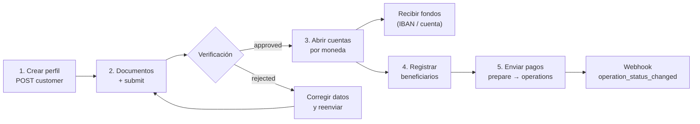
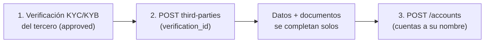

import { EnvUrls } from "/snippets/env-urls.jsx";

<EnvUrls lang="es" />

Banking te da **cuentas bancarias reales** a nombre de tu perfil verificado:
recibes fondos por rieles internacionales (SEPA, SWIFT, ACH según la
moneda), mantienes saldo en moneda fiat y envías pagos a terceros. Es un
producto distinto de tu saldo USDT: **el dinero de banking vive en tus
cuentas bancarias**, no en el saldo CBPay.

| Concepto | Dónde vive | Se consulta con |
|---|---|---|
| Saldo USDT CBPay | Ledger CBPay | `GET /v1/balances` |
| Saldos bancarios | Tus cuentas bancarias | `GET /v1/banking/accounts/{id}/balance` |

<Note>
Las comisiones de banking vienen en dos formas. Las **fijas standalone**
(`banking_customer`, `banking_account`, `banking_operation`) se debitan de tu
**saldo USDT** al ejecutar cada operación y se **reembolsan automáticamente**
si falla. Las **transaccionales por riel** (`banking_deposit`,
`banking_transfer_ach`, `banking_transfer_swift`, `banking_transfer_wire`,
`banking_transfer_sepa`) son un porcentaje más un monto fijo cobrado **en la
moneda de la operación** (tu saldo `BANK_USD` / `BANK_EUR`) — ver
[comisiones por riel](#comisiones-por-riel-depositos-y-transferencias). Con
comisión 0 (el default) el servicio es gratis. Los campos `banking_fee` y
`banking_fee_asset` de cada respuesta te muestran lo cobrado y en qué moneda.
</Note>

## El flujo completo



1. **Crea tu perfil bancario** (`POST /v1/banking/customer`) — una sola vez.
2. **Sube documentos** de verificación y **envíalo a revisión**.
3. Cuando quede `approved`, **abre cuentas** por moneda.
4. **Registra beneficiarios** (counterparties) para pagos a terceros.
5. **Envía pagos**: cotiza con `prepare` y ejecuta con `operations`.

Los cambios de estado te llegan por los webhooks
`banking_customer_status_changed` y `banking_operation_status_changed`
([webhooks](/es/webhooks)).

## 1. Crea tu perfil bancario

Una vez por cuenta. Si no envías `type`, `name` o `email`, se completan con
los datos de tu cuenta CBPay:

```bash
curl -X POST https://api.qbank.cl/platform/v1/banking/customer \
  -H "Authorization: Bearer <token>" \
  -H "Content-Type: application/json" \
  -d '{
    "currency": "USD",
    "address": { "countryIso": "CL", "city": "Santiago" }
  }'
```

Respuesta `201`:

```json
{
  "customer_id": "9f2b…",
  "provider_id": "…",
  "status": "draft",
  "data": { "item": { "…": "…" } },
  "created_at": "2026-07-07T12:00:00Z",
  "banking_fee": "5.000000"
}
```

Si tu cuenta ya tiene perfil bancario — `409 banking_customer_exists`.

<Note>
**Idempotencia durable.** La plataforma deriva un claim determinista en el
core para esta cuenta/perfil. La primera solicitud exitosa responde `201`.
Repetir la misma solicitud responde `201` con `idempotency_hit: true`, sin
crear un segundo perfil ni cobrar dos veces el fee del perfil. Un payload
distinto para la misma cuenta responde `409 idempotency_conflict`. Si el
resultado upstream/core es ambiguo, la API responde
`503 banking_recovery_pending`; no reintentes con una clave nueva.
Operaciones debe reconciliar primero el claim durable.
</Note>


<Note>
**Revisión de solicitudes.** Si tu organización activó la revisión de solicitudes banking, esta llamada puede responder **`202 Accepted`** con `{"status":"in_review","kind":"banking_application","review_id":"…"}` en vez de `201` — el perfil se crea solo cuando compliance aprueba la revisión. El fee del perfil banking se cobra al retener la solicitud y **se reembolsa automáticamente si se rechaza**. Sigue el resultado con el webhook `txn_review_status_changed` o en [Revisiones de operaciones](/es/guias/revisiones-operaciones).
</Note>

Consulta el estado en cualquier momento:

```bash
curl https://api.qbank.cl/platform/v1/banking/customer \
  -H "Authorization: Bearer <token>"
```

## 2. Documentos y verificación

Sube cada documento en base64 (gratis):

```bash
curl -X POST https://api.qbank.cl/platform/v1/banking/customer/documents \
  -H "Authorization: Bearer <token>" \
  -H "Content-Type: application/json" \
  -d '{
    "type": "PASSPORT",
    "filename": "pasaporte.pdf",
    "attach": "<contenido en base64>"
  }'
```

Y envía el perfil a revisión (gratis):

```bash
curl -X POST https://api.qbank.cl/platform/v1/banking/customer/submit \
  -H "Authorization: Bearer <token>"
```

Estados del perfil: `draft` → `submitted` → `under_review` →
**`approved`** o `rejected`. El webhook
`banking_customer_status_changed` te avisa cada cambio — del perfil propio
(`customer_kind: self`) y de los terceros que registres
(`customer_kind: third_party`, con su `third_party_id`):

```json
{
  "account_id": "…",
  "customer_id": "9f2b…",
  "customer_kind": "self",
  "kyc_status": "approved"
}
```

## 3. Abre cuentas bancarias

Con el perfil `approved`, crea una cuenta por moneda. Monedas disponibles:
**USD** (rieles ACH/Fedwire/SWIFT) y **EUR** (SEPA/SWIFT):

<CodeGroup>

```bash Cuenta USD
curl -X POST https://api.qbank.cl/platform/v1/banking/accounts \
  -H "Authorization: Bearer <token>" \
  -H "Content-Type: application/json" \
  -d '{ "currency": "USD", "name": "Operativa USD" }'
```

```bash Cuenta EUR
curl -X POST https://api.qbank.cl/platform/v1/banking/accounts \
  -H "Authorization: Bearer <token>" \
  -H "Content-Type: application/json" \
  -d '{ "currency": "EUR", "name": "Operativa EUR" }'
```

</CodeGroup>

Respuesta `201` — `data` incluye los datos para **recibir** (número de
cuenta/IBAN, routing, banco):

```json
{
  "account_id": "c4d1…",
  "provider_id": "…",
  "status": "active",
  "data": { "…": "…" },
  "banking_fee": "1.000000"
}
```

Lista tus cuentas, consulta el detalle de una cuenta puntual y su saldo:

```bash
curl https://api.qbank.cl/platform/v1/banking/accounts \
  -H "Authorization: Bearer <token>"

curl https://api.qbank.cl/platform/v1/banking/accounts/c4d1… \
  -H "Authorization: Bearer <token>"

curl https://api.qbank.cl/platform/v1/banking/accounts/c4d1…/balance \
  -H "Authorization: Bearer <token>"
```

El detalle (`GET /v1/banking/accounts/{id}`) devuelve la cuenta EN VIVO —
nombre, moneda, estado y bajo `data` los **requisitos para recibir
fondos** (rieles wire y locales: banco, número de cuenta/IBAN, routing).
Úsalo para mostrar las instrucciones de depósito de una cuenta específica
sin recorrer el listado:

```json
{
  "account_id": "c4d1…",
  "provider_id": "…",
  "source": "live",
  "data": {
    "name": "Operativa USD",
    "currencyCode": "USD",
    "status": "ACCEPT",
    "requisites": [
      { "type": "SWIFT", "…": "…" },
      { "type": "LOCAL", "…": "…" }
    ]
  }
}
```

`source` indica de dónde salió el detalle: `live` (el banco respondió en
vivo) o `mirror` (el banco no pudo servir la cuenta en ese momento y se
devuelve el último snapshot conocido — los requisitos de depósito siguen
disponibles).

<Note>
El listado expone solo las cuentas **habilitadas para tu operación** según
la configuración del corredor. Una cuenta no habilitada no aparece en el
listado y sus consultas por id responden `404 not_found`.
</Note>

<Note>
**Límite para cuentas persona**: una cuenta persona puede tener **máximo 1
cuenta bancaria**. Al intentar la segunda recibirás `409
banking_account_limit`. Las cuentas empresa no tienen límite.
</Note>

## Usuarios de terceros (solo empresas)

Si tu cuenta es **empresa**, además de tus cuentas propias puedes dar de
alta **usuarios banking de terceros** — tus clientes finales (personas o
empresas) — cada uno con su identidad y verificación propias y **cuentas
bancarias a su nombre**. Sin límite de terceros ni de cuentas por tercero.



### Alta del tercero

El alta exige el `verification_id` de una [verificación KYC/KYB
**aprobada**](/es/guias/kyc) del tercero — su identidad única en CBPay. El
tipo sale del kind de la verificación (KYC ⇒ `INDIVIDUAL`, KYB ⇒
`COMPANY`), los datos (nombre, email, dirección) se completan solos desde
el perfil verificado (lo que envíes explícito gana) y los **documentos ya
validados se re-entregan automáticamente** al proveedor bancario. Se cobra
el fee de perfil bancario (se reembolsa si el alta falla):

```bash
curl -X POST https://api.qbank.cl/platform/v1/banking/third-parties \
  -H "Authorization: Bearer <token>" \
  -H "Content-Type: application/json" \
  -d '{
    "verification_id": "c3d4e5f6-a7b8-4c9d-0e1f-2a3b4c5d6e7f"
  }'
```

Respuesta `201`:

```json
{
  "third_party_id": "7f2a…",
  "customer_id": "…",
  "kind": "third_party",
  "status": "pending",
  "verification_id": "c3d4e5f6-a7b8-4c9d-0e1f-2a3b4c5d6e7f",
  "documents_synced": 2,
  "registered_at": "2026-07-10T15:00:00Z",
  "banking_fee": "1.000000"
}
```

<Note>
`documents_synced` cuenta los documentos de la verificación que quedaron
cargados automáticamente en el perfil bancario del tercero. Si alguno no se
pudo sincronizar (o el banco pide categorías adicionales), súbelo por el
flujo manual de documentos de más abajo y luego haz `submit`.
</Note>

<Note>
**Revisión de solicitudes.** Con la revisión de solicitudes banking activada, registrar un tercero también puede responder **`202 Accepted`** (`kind: banking_application`): el tercero se registra solo cuando la revisión se aprueba, y el fee de registro se reembolsa automáticamente si se rechaza. Síguelo vía `txn_review_status_changed` o en [Revisiones de operaciones](/es/guias/revisiones-operaciones).
</Note>

Guarda el `third_party_id`: todas las rutas del tercero lo usan. Lista y
consulta (el GET trae el estado de verificación en vivo):

```bash
curl "https://api.qbank.cl/platform/v1/banking/third-parties?page=1&page_size=50" \
  -H "Authorization: Bearer <token>"

curl https://api.qbank.cl/platform/v1/banking/third-parties/7f2a… \
  -H "Authorization: Bearer <token>"
```

### Verificación del tercero (gratis)

Igual que tu propio perfil, pero sobre el tercero:

```bash
curl -X POST https://api.qbank.cl/platform/v1/banking/third-parties/7f2a…/documents \
  -H "Authorization: Bearer <token>" \
  -H "Content-Type: application/json" \
  -d '{ "type": "PASSPORT", "file_base64": "…" }'

curl -X POST https://api.qbank.cl/platform/v1/banking/third-parties/7f2a…/submit \
  -H "Authorization: Bearer <token>"
```

### Cuentas del tercero

Con el tercero aprobado, ábrele cuentas (mismo fee `banking_account`) y
opera igual que con las tuyas:

```bash
curl -X POST https://api.qbank.cl/platform/v1/banking/third-parties/7f2a…/accounts \
  -H "Authorization: Bearer <token>" \
  -H "Content-Type: application/json" \
  -d '{ "currency": "USD", "name": "Cuenta Carlos" }'

curl https://api.qbank.cl/platform/v1/banking/third-parties/7f2a…/accounts \
  -H "Authorization: Bearer <token>"

curl https://api.qbank.cl/platform/v1/banking/third-parties/7f2a…/accounts/{bankAccountID}/balance \
  -H "Authorization: Bearer <token>"
```

- Cada tercero es tuyo y solo tuyo: otra cuenta CBPay jamás puede verlo ni
  operarlo (responde `404`).
- Una cuenta **persona** que intente crear terceros recibe
  `403 company_required`.
- Sin `verification_id` (o con una verificación no aprobada) el alta
  responde `422 verification_required` / `422 verification_not_approved`.
  Si envías un `type` que no calza con el kind de la verificación,
  `422 verification_kind_mismatch`. Los terceros creados antes de esta
  regla siguen operando con normalidad.
- Los terceros dados de alta alimentan la métrica "usuarios nuevos" de tu
  [resumen de cuenta](/es/guias/analytics).

## 4. Registra beneficiarios

Para pagar a terceros, primero registra al beneficiario con sus datos
bancarios (gratis; pasa por moderación antes de poder usarse):

```bash
curl -X POST https://api.qbank.cl/platform/v1/banking/counterparties \
  -H "Authorization: Bearer <token>" \
  -H "Content-Type: application/json" \
  -d '{
    "description": "Proveedor ACME",
    "profile": {
      "name": "ACME LLC",
      "address": { "addressLine1": "1 Main St", "city": "New York", "stateIso": "NY", "countryIso": "US", "postalCode": "10001" },
      "additionalInfo": { "type": "CORPORATION" }
    },
    "accounts": [
      {
        "currencyCode": "USD",
        "bank": { "name": "Test Bank", "number": "011000138" },
        "fiat": {
          "number": "0532013000",
          "routingNumber": "011000138",
          "additionalInformation": { "type": "TYPE_FIAT_US", "accountType": "CHECKING", "supportedRails": ["ACH"] }
        }
      }
    ]
  }'
```

Lista los tuyos con `GET /v1/banking/counterparties` y agrega más cuentas a
un beneficiario existente con
`POST /v1/banking/counterparties/{id}/accounts`.

## 5. Envía pagos

Dos tipos de operación:

| `type` | Qué hace | `paymentType` |
|---|---|---|
| `TRANSFER` | Entre tus propias cuentas bancarias | `EMPTY` |
| `WITHDRAW` | A un beneficiario registrado | Según el rail (ej. `SEPA_CT`) |

Cotiza primero (gratis, no mueve dinero):

```bash
curl -X POST https://api.qbank.cl/platform/v1/banking/operations/prepare \
  -H "Authorization: Bearer <token>" \
  -H "Content-Type: application/json" \
  -d '{
    "currency": "USD",
    "type": "WITHDRAW",
    "paymentType": "SEPA_CT",
    "sourceRequisit": { "account": "c4d1…" },
    "destinationRequisit": { "beneficiar": "<cuenta del beneficiario>" },
    "amount": { "currencyCode": "USD", "units": "250", "nanos": 0 }
  }'
```

Ejecuta con clave de idempotencia (aquí se cobra la comisión del riel — o la
legacy `banking_operation` cuando el riel no tiene configuración):

<CodeGroup>

```bash WITHDRAW (a un beneficiario)
curl -X POST https://api.qbank.cl/platform/v1/banking/operations \
  -H "Authorization: Bearer <token>" \
  -H "Idempotency-Key: pago-acme-0071" \
  -H "Content-Type: application/json" \
  -d '{
    "currency": "USD",
    "type": "WITHDRAW",
    "paymentType": "SEPA_CT",
    "sourceRequisit": { "account": "c4d1…" },
    "destinationRequisit": { "beneficiar": "<cuenta del beneficiario>" },
    "amount": { "currencyCode": "USD", "units": "250", "nanos": 0 },
    "comment": "Factura 8841"
  }'
```

```bash TRANSFER (entre tus cuentas)
curl -X POST https://api.qbank.cl/platform/v1/banking/operations \
  -H "Authorization: Bearer <token>" \
  -H "Idempotency-Key: mov-interno-0012" \
  -H "Content-Type: application/json" \
  -d '{
    "currency": "USD",
    "type": "TRANSFER",
    "paymentType": "EMPTY",
    "sourceRequisit": { "account": "c4d1…" },
    "destinationRequisit": { "account": "<otra cuenta tuya>" },
    "amount": { "currencyCode": "USD", "units": "100", "nanos": 0 }
  }'
```

</CodeGroup>

Respuesta `202`:

```json
{
  "operation_id": "7e8a…",
  "provider_id": "…",
  "status": "pending",
  "idempotency_key": "platform:…:pago-acme-0071",
  "data": { "…": "…" },
  "banking_fee": "2.000000",
  "banking_fee_asset": "BANK_USD"
}
```

`banking_fee` y `banking_fee_asset` solo aparecen cuando se cobró una
comisión. Con una comisión por riel el asset es la moneda de la operación
(`BANK_USD` / `BANK_EUR`); con el fallback legacy es `USDT`.

- El estado final llega por el webhook `banking_operation_status_changed`
  (`completed` / `failed`); también puedes consultar
  `GET /v1/banking/operations/{id}`. Cuando la operación queda en estado
  final, el webhook incluye su `receipt_url` y puedes descargar el
  comprobante PDF con `GET /v1/banking/operations/{id}/receipt`
  ([comprobantes](/es/guias/comprobantes)).
- Reintentos con la misma `Idempotency-Key` devuelven la operación original
  (`idempotency_hit: true`) **sin volver a cobrar** la comisión.

<Note>
**Trazabilidad completa.** Cada operación bancaria queda registrada en tu
cuenta: aparece en la sección `banking_operations` de la
[cartola](/es/guias/cartola), su dinero cuadra en los saldos espejo
`BANK_USD`/`BANK_EUR` (sección `assets`), y su volumen suma al
`gross_volume` de [analytics](/es/guias/analytics). El saldo autoritativo
sigue siendo el del banco: el espejo se reconcilia periódicamente.
</Note>

El historial completo, con filtros:

```bash
curl "https://api.qbank.cl/platform/v1/banking/operations?from=2026-07-01&to=2026-07-08&status=completed&type=WITHDRAW&page_size=50" \
  -H "Authorization: Bearer <token>"
```

```json
{
  "items": [
    {
      "id": "7e8a…",
      "type": "withdraw",
      "status": "completed"
    }
  ],
  "meta": { "page": 1, "page_size": 50, "retrieved": 1 }
}
```

<Note>
Toda operación bancaria — incluidos los depósitos entrantes y las comisiones
bancarias descubiertas automáticamente desde el banco — expone su
`direction` (`in` / `out`), `amount` neto, `currency`, `counterparty` y
`reference` cuando el banco los reporta. Estos campos son opcionales y
aparecen en `GET /v1/banking/operations` y
`GET /v1/banking/operations/{id}`.
</Note>

El webhook `banking_operation_status_changed` se mantiene liviano por
diseño: lleva los identificadores y el nuevo estado, nunca los campos
enriquecidos. Cuando llegue, consulta el detalle de la operación para leer
la dirección, el monto, la contraparte y la referencia. Ver
[webhooks](/es/webhooks).

## Comisiones por riel (depósitos y transferencias)

Además de las comisiones fijas standalone, banking soporta **comisiones
transaccionales por riel** — un porcentaje más un monto fijo, siempre
cobradas **en la moneda de la operación** (`BANK_USD` / `BANK_EUR`), nunca
en USDT:

| Servicio | Aplica a | Cuándo se cobra |
|---|---|---|
| `banking_deposit` | Depósitos entrantes (USD/EUR) | Al acreditar el depósito — **con tope en el monto del depósito** (`fee = min(fee, monto)`), así un depósito chico nunca queda en negativo |
| `banking_transfer_ach` | Transferencias salientes ACH | Al despachar, con chequeo de saldo fail-closed |
| `banking_transfer_swift` | Transferencias salientes SWIFT | Al despachar, con chequeo de saldo fail-closed |
| `banking_transfer_wire` | Transferencias salientes wire (FEDWIRE) | Al despachar, con chequeo de saldo fail-closed |
| `banking_transfer_sepa` | Transferencias salientes SEPA | Al despachar, con chequeo de saldo fail-closed |

En las **transferencias** el saldo disponible debe cubrir `monto + comisión`
— si no alcanza, la API responde `402 insufficient_funds` y la operación
**no se crea**. Si la operación es rechazada de forma definitiva justo
después del despacho, la comisión se **reembolsa automáticamente** (la misma
disciplina de la comisión legacy).

**Fallback:** si el riel no tiene configuración específica (ni a nivel cuenta
ni plataforma), se cobra la legacy `banking_operation` (fija, en USDT). Un
riel configurado con 0% + 0 fijo queda **explícitamente gratis** — NO cae al
fallback.

## Estados de operación

| Estado | Significado |
|---|---|
| `pending` | Aceptada, esperando procesamiento |
| `processing` | En ejecución en el rail bancario |
| `completed` | El dinero llegó — final |
| `failed` | Falló; si hubo comisión de la operación, se reembolsó |
| `cancelled` | Cancelada antes de ejecutarse |

## Errores

| HTTP | `error` | Qué hacer |
|---|---|---|
| 400 | `idempotency_key_required` | Envía la clave en body o header |
| 402 | `insufficient_funds` | Saldo insuficiente: con comisión por riel el chequeo es `saldo ≥ monto + comisión` en la **moneda de la operación** (`BANK_USD`/`BANK_EUR`); con el fallback legacy es tu saldo USDT |
| 403 | `account_blocked` | La cuenta no está activa; contacta al equipo de CBPay |
| 409 | `banking_customer_exists` | Tu cuenta ya tiene perfil bancario (`GET /v1/banking/customer`) |
| 409 | `idempotency_conflict` | El claim del mismo perfil banking sigue pendiente o cambió el payload — conserva la misma solicitud y no crees un segundo perfil |
| 503 | `banking_recovery_pending` | El resultado del alta es ambiguo — operaciones debe reconciliar el claim durable antes de reintentar con una clave nueva |
| 409 | `no_banking_customer` | Crea primero tu perfil (`POST /v1/banking/customer`) |
| 409 | `banking_account_limit` | Las cuentas persona tienen máximo 1 cuenta bancaria |
| 403 | `company_required` | Los usuarios de terceros solo están disponibles para cuentas empresa |
| 422 | `verification_required` | El alta de terceros exige `verification_id` de una verificación aprobada ([verifica primero](/es/guias/kyc)) |
| 422 | `verification_not_approved` | La verificación referenciada aún no está aprobada; espera la aprobación |
| 422 | `verification_kind_mismatch` | El `type` enviado no calza con el kind de la verificación (KYC ⇒ INDIVIDUAL, KYB ⇒ COMPANY) |
| 422 | `verification_invalid` | Referenciaste tu verificación de onboarding; el tercero necesita la suya propia |
| 404 | `not_found` | El tercero (o la verificación) no existe o no pertenece a tu cuenta |
| 502 | `banking_request_failed` | Error del corredor bancario; la comisión se reembolsó — reintenta |
## FAQ

<AccordionGroup>
<Accordion title="¿El dinero banking aparece en mi saldo USDT?">
No. El dinero banking vive en tus cuentas bancarias y se consulta con
`GET /v1/banking/accounts/{id}/balance`. El saldo autoritativo es el del
banco; tu [cartola](/es/guias/cartola) lo concilia en los saldos espejo
`BANK_USD`/`BANK_EUR`. Las **comisiones por riel** se cobran en la moneda de
la operación (tu saldo `BANK_USD`/`BANK_EUR`); solo la comisión legacy
`banking_operation` se debita de tu saldo USDT.
</Accordion>
<Accordion title="¿Qué pasa con la comisión si una operación falla?">
Se reembolsa automáticamente — comisiones de perfil, cuenta y operación por
igual, incluidas las comisiones por riel (reembolsadas en el rechazo
definitivo síncrono). Un reintento con la misma `Idempotency-Key` devuelve
la operación original (`idempotency_hit: true`) y jamás cobra dos veces.
</Accordion>
<Accordion title="¿Cuántas cuentas bancarias puedo abrir?">
Una por moneda (USD, EUR). Además, las cuentas **persona** pueden tener
como máximo 1 cuenta bancaria en total (`409 banking_account_limit`); las
cuentas empresa no tienen límite.
</Accordion>
<Accordion title="¿Por qué una de mis cuentas no aparece en el listado?">
El listado solo expone las cuentas **habilitadas para tu operación** según
la configuración del corredor. Una cuenta no habilitada no aparece y sus
consultas por id responden `404 not_found` — contacta a tu equipo CBPay si
necesitas habilitarla.
</Accordion>
<Accordion title="¿Una cuenta persona puede registrar usuarios terceros?">
No — los terceros son una capacidad de empresa (`403 company_required`). El
registro además exige el `verification_id` de una verificación KYC/KYB
**aprobada** del tercero.
</Accordion>
<Accordion title="¿Cómo sé cuándo un pago llegó a su estado final?">
Suscríbete a `banking_operation_status_changed`: se dispara en `completed`
/ `failed` e incluye el `receipt_url` una vez final. También puedes
consultar `GET /v1/banking/operations/{id}`.
</Accordion>
</AccordionGroup>

## Banking creation claims and recovery

Creation claims are durable records, not permission to send a second provider
request. The platform stores `banking_creation_claims` with `kind`,
`idempotency_key`, `request_hash`, status, attempts and refund state. Migration
105 creates this table and its single-flight lock; migration 106 stores
transaction-firewall fee-refund recovery. Migration 074 persists the resolved
core provider on customer idempotency claims.

### Recovery rules

- A completed account recovery compares the provider account ownership with
  the claimed customer's `ProviderID`.
- A terminal provider authentication response (`401` or `403`) does not by
  itself prove that the creation failed; the claim remains recoverable.
- Reusing the same idempotency key with a different request hash is rejected.
- A completed claim can be replayed with HTTP `200` and `idempotency_hit: true`;
  recovery does not call the provider again.
- `POST /v1/org/banking/creation-claims/refund` retries a pending fee refund
  for `kind=customer` or `kind=account`.
- `POST /v1/org/txn-firewall/fee-refunds/{resourceID}/retry` retries the
  durable firewall-fee refund. A completed refund replays as HTTP `200`.

The core admin route
`POST /v1/ops/banking/account-creations/reconcile` verifies the provider
account and finalizes the local mirror. The org-admin routes list claims,
reconcile customer claims, and retry refunds. These operations are locked so
concurrent reconciliation cannot originate duplicate money movement.

## vIBAN EUR

La plataforma puede solicitar un IBAN virtual para una cuenta activa y
verificada. Un vIBAN es un instrumento de direccionamiento y ruteo; no es un
saldo separado del proveedor. La superficie de cuenta expone la solicitud
durable y su estado. El procesamiento de ingresos y returns/recalls está
implementado para ambos propósitos; el onboarding de customers del proveedor y
la activación productiva quedan fuera del contrato público provider-agnostic.

Hay dos propósitos:

| Propósito | Por defecto | Significado |
|---|---:|---|
| `funding_usdt` | Sí | Dirección EUR asociada al producto de fondeo USDT. |
| `banking_eur` | No | Dirección de Banking EUR; la cuenta debe tener habilitado Banking. |

Solicita la dirección de fondeo con una clave idempotente:

```bash
curl -X POST https://api.qbank.cl/platform/v1/banking/virtual-ibans \
  -H "Authorization: Bearer <token>" \
  -H "Idempotency-Key: viban-funding-2026-001" \
  -H "Content-Type: application/json" \
  -d '{"purpose":"funding_usdt"}'
```

La solicitud entra a la cola de aprobación manual:

```json
{
  "virtual_iban": {
    "id": "2f8c1d4e-1111-4b22-8a33-000000000001",
    "owner_account_id": "9b1deb4d-3b7d-4bad-9bdd-2b0d7b3dcb6d",
    "manager_account_id": "",
    "purpose": "funding_usdt",
    "currency": "EUR",
    "iban": "",
    "iban_country": "",
    "status": "pending_approval",
    "client_order": "platform:virtual-iban:org:account:funding_usdt:viban-funding-2026-001",
    "order_reference": "",
    "created_at": "2026-09-10T12:00:00Z",
    "updated_at": "2026-09-10T12:00:00Z"
  },
  "status": "pending_approval"
}
```

`banking_eur` se solicita explícitamente:

```bash
curl -X POST https://api.qbank.cl/platform/v1/banking/virtual-ibans \
  -H "Authorization: Bearer <token>" \
  -H "Idempotency-Key: viban-eur-2026-001" \
  -H "Content-Type: application/json" \
  -d '{"purpose":"banking_eur"}'
```

Lista las solicitudes de la cuenta con ventana de fechas obligatoria:

```bash
curl "https://api.qbank.cl/platform/v1/banking/virtual-ibans?page=1&page_size=50&from=2026-09-01&to=2026-09-11&purpose=funding_usdt" \
  -H "Authorization: Bearer <token>"
```

La lista responde `{page, page_size, virtual_ibans}`. Los estados soportados
son `pending_approval`, `pending`, `active`, `rejected`, `failed`, `disabled`
y `closed`. La cuenta ve el IBAN completo cuando fue asignado; la lectura de
organización lo muestra enmascarado.

<Warning>
El corredor bancario puede requerir aprobación de operaciones y un customer
verificado antes de activar un vIBAN EUR. Host productivo, certificados/mTLS,
límites, fees comerciales y activación son configuración y no forman parte de
este contrato provider-agnostic. Nunca los infieras desde ejemplos.
</Warning>

### Errores

| HTTP | Código | Acción |
|---:|---|---|
| 400 | `invalid_json` | Envía un objeto JSON. |
| 400 | `invalid_purpose` | Usa `funding_usdt` o `banking_eur`. |
| 400 | `idempotency_key_required` | Envía `Idempotency-Key` o `idempotency_key`. |
| 403 | `verification_required` / error de servicio | Completa la verificación y habilita el producto requerido. |
| 409 | `virtual_iban_conflict` | Reutiliza la solicitud original; no crees otra asignación. |
| 503 | `banking_recovery_pending` | Reconcilia la solicitud durable antes de reintentar. |

### Preguntas frecuentes

<AccordionGroup>
<Accordion title="¿Solicitar un vIBAN crea un saldo BANK_EUR?">
No. El propósito queda guardado en la solicitud, pero el vIBAN no es un saldo
independiente del proveedor. El tratamiento financiero se documentará cuando
el flujo de Banking EUR esté habilitado.
</Accordion>
<Accordion title="¿Puedo reintentar después de un timeout?">
Reintenta con la misma clave idempotente. Una clave nueva crea otra solicitud
y no debe usarse para adivinar el resultado de una llamada ambigua.
</Accordion>
<Accordion title="¿Por qué el estado es pending_approval?">
Cada asignación requiere aprobación manual de operaciones de la organización
antes de llamar al riel bancario.
</Accordion>
</AccordionGroup>

## Procesamiento de ingresos verificado

Cuando el proveedor bancario envía un ingreso terminal, el core lo normaliza
como `banking_virtual_iban_inbound`. La plataforma resuelve el vIBAN dueño y
aplica su propósito:

- `funding_usdt` crea un payin `banking_funding` en EUR, aplica la tasa marcada
  EUR→USDT y el fee/spread configurado, y sigue el firewall y la cadena de
  crédito de payin.
- `banking_eur` crea un espejo Banking en `BANK_EUR`, usa el camino del ledger,
  emite KYT/estado de operación y encola el comprobante por email.

Solo estados terminales (`completed`, `success`, `settled`, `credited` o
`succeeded`) aplican el efecto financiero. Los estados pending/unknown quedan
reconciliables y no acreditan saldo.

`failed` y `rejected` son resultados terminales negativos. No crean un crédito;
un payin de fondeo aún no acreditado queda failed sin un loop de refund.

<Note>
Returns/recalls se procesan como eventos terminales `returned`, `recalled` o
`reversed`. Un return antes del crédito impide que un replay posterior acredite.
Un payin `funding_usdt` ya acreditado crea el camino determinista de
chargeback/refund; una operación `banking_eur` ledgerizada recibe un reverse
append-only. Un evento de completion posterior no puede resucitar una operación
devuelta.
</Note>

## Trazabilidad del ingreso EUR

Los ingresos por vIBAN EUR conservan el riel y el propósito en el espejo
banking, la cartola y analytics. El detalle puede exponer
`payment_rail: "SEPA_INSTANT"`, `purpose` (`funding_usdt` o `banking_eur`) y la
referencia del vIBAN cuando el riel la informa. Un evento terminal
`funding_usdt` entra a la cadena normal de crédito de payin; un evento terminal
`banking_eur` queda como operación `BANK_EUR` y comprobante.

## vIBAN para terceros

Las cuentas empresa pueden solicitar un vIBAN `banking_eur` para un tercero
propio después de que acepte la invitación y complete KYC/KYB aprobado. El
tercero es el dueño del saldo; la empresa administra la relación:

```bash
curl -X POST https://api.qbank.cl/platform/v1/banking/third-parties/7f2a0000-0000-4000-8000-000000000001/virtual-ibans   -H "Authorization: Bearer <token>"   -H "Idempotency-Key: third-party-viban-2026-001"   -H "Content-Type: application/json"   -d '{}'
```

La solicitud queda como `banking_eur` y sigue la misma aprobación manual y
ciclo de estados de la solicitud de cuenta.

### Saldo BANK_EUR

Para una solicitud `banking_eur`, consulta el saldo conciliado:

```bash
curl https://api.qbank.cl/platform/v1/banking/virtual-ibans/2f8c1d4e-1111-4b22-8a33-000000000001/balance   -H "Authorization: Bearer <token>"
```

La respuesta lleva `asset: "BANK_EUR"`, `available`, `held`, `purpose` y
`source`. Para `funding_usdt` responde `409 balance_not_available`, porque ese
propósito entra a la cadena de crédito USDT y no mantiene `BANK_EUR`.
