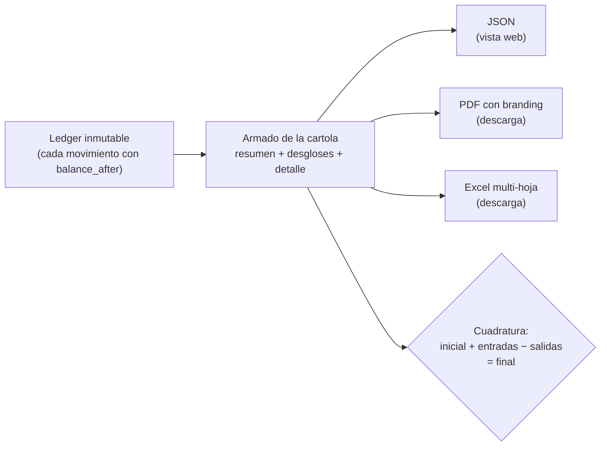

import { EnvUrls } from "/snippets/env-urls.jsx";

<EnvUrls lang="es" />

La cartola consolida **todos** los movimientos de una cuenta en un período —
payouts, payins, depósitos y retiros crypto, transferencias internas,
compras con tarjeta, conversiones de saldo, operaciones bancarias y
cargos por servicio — en un solo documento auditable. Un mismo endpoint la
entrega en tres formatos:

| Formato | Para qué | Cómo pedirlo |
|---|---|---|
| `json` (default) | Mostrar la cartola en tu web/app | `format=json` |
| `pdf` | Documento formal con branding CBPay | `format=pdf` |
| `xlsx` | Excel con hojas por sección, filtros y celdas numéricas | `format=xlsx` |



## Pedir la cartola

```bash
# JSON para tu front
curl "https://api.qbank.cl/platform/v1/reports/statement?from=2026-01-01&to=2026-07-07" \
  -H "Authorization: Bearer <token>"

# PDF descargable (branding CBPay)
curl -OJ "https://api.qbank.cl/platform/v1/reports/statement?from=2026-01-01&to=2026-07-07&format=pdf" \
  -H "Authorization: Bearer <token>"

# Excel descargable
curl -OJ "https://api.qbank.cl/platform/v1/reports/statement?from=2026-01-01&to=2026-07-07&format=xlsx" \
  -H "Authorization: Bearer <token>"
```

- `from` / `to`: fechas `YYYY-MM-DD` inclusive, en la zona horaria de tu organización. Rango máximo:
  400 días.
- El campo de respuesta `period.timezone` contiene la zona horaria IANA real de la organización (por ejemplo `America/New_York`), no una etiqueta UTC fija.
- `lang=en|es|zh`: idioma del PDF/Excel (default `en`). Tambien `Content-Language`.
- Los archivos llegan con `Content-Disposition: attachment`. El basename sigue el locale (`statement_…` / `cartola_…` / `对账单_…`).

## Qué contiene

```json
{
  "account": { "account_id": "…", "display_name": "Empresa Ejemplo SpA", "type": "company" },
  "period": { "from": "2026-01-01", "to": "2026-07-07", "timezone": "America/New_York" },
  "generated_at": "2026-07-07T15:00:00Z",
  "summary": {
    "opening_balance": "0.000000",
    "total_in": "985633.540000",
    "total_out": "38099.870000",
    "net_change": "947533.670000",
    "closing_balance": "947533.670000",
    "balanced": true,
    "counts": { "payouts": 51, "payins": 12, "crypto_deposits": 18, "transfers": 4 },
    "fees_by_service": { "payout": "15.300000", "funding": "897.550000" },
    "total_fees": "912.850000"
  },
  "breakdown": {
    "by_product": [ { "product": "payouts", "count": 51, "usdt_in": "0.000000", "usdt_out": "38099.870000", "fees": "15.300000" } ],
    "by_country": [ { "flow": "payouts", "country": "BO", "currency": "BOB", "count": 14, "local_amount": "28748.58", "usdt_amount": "2902.210000" } ],
    "by_currency": [ { "currency": "BOB", "payout_local": "28748.58", "payin_local": "700.00" } ],
    "by_month": [ { "month": "2026-01", "usdt_in": "985633.540000", "usdt_out": "35100.000000" } ]
  },
  "payouts": [ { "created_at": "…", "payout_id": "…", "country": "BO", "beneficiary": "Juan Quispe", "local_amount": "90.00", "fx_rate": "6.91", "usdt_amount": "13.024600", "fee": "0.300000", "fee_percent": "0.200000", "fee_fixed": "0.100000", "total_debit": "13.324600", "status": "completed", "bank_reference": "00761123456" } ],
  "payins": [ { "…": "…" } ],
  "card_transactions": [ { "created_at": "…", "transaction_id": "…", "card_id": "…", "kind": "purchase", "merchant": "AMAZON.COM", "amount_usd": "25.00", "spend_asset": "USDT", "spend_amount": "25.000000", "status": "settled" } ],
  "swaps": [ { "created_at": "…", "swap_id": "…", "from_asset": "USDT", "to_asset": "BTC", "from_amount": "10.000000", "to_amount": "0.00015433", "rate": "0.00001543", "status": "completed" } ],
  "banking_operations": [ { "created_at": "…", "operation_id": "…", "direction": "out", "type": "wire", "currency": "USD", "amount": "150.00", "counterparty": "Acme Inc", "status": "completed" } ],
  "assets": [
    {
      "asset": "GOLD",
      "opening_balance": "0.000000",
      "total_in": "12.500000",
      "total_out": "2.000000",
      "net_change": "10.500000",
      "closing_balance": "10.500000",
      "balanced": true,
    }
  ],
  "crypto_deposits": [ { "chain": "tron", "asset": "USDT", "tx_id": "…", "usdt_gross": "100.000000", "fee": "1.000000", "usdt_credited": "99.000000", "balance_after": "99.000000" } ],
  "crypto_withdrawals": [ { "…": "…" } ],
  "transfers": [ { "direction": "sent", "counterparty": "Ana Pérez", "asset": "USDT", "amount": "25.000000" } ],
  "service_charges": [ { "type": "banking_fee", "service": "banking_customer", "fee_model": "fixed", "asset": "USDT", "amount": "-0.500000", "balance_after": "98.500000" } ],
}
```

Secciones:

1. **`summary`** — saldo inicial, entradas, salidas, saldo final, comisiones
   por servicio y el flag `balanced` del **saldo USDT** (la moneda
   operativa).
2. **`assets`** — una sección conciliada por cada saldo no-USDT con
   actividad o saldo (USDC, BTC, GOLD y, si usas Banking, los espejos
   `BANK_USD`/`BANK_EUR` de tus cuentas bancarias): saldo inicial/final,
   entradas, salidas y su propio flag `balanced`, en la precisión de cada
   moneda y SIN detalle crudo en la vista cliente; el detalle crudo por
   asset vive solo en la cartola org-admin. Si solo operas USDT, viene vacía.
3. **`breakdown`** — por producto, por país (payouts y payins con monto
   local y USDT), por moneda fiat y por mes.
4. **Detalle por producto** — payouts (con beneficiario, tasa y débito),
   payins (por modalidad), crypto (con `tx_id` y su `asset`),
   transferencias (con contraparte y `asset`), compras con tarjeta
   (`card_transactions`, con comercio y saldo de gasto), conversiones de
   saldo (`swaps`), operaciones bancarias (`banking_operations`) y cargos
   por servicio (con reembolsos).
5. **Secciones de producto y auditoría** — la cartola del cliente omite el ledger crudo `movements`, los `assets[].movements` y `summary.counts.movements`. Cuadra por sección de producto usando `balance_after` en cargos y depósitos crypto. Para una auditoría profunda, usa la cartola org-admin o `GET /v1/movements`.

<Note>
**Comisiones transparentes.** En payouts, payins y retiros crypto, cuando la
comisión combina un componente porcentual y uno fijo, la cartola los separa
en `fee_percent` y `fee_fixed` (suman exacto el `fee`). Los cargos standalone (compliance, wallets, banking, verificaciones y tarjetas) siempre son cargos de monto fijo, incluyen el `asset` cobrado (USDT para el resumen de fees que es solo USDT) y llevan `fee_model: "fixed"` — el PDF/Excel los etiqueta como **Fixed Com**.
</Note>

## Cómo cuadrar la cartola (para tu contador)

La cartola cumple identidades contables exactas, sin redondeos:

```text
saldo_inicial + total_entradas − total_salidas = saldo_final
```

- `balanced: true` confirma la identidad contra el ledger para el resumen
  USDT y, de forma independiente, para cada sección de `assets`. Nunca se
  suman saldos de activos distintos.
- Cada sección de producto se cuadra con sus propios montos y estados.
  Los cargos y depósitos crypto incluyen `balance_after`, para verificar su
  efecto en el saldo correspondiente sin depender de un dump del ledger.
- La cartola del cliente omite deliberadamente el ledger USDT crudo
  `movements`, `assets[].movements` y `summary.counts.movements`. Para una
  auditoría profunda, un org-admin puede usar la cartola administrativa o
  `GET /v1/movements`, la vista paginada del ledger.
- El saldo final de un período empalma con el saldo inicial del siguiente.
- El rango `from`/`to` se interpreta en la zona horaria de la organización (`period.timezone`), pero los timestamps de detalle de cada operación van en UTC (JSON en RFC3339 con `Z`; columnas Fecha (UTC) en PDF/Excel).
- Las comisiones nunca quedan escondidas: cada operación expone bruto,
  comisión y neto por separado; `fees_by_service` sigue siendo solo USDT por
  diseño.
- Los nombres de las hojas XLSX siguen el `lang` solicitado (`en`, `es` o
  `zh`), incluyendo Crypto, Segregated, Cards, Swaps, Banking y Margins
  cuando esas secciones están presentes.
- La hoja **Payouts** del Excel lleva la columna **Ref. bancaria** (justo
  después de la columna de referencia/concepto) con el id de la transacción
  que asigna el banco de destino al confirmar el pago. El PDF de la cartola
  la omite a propósito (densidad de la tabla) — el comprobante individual
  del payout sí la muestra.

## Para el administrador (org admin)

El equipo de CBPay puede generar la cartola de cualquiera de sus cuentas:

```bash
curl "https://api.qbank.cl/platform/v1/accounts/{accountID}/reports/statement?from=2026-01-01&to=2026-07-07&format=pdf" \
  -H "X-API-Key: <pk_org_admin>"
```

La vista del administrador incluye información operativa adicional del
período (detallada en la documentación de administración).

## Errores

| HTTP | `error` | Causa |
|---|---|---|
| 400 | `invalid_range` | Fechas faltantes/invalidas, `to` anterior a `from`, o rango mayor a 400 días |
| 400 | `invalid_format` | `format` distinto de `json`, `pdf`, `xlsx` |
| 404 | `not_found` | La cuenta no existe (solo org admin) |
## FAQ

<AccordionGroup>
<Accordion title="¿Cada cuánto se genera la cartola?">
Bajo demanda — cada consulta la construye en vivo desde el ledger para el
rango `from`/`to` que pases (ambos obligatorios, `YYYY-MM-DD`, zona horaria de tu organización).
</Accordion>
<Accordion title="¿Qué significa balanced: true?">
Cada asset concilia de forma independiente: `apertura + abonos − cargos =
cierre` para USDT, USDC, BTC, GOLD y los espejos banking. Si algún asset no
cuadra el flag queda `false` — repórtalo a tu equipo CBPay.
</Accordion>
<Accordion title="¿Por qué veo saldos BANK_USD / BANK_EUR?">
Espejan tu dinero banking dentro de la cartola para que la cuenta se
reconstruya completa. El saldo autoritativo siempre es el del banco
(`GET /v1/banking/accounts/{id}/balance`); estos espejos jamás son
gastables.
</Accordion>
<Accordion title="¿Qué formatos hay disponibles?">
JSON (integración), PDF y XLSX — ambos brandeados con la identidad de tu
organización. Usa el header `Accept` o el parámetro de formato del
endpoint.
</Accordion>
<Accordion title="¿Qué es fee_model: fixed?">
Los cargos standalone de servicios (verificaciones, screenings, servicios
de wallet) son comisiones solo-fijas, etiquetadas "Fixed Com" en la
cartola — a diferencia de las comisiones transaccionales de % + fijo.
</Accordion>
<Accordion title="¿Puedo verificar un movimiento individual?">
Sí — toda operación tiene su [comprobante](/es/guias/comprobantes) con un
código de verificación público; cualquiera puede validarlo sin
autenticación.
</Accordion>
</AccordionGroup>

## Disputas en la cartola

La cartola incluye `disputes[]` cuando se creó un caso en el período. Cada
item trae `created_at`, `dispute_id`, `kind`, `status`, `disputed_usdt`,
`held_usdt`, `case_number` opcional y `deadline_at`. El hold preventivo aparece
una vez; el chargeback del proveedor es el débito financiero separado.

{/* banking-fase2-fiat-hold:2026-09-24 */}
## Filas por activo

Payins incluyen `credit_asset` y `fiat_credited` opcional; devoluciones
incluyen `debited_asset` y `debited_amount`. JSON, PDF y XLSX conservan la
precisión del activo real y separan el equivalente USDT.
