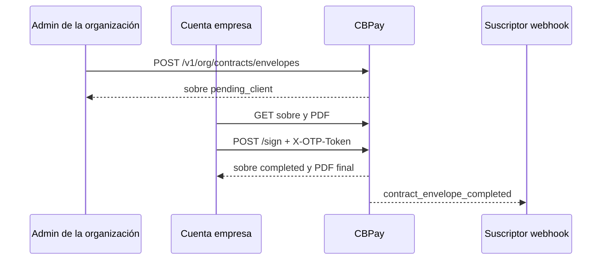

El Contrato Marco Grupo CB es un documento prellenado que CBPay emite para
una cuenta empresa verificada. CBPay resuelve la identidad legal, dirección
verificada, servicios activos, comisiones y firma vigente de CBPay antes de
crear el sobre. Si falta un dato obligatorio verificable, el sobre no se crea.

La ceremonia la completa una persona humana con rol owner u operator de la
cuenta empresa. Exige consentimiento explícito y un OTP fresco de un solo uso.
Las API keys no pueden firmar.

Para solicitudes de prueba usa `https://cryptobank.qbank.cl/platform`;
`https://api.qbank.cl/platform` corresponde solo a producción.



## Elegibilidad y estados

La cuenta debe ser empresa activa con KYB aprobado. El sobre está acotado a la
organización y cuenta; un ID ajeno responde `404 not_found`.

| Estado | Significado | Próxima acción |
|---|---|---|
| `pending_client` | CBPay congeló el documento prefirmado y el cliente aún no completa la ceremonia. | Revisar y firmar, o pedir al admin emitir void/reissue. |
| `completed` | Firma, consentimiento y claim OTP exitosos; el PDF final quedó generado. | Leer o descargar el documento final. No se puede voidar. |
| `voided` | Un admin voidó el sobre pendiente con motivo. | Emitir un sobre nuevo si hay que corregirlo. |

No existen los estados `draft` ni `pending`.

Para `lang=en`, la organización debe tener
`contract_counsel_approved_en=true`. La emisión en español no requiere ese
gate de counsel en inglés. La plantilla es `v13.2`; el hash y la versión de
firma de CBPay quedan congelados en el snapshot del sobre.

## Cobertura de precios y cifras mostradas

El endpoint de emisión de la organización comprueba la cobertura de precios
antes de crear el sobre. Si un servicio habilitado no tiene una fila de fee
efectiva, responde HTTP 422 `contract_unfillable` con un array `missing` que
usa valores de la forma `pricing:<flag>`. Una fila explícita de cero por ciento
y cero fijo es una configuración gratuita válida. `transfers` y `swaps` están
exentos de este gate de filas de fee.

Operativamente, la nota general del §3 v13.2 significa que las cifras del
Anexo A son ejemplos, no precios para conciliar o cobrar. Rige la configuración
efectiva del Programa capturada al emitir; el admin debe corregir una cobertura
faltante y emitir un sobre nuevo.

Los márgenes internos `fx_spread`, `settlement_spread` y `swap_spread` no
aparecen en el `fill_snapshot` visible para la cuenta ni en el apéndice de
precios del PDF. La vista org-admin conserva el snapshot completo para
auditoría.

## Ceremonia

<Steps>
  <Step title="Lista y abre el sobre">
    Usa `GET /v1/me/contracts/envelopes` y luego
    `GET /v1/me/contracts/envelopes/{envelopeID}`. La lista usa `page` y
    `page_size` (default 50, máximo 200). El detalle incluye el timeline
    append-only.

```bash
curl "https://api.qbank.cl/platform/v1/me/contracts/envelopes?page=1&page_size=50" \
  -H "Authorization: Bearer <CBPAY_TOKEN>"
```
  </Step>

  <Step title="Descarga el documento antes de firmar">
    `GET /v1/me/contracts/{envelopeID}/pdf` devuelve bytes PDF. Guarda el
    archivo y revisa razón social, dirección, servicios y comisiones. El
    documento ya viene prefirmado por CBPay, pero permanece
    `pending_client` hasta completar la ceremonia.

```bash
curl -o contrato-marco.pdf \
  "https://api.qbank.cl/platform/v1/me/contracts/envelopes/<ENVELOPE_ID>/pdf" \
  -H "Authorization: Bearer <CBPAY_TOKEN>"
```
  </Step>

  <Step title="Declara identidad y consentimiento">
    Envía nombre y cargo del firmante en JSON. El consentimiento debe ser el
    booleano JSON `true`. El OTP **no** es un campo JSON `code`: envía el
    token fresco de un solo uso en el header `X-OTP-Token`.

```bash
curl -X POST \
  "https://api.qbank.cl/platform/v1/me/contracts/envelopes/<ENVELOPE_ID>/sign" \
  -H "Authorization: Bearer <CBPAY_TOKEN>" \
  -H "Content-Type: application/json" \
  -H "X-OTP-Token: <FRESH_SINGLE_USE_OTP_TOKEN>" \
  -d '{
    "signer_name": "Jordan Lee",
    "signer_title": "Chief Executive Officer",
    "consent": true
  }'
```
  </Step>

  <Step title="Confirma la finalización">
    La respuesta exitosa devuelve el sobre en `completed`. Vuelve a leer el
    recurso y descarga el PDF para guardar el `final_hash`. El evento
    `contract_envelope_completed` llega a la audiencia org-admin. El claim
    completado también registra automáticamente el hito de Client Journey
    `contract_signed` con actor `system:contract-ceremony`; no es un hito
    manual del admin.
  </Step>
</Steps>

## Ejemplos de respuesta

Respuesta de lista:

```json
{
  "items": [
    {
      "id": "7c9e2f1a-4b3c-4d5e-8f60-1a2b3c4d5e6f",
      "account_id": "8d0f1a2b-3c4d-4e5f-9012-6a7b8c9d0e1f",
      "template_version": "v13.2",
      "lang": "es",
      "status": "pending_client",
      "doc_hash": "sha256-of-the-presigned-pdf",
      "cb_signature_id": "a1b2c3d4-e5f6-4a7b-8c9d-0e1f2a3b4c5d",
      "created_at": "2026-10-01T14:00:00Z",
      "updated_at": "2026-10-01T14:00:00Z"
    }
  ],
  "page": 1,
  "page_size": 50
}
```

Respuesta completada:

```json
{
  "id": "7c9e2f1a-4b3c-4d5e-8f60-1a2b3c4d5e6f",
  "account_id": "8d0f1a2b-3c4d-4e5f-9012-6a7b8c9d0e1f",
  "template_version": "v13.2",
  "lang": "es",
  "status": "completed",
  "doc_hash": "sha256-of-the-presigned-pdf",
  "final_hash": "sha256-of-the-final-pdf",
  "signer_name": "Jordan Lee",
  "signer_title": "Chief Executive Officer",
  "signer_email": "jordan@example.com",
  "signed_at": "2026-10-01T14:03:12Z",
  "otp_channel": "otp",
  "created_at": "2026-10-01T14:00:00Z",
  "updated_at": "2026-10-01T14:03:12Z"
}
```

## Evento de finalización

Suscríbete a `contract_envelope_completed` para actualizar la bandeja del
admin de la organización. El evento es solo org-admin; la cuenta recibe el
PDF final por email y puede leerlo en sus endpoints de sobres.

```json
{
  "event_type": "contract_envelope_completed",
  "account_id": "8d0f1a2b-3c4d-4e5f-9012-6a7b8c9d0e1f",
  "payload": {
    "envelope_id": "7c9e2f1a-4b3c-4d5e-8f60-1a2b3c4d5e6f",
    "final_hash": "sha256-of-the-final-pdf",
    "signer": "Jordan Lee"
  }
}
```

La hora de firma y el idioma siguen disponibles en el detalle del sobre.
No infieras la finalización desde el email: usa el evento y el estado.

## Errores y solución

| HTTP | Código | Causa y solución |
|---|---|---|
| 400 | `idempotency_key_required` | Falta la key en el body o header `Idempotency-Key`; envía una key estable. |
| 400 | `invalid_idempotency_key` | La key supera 256 caracteres; usa una más corta. |
| 403 | `contract_counsel_required` | Falta aprobación de counsel para inglés; aprueba la plantilla o emite `lang=es`. |
| 403 | `human_session_required` | Una API key no puede firmar; usa una sesión humana. |
| 403 | `account_blocked` | La cuenta no está activa; resuelve su estado con un admin. |
| 401 | `invalid_otp` | OTP ausente, vencido o consumido; solicita otro y envíalo en `X-OTP-Token`. |
| 404 | `not_found` | El sobre no existe o pertenece a otra cuenta; usa un ID de tu lista. |
| 409 | `contract_invalid_state` | Ya está completado o voided; no repitas la ceremonia. |
| 422 | `invalid_lang` | Usa exactamente `es` o `en`. |
| 422 | `contract_account_ineligible` | La cuenta no es empresa activa con KYB aprobado. |
| 422 | `contract_unfillable` | Falta un dato verificable o una cobertura de precios; revisa `missing` para `pricing:<flag>`, corrige la fuente y emite un sobre nuevo. |
| 422 | `invalid_consent` | El body debe incluir `"consent": true`. |
| 422 | `invalid_signer` | Nombre y cargo deben ser no vacíos y de máximo 120 caracteres. |
| 502 | `storage_failed` | Falló el almacenamiento privado; lee y reconcilia el sobre antes de crear otra key. |
| 503 | `storage_unavailable` | Storage privado no disponible; reintenta cuando operaciones lo restaure. |

## Preguntas frecuentes

<AccordionGroup>
  <Accordion title="¿Puede firmar una cuenta persona?">
    No. Debe ser una cuenta empresa activa con KYB aprobado y el firmante debe
    ser miembro owner u operator.
  </Accordion>
  <Accordion title="¿Puedo mandar el OTP en el JSON?">
    No. El handler consume un token fresco de un solo uso en `X-OTP-Token`.
    Un campo JSON `code` no forma parte del contrato vigente.
  </Accordion>
  <Accordion title="¿Qué pasa si el PDF tiene un campo vacío?">
    El sobre responde `contract_unfillable`; CBPay nunca emite un PDF firmado
    con un dato obligatorio sin resolver.
  </Accordion>
  <Accordion title="¿Se puede voidar un sobre completado?">
    No. `completed` es terminal. Solo se puede voidar `pending_client` con un
    motivo y luego emitir otro sobre.
  </Accordion>
  <Accordion title="¿Puedo reintentar la firma?">
    Sí, con el mismo sobre y un OTP nuevo. El claim atómico impide una segunda
    firma; un sobre completado responde `contract_invalid_state`.
  </Accordion>
</AccordionGroup>

