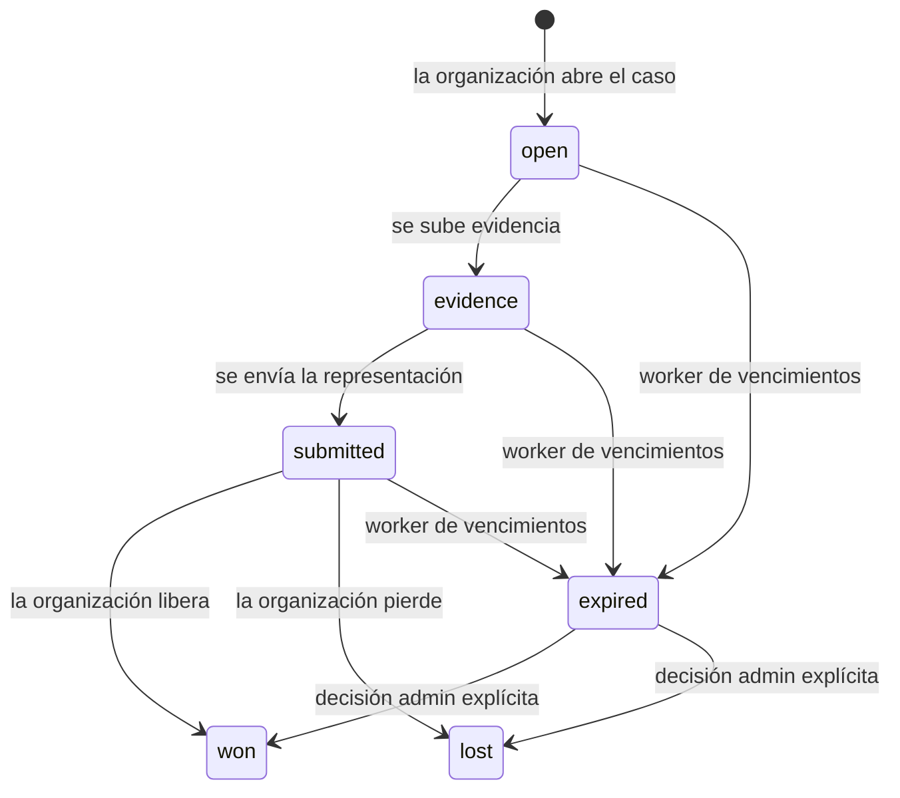

import { EnvUrls } from "/snippets/env-urls.jsx";

<EnvUrls lang="es" />

CBPay expone al dueño del pago la información de casos de disputa y fraude. La
cuenta puede leer el caso, seguir su timeline inmutable, subir evidencia y
descargar el pack generado por la organización. Solo administradores de la
organización pueden abrir, enviar o resolver un caso.

<Note>
La API de cuenta es de solo lectura para decisiones. Una subida exitosa no
cambia el resultado: agrega una versión inmutable de evidencia.
</Note>

## Contenido del pack de evidencia

Cuando la organización genera un pack, la cuenta puede descargar el mismo PDF
privado y autenticado asociado al caso. Incluye campos tipados del payin,
evidencia de ledger/FIFO y referencias externas del gasto.

Para payins con tarjeta, el pack incluye la operación que se presenta al
procesador (referencias de transacción, aprobación, monto/moneda/fecha,
detalles enmascarados de la tarjeta, emisor/país, 3DS, AVS/CVV, resultado del
motor de decisión, fingerprint del dispositivo y contexto enmascarado del
pagador). Los gastos FIFO incluyen el ID del retiro o payout, activo/moneda,
estado, dirección de destino o referencia bancaria y hash de transacción si
existe. La identidad verificada KYB/KYC del comercio se incluye completa para
representarlo ante el procesador; el pagador permanece enmascarado. Se
excluyen los payloads crudos y los campos adyacentes al PAN.

## Abrir casos por identificadores

Los administradores de la organización pueden abrir varios casos desde una
lista pegada de identificadores. El flujo acepta entre 1 y 100 valores únicos
y no vacíos después de quitar espacios y duplicados exactos. Un identificador
puede ser el ID del payin, una clave de idempotencia, una referencia corta,
`qbank_reference` o `qbank_payin_id`.

Ambas llamadas exigen el permiso de organización `disputes:write`. El preview
es de solo lectura: no crea casos, no retiene fondos ni envía webhooks.

### 1. Previsualizar la lista

```bash
curl -X POST "https://api.qbank.cl/platform/v1/org/disputes/batch-preview" \
  -H "Authorization: Bearer $ADMIN_TOKEN" \
  -H "Content-Type: application/json" \
  -d '{
    "identifiers": [
      "9b8a7c6d-5e4f-4a3b-8c2d-1e0f9a8b7c6d",
      "payin-reference-2026-00041",
      "valor-copiado-sin-coincidencia"
    ]
  }'
```

La respuesta separa las coincidencias exactas de los valores que no se pueden
resolver a un único payin. Un valor `ambiguous` incluye hasta cinco
candidatos; cada candidato trae `payin_id`, `currency`, `local_amount` y
`credited_at`.

```json
{
  "matched": [
    {
      "input": "9b8a7c6d-5e4f-4a3b-8c2d-1e0f9a8b7c6d",
      "payin_id": "9b8a7c6d-5e4f-4a3b-8c2d-1e0f9a8b7c6d",
      "account_id": "5c4b3a29-1111-4222-8333-444455556666",
      "method": "card",
      "currency": "USD",
      "local_amount": "100.00",
      "credited_usdt": "100.000000",
      "status": "credited",
      "has_open_case": false
    }
  ],
  "unmatched": [
    {
      "input": "valor-copiado-sin-coincidencia",
      "reason": "not_found"
    }
  ]
}
```

El preview también puede mostrar un payin que todavía no es elegible para
abrir. Revisa `status` y `has_open_case` antes de confirmar: batch-open solo
abre payins acreditados que no tengan un caso abierto.

La apertura individual y la vinculación manual de una fila importada también
exigen un payin `credited`. Si no lo está, responden `409 payin_not_credited`
y no crean una retención; batch e importación lo reportan por ítem o fila.

### 2. Confirmar la apertura

Envía los mismos identificadores, o la lista completa, con una clave de
idempotencia del batch. `kind` por defecto es `dispute` y también acepta
`fraud_hold`.

```bash
curl -X POST "https://api.qbank.cl/platform/v1/org/disputes/batch-open" \
  -H "Authorization: Bearer $ADMIN_TOKEN" \
  -H "Content-Type: application/json" \
  -H "Idempotency-Key: disputes-batch-2026-09-19-001" \
  -d '{
    "identifiers": [
      "9b8a7c6d-5e4f-4a3b-8c2d-1e0f9a8b7c6d",
      "payin-reference-2026-00041",
      "valor-copiado-sin-coincidencia"
    ],
    "kind": "dispute",
    "idempotency_key": "disputes-batch-2026-09-19-001"
  }'
```

El servidor vuelve a resolver cada identificador. Nunca confía en un payin o
cuenta enviado por el cliente. Cada payin acreditado que calza se abre con
una clave idempotente propia derivada de la clave del batch y el ID del payin.

```json
{
  "results": [
    {
      "input": "9b8a7c6d-5e4f-4a3b-8c2d-1e0f9a8b7c6d",
      "payin_id": "9b8a7c6d-5e4f-4a3b-8c2d-1e0f9a8b7c6d",
      "status": "opened",
      "dispute_id": "7c9e6679-7425-40de-944b-e07fc1f90ae7"
    },
    {
      "input": "payin-reference-2026-00041",
      "payin_id": "6d5c4b3a-2f1e-4d3c-8b2a-1e0f9a8b7c6d",
      "status": "skipped",
      "reason": "case_already_open"
    },
    {
      "input": "valor-copiado-sin-coincidencia",
      "status": "skipped",
      "reason": "not_found"
    }
  ],
  "summary": {
    "opened": 1,
    "skipped": 2,
    "failed": 0
  }
}
```

La respuesta del batch es `200` cuando la solicitud es válida.
`case_already_open`, `not_found`, `ambiguous` y `not_credited` son resultados
`skipped` por ítem; un monto inválido o un fallo de apertura es un resultado
`failed` por ítem. Repetir la misma clave devuelve el ítem original como
`opened` con `idempotency_hit: true` y no crea otra retención.

La API devuelve `invalid_payload` para una lista vacía, valores vacíos, un
`kind` inválido o más de 100 identificadores únicos. No existe un código
superior separado `too_many`. Si falta la idempotencia devuelve
`idempotency_key_required`; si falta el scope de organización devuelve
`org_required`.

## Ciclo de vida



Un caso vencido mantiene su retención preventiva. Vencer es una señal
operativa, no un movimiento automático de dinero.

## Lista tus casos

```bash
curl "https://api.qbank.cl/platform/v1/disputes?from=2026-09-01&to=2026-09-30&page=1&page_size=50&status=open"   -H "Authorization: Bearer $ACCOUNT_TOKEN"
```

El alcance de cuenta se aplica en el servidor. Los filtros son `status`,
`kind`, `from`, `to`, `page` y `page_size`.

```json
{
  "page": 1,
  "page_size": 50,
  "disputes": [
    {
      "dispute_id": "7c9e6679-7425-40de-944b-e07fc1f90ae7",
      "account_id": "5c4b3a29-1111-4222-8333-444455556666",
      "kind": "dispute",
      "status": "evidence",
      "currency": "USD",
      "disputed_usdt": "100.000000",
      "held_usdt": "100.000000",
      "underfunded": false,
      "case_number": "CASE-2026-00041",
      "source": "import",
      "opened_by": "admin:2c1...",
      "created_at": "2026-09-19T12:00:00Z",
      "updated_at": "2026-09-19T12:05:00Z",
      "deadline_at": "2026-10-01T00:00:00Z"
    }
  ]
}
```

## Detalle y evidencia

`GET /v1/disputes/{id}` agrega `items`, `timeline` y `evidence` al caso. El
payload crudo de los cobros nunca se incrusta en la respuesta.

```bash
curl "https://api.qbank.cl/platform/v1/disputes/7c9e6679-7425-40de-944b-e07fc1f90ae7/evidence"   -H "Authorization: Bearer $ACCOUNT_TOKEN"
```

Sube PDF, PNG o JPG (máximo 10 MB) como multipart con el campo `file`:

```bash
curl -X POST "https://api.qbank.cl/platform/v1/disputes/7c9e6679-7425-40de-944b-e07fc1f90ae7/evidence"   -H "Authorization: Bearer $ACCOUNT_TOKEN"   -F "file=@comprobante.pdf;type=application/pdf"
```

```json
{
  "evidence_id": "1f2...",
  "version": 2,
  "kind": "merchant_doc",
  "sha256": "b4e2...",
  "bytes": 482110,
  "created_at": "2026-09-19T12:10:00Z"
}
```

Descarga una versión como binario autenticado:

```bash
curl "https://api.qbank.cl/platform/v1/disputes/7c9e6679-7425-40de-944b-e07fc1f90ae7/evidence/2/download"   -H "Authorization: Bearer $ACCOUNT_TOKEN" -o evidencia-v2.pdf
```

## Webhook

Suscríbete a `dispute_status_changed` mediante el flujo normal de webhooks:

```json
{
  "event": "opened",
  "dispute_id": "7c9e6679-7425-40de-944b-e07fc1f90ae7",
  "kind": "dispute",
  "status": "open",
  "account_id": "5c4b3a29-1111-4222-8333-444455556666",
  "disputed_usdt": "100.000000",
  "held_usdt": "100.000000",
  "case_number": "CASE-2026-00041",
  "deadline_at": "2026-10-01T00:00:00Z"
}
```

Deduplica por el ID del evento del webhook. El evento informa una transición;
no aprueba ni rechaza un caso.

## Errores

| HTTP | Código | Qué hacer |
|---:|---|---|
| 400 | `invalid_range` | Envía `from` y `to` como `YYYY-MM-DD`. |
| 400 | `invalid_payload` | Envía el archivo multipart y un content type permitido. |
| 404 | `not_found` | Confirma que el caso pertenece a la cuenta autenticada. |
| 409 | `invalid_state` | El caso está cerrado o no acepta evidencia. |
| 503 | `storage_unavailable` | Reintenta la subida más tarde; no abras otro caso. |

Consulta el [catálogo de errores](/es/errores).

## FAQ

<AccordionGroup>
<Accordion title="¿Puedo liberar o perder un caso desde la API de cuenta?">
No. Son acciones de organización, protegidas por `disputes:write` y
maker-checker.
</Accordion>
<Accordion title="¿Un vencimiento libera la retención?">
No. El worker solo cambia el caso a `expired` y registra el evento.
</Accordion>
<Accordion title="¿Puedo subir evidencia después de enviar el caso?">
Sí. `open`, `evidence` y `submitted` aceptan evidencia de cuenta. Los casos
won, lost y expired quedan cerrados.
</Accordion>
</AccordionGroup>

{/* banking-fase2-fiat-hold:2026-09-24 */}
## Fiat local retenido

Un payin con `credit_asset` BOB, MXN o ARS devuelve
`409 dispute_fiat_unsupported` sin crear caso ni hold. Batch lo omite como
`fiat_unsupported` e import lo marca `payin holds local fiat (unsupported)`.
