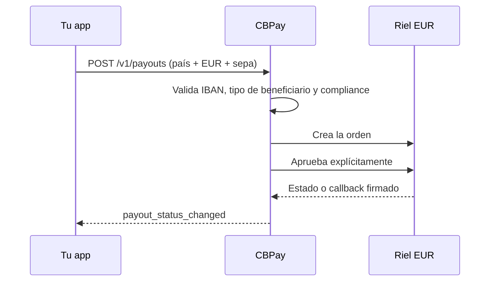

import { EnvUrls } from "/snippets/env-urls.jsx";

<EnvUrls lang="es" />

Usa esta guía cuando el beneficiario reciba EUR mediante el método de payout
`sepa`. El catálogo es provider-agnostic: expone país, `EUR` y `sepa`, mientras
la cuenta usa el pricing e idempotencia normal de payouts.



## Corredor de enrutamiento

V1 registra un único corredor: `country=EU`, `currency=EUR` y `method=sepa`.
`EU` es el código de catálogo para Europa, no el país real del beneficiario.
El país real sale de las dos primeras letras del IBAN normalizado; el IBAN
debe pertenecer al conjunto admitido por SEPA Instant.

`GB` queda fuera de SEPA Instant V1: un IBAN británico falla rápido con HTTP
400 antes del despacho porque `sepaInstReachable=false`. SEPA Credit Transfer
para GB es un alcance futuro separado. `GET /v1/payouts/methods` devuelve la
única fila `EU`/`EUR`/`sepa` cuando el corredor está habilitado.

## Contrato del beneficiario

El objeto `beneficiary` debe incluir:

| Campo | Regla |
|---|---|
| `beneficiary_type` | Valor cerrado obligatorio: `individual` o `corporate`. |
| `iban` | Obligatorio; se normalizan espacios, se valida ISO 13616 mod-97 y el país debe pertenecer a SEPA. |
| `bic` | BIC ISO 9362 opcional, de 8 u 11 caracteres. |
| `given_name` + `first_surname` | Nombre estructurado obligatorio para personas; ambos deben estar presentes. |
| `name` | Obligatorio para empresa. Para persona, un valor de varias palabras puede separarse en nombre y apellido; un monónimo se rechaza. |

Usa una sola clave de idempotencia para toda la operación. `description` es
opcional en la API, pero si se envía se normaliza para el wire SEPA: se pliegan
los diacríticos, se aplica el mapa europeo explícito de abajo, el resultado
debe caber en el charset corporativo del proveedor y queda limitado a **140
puntos de código Unicode**. Si todavía contiene un carácter fuera de ese
charset, la creación falla con `400 invalid_payload`. Si se omite, el adapter
genera una descripción SEPA interna válida.

Los nombres usan el mismo pliegue determinista antes de validar el charset:

| Entrada | Pliegue en el wire |
|---|---|
| tildes, diéresis y `ñ` | Letra latina base (`é` → `e`, `ñ` → `n`) |
| `ß`, `æ`, `œ`, `ø`, `å`, `ł`, `đ`, `þ`, `ð` | `ss`, `ae`, `oe`, `o`, `a`, `l`, `d`, `th`, `d` |
| Maltés `ħ`, `ċ`, `ġ`, `ż` | `h`, `c`, `g`, `z` |
| cualquier carácter restante fuera del charset | `400 invalid_payload` |

Una persona debe resolver a nombre y apellido. Los monónimos no se pueden
pagar como `individual` en V1; envía `given_name` y `first_surname`, o un
`name` de varias palabras.

## Crear un payout

```bash
curl -X POST https://api.qbank.cl/platform/v1/payouts \
  -H "Authorization: Bearer <token>" \
  -H "Content-Type: application/json" \
  -d '{
    "country": "EU",
    "currency": "EUR",
    "method": "sepa",
    "amount": "100.00",
    "beneficiary": {
      "beneficiary_type": "individual",
      "given_name": "Elena",
      "first_surname": "Fuentes",
      "iban": "DE89370400440532013000",
      "bic": "COBADEFFXXX"
    },
    "description": "Factura 2026-0916",
    "idempotency_key": "sepa-eu-20260917-001"
  }'
```

La respuesta es el recurso de payout habitual:

```json
{
  "payout_id": "7d5c2f0a-1e9b-4a6d-8f3c-0b2a1d9e8c7f",
  "country": "EU",
  "currency": "EUR",
  "method": "sepa",
  "local_amount": "100.00",
  "status": "processing",
  "status_code": "approved",
  "funds_debited": true,
  "bank_reference": ""
}
```

El create y el approve explícito del proveedor son pasos internos. No crees
un payout de reemplazo mientras este esté `processing`; ante un retry del
cliente usa la misma clave de idempotencia.

## Fuente EUR e identidad ordenante

Para una cuenta cliente, cada payout `sepa` debe resolver un IBAN virtual
asignado y activo con propósito `funding_usdt`. Este es el propósito de fondeo
para los payouts de clientes; los retiros de EUR Banking usan el propósito
separado `banking_eur`.

Envía `source_virtual_iban_id` en el nivel superior cuando necesites elegir un
IBAN virtual `funding_usdt` activo específico:

```json
{
  "country": "EU",
  "currency": "EUR",
  "method": "sepa",
  "amount": "100.00",
  "source_virtual_iban_id": "2f8c1d4e-1111-4b22-8a33-000000000001",
  "beneficiary": {
    "beneficiary_type": "individual",
    "given_name": "Elena",
    "first_surname": "Fuentes",
    "iban": "DE89370400440532013000",
    "bic": "COBADEFFXXX"
  },
  "idempotency_key": "sepa-eu-20260922-001"
}
```

- Con exactamente un IBAN virtual `funding_usdt` activo, omitir el parámetro
  selecciona esa cuenta de forma determinista.
- Sin una fuente activa, la API devuelve `422 funding_account_required`.
- Con varias fuentes activas, la API devuelve
  `422 ambiguous_source_viban` hasta que envíes el UUID elegido.
- Un UUID explícito que no pertenece a la cuenta o no está activo devuelve
  `404 not_found` o `422 funding_account_required`.

La identidad ordenante se estampa server-side desde el `registrant` persistido
del vIBAN seleccionado: una persona usa nombre y apellido, y una empresa usa
su razón social registrada y sus datos de registro. Los campos `payer` o
`cj_payer_*` enviados por el caller no pueden reemplazarla.

En filas activas legacy sin un `registrant` utilizable, la plataforma deriva
los nombres desde el perfil verificado vigente. Si no puede leer ese perfil,
devuelve `503 funding_account_unavailable`; si la identidad resultante está
incompleta, devuelve `422 registrant_incomplete`.

No existe un tope por vIBAN. El payout descuenta del saldo normal de
liquidación USDT de la cuenta; `BANK_EUR` se usa en operaciones EUR Banking,
no en payouts de clientes.

<Note>
Los holds de payout creados antes de esta puerta de origen quedan
grandfathered: continúan por su flujo existente de dispatch y reconciliación y
no se rechazan retroactivamente.
</Note>

La comprobación de la fuente ocurre antes de cualquier débito o dispatch al
proveedor. Si la consulta está temporalmente no disponible, reintenta con la
misma clave de idempotencia.

## Idempotencia y casos límite de selección de origen


## Casos límite de idempotencia y selección del origen

El vIBAN de origen es parte de la intención del payout. Si el conjunto de
vIBAN activos cambia entre dos requests secuenciales, reintentar con la misma
clave de idempotencia devuelve el payout original. Si una request concurrente
observa un conjunto distinto, devuelve `409 idempotency_conflict`; ambos
resultados son seguros y no crean un segundo débito. No uses una clave nueva
para adivinar el resultado.

La misma clave no puede representar simultáneamente el origen default y un
`source_virtual_iban_id` explícito: ese replay devuelve
`409 idempotency_conflict`. La comparación estricta evita cambiar en silencio
la cuenta ordenante.

## Estados y returns

| Señal del proveedor | Resultado público | Efecto financiero |
|---|---|---|
| `created`, `pending` o desconocido | `processing` | Sigue abierto para reconciliación; no se reenvía automáticamente. |
| `settled` | `completed` | Se consume el hold. |
| `declined` o `canceled` | `failed` | Se aplica el reembolso existente de payout fallido. |
| Notificación de return | `failed`, `status_code: reversed` | El payout ya completado se revierte por el camino de refund existente. |

Suscríbete a `payout_status_changed`. SEPA no agrega un webhook nuevo: el
callback se verifica y entra al mismo pipeline de estados.

## Errores

| HTTP | Código o resultado | Solución |
|---:|---|---|
| 400 | `invalid_payload` | Corrige EUR, IBAN/nombres o las reglas de charset SEPA de la descripción y del beneficiario. |
| 400 | `payout_corridor_unsupported` | Confirma que la única fila `EU`/EUR/`sepa` esté en el catálogo y que el país del IBAN sea compatible. Un IBAN GB se rechaza con 400 antes del despacho. |
| 422 | payout `failed` / `core_rejected` | Corrige el beneficiario y crea una operación nueva con una clave nueva. |
| 503 | `payout_provider_failed` o `channel_unavailable` | Lee el payout existente; si es ambiguo, reintenta solo con la misma clave. |

<AccordionGroup>
<Accordion title="¿El BIC es obligatorio?">
  No. El IBAN es obligatorio; el BIC es opcional.
</Accordion>
<Accordion title="¿Puedo enviar USD por este método?">
  No. `sepa` es exclusivamente EUR y se rechaza antes del despacho.
</Accordion>
<Accordion title="¿Un return crea un webhook nuevo?">
  No. `payout_status_changed` lleva `status_code: reversed` y el resultado
  normal del reembolso.
</Accordion>
</AccordionGroup>
