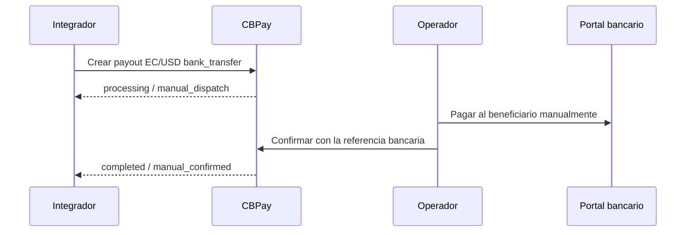

import { EnvUrls } from "/snippets/env-urls.jsx";

<EnvUrls lang="es" />

## Alcance

Este corredor se limita a `country=EC`, `currency=USD` y
`method=bank_transfer`. Usa el modo de despacho manual: el payout queda en
`processing` con `status_code=manual_dispatch` hasta que un operador autorizado
lo pague en el portal bancario y confirme el resultado. CBPay no llama ni
concilia automáticamente un banco en esta ruta.

La selección del proveedor y sus credenciales son asuntos de despliegue; no
forman parte del contrato público de CBPay.

## Ambientes

Prueba primero en staging, con rieles simulados y beneficiarios sintéticos.
Verifica staging antes de probar producción. Las verificaciones en producción
requieren datos operativos y autorización explícita del ambiente y del alcance.

## Flujo



## Crear y leer un payout

Usa los endpoints normales de payouts con un beneficiario sintético:

```http
POST /v1/payouts
Authorization: Bearer <API_KEY>
Content-Type: application/json
Idempotency-Key: ec-manual-<unique-key>
```

```json
{
  "country": "EC",
  "currency": "USD",
  "method": "bank_transfer",
  "amount": "125.00",
  "beneficiary": {
    "name": "Example Recipient",
    "document_value": "0900000000",
    "bank_code": "000000",
    "account_number": "0000000000",
    "account_type": "CACC",
    "country_code": "EC",
    "sender_name": "Example Sender"
  },
  "description": "Invoice 1001",
  "idempotency_key": "ec-manual-<unique-key>"
}
```

El monto permitido es USD `1.00` a `10000.00`, inclusive, con máximo dos
decimales por valor. Usa strings decimales, nunca floating point.

```http
GET /v1/payouts/{payoutID}
Authorization: Bearer <API_KEY>
```

El corredor Ecuador manual genera una referencia bancaria con el formato `ECM`
seguido de 13 dígitos secuenciales. Es un formato propio de este corredor, no
una restricción general para todas las referencias bancarias. La respuesta
inicial normalmente incluye:

```json
{
  "payout_id": "00000000-0000-4000-8000-000000000001",
  "status": "processing",
  "status_code": "manual_dispatch",
  "idempotency_hit": false
}
```

## Confirmar el pago bancario

El operador del core confirma el payout pagado manualmente:

```http
POST /v1/ops/payouts/{payoutID}/confirm-manual-paid
Authorization: Bearer <CORE_ADMIN_KEY>
Content-Type: application/json
Idempotency-Key: confirm-ec-<unique-key>
```

Los administradores de plataforma usan el proxy del core:

```http
POST /v1/admin/core/payouts/{payoutID}/confirm-manual-paid
Authorization: Bearer <PLATFORM_ADMIN_KEY>
Content-Type: application/json
Idempotency-Key: confirm-ec-<unique-key>
```

Los administradores de la organización usan el proxy org:

```http
POST /v1/org/treasury/manual-payouts/{payoutID}/confirm-manual-paid
Authorization: Bearer <ORG_ADMIN_KEY>
Content-Type: application/json
Idempotency-Key: confirm-ec-<unique-key>
```

El body contiene `bank_reference`, `paid_amount` y `reason`. La confirmación
mediante `POST /v1/ops/payouts/{payoutID}/confirm-manual-paid` exige
`Idempotency-Key`; se recomienda enviarla en el header, o puedes incluir
`idempotency_key` en el JSON. Sin una key, el endpoint responde `400
idempotency_key_required`. La confirmación es idempotente: después de un
timeout, vuelve a leer el payout primero. Si el resultado sigue incierto,
reintenta la misma confirmación con la misma key y evidencia idéntica. El
replay devuelve el original con `idempotency_hit: true`; una evidencia
distinta devuelve `409 idempotency_conflict`. Nunca uses una key nueva para la
misma acción bancaria.

## Payins manuales

Confirmar la recepción de un payin ya anunciado `EC/USD/push/bank_transfer`
es una operación de dos personas (maker-checker). No se mueve dinero hasta la
segunda aprobación. Ningún paso usa clave de idempotencia del cliente: la
llamada identifica la operación por el payin ID y la evidencia bancaria, y los
replays honestos devuelven el original con `idempotency_hit: true`.

**Paso 1 — solicitud (maker).** Un operador autorizado de la organización
con `org_operations`/`ops:write` y una sesión admin humana registra la
evidencia bancaria. El payin sigue `pending`; nada se acredita aún:

```http
POST /v1/payins/{payinID}/confirm-received
Authorization: Bearer <ORG_ADMIN_KEY>
Content-Type: application/json
```

```json
{
  "bank_reference": "ECM0000000000001",
  "received_amount": "125.00"
}
```

La respuesta es la solicitud de confirmación (`id`, `status`,
`bank_reference`, `received_amount`, `account_id`, `maker`, `created_at`).
Reintentar la misma solicitud del maker con evidencia idéntica reproduce la
solicitud original con un hit; una evidencia distinta devuelve
`409 invalid_state`. La solicitud no expira: queda abierta hasta que un
checker la apruebe o el maker (o un admin god) la cancele.

**Paso 2 — aprobación (checker).** Un segundo admin god nombrado, distinto
del maker, aprueba la solicitud abierta. La solicitud no lleva body:

```http
POST /v1/payins/{payinID}/confirm-approve
Authorization: Bearer <GOD_ADMIN_KEY>
Content-Type: application/json
```

La aprobación acredita el payin de inmediato a través de la cadena normal de
pricing, firewall y crédito. El mismo admin no puede aprobar su propia
solicitud (`409 second_approver_required`). Si los datos del payin cambiaron
desde la solicitud (`confirm_account_mismatch`, `bank_ref_conflict`), o la
referencia pertenece a una liquidación de tesorería
(`deposit_settled_treasury_trade`), la aprobación falla de forma honesta y el
payin sigue `pending`; lee ambos recursos antes de reintentar.

**Cancelación.** El maker o cualquier admin god puede cancelar una solicitud
abierta con `POST /v1/payins/{payinID}/confirm-cancel` (también sin body).
Una solicitud cancelada nunca acredita; para confirmar se necesita una
solicitud nueva.

Tras cualquier timeout, lee primero el payin. Si ya está acreditado con la
misma evidencia, el replay devuelve el resultado original; si sigue
pendiente, vuelve a leer la solicitud de confirmación y reintenta el mismo
paso. Nunca intentes una confirmación con una evidencia distinta para
"empujarla".

## Instrucciones de depósito

Lee las instrucciones del instrumento payin existente:

```http
GET /v1/payins/deposit-instructions
Authorization: Bearer <API_KEY>
```

La respuesta es provider-clean y solo contiene instrucciones aplicables a la
cuenta y al corredor. No infieras datos bancarios desde un payout.

Para los códigos bancarios de Ecuador, usa el catálogo vivo:

```http
GET /v1/payouts/banks?country=EC
Authorization: Bearer <API_KEY>
```

Devuelve `{ "items": [{ "code": "...", "name": "..." }], "meta": {
"retrieved": 1 } }`, donde `retrieved` es el número de elementos devueltos.
Usa un `code` devuelto por el catálogo como `beneficiary.bank_code`.

## Reglas operativas

- El operador paga en el portal bancario y registra la referencia bancaria.
- No reenvíes una acción bancaria ambigua con una key nueva.
- Para la confirmación de payins manuales, la solicitud y la aprobación son dos
  pasos separados de dos admins distintos; tras un timeout, lee el payin y la
  solicitud de confirmación antes de reintentar el mismo paso.
- Los ejemplos son sintéticos; reemplaza placeholders solo con datos
  operativos autorizados.

## Estados y errores

| Estado o código | Significado | Acción |
|---|---|---|
| `processing` + `manual_dispatch` | El payout espera que el operador complete la acción bancaria. | Paga una sola vez en el portal bancario y confirma el payout existente. |
| `completed` + `manual_confirmed` | El operador confirmó el pago bancario. | Vuelve a leer el payout y conserva la referencia bancaria. |
| `invalid_payload` | Falta un campo o un monto, cuenta o dato de confirmación no es válido. | Corrige la solicitud; no crees un reemplazo para la misma operación. |
| `idempotency_conflict` | La misma key se reutilizó con datos distintos o un estado incompatible. | Lee el recurso original y usa una key nueva solo para una operación realmente nueva. |
| `second_approver_required` | El aprobador debe ser un admin distinto del maker. | Un segundo admin god nombrado aprueba la solicitud abierta; el maker no puede aprobarla. |
| `confirm_account_mismatch` | La cuenta del payin cambió desde la solicitud de confirmación. | Lee el payin y la solicitud; cancela e inicia una solicitud nueva con evidencia fresca. |
| `confirm_request_conflict` | Ya existe otra confirmación abierta para este payin. | Lee la solicitud existente y apruébala o cancélala antes de crear otra. |
| `treasury_check_unavailable` | No se pudo completar el control de ownership o conflicto de tesorería del payin. | No acredites el payin; reintenta cuando la dependencia se recupere. |
| `deposit_settled_treasury_trade` | La referencia bancaria pertenece a una liquidación de tesorería. | No lo asignes ni lo acredites como payin de cliente. |

Consulta el [catálogo completo de errores](/es/errors) para el formato común
de respuestas y las reglas de manejo.

## Preguntas frecuentes

<AccordionGroup>
  <Accordion title="¿CBPay envía automáticamente la transferencia de Ecuador?">
    No. El operador completa la acción bancaria y confirma el payout existente
    en CBPay.
  </Accordion>
  <Accordion title="¿Qué significa `manual_dispatch`?">
    Significa que el payout sigue en procesamiento y espera que un operador
    autorizado complete y confirme la acción bancaria.
  </Accordion>
  <Accordion title="¿Qué hago después de un timeout?">
    Lee primero el recurso correspondiente. Para un payout, reintenta la misma
    solicitud con la misma key de idempotencia. Para
    `confirm-received`, lee primero el payin y no reenvíes la confirmación con
    una nueva key sin verificar qué ocurrió en el banco.
  </Accordion>
</AccordionGroup>
