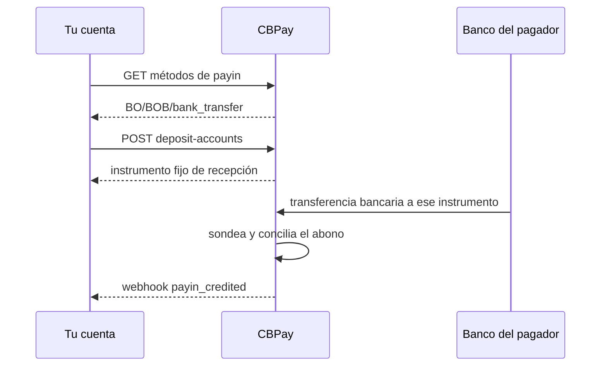

import { EnvUrls } from "/snippets/env-urls.jsx";

<EnvUrls lang="es" />

Una **cuenta de fondeo** es un destino de depósito en una moneda local cuyo
único trabajo es recibir dinero: cada abono convierte automáticamente a
USD, tu saldo principal. Es el `purpose: "fondeo"` por defecto de una
deposit account — crea una por corredor y comparte su instrumento (número
de cuenta, CLABE, alias, IBAN) con tus pagadores.

Si necesitas **mantener** fiat local para payouts en vez de convertirlo,
eso es [Banking](/es/guides/banking): crea un segundo destino con
`purpose: "banking"`. Fondeo convierte; Banking retiene.

## Fondeo vs Banking

Para los corredores fiat locales (`BO/BOB`, `MX/MXN`, `AR/ARS`), cada
destino de payin lleva un `purpose` que decide dónde aterriza el dinero
entrante:

| Purpose | Significado |
|---|---|
| `fondeo` (default) | **Cuenta de fondeo.** Todo lo recibido convierte automáticamente a USD, tu saldo principal. |
| `banking` | **Cuenta Banking.** El fiat entrante se retiene en su moneda local para payouts, con saldos individuales por moneda. |

Los destinos creados sin purpose conservan el comportamiento histórico
`fondeo`. El purpose banking solo se soporta en
`BO/BOB/bank_transfer`, `MX/MXN/bank_transfer` y `AR/ARS/bank_transfer`;
todo lo demás es siempre fondeo.

## Fondeo por moneda

### 🇦🇷 ARS — peso argentino

Recibe pesos a través de una CVU dedicada. La CVU se crea con el **alias
bancario que tú eliges** al crearla (`bank_alias` es obligatorio). Los
pesos entrantes convierten automáticamente a USD, tu saldo principal.

Para el contrato completo de deposit accounts ver
[payins](/es/guides/payins); para enviar pesos, ver
[payouts](/es/guides/payouts).

### 🇧🇴 BOB — boliviano

Recibe bolivianos a través de una cuenta dedicada de transferencia
bancaria. Los BOB entrantes convierten automáticamente a USD, tu saldo
principal.

Para enviar bolivianos (transferencia en BOB o USD, además de QR), ver la
pestaña Bolivia en [payouts](/es/guides/payouts).

### 🇲🇽 MXN — peso mexicano

Recibe pesos a través de una CLABE dedicada. Los MXN entrantes convierten
automáticamente a USD, tu saldo principal.

Para el contrato completo de deposit accounts ver
[payins](/es/guides/payins); para enviar pesos, ver
[payouts](/es/guides/payouts).

### 🇪🇺 EUR — euro

Recibe euros a través de un IBAN virtual `funding_usdt`: los euros
entrantes convierten automáticamente a USD, tu saldo principal. (Un IBAN
`banking_eur` en cambio mantiene `BANK_EUR` para payouts SEPA — eso es
[Banking](/es/guides/banking).)

Solicita y lee IBANs en [Banking](/es/guides/banking); para enviar euros,
ver [payouts SEPA Instant](/es/guides/sepa-instant-payouts).

## El flujo de fondeo



1. **Descubre el corredor** (`GET /v1/payins/methods`) — lee siempre el
catálogo vivo antes de ofrecer una opción de pago.
2. **Crea o repara la deposit account**
(`POST /v1/payins/deposit-accounts`) — las cuentas verificadas reciben
su primer destino automáticamente; las empresas pueden agregar más en
corredores habilitados.
3. **Comparte el instrumento** — tu pagador envía una transferencia
bancaria ordinaria.
4. **Recibe el abono** — CBPay concilia el crédito bancario y emite
`payin_credited`; el neto aterriza en USD, tu saldo principal.

Este modo no tiene paso de anuncio: el pagador nunca completa una
referencia de `POST /v1/payins`.

## 1. Descubre los corredores disponibles

Lee siempre el catálogo vivo antes de ofrecer una opción de pago en tu app:

```bash
curl https://api.qbank.cl/platform/v1/payins/methods \
  -H "Authorization: Bearer <token>"
```

Un registro representativo:

```json
{
  "country": "BO",
  "currency": "BOB",
  "method": "bank_transfer",
  "delivery": "polling"
}
```

El catálogo es la única fuente de verdad. Un corredor puede existir en el
contrato de la API y aun así estar deshabilitado para tu organización.

## 2. Crea o repara una deposit account

La plataforma aprovisiona el instrumento inicial de fondeo solo después de
que la propia verificación de la cuenta pasa: KYC para personas, KYB para
empresas. El registro por sí solo nunca crea una cuenta de fondeo. Una
cuenta verificada sin instrumento puede repararlo con la misma llamada:

```bash
curl -X POST https://api.qbank.cl/platform/v1/payins/deposit-accounts \
  -H "Authorization: Bearer <token>" \
  -H "Content-Type: application/json" \
  -d '{
    "country": "BO",
    "currency": "BOB",
    "method": "bank_transfer"
  }'
```

Respuesta `201`:

```json
{
  "instrument_id": "1f4a…",
  "account_id": "9b1d…",
  "country": "BO",
  "currency": "BOB",
  "method": "bank_transfer",
  "instrument": "<receiving-account-number>",
  "details": {
    "account_number": "<receiving-account-number>",
    "alias": "CBPay Example BOB 20260919",
    "merchant_nit": "123456789",
    "bank_name": "Example Receiving Bank",
    "status": "ACTIVA"
  },
  "status": "active",
  "created_at": "2026-09-09T20:00:00Z"
}
```

Comparte `instrument` con tus pagadores como la cuenta receptora.
`instrument_id` es el identificador estable de CBPay; nunca sustituyas el
número de cuenta por un UUID. Al retornar, `details.alias`,
`details.merchant_nit` y `details.bank_name` son los campos de
visualización de la tarjeta de transferencia; los campos opcionales
faltantes nunca se infieren.

Las cuentas persona conservan como máximo una cuenta de fondeo activa por
país/moneda/método. Las cuentas empresa pueden crear destinos adicionales
inmutables solo en corredores habilitados; los corredores adicionales
soportados actualmente son `MX/MXN/bank_transfer`, `BO/BOB/bank_transfer` y `AR/ARS/bank_transfer`. Cada destino sigue ligado a la misma cuenta CBPay,
y los abonos calzan por instrumento de destino.

La verificación aprovisiona automáticamente el primer instrumento del
corredor para una cuenta verificada. La llamada anterior también repara un
instrumento faltante tras la verificación. Los campos de visualización de
una deposit account son opcionales y nunca se infieren. Este flujo de
fondeo nunca crea un alias bancario elegido por el usuario; los alias
bancarios AR/ARS son un contrato separado en la guía de payins. Cuando una
empresa crea un destino BOB adicional, cada destino debe usar una
idempotency key nueva:

```bash
curl -X POST https://api.qbank.cl/platform/v1/payins/deposit-accounts \
  -H "Authorization: Bearer <token>" \
  -H "Idempotency-Key: company-bob-001" \
  -H "Content-Type: application/json" \
  -d '{
    "country": "BO",
    "currency": "BOB",
    "method": "bank_transfer",
    "idempotency_key": "company-bob-001"
  }'
```

Una key nueva retorna `201` y un destino nuevo. Reproducir la misma key
completada retorna `200` con el instrumento original e
`idempotency_hit: true`; un replay concurrente de una en proceso puede
retornar `409 idempotency_conflict`. Cuando el riel responde ausente o
ambiguo, el sistema conserva un estado conciliable en vez de reintentar en
silencio.

## 3. Lista los instrumentos de depósito

La lista es paginada y oculta los claims de aprovisionamiento que aún no
recibieron un número real de recepción:

```bash
curl "https://api.qbank.cl/platform/v1/payins/deposit-accounts?page=1&page_size=50" \
  -H "Authorization: Bearer <token>"
```

```json
{
  "page": 1,
  "page_size": 50,
  "deposit_accounts": [
    {
      "instrument_id": "1f4a…",
      "account_id": "9b1d…",
      "country": "BO",
      "currency": "BOB",
      "method": "bank_transfer",
      "instrument": "<receiving-account-number>",
      "status": "active",
      "created_at": "2026-09-09T20:00:00Z"
    }
  ]
}
```

## 4. Recibe y concilia la transferencia

Este modo nunca usa anuncios `POST /v1/payins`. El pagador transfiere BOB
a tu `instrument`. El sistema sondea el banco dentro de una ventana de
fechas acotada; los abonos completados deduplican por referencia bancaria,
número de orden ACH o una llave determinista de respaldo.

Una vez que el abono calza, suscríbete a `payin_credited` y lee los montos
y el estado finales desde el recurso payin:

```bash
curl "https://api.qbank.cl/platform/v1/payins?country=BO&status=credited&from=2026-09-01&to=2026-09-10&page=1&page_size=50" \
  -H "Authorization: Bearer <token>"
```

Aplican las reglas estándar de fees y tasas de payin. La API pública nunca
expone objetos propios del riel bancario.

### Campos de instrumento y pagador en pushes acreditados

Un payin acreditado sigue disponible a través de los recursos ordinarios
de lista/detalle. Cuando el abono cae en una cuenta dedicada, concilia con
`instrument_id` e `instrument` (`account_number`, `purpose`, `status`) y
filtra el historial con `?instrument_id=<uuid>`. Los abonos nuevos también
pueden traer `payer_source: "bank_event"` con el bloque `payer` reportado
por el banco. Los datos que el banco no reporta se omiten, los pagadores
históricos nunca se rellenan, y un screening existente puede retener el
abono para revisión.

## Estados

| Estado | Significado | Acción |
|---|---|---|
| `active` | La deposit account puede compartirse con pagadores | Usa `instrument` |
| `pending` | El aprovisionamiento o la conciliación siguen en curso | No crees una segunda cuenta |
| `credited` | La transferencia calzó y se acreditó | Procesa `payin_credited` |
| `unassigned` | El abono no puede rutearse a una sola cuenta | Resuélvelo en la vista de operaciones |

Tras un timeout, lee primero la lista. Aunque la respuesta se pierda, el
riel puede ya haber aceptado la primera solicitud.

## Errores

| HTTP | Code | Acción |
|---:|---|---|
| 400 | `payin_corridor_unsupported` | Relee `GET /v1/payins/methods`; el corredor no está habilitado |
| 401 | `unauthorized` | Actualiza las credenciales de la cuenta |
| 403 | `account_blocked` | Pide al operador de la org que active la cuenta |
| 422 | `deposit_account_limit_reached` | Usa el instrumento existente; un destino por corredor |
| 502 | `deposit_account_failed` | Lee la lista antes de reintentar; no asumas que el riel no creó nada |
| 502 | `core_unavailable` | Reintenta la misma operación lógica cuando el servicio se recupere |
| 502 | `core_invalid_response` | Conserva el claim para conciliar y contacta a operaciones si persiste |

## FAQ

<AccordionGroup>
<Accordion title="¿Una cuenta puede servir a varias cuentas CBPay?">
No. Un destino está ligado a una cuenta CBPay y a una organización. Solo
comparte cada instrumento con los pagadores de esa cuenta.
</Accordion>
<Accordion title="¿El pagador necesita una cuenta CBPay?">
No. Los pagadores usan su propio flujo de transferencia bancaria. CBPay
solo necesita el instrumento activo y que el banco reporte el abono.
</Accordion>
<Accordion title="¿Puedo eliminar o rotar una cuenta?">
No. Los instrumentos de un corredor son inmutables. Si el banco reporta una
anomalía, contacta a operaciones en vez de crear un sustituto a ciegas.
</Accordion>
<Accordion title="¿Cuándo se acredita la transferencia?">
Este corredor sondea. El tiempo final depende de cuándo el banco registra
el movimiento; el webhook se envía solo tras la conciliación.
</Accordion>
<Accordion title="¿Fondeo o Banking — cuál necesito?">
Elige fondeo (default) cuando cada depósito debe aterrizar en USD, tu
saldo principal. Elige [Banking](/es/guides/banking) con
`purpose: "banking"` cuando necesites mantener saldos BOB, MXN o ARS
locales para payouts.
</Accordion>
</AccordionGroup>
