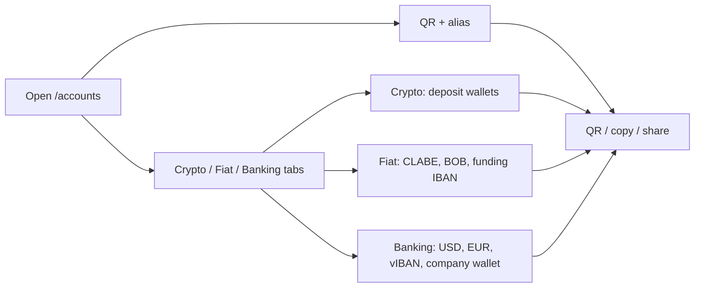

> **Environments:** Test `https://cryptobank.qbank.cl/platform` (`pk_test_...`) - Live `https://api.qbank.cl/platform` (`pk_...`).

## One place for your receiving details

The **My accounts** page is the account portal's directory of destinations
that can receive money for you. Open `/accounts` from the sidebar, directly
below **Deposit**. The page groups your QR payment identity, local receiving
accounts, Banking destinations, EUR instruments and crypto deposit wallets.

It does not merge balances that have different financial meanings. A bank
account remains a bank account, a virtual IBAN remains a routing instrument,
and a crypto deposit wallet remains a blockchain address. Use the existing
product pages for sending money, withdrawals and statements.

If a destination or read operation returns an error, use the public
[error catalog](https://docs.cbpayapp.com/en/errors) for the code and recovery action.

## CBPAY hero and three account tabs

The page opens with a **CBPAY** hero for your account. It keeps the QR and
alias actions immediately available: display the QR, copy the receiving
payload or share the account's receive identity.

Below the hero, the page has three tabs:

- **Crypto** (`?tab=crypto`): deposit wallets for on-chain assets.
- **Fiat** (`?tab=fiat`): local fiat instruments such as MX/CLABE and BO/BOB,
  plus EUR funding virtual IBANs.
- **Banking** (`?tab=banking`): USD/EUR Banking accounts, Banking virtual
  IBANs and EUR company wallets.

The selected tab is reflected in the URL, so you can link directly to
`/accounts?tab=crypto`, `/accounts?tab=fiat` or `/accounts?tab=banking`.
Without `tab`, the page opens on its default tab and still keeps all three
sections available.

### Open My accounts

Select **My accounts** from the portal sidebar. The **Wallets** label is the
new name for the area previously shown as **My wallets**; the underlying
wallets and addresses are unchanged.
### Choose a tab

Select **Crypto**, **Fiat** or **Banking**. You can bookmark the current view
with its `?tab=` deep-link when you need to return to a specific group.
### Copy, show or share

Use the card actions to display a QR code, copy the destination value or share
the receiving details. Share only the destination intended for that payment:
an account or address is bound to your CBPay account and is not interchangeable
with another account's destination.
## What each tab shows

| Tab | What it contains | What you can share |
|---|---|---|
| **Crypto** | Deposit wallets with network, asset, address, wallet type, receive-only status and creation time. Supported pairs include TRON/USDT, Ethereum/USDT, Ethereum/USDC and Bitcoin/BTC. | A blockchain address or its QR code. |
| **Fiat** | Local receiving instruments with country, currency, method, instrument, status and creation time. This includes MXN CLABE, BO/BOB bank-transfer destinations and EUR funding virtual IBANs (`purpose: funding_usdt`). | The CLABE, BOB account number or funding IBAN, after checking its status. |
| **Banking** | Enabled USD/EUR bank accounts with their receiving requirements, Banking virtual IBANs (`purpose: banking_eur`) and EUR company wallets. Details can include account number/IBAN, routing or SWIFT, status, wallet UUID and activation time. | The banking account details, Banking EUR IBAN or active company-wallet destination. |

The QR and alias remain available in the CBPAY hero above the tabs. The QR
identifies your account to receive transfers and the alias is optional.

The page uses the same account-scoped resources as the rest of the portal:
`GET /v1/me/qr`, `GET /v1/payins/deposit-accounts`,
`GET /v1/banking/accounts`, `GET /v1/banking/virtual-ibans`,
`GET /v1/banking/company-wallets` and `GET /v1/crypto/wallets`. It is a
navigation and sharing surface, not a new API contract.

## Honest empty and pending states

- **No QR:** the account has no QR token available. The page does not invent a
  QR or display a placeholder as if it could receive money.
- **No CLABE or BOB account:** local deposit destinations are provisioned only
  after the account's KYC (person) or KYB (company) is approved. A pending
  approval, an unavailable corridor or an existing claim can leave this
  section empty until reconciliation finishes.
- **Banking USD is empty:** create or complete the Banking profile and
  verification first, then wait for an enabled USD account to become visible.
  A missing account is not a zero balance.
- **EUR shows `pending_approval` or `pending`:** the request is still being
  reconciled. Do not create another virtual IBAN or company wallet just
  because the first read is not active yet.
- **Crypto has fewer addresses than expected:** a newly approved account can
  still be provisioning its deposit wallets. Refresh the page; use the
  existing destination once its address is present. Additional operating
  wallets belong to the separate segregated-wallets product.

If a card shows a temporary read error, refresh the card and keep the existing
request or destination. Do not create a second account, wallet or virtual IBAN
to guess the outcome of an ambiguous operation.

## FAQ

#### Are all the entries on this page wallets?
No. The page groups different receiving instruments: a QR identity, bank
accounts, virtual IBANs, a company Banking wallet and on-chain deposit
addresses. Their balances and operating rules remain separate.
#### Why did my CLABE or BOB account not appear at registration?
Registration alone does not provision these destinations. The account must
first reach approved KYC or KYB. After approval, provisioning is triggered
through the normal approval flow and existing accounts can be reconciled by
operations.
#### Can I share the values shown here?
Yes, share the QR or the receiving details for the payment you expect. Never
share session tokens, internal IDs or a destination copied from another CBPay
account. Verify the country, currency and method before the payer sends.
#### Why does a destination say pending?
Provisioning or provider reconciliation is still in progress. Keep the
destination request; do not create a second one with a new key. The page will
show the receiving value only once it is available.
#### Does renaming My wallets to Wallets change my addresses?
No. It is only a portal label change. The wallet IDs, addresses, assets and
receive-only behavior remain the same.
