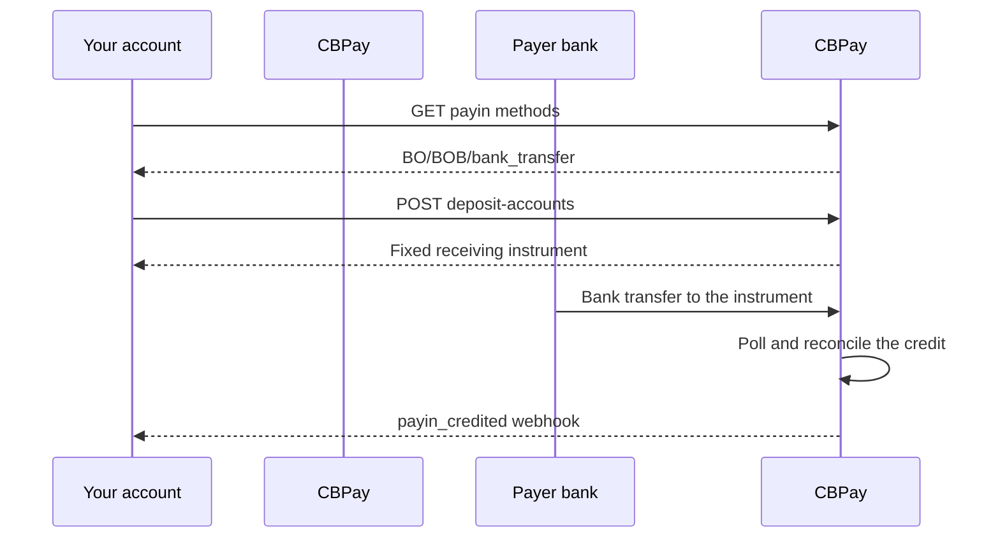

> **Environments:** Test `https://cryptobank.qbank.cl/platform` (`pk_test_...`) - Live `https://api.qbank.cl/platform` (`pk_...`).

## What this product does

A BOB virtual deposit account is a fixed receiving destination bound to one
CBPay account. Your payer sends a normal bank transfer in bolivianos to that
destination; CBPay detects the credit, reconciles the reported account and
credits your account through the normal payin flow.

The account is receive-only. It is not a wallet, it does not create a payment
session and your payer does not need to include an announcement reference.



## 1. Confirm the corridor

Always use the live catalog before enabling a payment option in your
application:

```bash
curl https://api.qbank.cl/platform/v1/payins/methods \
  -H "Authorization: Bearer <token>"
```

The relevant row is:

```json
{
  "country": "BO",
  "currency": "BOB",
  "method": "bank_transfer",
  "delivery": "polling"
}
```

The catalog is the source of truth. An organization may have the corridor
disabled even when the API contract exists.

## 2. Create or repair the receiving account

After the account's own verification is approved — KYC for a person or KYB
for a company — the platform provisions the default BOB deposit instrument.
Registration alone never creates a funding account. This endpoint is also
available when an approved account needs to repair a missing instrument:

```bash
curl -X POST https://api.qbank.cl/platform/v1/payins/deposit-accounts \
  -H "Authorization: Bearer <token>" \
  -H "Content-Type: application/json" \
  -d '{
    "country": "BO",
    "currency": "BOB",
    "method": "bank_transfer"
  }'
```

Response `201`:

```json
{
  "instrument_id": "1f4a…",
  "account_id": "9b1d…",
  "country": "BO",
  "currency": "BOB",
  "method": "bank_transfer",
  "instrument": "<receiving-account-number>",
  "details": {
    "account_number": "<receiving-account-number>",
    "alias": "CBPay Example BOB 20260919",
    "merchant_nit": "123456789",
    "bank_name": "Example Receiving Bank",
    "status": "ACTIVA"
  },
  "status": "active",
  "created_at": "2026-09-09T20:00:00Z"
}
```

Share `instrument` with the payer as the receiving account number. The
`instrument_id` is CBPay's stable identifier; do not replace the receiving
number with the UUID. When returned, `details.alias`, `details.merchant_nit`
and `details.bank_name` are presentation fields for the transfer-details
sheet; missing optional values are not inferred.

Person accounts have at most one active deposit account per
country/currency/method. Company accounts can create additional immutable
destinations only in enabled corridors; the currently enabled additional
deposit-account corridors are `MX/MXN/bank_transfer` and
`BO/BOB/bank_transfer`. Each destination remains bound to the same CBPay
account and incoming credits are matched by the destination instrument.

After approval, the account's first corridor instrument is provisioned
automatically. The request shown above is valid for repairing a missing
post-approval instrument. The provider-facing alias is generated server-side
from the account's verified name; clients do not choose that alias. A company
creating an additional BOB destination must use a new idempotency key for each
destination:

```bash
curl -X POST https://api.qbank.cl/platform/v1/payins/deposit-accounts \
  -H "Authorization: Bearer <token>" \
  -H "Idempotency-Key: company-bob-001" \
  -H "Content-Type: application/json" \
  -d '{
    "country": "BO",
    "currency": "BOB",
    "method": "bank_transfer",
    "idempotency_key": "company-bob-001"
  }'
```

A new key returns `201` with a new destination. Replaying the same completed
key returns `200` with the original instrument and `idempotency_hit: true`;
an in-flight replay can return `409 idempotency_conflict`. A missing or
ambiguous provider response remains visible for reconciliation instead of
being silently retried.

## 3. List the account's instruments

The list is paginated and hides provisioning claims that do not yet have a
real receiving number:

```bash
curl "https://api.qbank.cl/platform/v1/payins/deposit-accounts?page=1&page_size=50" \
  -H "Authorization: Bearer <token>"
```

```json
{
  "page": 1,
  "page_size": 50,
  "deposit_accounts": [
    {
      "instrument_id": "1f4a…",
      "account_id": "9b1d…",
      "country": "BO",
      "currency": "BOB",
      "method": "bank_transfer",
      "instrument": "<receiving-account-number>",
      "status": "active",
      "created_at": "2026-09-09T20:00:00Z"
    }
  ]
}
```

## 4. Receive and reconcile a transfer

There is no `POST /v1/payins` announcement for this mode. The payer sends
BOB to the account shown in `instrument`. The rail is polled using a bounded
date window; completed credits are deduplicated by the bank transaction
reference, ACH order or a deterministic fallback key.

When the credit is matched, subscribe to `payin_credited` and use the payin
resource for the final amount and status:

```bash
curl "https://api.qbank.cl/platform/v1/payins?country=BO&status=credited&from=2026-09-01&to=2026-09-10&page=1&page_size=50" \
  -H "Authorization: Bearer <token>"
```

The regular payin fee and FX conversion rules apply. The BOB bank movement is
not exposed as a provider-specific object in the public API.

## BOB payouts

BOB payouts continue to use the provider-agnostic payout contract:

```bash
curl -X POST https://api.qbank.cl/platform/v1/payouts \
  -H "Authorization: Bearer <token>" \
  -H "Idempotency-Key: bo-payout-2026-001" \
  -H "Content-Type: application/json" \
  -d '{
    "country": "BO",
    "currency": "BOB",
    "method": "bank_transfer",
    "amount": "1382.00",
    "beneficiary": {
      "name": "Juan Quispe Mamani",
      "tax_id": "4567890",
      "bank_code": "1016",
      "account_number": "1234567890"
    },
    "description": "Supplier payment"
  }'
```

The organization controls which internal rail version is active. That choice
is not a client-controlled public field, and the payout stores the selected
version so later polling continues against the correct operation. The
response and webhook remain the same provider-agnostic payout contract.

## States and recovery

| State | Meaning | Action |
|---|---|---|
| `active` | The receiving account can be shared with payers | Use `instrument` |
| `pending` | Provisioning or reconciliation is still in progress | Do not create a second account |
| `credited` | A transfer was reconciled and credited | Consume `payin_credited` |
| `unassigned` | A credit could not be routed to exactly one account | Resolve it from the admin operations flow |

Never create a second account after a timeout without first reading the list.
The provider may have accepted the first request even when the response was
lost.

## Errors

| HTTP | Code | Action |
|---:|---|---|
| 400 | `payin_corridor_unsupported` | Re-read `GET /v1/payins/methods`; the corridor is not enabled |
| 401 | `unauthorized` | Refresh the account credential |
| 403 | `account_blocked` | Activate the account through the organization operator |
| 422 | `deposit_account_limit_reached` | Use the existing instrument; one destination exists per corridor |
| 502 | `deposit_account_failed` | Read the list before retrying; do not assume the provider did not create it |
| 502 | `core_unavailable` | Retry the same logical request after availability returns |
| 502 | `core_invalid_response` | Keep the claim under reconciliation and contact operations if it persists |

## FAQ

#### Can I use the same account for several CBPay accounts?
No. The destination is bound to one CBPay account and one organization. Share
only the instrument returned for that account.
#### Does the payer need a CBPay account?
No. The payer uses their own bank's transfer flow. CBPay only needs the
receiving account to be active and the bank to report the credit.
#### Can I delete or rotate the account?
No. The instrument is immutable for its corridor. If the provider reports a
problem, contact operations instead of creating a replacement blindly.
#### How quickly is a transfer credited?
The rail is polled. The final timing depends on when the bank posts the
movement; the webhook is emitted after reconciliation, not when the payer
submits the transfer.
