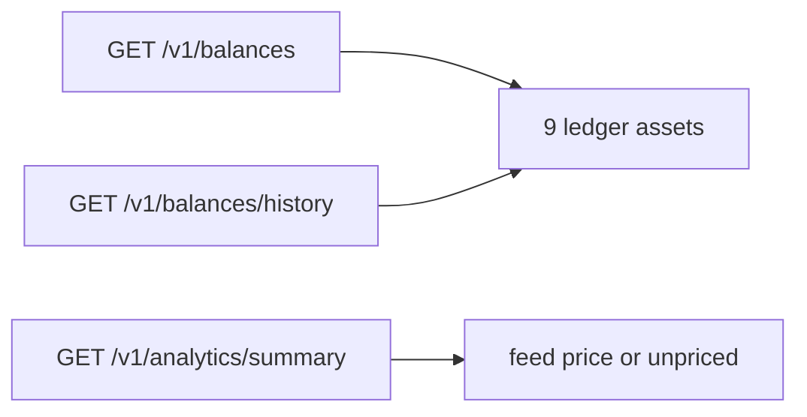

> **Environments:** Test `https://cryptobank.qbank.cl/platform` (`pk_test_...`) - Live `https://api.qbank.cl/platform` (`pk_...`).

CBPay accounts now expose three fiat ledger assets: **BOB**, **MXN** and
**ARS**. They are independent balances, stored with two decimal places
(minor units), and appear alongside USDT, USDC, BTC, GOLD, SILVER and
PLATINUM.



## Where fiat assets appear

The following account endpoints include the three fiat assets:

- `GET /v1/balances`: always returns all nine ledger assets, including zero
  rows. Fiat values use two decimals, for example `"125.40"`.
- `GET /v1/balances/history`: includes a daily series for each fiat asset.
  The `available` balance is tracked; held amounts are exposed by the
  current snapshot.
- `GET /v1/analytics/summary`: includes fiat balances and volumes when they
  exist. USD valuation uses the organization rate feed (`1 / local-per-USD`);
  if no valid rate exists, the asset is reported as unpriced and excluded
  from USD totals.

```json
{
  "account_id": "9b1deb4d-3b7d-4bad-9bdd-2b0d7b3dcb6d",
  "balances": [
    { "asset": "BOB", "available": "15000.00", "held": "0.00" },
    { "asset": "MXN", "available": "0.00", "held": "0.00" },
    { "asset": "ARS", "available": "0.00", "held": "0.00" }
  ]
}
```

## Transfers

`POST /v1/transfers` permits a same-asset transfer when the source and
destination accounts use the same asset. A fiat transfer keeps its two-decimal
precision; it is not implicitly converted to USDT or another currency.

## Product gates in v1

The ledger registration does not mean every product can spend fiat:

| Product | BOB/MXN/ARS in v1 |
|---|---|
| Account balances, history and analytics | Supported |
| Same-asset internal transfers | Supported |
| Payout settlement asset and organization defaults | Accepted; fiat execution returns `503 pricing_unavailable` until fiat settlement pricing ships |
| Swaps | Rejected with `400 invalid_pair` |
| Checkout | Rejected as a settlement asset with `invalid_asset` |
| POS | Rejected as a settlement asset with `invalid_asset` |
| Cards | Rejected with `400 spending_asset_unavailable` |

This separation is intentional: a balance can exist in the ledger before a
pricing or external settlement path is available.

## Errors and precision

Amounts are decimal strings. `1.50` BOB means 150 minor units; `1.234` BOB,
MXN or ARS is rejected. A fiat settlement request may be syntactically valid
but still return `503 pricing_unavailable` until the fiat payout settlement
path is implemented.

#### Does adding a fiat asset change my default settlement asset?
No. Existing accounts keep their current default. A fiat asset is only used
when explicitly enabled and accepted by the relevant product gate.
#### Can I use a fiat balance to pay a card purchase?
No. Cards reject fiat spending assets in v1; the balance remains visible and
usable by the products listed as supported above.
