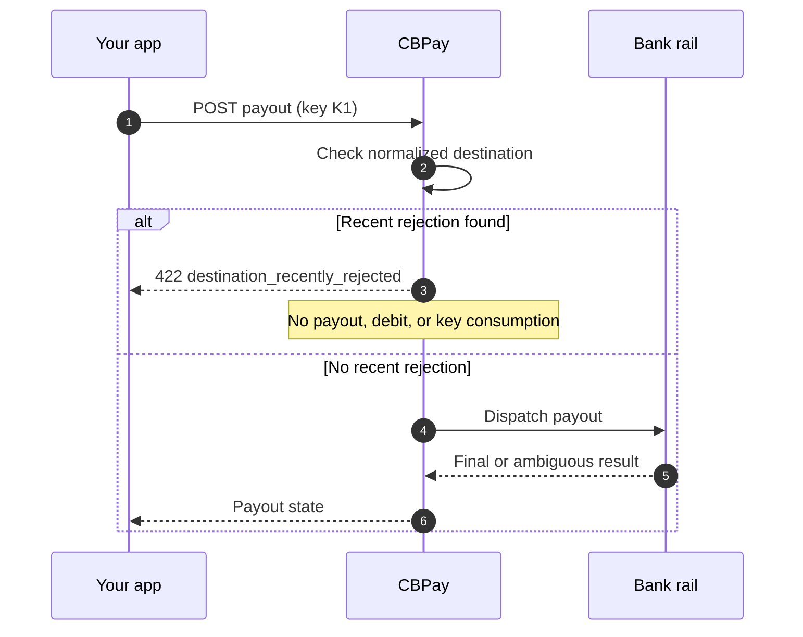

> **Environments:** Test `https://cryptobank.qbank.cl/platform` (`pk_test_...`) - Live `https://api.qbank.cl/platform` (`pk_...`).

See the [public error catalog](https://docs.cbpayapp.com/en/errors) for the complete error contract.

## What this protection does

Some bank corridors protect a destination after a recent bank rejection. When
the same normalized destination was rejected recently, CBPay stops the next
create before it creates a payout, debits the balance, or consumes the
idempotency key.

The protection is scoped to the account and the normalized combination of
`bank_code`, `account_number`, and `tax_id`. Changing capitalization or
formatting does not bypass it.



## Safe sequence

1. If the first response is ambiguous, replay the exact request with the same
   `idempotency_key`. This returns the original resource with
   `idempotency_hit: true`; it never creates a second payout.
2. If the response is `destination_recently_rejected`, the original key was
   not consumed. Review the bank rejection and decide whether the destination
   should be retried.
3. A deliberate retry uses a **new** idempotency key and
   `options.destination_retry_ack` set to the most recent rejected payout ID.
4. Reusing the old key with changed options returns
   `409 idempotency_conflict`; it never changes the original operation.
5. A destination with no recent rejection, or a payout on another corridor,
   follows its normal validation and dispatch path.

The acknowledgement is an explicit operator decision, not an automatic second
attempt.

## Deliberate retry request

```json
{
  "country": "CL",
  "currency": "CLP",
  "method": "bank_transfer",
  "amount": "1000.00",
  "beneficiary": {
    "name": "Example Recipient",
    "bank_code": "012",
    "account_number": "123456789",
    "tax_id": "11111111-1"
  },
  "options": {
    "destination_retry_ack": "<prior_case_id>"
  },
  "idempotency_key": "payout-retry-0001"
}
```

The acknowledgement must identify the most recent rejected case for the same
account and normalized destination. Do not copy a case ID from another account
or destination.

For the complete error catalog, see [Errors](https://docs.cbpayapp.com/en/errors).

## Response examples

### Recent rejection

```json
{
  "error": "destination_recently_rejected",
  "message": "destination was rejected by the bank on 2026-01-15 (prior case <prior_case_id>, code <prior_code>); retry with a new idempotency_key and options.destination_retry_ack=<prior_case_id> to confirm"
}
```

The message includes the UTC rejection date, the prior case ID, and the prior
code. The public response is provider-agnostic.

### Changed options with the old key

```json
{
  "error": "idempotency_conflict",
  "message": "the idempotency key was already used with a different request"
}
```

## States and actions

| Response or state | Meaning | Action |
| --- | --- | --- |
| `422 destination_recently_rejected` | A recent rejection matches the same normalized destination. No payout was created and the key remains available. | Review the rejection; replay unchanged or deliberately retry with a new key plus acknowledgement. |
| `409 idempotency_conflict` | The same key was reused with a different request or options. | Keep the original operation; choose a fresh key only for a genuinely new request. |
| `processing` | The outcome is not final yet. | Read the payout and wait for the final webhook/status; do not create a new payout. |
| `completed` | The payout reached its final successful state. | No retry is needed. |
| `failed` | The payout failed and the debit was handled by the normal failure path. | Read the failure details and correct the request before starting a new operation. |

## FAQ

#### Does the 422 create a payout?
No. The guard runs before payout insertion and before the debit. It also does
not consume the submitted idempotency key.
#### Can I retry with the same key after the 422?
Yes, if you are replaying the exact original request. A deliberate retry after
reviewing the rejection must use a new key and the acknowledgement option.
#### Why does changing only options return 409?
Request options are part of the idempotency payload. Reusing a key with changed
options is a different request, so CBPay rejects it instead of silently
changing the original operation.
#### Does this apply to every payout corridor?
No. The protection is applied only where the corridor enables it. Other rails
and destinations without a recent matching rejection follow their existing
validation and dispatch flow.
