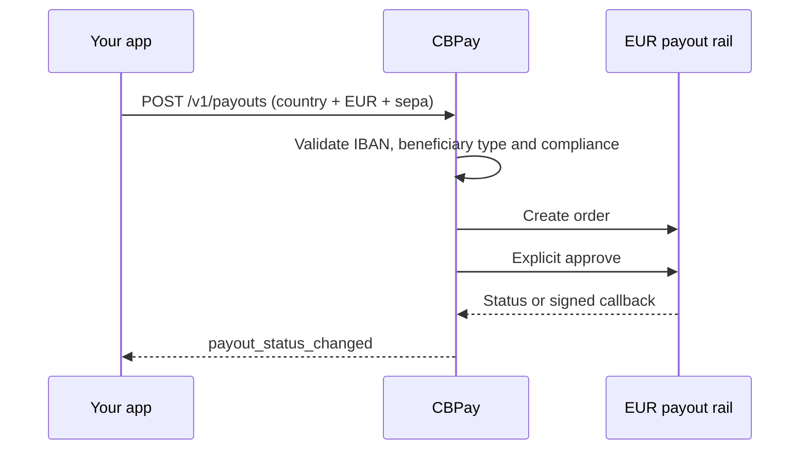

> **Environments:** Test `https://cryptobank.qbank.cl/platform` (`pk_test_...`) - Live `https://api.qbank.cl/platform` (`pk_...`).

Use this guide when your beneficiary receives EUR through the `sepa` payout
method. The catalog is provider-agnostic: it exposes the country, `EUR` and
`sepa`, while the account is debited using the normal payout pricing and
idempotency contract.



## Routing corridor

V1 registers one routing corridor: `country=EU`, `currency=EUR`,
`method=sepa`. `EU` is the catalog code for Europe, not the beneficiary's
actual country. The actual country is taken from the first two letters of the
normalized IBAN; the IBAN must belong to the supported SEPA Instant set.

`GB` is excluded from SEPA Instant V1: a British IBAN fails fast with HTTP 400
before dispatch because `sepaInstReachable=false`. SEPA Credit Transfer for GB
is a separate future scope. `GET /v1/payouts/methods` returns the single
`EU`/`EUR`/`sepa` row when the corridor is enabled.

## Beneficiary contract

The `beneficiary` object must include:

| Field | Rule |
|---|---|
| `beneficiary_type` | Required closed value: `individual` or `corporate`. |
| `iban` | Required; spaces are normalized, ISO 13616 mod-97 is checked and the country must be in the SEPA membership set. |
| `bic` | Optional ISO 9362 BIC, 8 or 11 characters. |
| `given_name` + `first_surname` | Required structured name for an individual; both must be present. |
| `name` | Required for a corporate beneficiary. For an individual, a multi-word value may split into first name and surname; a mononym is rejected. |

Use one idempotency key for the whole operation. The `description` is optional
at the API boundary, but when present it is normalized for the SEPA wire:
diacritics are folded, the explicit European fold map below is applied, the
result must fit the provider's corporate charset, and it is capped at **140
Unicode code points**. If the text still contains a character outside that
charset, creation fails with `400 invalid_payload`. When omitted, the adapter
generates a valid internal SEPA description.

Names use the same deterministic fold before the provider charset check:

| Input | Wire fold |
|---|---|
| accents, diaereses and `ñ` | Latin base letter (`é` → `e`, `ñ` → `n`) |
| `ß`, `æ`, `œ`, `ø`, `å`, `ł`, `đ`, `þ`, `ð` | `ss`, `ae`, `oe`, `o`, `a`, `l`, `d`, `th`, `d` |
| Maltese `ħ`, `ċ`, `ġ`, `ż` | `h`, `c`, `g`, `z` |
| any remaining character outside the provider charset | `400 invalid_payload` |

An individual must resolve to both a first name and a last name. Mononyms are
not payable as `individual` in V1; send the structured `given_name` and
`first_surname` fields or a multi-word `name`.

## Create a payout

```bash
curl -X POST https://api.qbank.cl/platform/v1/payouts \
  -H "Authorization: Bearer <token>" \
  -H "Content-Type: application/json" \
  -d '{
    "country": "EU",
    "currency": "EUR",
    "method": "sepa",
    "amount": "100.00",
    "beneficiary": {
      "beneficiary_type": "individual",
      "given_name": "Elena",
      "first_surname": "Fuentes",
      "iban": "DE89370400440532013000",
      "bic": "COBADEFFXXX"
    },
    "description": "Invoice 2026-0916",
    "idempotency_key": "sepa-eu-20260917-001"
  }'
```

The account-facing response is the normal payout resource:

```json
{
  "payout_id": "7d5c2f0a-1e9b-4a6d-8f3c-0b2a1d9e8c7f",
  "country": "EU",
  "currency": "EUR",
  "method": "sepa",
  "local_amount": "100.00",
  "status": "processing",
  "status_code": "approved",
  "funds_debited": true,
  "bank_reference": ""
}
```

The provider create and explicit approval are internal steps. Do not create a
replacement payout while this one is `processing`; use the same idempotency
key for a client retry.

## Statuses and returns

| Provider signal | Public payout result | Financial meaning |
|---|---|---|
| `created`, `pending` or unknown | `processing` | Keep open and reconcile; no automatic resend. |
| `settled` | `completed` | The hold is consumed. |
| `declined` or `canceled` | `failed` | The existing failed-payout refund path applies. |
| Return notification | `failed`, `status_code: reversed` | The already-completed payout is reversed through the existing refund path. |

Subscribe to `payout_status_changed`. SEPA does not add a new webhook event.
The provider callback is verified and bridged into the same payout status
pipeline; a late callback cannot resurrect a terminal row.

## Errors

| HTTP | Code or result | Solution |
|---:|---|---|
| 400 | `invalid_payload` | Correct EUR, IBAN/name fields or the SEPA charset rules for the description and beneficiary. |
| 400 | `payout_corridor_unsupported` | Confirm the single `EU`/EUR/`sepa` row is in the live catalog and the IBAN country is supported. A GB IBAN is rejected with 400 before dispatch. |
| 422 | payout `failed` / `core_rejected` | Fix the beneficiary and create a new operation with a new idempotency key. |
| 503 | `payout_provider_failed` or `channel_unavailable` | Read the existing payout first; if ambiguous, retry only with the same idempotency key. |

#### Is BIC mandatory?
  No. The IBAN is mandatory; BIC is optional and is sent when supplied.
#### Can I send USD through this method?
  No. `sepa` is EUR-only. A different currency is rejected before dispatch.
#### Does a return create a new webhook?
  No. The existing `payout_status_changed` event carries the `reversed`
  status code and the normal refund outcome.
