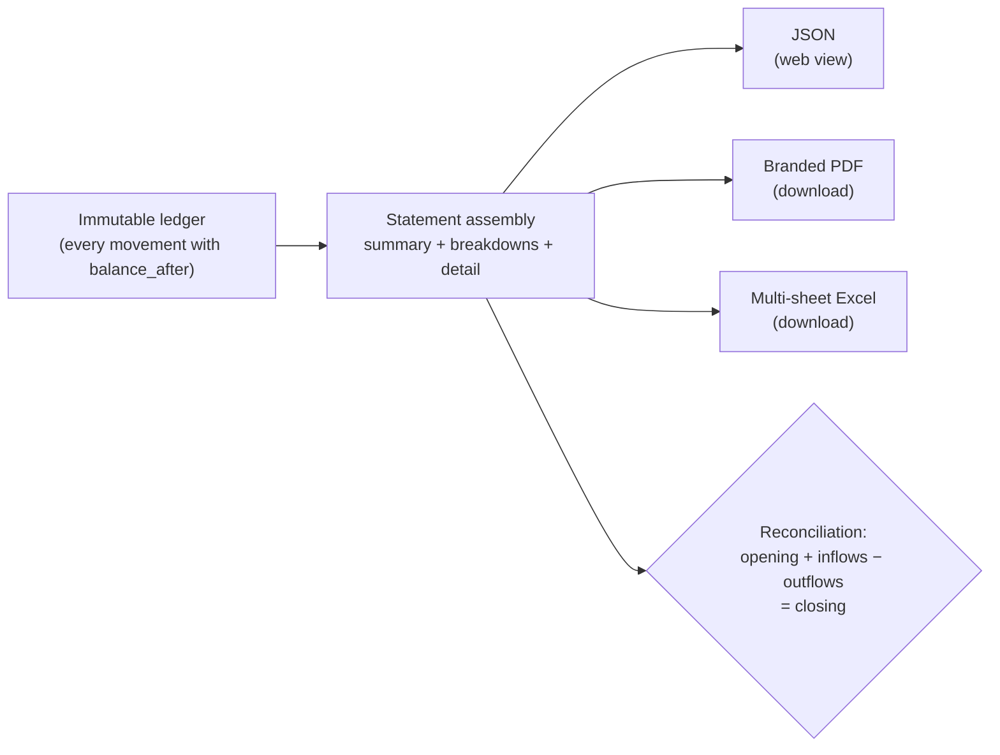

> **Environments:** Test `https://cryptobank.qbank.cl/platform` (`pk_test_...`) - Live `https://api.qbank.cl/platform` (`pk_...`).

The statement consolidates **every** movement of an account in a period —
payouts, payins, crypto deposits and withdrawals, internal transfers, card
purchases, balance conversions, banking operations and service charges —
into one auditable document. A single endpoint serves it in three formats:

| Format | What for | How to request it |
|---|---|---|
| `json` (default) | Rendering the statement in your web/app | `format=json` |
| `pdf` | Formal document with CBPay branding | `format=pdf` |
| `xlsx` | Excel with per-section sheets, filters and numeric cells | `format=xlsx` |



## Requesting the statement

```bash
# JSON for your front end
curl "https://api.qbank.cl/platform/v1/reports/statement?from=2026-01-01&to=2026-07-07" \
  -H "Authorization: Bearer <token>"

# Downloadable PDF (CBPay branding)
curl -OJ "https://api.qbank.cl/platform/v1/reports/statement?from=2026-01-01&to=2026-07-07&format=pdf" \
  -H "Authorization: Bearer <token>"

# Downloadable Excel
curl -OJ "https://api.qbank.cl/platform/v1/reports/statement?from=2026-01-01&to=2026-07-07&format=xlsx" \
  -H "Authorization: Bearer <token>"
```

- `from` / `to`: `YYYY-MM-DD` dates, inclusive, in your organization timezone. Maximum range:
  400 days.
- The response field `period.timezone` contains the real IANA timezone of the organization (for example `America/New_York`), not a constant UTC label.
- `lang=en|es|zh`: language of the PDF/Excel (default `en`). Also `Content-Language`.
- Files arrive with `Content-Disposition: attachment`. The basename follows the locale (`statement_…` / `cartola_…` / `对账单_…`).

## What it contains

```json
{
  "account": { "account_id": "…", "display_name": "Example Company SpA", "type": "company" },
  "period": { "from": "2026-01-01", "to": "2026-07-07", "timezone": "America/New_York" },
  "generated_at": "2026-07-07T15:00:00Z",
  "summary": {
    "opening_balance": "0.000000",
    "total_in": "985633.540000",
    "total_out": "38099.870000",
    "net_change": "947533.670000",
    "closing_balance": "947533.670000",
    "balanced": true,
    "counts": { "payouts": 51, "payins": 12, "crypto_deposits": 18, "transfers": 4 },
    "fees_by_service": { "payout": "15.300000", "funding": "897.550000" },
    "total_fees": "912.850000"
  },
  "breakdown": {
    "by_product": [ { "product": "payouts", "count": 51, "usdt_in": "0.000000", "usdt_out": "38099.870000", "fees": "15.300000" } ],
    "by_country": [ { "flow": "payouts", "country": "BO", "currency": "BOB", "count": 14, "local_amount": "28748.58", "usdt_amount": "2902.210000" } ],
    "by_currency": [ { "currency": "BOB", "payout_local": "28748.58", "payin_local": "700.00" } ],
    "by_month": [ { "month": "2026-01", "usdt_in": "985633.540000", "usdt_out": "35100.000000" } ]
  },
  "payouts": [ { "created_at": "…", "payout_id": "…", "country": "BO", "beneficiary": "Juan Quispe", "local_amount": "90.00", "fx_rate": "6.91", "usdt_amount": "13.024600", "fee": "0.300000", "fee_percent": "0.200000", "fee_fixed": "0.100000", "total_debit": "13.324600", "status": "completed", "bank_reference": "00761123456" } ],
  "payins": [ { "…": "…" } ],
  "card_transactions": [ { "created_at": "…", "transaction_id": "…", "card_id": "…", "kind": "purchase", "merchant": "AMAZON.COM", "amount_usd": "25.00", "spend_asset": "USDT", "spend_amount": "25.000000", "status": "settled" } ],
  "swaps": [ { "created_at": "…", "swap_id": "…", "from_asset": "USDT", "to_asset": "BTC", "from_amount": "10.000000", "to_amount": "0.00015433", "rate": "0.00001543", "status": "completed" } ],
  "banking_operations": [ { "created_at": "…", "operation_id": "…", "direction": "out", "type": "wire", "currency": "USD", "amount": "150.00", "counterparty": "Acme Inc", "status": "completed" } ],
  "assets": [
    {
      "asset": "GOLD",
      "opening_balance": "0.000000",
      "total_in": "12.500000",
      "total_out": "2.000000",
      "net_change": "10.500000",
      "closing_balance": "10.500000",
      "balanced": true,
    }
  ],
  "crypto_deposits": [ { "chain": "tron", "asset": "USDT", "tx_id": "…", "usdt_gross": "100.000000", "fee": "1.000000", "usdt_credited": "99.000000", "balance_after": "99.000000" } ],
  "crypto_withdrawals": [ { "…": "…" } ],
  "transfers": [ { "direction": "sent", "counterparty": "Ana Perez", "asset": "USDT", "amount": "25.000000" } ],
  "service_charges": [ { "type": "banking_fee", "service": "banking_customer", "fee_model": "fixed", "asset": "USDT", "amount": "-0.500000", "balance_after": "98.500000" } ],
}
```

Sections:

1. **`summary`** — opening balance, inflows, outflows, closing balance,
   fees by service and the `balanced` flag of the **USDT balance** (the
   operating currency).
2. **`assets`** — one reconciled section per non-USDT balance with activity
   or balance (USDC, BTC, GOLD and, if you use Banking, the
   `BANK_USD`/`BANK_EUR` mirrors of your bank accounts): opening/closing
   balance, inflows, outflows and its own `balanced` flag, in each
   currency's precision, WITHOUT raw detail in the client view; the raw
   per-asset detail lives only in the org-admin statement. Empty if you
   only operate USDT.
3. **`breakdown`** — by product, by country (payouts and payins with local
   amount and USDT), by fiat currency and by month.
4. **Per-product detail** — payouts (beneficiary, rate and debit), payins
   (per mode), crypto (with `tx_id` and its `asset`), transfers (with
   counterparty and `asset`), card purchases (`card_transactions`, with
   merchant and spending balance), balance conversions (`swaps`), banking
   operations (`banking_operations`) and service charges (with refunds).
5. **Product sections and audit trail** — the client statement omits the raw ledger `movements` and per-asset `assets[].movements`; it also omits `summary.counts.movements`. Reconcile by product section, using `balance_after` on charges and crypto deposits. For deep audit, use the org-admin statement or `GET /v1/movements`.

> **Note**
**Transparent fees.** On payouts, payins and crypto withdrawals, when the
fee combines a percentage and a fixed component, the statement splits them
into `fee_percent` and `fee_fixed` (they add up exactly to `fee`).
Standalone charges (compliance, wallets, banking, verifications and cards) are always fixed-amount charges, include the charged `asset` (USDT for the USDT-only fee summary), and carry `fee_model: "fixed"` — the PDF/Excel labels them **Fixed Com**.
## How to reconcile it (for your accountant)

The statement satisfies exact accounting identities, without rounding:

```text
opening_balance + total_in − total_out = closing_balance
```

- `balanced: true` confirms the identity against the ledger for the USDT
  summary and independently for every `assets` section. Balances from
  different assets are never added together.
- Each product section is reconciled using its own amounts and statuses.
  Charges and crypto deposits include `balance_after`, so you can verify
  their effect on the relevant balance without relying on a raw ledger dump.
- The client statement intentionally omits the raw USDT ledger
  `movements`, `assets[].movements`, and `summary.counts.movements`.
  For deep audit, an org admin can use the administrator statement or
  `GET /v1/movements`, the paginated ledger view.
- The closing balance of one period matches the opening balance of the next.
- The `from`/`to` range is interpreted in the organization's timezone (`period.timezone`), but each operation's detail timestamps are in UTC (JSON in RFC3339 with `Z`; Date (UTC) columns in PDF/Excel).
- Fees are never hidden: each operation exposes gross, fee and net
  separately, while `fees_by_service` remains USDT-only by design.
- XLSX sheet names follow the requested `lang` (`en`, `es` or `zh`), including
  Crypto, Segregated, Cards, Swaps, Banking and Margins when those sections
  are present.
- The Excel **Payouts** sheet carries a **Bank ref** column (right after
  the reference/concept column) with the transaction id assigned by the
  destination bank once it confirms the payment. The statement PDF omits
  it on purpose (table density) — the individual payout receipt does show
  it.

## For the administrator (org admin)

The CBPay team can generate any of its accounts' statements:

```bash
curl "https://api.qbank.cl/platform/v1/accounts/{accountID}/reports/statement?from=2026-01-01&to=2026-07-07&format=pdf" \
  -H "X-API-Key: <pk_org_admin>"
```

The administrator view also includes additional operational information for
the period (detailed in the administration documentation).

## Errors

| HTTP | `error` | Cause |
|---|---|---|
| 400 | `invalid_range` | Missing/invalid dates, `to` before `from`, or range over 400 days |
| 400 | `invalid_format` | `format` other than `json`, `pdf`, `xlsx` |
| 404 | `not_found` | The account does not exist (org admin only) |
## FAQ

#### How often is the statement generated?
On demand — every request builds it live from the ledger for the `from`/`to`
range you pass (both required, `YYYY-MM-DD`, organization timezone).
#### What does balanced: true mean?
Each asset reconciles independently: `opening + credits − debits = closing`
for USDT, USDC, BTC, GOLD and the banking mirrors. If any asset does not
balance the flag is `false` — report it to your CBPay team.
#### Why do I see BANK_USD / BANK_EUR balances?
They mirror your banking money inside the statement so the account
reconstructs completely. The authoritative balance is always the bank's
(`GET /v1/banking/accounts/{id}/balance`); these mirrors are never
spendable.
#### Which formats are available?
JSON (integration), PDF and XLSX — both branded with your organization's
identity. Use the `Accept` header or the format parameter of the endpoint.
#### What is fee_model: fixed?
Standalone service charges (verifications, screenings, wallet services) are
fixed-only fees, labeled "Fixed Com" in the statement — as opposed to
percent+fixed transactional fees.
#### Can I verify an individual movement?
Yes — every operation has a [receipt](https://docs.cbpayapp.com/en/guides/receipts) with a public
verification code; anyone can validate it without authentication.
## Disputes in the statement

The account statement includes `disputes[]` when a case was created in the
period. Each item contains `created_at`, `dispute_id`, `kind`, `status`,
`disputed_usdt`, `held_usdt`, optional `case_number` and `deadline_at`. The
preventive hold is represented once; the provider chargeback is the separate
financial debit.

## Asset-aware payin rows

Payin rows include `credit_asset` and optional `fiat_credited`; refund rows
include `debited_asset` and `debited_amount`. JSON, PDF and XLSX preserve the
real asset precision and keep the USDT equivalent separate.
