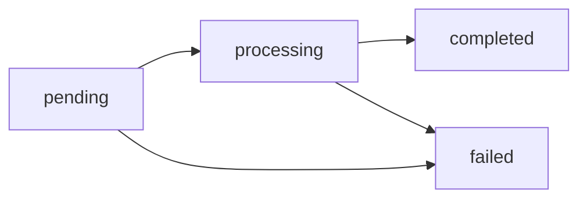

## Diez saldos virtuales independientes

Cada cuenta mantiene **diez saldos virtuales, uno por asset**:

| Asset | Qué es | Decimales | Cómo se fondea |
|---|---|---|---|
| `USD` | Dólares — **el saldo principal** | 2 | Payins fiat, swaps, transferencias, ajustes |
| `USDT` | Stablecoin USD — saldo principal legacy | 6 | Payins fiat, depósitos on-chain (TRON/Ethereum), transferencias |
| `USDC` | Stablecoin USD | 6 | Depósitos on-chain (Ethereum), transferencias |
| `BTC` | Bitcoin | 8 (satoshis) | Depósitos on-chain, abonos del operador y transferencias internas |
| `GOLD` | Gramos de oro fino, respaldados por custodio | 6 | Abonos del operador y transferencias internas |
| `SILVER` | Gramos de plata fina, respaldados por custodio | 6 | Abonos del operador y transferencias internas |
| `PLATINUM` | Gramos de platino fino, respaldados por custodio | 6 | Abonos del operador y transferencias internas |
| `BOB` | Bolivianos — hold local | 2 | Payins fiat con hold local, transferencias, ajustes |
| `MXN` | Pesos mexicanos — hold local | 2 | Payins fiat con hold local, transferencias, ajustes |
| `ARS` | Pesos argentinos — hold local | 2 | Payins fiat con hold local, transferencias, ajustes |

Son totalmente independientes entre sí: nunca se mezclan ni se convierten
automáticamente. (`BANK_USD` y `BANK_EUR` son saldos espejo de banking
separados — ver [Banking](https://docs.cbpayapp.com/es/guides/banking).)

`GET /v1/balances` devuelve siempre los diez (con ceros si no has operado
ese asset), como **strings decimales**:

```json
{
  "account_id": "…",
  "balances": [
    { "asset": "USD", "available": "1000.00", "held": "0.00" },
    { "asset": "USDT", "available": "125.430000", "held": "10.000000" },
    { "asset": "USDC", "available": "50.000000", "held": "0.000000" },
    { "asset": "BTC", "available": "0.00060000", "held": "0.00000000" },
    { "asset": "GOLD", "available": "12.500000", "held": "0.000000" },
    { "asset": "SILVER", "available": "0.000000", "held": "0.000000" },
    { "asset": "PLATINUM", "available": "0.000000", "held": "0.000000" },
    { "asset": "BOB", "available": "0.00", "held": "0.00" },
    { "asset": "MXN", "available": "0.00", "held": "0.00" },
    { "asset": "ARS", "available": "0.00", "held": "0.00" }
  ]
}
```

> **Nota**
Internamente cada monto se almacena como entero en la unidad mínima de su
asset (centavos, micro-USDT, satoshis, micro-gramos) y se calcula con
aritmética racional exacta. Nunca hay floats ni errores de redondeo
acumulados.
**USD es el saldo principal de las cuentas nuevas**: payouts, payins fiat
y comisiones usan USD salvo que la cuenta configure otra cosa. Las cuentas
creadas antes del default USD llevan USDT explícito y siguen operando en
USDT. Un asset vacío se normaliza a USD.

## Elige desde qué saldo pagas

Los **payouts** y las **comisiones de servicios** (KYC, creación de
wallets, banking) pueden debitarse desde cualquiera de tus diez saldos.
El pipeline de pricing no cambia: la operación se cotiza en USDT como
siempre, y al final el total se traduce al asset elegido con el **precio
efectivo de settlement** del momento.

- **Predeterminado por cuenta**: `PUT /v1/settlement` con
  `{"default_settlement_asset": "BTC"}`. Desde ahí, todo payout y toda
  comisión de servicio sale del saldo BTC (si alcanza; no hay cascadas a
  otros saldos).
- **Override por operación**: envía `settlement_asset` en
  `POST /v1/payouts` (o en el confirm de QR) para pagar esa operación
  puntual desde otro saldo, sin tocar el predeterminado.

```bash
# Definir BTC como saldo de pago predeterminado
curl -X PUT "https://api.qbank.cl/platform/v1/settlement" \
  -H "Authorization: Bearer <token>" -H "Content-Type: application/json" \
  -d '{"default_settlement_asset": "BTC"}'
```

Reglas del settlement multi-asset:

| Regla | Detalle |
|---|---|
| Precio de ejecución | BTC y GOLD usan un feed on-chain de ejecución (no el precio de referencia). Si el feed está viejo o no disponible, la operación devuelve `503 pricing_unavailable` — nunca se ejecuta con un precio dudoso. |
| Débito, hold y reembolso | Los tres viven en el asset elegido. Si el payout falla, se reembolsa el `settlement_amount` **exacto** — jamás se re-cotiza. |
| Idempotencia | El replay con la misma llave devuelve el monto original; el precio no se recalcula. |
| Límite por operación | Los assets volátiles (BTC/GOLD/SILVER/PLATINUM) tienen un límite por operación (equivalente USDT, visible en `GET /v1/settlement`); si lo superas: `422 settlement_limit_exceeded`. |
| Límite diario por cuenta | Los assets volátiles también tienen un tope de volumen en 24 h móviles (`volatile_daily_limit_usdt` en `GET /v1/settlement`); al superarlo: `422 settlement_daily_limit_exceeded`. Paga en USD/USDT/USDC o reintenta más tarde. |
| USD | Es el default de las cuentas nuevas; las cuentas legacy con USDT explícito no cambian. USD liquida 1:1 con USDT, exacto al centavo. |

El bloque `settlement` de `GET /v1/rates` muestra el precio efectivo por
asset (spread incluido) para estimar antes de operar, y la respuesta del
payout registra `settlement_asset`, `settlement_amount` y
`settlement_rate` para auditoría.

## Elige en qué saldo se acreditan tus payins

En una cuenta nueva, los **payins** (QR, transferencia, collect y tarjeta)
acreditan directamente al saldo USD en centavos. Una cuenta legacy con USDT
explícito conserva USDT. Si configuras otro `default_payin_asset`, el neto
sigue el flujo de conversión posterior al crédito al precio real, sin
spread adicional; el payin ya pagó su comisión y su tasa. Aplican los
mismos límites de un swap normal.

```bash
# Acreditar mis payins en USDC
curl -X PUT "https://api.qbank.cl/platform/v1/settlement" \
  -H "Authorization: Bearer <token>" -H "Content-Type: application/json" \
  -d '{"default_payin_asset": "USDC"}'
```

| Regla | Detalle |
|---|---|
| Conversión post-crédito | El payin acredita en el asset principal de la cuenta (USD en cuentas nuevas, USDT en legacy) y la conversión corre inmediatamente después como un swap (verás `swap_out`/`swap_in` en tu cartola). |
| Precio y límites | La conversión ejecuta **al precio real, sin spread de swap** (no hay doble costo: el payin ya pagó su comisión y su tasa). Aplican los límites por operación/24 h de los assets volátiles (BTC/GOLD/SILVER/PLATINUM). |
| Si la conversión falla | El payin queda acreditado en el asset principal con `conversion_status: pending_retry` y el sistema reintenta automático — el saldo jamás se pierde ni se convierte doble. |
| Checkout y POS | Cada link conserva el `settlement_asset` elegido al crearlo; esta configuración no los re-convierte. Un link creado **sin** `settlement_asset` usa tu `default_payin_asset`. |
| Superficies | `GET /v1/payins`, el detalle y el webhook `payin_credited` exponen `settlement_asset` y `conversion_status` cuando hay conversión. |

## `available` y `held`

Cada saldo tiene sus dos contadores:

| Campo | Significado |
|---|---|
| `available` | Saldo disponible para operar |
| `held` | Reservado por operaciones en vuelo (payouts y retiros pendientes) |

Cuando creas un payout o retiro, el débito (`monto + comisión`) sale de
`available` y queda en `held` hasta que la operación llega a estado final:

- **`completed`** → el hold se consume; el dinero salió.
- **`failed`** → se reembolsa el débito completo (monto + comisión) a
  `available`.

## Conversión FX (fiat ↔ USDT, cotizada)

Las operaciones fiat se cotizan en USDT con **las tasas de tu cuenta** al
momento de ejecutar (las mismas que devuelve `GET /v1/rates`, base USD):
`rate` para payouts y `payin_rate` para payins. La conversión redondea
**hacia arriba** en los débitos y **hacia abajo** en los abonos, con una
diferencia máxima de 1 micro-USDT. El total cotizado luego se debita (o se
acredita) en el asset de settlement — las cuentas con principal USD
liquidan 1:1 en centavos USD.

Ejemplo de un payout de 50.000 CLP con tasa 950.25:

```
usdt_amount = ceil(50000 / 950.25 × 10^6) / 10^6 = 52.618258 USDT
total_debit = usdt_amount + fee
```

Ejemplo de un payin de 50.000 CLP con `payin_rate` 955.10:

```
usdt_gross    = floor(50000 / 955.10 × 10^6) / 10^6 = 52.350539 USDT
usdt_credited = usdt_gross − fee
```

La tasa usada queda registrada en el objeto (`fx_rate`) para auditoría.

## Precios de referencia y de settlement

`GET /v1/rates` incluye un bloque `asset_prices` con el **precio USD de
referencia** de cada moneda (BTC por unidad; GOLD, SILVER y PLATINUM por
gramo; USD, USDT y USDC valen 1 por convención), para valorizar tus saldos
en pantalla, y un bloque `settlement` con el **precio efectivo** al que se
valoraría tu saldo si pagas una operación desde ese asset (spread incluido):

```json
{
  "asset_prices": {
    "USD": { "currency": "USD", "unit": "usd", "price": "1" },
    "USDT": { "currency": "USD", "unit": "usdt", "price": "1" },
    "USDC": { "currency": "USD", "unit": "usdc", "price": "1" },
    "BTC": { "currency": "USD", "unit": "btc", "price": "109853.24",
             "updated_at": "2026-07-07T11:59:41Z",
             "settlement_grade": true },
    "GOLD": { "currency": "USD", "unit": "gram", "price": "107.5341",
              "updated_at": "2026-07-07T09:12:05Z",
              "settlement_grade": true },
    "SILVER": { "currency": "USD", "unit": "gram", "price": "1.2345",
                "updated_at": "2026-07-07T09:12:05Z",
                "settlement_grade": true },
    "PLATINUM": { "currency": "USD", "unit": "gram", "price": "45.6789",
                  "updated_at": "2026-07-07T09:12:05Z",
                  "settlement_grade": true }
  },
  "settlement": {
    "default_asset": "USD",
    "assets": [
      { "asset": "USD", "available": true, "settlement_rate": "1" },
      { "asset": "USDT", "available": true, "settlement_rate": "1" },
      { "asset": "USDC", "available": true, "settlement_rate": "0.99900000" },
      { "asset": "BTC", "available": true, "settlement_rate": "109029.34070000" },
      { "asset": "GOLD", "available": true, "settlement_rate": "106.99642950" }
    ]
  }
}
```

`settlement_grade: true` indica que el precio está lo bastante fresco para
ejecutar operaciones; si baja a `false`, los pagos desde ese asset
responden `503 pricing_unavailable` hasta que el precio vuelva.

## Ledger inmutable

Cada movimiento genera una entrada inmutable con saldo resultante
(`balance_after`) **en la moneda del movimiento**. Tu historial completo
está en `GET /v1/movements` (filtra por moneda con `?asset=`):

| `type` | Qué representa |
|---|---|
| `payin_credit` | Abono de un cobro fiat |
| `payout_debit` / `payout_refund` | Débito de payout / reembolso si falló |
| `transfer_in` / `transfer_out` | Transferencia interna recibida / enviada |
| `funding` | Depósito on-chain acreditado (USDT o USDC, cada uno en su saldo) |
| `withdrawal_debit` / `withdrawal_refund` | Retiro on-chain / reembolso si falló |
| `compliance_fee` / `compliance_refund` | Cargo por servicio KYC/KYB / reembolso |
| `wallet_creation_fee` / `wallet_creation_refund` | Cargo por creación de wallet / reembolso |
| `adjustment` | Ajuste manual de CBPay (auditado) |

```bash
curl "https://api.qbank.cl/platform/v1/movements?type=payout_debit&from=2026-07-01&to=2026-07-07&page_size=20" \
  -H "Authorization: Bearer <token>"

# Solo los movimientos del saldo GOLD
curl "https://api.qbank.cl/platform/v1/movements?asset=GOLD&from=2026-07-01&to=2026-07-07" \
  -H "Authorization: Bearer <token>"
```

Todos los listados (`/v1/movements`, `/v1/payouts`, `/v1/payins`,
`/v1/crypto/transactions`, `/v1/banking/operations`) aceptan paginación
(`page`, `page_size` hasta 200) y filtros de fecha `from`/`to`
(YYYY-MM-DD, zona horaria de la organización, inclusive).

## Estados de operación

Payouts y retiros crypto siguen el mismo ciclo:



Los estados finales (`completed`/`failed`) llegan por
[webhook](https://docs.cbpayapp.com/es/webhooks); no es necesario hacer polling.

### Saldos de metales respaldados por custodio

`GOLD`, `SILVER` y `PLATINUM` son saldos ledger-only respaldados por
custodio y medidos en gramos finos con seis decimales. Settlement y swaps
usan un oráculo de precios y la conversión fija de `31.1034768` gramos por
onza troy; esto no implica un riel on-chain de depósito, retiro o gasto de
metales.
