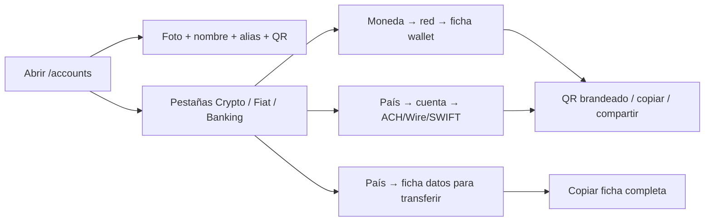

> **Ambientes:** Test `https://cryptobank.qbank.cl/platform` (`pk_test_...`) - Live `https://api.qbank.cl/platform` (`pk_...`).

## Un solo lugar para tus datos de recepción

La página **Mis cuentas** es el directorio del portal con los destinos que
pueden recibir dinero para ti. Ábrela en `/accounts` desde la barra lateral,
justo debajo de **Depositar**. La página reúne tu identidad de cuenta, las
wallets crypto de depósito, las cuentas receptoras fiat y los destinos de
Banking en una sola vista.

No mezcla saldos con significados financieros distintos. Una cuenta bancaria
sigue siendo una cuenta bancaria, un vIBAN sigue siendo un instrumento de
ruteo y una wallet crypto de depósito sigue siendo una dirección blockchain.
Usa las páginas de cada producto para enviar dinero, retirar y consultar la
cartola.

Si un destino o una lectura devuelve un error, usa el [catálogo público de
errores](https://docs.cbpayapp.com/es/errores) para revisar el código y la acción de recuperación.

## Hero CBPAY y tres pestañas de cuentas

La página abre con un hero **CBPAY** para tu cuenta. Muestra la foto y el
nombre del titular cuando están disponibles, además del alias permanente y el
QR de la cuenta. El hero usa la respuesta existente de `GET /v1/me/qr`; no
inventa un QR cuando la cuenta no tiene uno.

Debajo del hero hay tres pestañas:

- **Crypto** (`?tab=crypto`): elige una moneda y luego una red para ver solo
  la wallet de depósito seleccionada, con un QR brandeado.
- **Fiat** (`?tab=fiat`): elige un país y ve la ficha de **datos para
  transferir** de cada cuenta de ese país. Las fichas Fiat nunca muestran QR.
- **Banking** (`?tab=banking`): elige un país y ve las cuentas Banking.
  Estados Unidos tiene subpestañas **ACH**, **Wire** y **SWIFT**; Europa
  muestra vIBANes Banking y wallets de empresa.

La pestaña y el instrumento seleccionado quedan reflejados en la URL:

- `/accounts?tab=crypto&sel=USDT:tron`
- `/accounts?tab=fiat&sel=BO`
- `/accounts?tab=banking&sel=US:<account_id>:ach`
- `/accounts?tab=banking&sel=EU`

Los valores desconocidos o malformados vuelven al valor seguro por defecto;
nunca exponen otra cuenta ni crean un destino.



### Abre Mis cuentas

Selecciona **Mis cuentas** en la barra lateral del portal. La etiqueta
**Wallets** reemplaza a **Mis wallets**; las wallets y direcciones subyacentes
no cambian.
### Elige pestaña y selección

Selecciona **Crypto**, **Fiat** o **Banking**, y luego la moneda, país,
cuenta o riel de Estados Unidos que muestra la página. Puedes guardar la vista
actual con su deep-link `?tab=&sel=`.
### Copia o comparte los datos correctos

Las fichas Crypto y Banking pueden mostrar un QR con el símbolo de branding
de la organización, copiar valores individuales o compartir el riel
seleccionado. Las fichas Fiat no tienen QR: usa **Copiar todo** para copiar
la ficha completa, con titular, banco, NIT cuando venga informado y número
receptor.
## Qué muestra cada pestaña

| Pestaña | Qué contiene | Qué puedes compartir |
|---|---|---|
| **Crypto** | Elige un activo y luego una red. La ficha muestra solo esa wallet, su dirección, red, estado de solo recepción y fecha de creación. Incluye TRON/USDT, Ethereum/USDT, Ethereum/USDC y Bitcoin/BTC. | La dirección blockchain seleccionada o un QR con el símbolo de la organización. |
| **Fiat** | Elige **MX**, **BO** o **EU**. Las cuentas MX/BO muestran una ficha con titular, `bank_name` cuando viene informado, `merchant_nit` para BO cuando viene informado y CLABE o número de cuenta. EU muestra el vIBAN de fondeo (`purpose: funding_usdt`). Fiat **no tiene QR**. | La ficha completa, copiada con **Copiar todo**, o el IBAN de fondeo después de revisar su estado. |
| **Banking** | Elige **US** o **EU**. Las cuentas US se agrupan en subpestañas ACH, Wire y SWIFT usando los datos receptores disponibles. EU muestra vIBANes Banking (`purpose: banking_eur`) y wallets EUR de empresa. Las fichas muestran cuenta/IBAN, routing o SWIFT, estado y activación cuando existen. | El riel Banking seleccionado, incluido su QR brandeado cuando esté disponible, o el destino EUR activo. |

El QR y el alias siguen disponibles en el hero CBPAY sobre las pestañas. El
QR identifica tu cuenta para recibir transferencias y el alias es opcional. La
página solo muestra campos que devuelve la API; nunca fabrica titular, banco,
NIT ni número de cuenta.

La página usa los mismos recursos acotados a la cuenta que el resto del
portal: `GET /v1/me/qr`, `GET /v1/payins/deposit-accounts`,
`GET /v1/banking/accounts`, `GET /v1/banking/virtual-ibans`,
`GET /v1/banking/company-wallets` y `GET /v1/crypto/wallets`. Es una
superficie de navegación y compartir, no un contrato API nuevo.

## Estados vacíos y pendientes honestos

- **Sin QR del hero:** la cuenta no tiene un token QR disponible. La página no
  inventa un QR ni muestra un placeholder como si pudiera recibir dinero.
- **Fiat no tiene QR por diseño:** usa la ficha de datos para transferir y
  **Copiar todo**. La ausencia de QR en Fiat no es un error de provisión.
- **Sin CLABE o cuenta BOB:** estos destinos se provisionan solo después de
  aprobar el KYC de una persona o el KYB de una empresa. Una aprobación
  pendiente, un corredor no disponible o un claim existente pueden dejar la
  sección vacía hasta que termine la conciliación.
- **Banking USD vacío:** completa primero el perfil y la verificación de
  Banking; luego espera a que una cuenta USD habilitada aparezca. Una cuenta
  ausente no equivale a saldo cero.
- **EUR en `pending_approval` o `pending`:** la solicitud sigue en
  conciliación. No crees otro vIBAN o wallet de empresa solo porque la primera
  lectura aún no está activa.
- **Faltan wallets crypto:** una cuenta recién aprobada todavía puede estar
  provisionando sus wallets de depósito. Actualiza la página y usa el destino
  cuando aparezca la dirección. Las wallets operativas adicionales pertenecen
  al producto separado de wallets segregadas.

Si una tarjeta muestra un error temporal de lectura, actualiza esa tarjeta y
conserva la solicitud o destino existente. No crees una segunda cuenta, wallet
o vIBAN para adivinar el resultado de una operación ambigua.

## Preguntas frecuentes

#### ¿Todo lo que aparece aquí son wallets?
No. La página agrupa una identidad QR, cuentas bancarias, vIBANes, una wallet
Banking de empresa y direcciones on-chain de depósito. Sus saldos y reglas de
operación siguen separados.
#### ¿Por qué mi CLABE o cuenta BOB no apareció al registrarme?
El registro por sí solo no provisiona esos destinos. La cuenta debe alcanzar
KYC o KYB aprobado. Después de la aprobación, el flujo normal de aprobación
dispara la provisión y operaciones puede conciliar cuentas existentes.
#### ¿Puedo compartir los datos que aparecen aquí?
Sí: comparte el QR Crypto o Banking seleccionado, o la ficha Fiat copiada con
**Copiar todo**. Nunca compartas tokens de sesión, IDs internos ni un destino
copiado desde otra cuenta CBPay. Verifica país, moneda y método antes de que el
pagador envíe.
#### ¿Por qué un destino aparece pendiente?
La provisión o conciliación con el proveedor todavía está en curso. Conserva
la solicitud y no crees otra con una clave nueva. La página mostrará el valor
receptor cuando esté disponible.
#### ¿Cambiar Mis wallets por Wallets cambia mis direcciones?
No. Es solo un cambio de etiqueta en el portal. Los IDs, direcciones, activos
y el comportamiento de solo recepción de las wallets se mantienen.
#### ¿Por qué falta el banco o el NIT mercantil de BO?
Son campos opcionales. `bank_name` se muestra cuando lo devuelve el riel
receptor de MX y `merchant_nit` cuando lo devuelve el riel BO/BOB. Si falta un
campo opcional, la página no lo reemplaza por un valor inventado; copia solo
los datos que devolvió la API.
## Saldo disputado

El item USDT de `GET /v1/balances` puede incluir `disputed`, el monto exacto
retenido actualmente por casos abiertos:

```json
{ "asset": "USDT", "available": "900.000000", "held": "100.000000", "disputed": "100.000000" }
```
