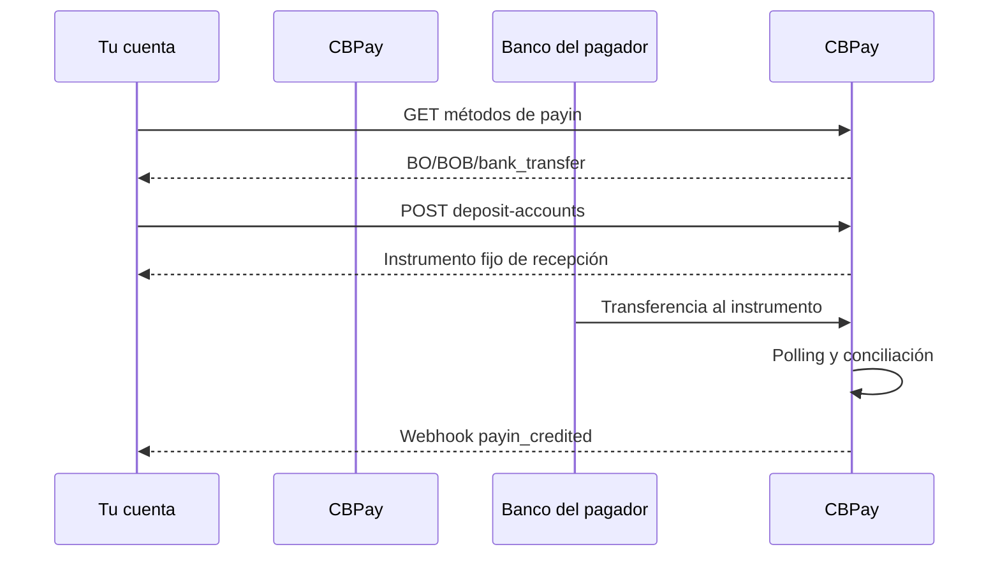

> **Ambientes:** Test `https://cryptobank.qbank.cl/platform` (`pk_test_...`) - Live `https://api.qbank.cl/platform` (`pk_...`).

## Qué resuelve este producto

Una cuenta virtual de depósito BOB es un destino fijo de recepción vinculado
a una cuenta CBPay. Tu pagador hace una transferencia bancaria normal en
bolivianos a ese destino; CBPay detecta el abono, reconcilia la cuenta
reportada y acredita tu cuenta mediante el flujo normal de payins.

La cuenta es solo de recepción. No es una wallet, no crea una sesión de pago y
el pagador no necesita incluir una referencia de anuncio.



## 1. Confirma el corredor

Usa siempre el catálogo vivo antes de activar una opción de pago:

```bash
curl https://api.qbank.cl/platform/v1/payins/methods \
  -H "Authorization: Bearer <token>"
```

La fila relevante es:

```json
{
  "country": "BO",
  "currency": "BOB",
  "method": "bank_transfer",
  "delivery": "polling"
}
```

El catálogo es la fuente de verdad. Tu organización puede tener el corredor
apagado aunque exista el contrato de la API.

## 2. Crea o repara el destino de recepción

Después de aprobar la verificación propia de la cuenta — KYC para una persona
o KYB para una empresa — la plataforma provisiona el instrumento BOB inicial.
El registro por sí solo nunca crea una cuenta de fondeo. Este endpoint también
sirve para reparar un instrumento faltante de una cuenta aprobada:

```bash
curl -X POST https://api.qbank.cl/platform/v1/payins/deposit-accounts \
  -H "Authorization: Bearer <token>" \
  -H "Content-Type: application/json" \
  -d '{
    "country": "BO",
    "currency": "BOB",
    "method": "bank_transfer"
  }'
```

Respuesta `201`:

```json
{
  "instrument_id": "1f4a…",
  "account_id": "9b1d…",
  "country": "BO",
  "currency": "BOB",
  "method": "bank_transfer",
  "instrument": "<receiving-account-number>",
  "details": {
    "account_number": "<receiving-account-number>",
    "alias": "CBPay Example BOB 20260919",
    "merchant_nit": "123456789",
    "bank_name": "Example Receiving Bank",
    "status": "ACTIVA"
  },
  "status": "active",
  "created_at": "2026-09-09T20:00:00Z"
}
```

Comparte `instrument` con el pagador como número de cuenta de recepción.
`instrument_id` es el identificador estable de CBPay; no reemplaces el número
de recepción por el UUID. Cuando vienen informados, `details.alias`,
`details.merchant_nit` y `details.bank_name` son campos de presentación para la
ficha de datos para transferir; los valores opcionales faltantes no se
infieren.

Las cuentas persona tienen como máximo una cuenta de depósito activa por
país/moneda/método. Las cuentas empresa pueden crear destinos inmutables
adicionales solo en corredores habilitados; hoy los corredores adicionales
son `MX/MXN/bank_transfer` y `BO/BOB/bank_transfer`. Cada destino sigue
vinculado a la misma cuenta CBPay y los abonos se concilian por el
instrumento de destino.

Después de la aprobación, el instrumento del primer corredor se provisiona
automáticamente. La solicitud anterior sirve para reparar un instrumento
faltante posterior a la aprobación. El alias que recibe el proveedor se
genera en el servidor a partir del nombre verificado de la cuenta; el cliente
no lo elige. Una empresa que crea un destino BOB adicional debe usar una clave
de idempotencia nueva por destino:

```bash
curl -X POST https://api.qbank.cl/platform/v1/payins/deposit-accounts \
  -H "Authorization: Bearer <token>" \
  -H "Idempotency-Key: company-bob-001" \
  -H "Content-Type: application/json" \
  -d '{
    "country": "BO",
    "currency": "BOB",
    "method": "bank_transfer",
    "idempotency_key": "company-bob-001"
  }'
```

Una clave nueva responde `201` con un destino nuevo. Repetir la misma clave
completada responde `200` con el instrumento original e
`idempotency_hit: true`; una repetición en vuelo puede responder
`409 idempotency_conflict`. Una respuesta ausente o ambigua queda visible
para conciliación; el sistema no reintenta silenciosamente.

## 3. Lista los instrumentos

El listado es paginado y oculta los claims de provisión que aún no tienen un
número real:

```bash
curl "https://api.qbank.cl/platform/v1/payins/deposit-accounts?page=1&page_size=50" \
  -H "Authorization: Bearer <token>"
```

```json
{
  "page": 1,
  "page_size": 50,
  "deposit_accounts": [
    {
      "instrument_id": "1f4a…",
      "account_id": "9b1d…",
      "country": "BO",
      "currency": "BOB",
      "method": "bank_transfer",
      "instrument": "<receiving-account-number>",
      "status": "active",
      "created_at": "2026-09-09T20:00:00Z"
    }
  ]
}
```

## 4. Recibe y concilia la transferencia

Este modo no usa el anuncio `POST /v1/payins`. El pagador transfiere BOB al
instrumento indicado. El rail se consulta en una ventana de fechas acotada;
los abonos completados se deduplican por la referencia bancaria, la orden ACH
o una clave determinística de respaldo.

Cuando el abono se concilie, suscríbete a `payin_credited` y usa el recurso
payin para conocer monto y estado finales:

```bash
curl "https://api.qbank.cl/platform/v1/payins?country=BO&status=credited&from=2026-09-01&to=2026-09-10&page=1&page_size=50" \
  -H "Authorization: Bearer <token>"
```

Se aplican la comisión normal y las reglas de conversión de payins. La API
pública no expone el objeto específico del proveedor bancario.

## Payouts BOB

Los payouts BOB mantienen el contrato provider-agnostic:

```bash
curl -X POST https://api.qbank.cl/platform/v1/payouts \
  -H "Authorization: Bearer <token>" \
  -H "Idempotency-Key: bo-payout-2026-001" \
  -H "Content-Type: application/json" \
  -d '{
    "country": "BO",
    "currency": "BOB",
    "method": "bank_transfer",
    "amount": "1382.00",
    "beneficiary": {
      "name": "Juan Quispe Mamani",
      "tax_id": "4567890",
      "bank_code": "1016",
      "account_number": "1234567890"
    },
    "description": "Pago a proveedor"
  }'
```

La organización define qué versión interna del rail está activa. Esa decisión
no es un campo controlado por el cliente y queda guardada en la operación para
que el polling posterior consulte el rail correcto. La respuesta y el webhook
siguen siendo provider-agnostic.

## Estados y recuperación

| Estado | Significado | Acción |
|---|---|---|
| `active` | La cuenta de recepción puede compartirse | Usa `instrument` |
| `pending` | La provisión o conciliación sigue en curso | No crees otra cuenta |
| `credited` | Una transferencia fue conciliada y acreditada | Consume `payin_credited` |
| `unassigned` | El crédito no pudo enrutarse a una sola cuenta | Resuélvelo en operaciones |

Después de un timeout, lee primero el listado. El proveedor puede haber
aceptado la primera solicitud aunque la respuesta se haya perdido.

## Errores

| HTTP | Código | Acción |
|---:|---|---|
| 400 | `payin_corridor_unsupported` | Vuelve a consultar `GET /v1/payins/methods`; el corredor no está activo |
| 401 | `unauthorized` | Renueva la credencial de la cuenta |
| 403 | `account_blocked` | Activa la cuenta con el operador de la organización |
| 422 | `deposit_account_limit_reached` | Usa el instrumento existente; hay un destino por corredor |
| 502 | `deposit_account_failed` | Lee el listado antes de reintentar; no asumas que el proveedor no creó la cuenta |
| 502 | `core_unavailable` | Reintenta la misma operación lógica cuando vuelva la disponibilidad |
| 502 | `core_invalid_response` | Mantén el claim en conciliación y escala si persiste |

## Preguntas frecuentes

#### ¿Puedo usar la misma cuenta para varias cuentas CBPay?
No. El destino está vinculado a una cuenta CBPay y a una organización.
Comparte solo el instrumento de esa cuenta.
#### ¿El pagador necesita una cuenta CBPay?
No. Usa el flujo de transferencia de su propio banco. CBPay solo necesita que
el destino esté activo y que el banco reporte el abono.
#### ¿Puedo borrar o rotar la cuenta?
No. El instrumento es inmutable para su corredor. Si el proveedor reporta un
problema, contacta a operaciones en vez de crear un reemplazo a ciegas.
#### ¿Cuándo se acredita una transferencia?
El rail se consulta por polling. El tiempo final depende de cuándo el banco
registre el movimiento; el webhook se emite después de la conciliación.
