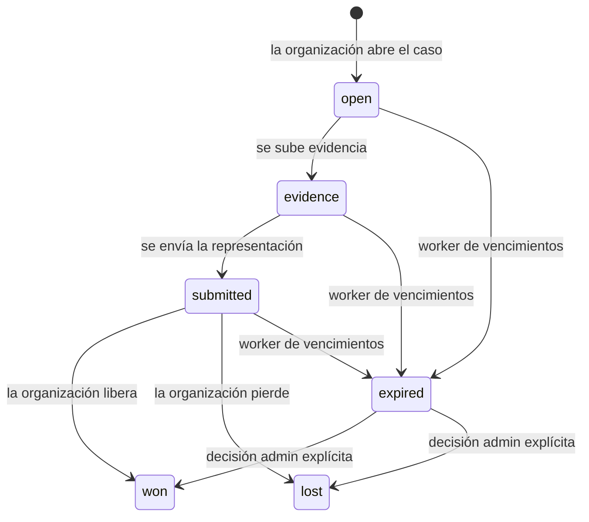

> **Ambientes:** Test `https://cryptobank.qbank.cl/platform` (`pk_test_...`) - Live `https://api.qbank.cl/platform` (`pk_...`).

CBPay expone al dueño del pago la información de casos de disputa y fraude. La
cuenta puede leer el caso, seguir su timeline inmutable, subir evidencia y
descargar el pack generado por la organización. Solo administradores de la
organización pueden abrir, enviar o resolver un caso.

> **Nota**
La API de cuenta es de solo lectura para decisiones. Una subida exitosa no
cambia el resultado: agrega una versión inmutable de evidencia.
## Ciclo de vida



Un caso vencido mantiene su retención preventiva. Vencer es una señal
operativa, no un movimiento automático de dinero.

## Lista tus casos

```bash
curl "https://api.qbank.cl/platform/v1/disputes?from=2026-09-01&to=2026-09-30&page=1&page_size=50&status=open"   -H "Authorization: Bearer $ACCOUNT_TOKEN"
```

El alcance de cuenta se aplica en el servidor. Los filtros son `status`,
`kind`, `from`, `to`, `page` y `page_size`.

```json
{
  "page": 1,
  "page_size": 50,
  "disputes": [
    {
      "dispute_id": "7c9e6679-7425-40de-944b-e07fc1f90ae7",
      "account_id": "5c4b3a29-1111-4222-8333-444455556666",
      "kind": "dispute",
      "status": "evidence",
      "currency": "USD",
      "disputed_usdt": "100.000000",
      "held_usdt": "100.000000",
      "underfunded": false,
      "case_number": "CASE-2026-00041",
      "source": "import",
      "opened_by": "admin:2c1...",
      "created_at": "2026-09-19T12:00:00Z",
      "updated_at": "2026-09-19T12:05:00Z",
      "deadline_at": "2026-10-01T00:00:00Z"
    }
  ]
}
```

## Detalle y evidencia

`GET /v1/disputes/{id}` agrega `items`, `timeline` y `evidence` al caso. El
payload crudo de los cobros nunca se incrusta en la respuesta.

```bash
curl "https://api.qbank.cl/platform/v1/disputes/7c9e6679-7425-40de-944b-e07fc1f90ae7/evidence"   -H "Authorization: Bearer $ACCOUNT_TOKEN"
```

Sube PDF, PNG o JPG (máximo 10 MB) como multipart con el campo `file`:

```bash
curl -X POST "https://api.qbank.cl/platform/v1/disputes/7c9e6679-7425-40de-944b-e07fc1f90ae7/evidence"   -H "Authorization: Bearer $ACCOUNT_TOKEN"   -F "file=@comprobante.pdf;type=application/pdf"
```

```json
{
  "evidence_id": "1f2...",
  "version": 2,
  "kind": "merchant_doc",
  "sha256": "b4e2...",
  "bytes": 482110,
  "created_at": "2026-09-19T12:10:00Z"
}
```

Descarga una versión como binario autenticado:

```bash
curl "https://api.qbank.cl/platform/v1/disputes/7c9e6679-7425-40de-944b-e07fc1f90ae7/evidence/2/download"   -H "Authorization: Bearer $ACCOUNT_TOKEN" -o evidencia-v2.pdf
```

## Webhook

Suscríbete a `dispute_status_changed` mediante el flujo normal de webhooks:

```json
{
  "event": "opened",
  "dispute_id": "7c9e6679-7425-40de-944b-e07fc1f90ae7",
  "kind": "dispute",
  "status": "open",
  "account_id": "5c4b3a29-1111-4222-8333-444455556666",
  "disputed_usdt": "100.000000",
  "held_usdt": "100.000000",
  "case_number": "CASE-2026-00041",
  "deadline_at": "2026-10-01T00:00:00Z"
}
```

Deduplica por el ID del evento del webhook. El evento informa una transición;
no aprueba ni rechaza un caso.

## Errores

| HTTP | Código | Qué hacer |
|---:|---|---|
| 400 | `invalid_range` | Envía `from` y `to` como `YYYY-MM-DD`. |
| 400 | `invalid_payload` | Envía el archivo multipart y un content type permitido. |
| 404 | `not_found` | Confirma que el caso pertenece a la cuenta autenticada. |
| 409 | `invalid_state` | El caso está cerrado o no acepta evidencia. |
| 503 | `storage_unavailable` | Reintenta la subida más tarde; no abras otro caso. |

Consulta el [catálogo de errores](https://docs.cbpayapp.com/es/errores).

## FAQ

#### ¿Puedo liberar o perder un caso desde la API de cuenta?
No. Son acciones de organización, protegidas por `disputes:write` y
maker-checker.
#### ¿Un vencimiento libera la retención?
No. El worker solo cambia el caso a `expired` y registra el evento.
#### ¿Puedo subir evidencia después de enviar el caso?
Sí. `open`, `evidence` y `submitted` aceptan evidencia de cuenta. Los casos
won, lost y expired quedan cerrados.
