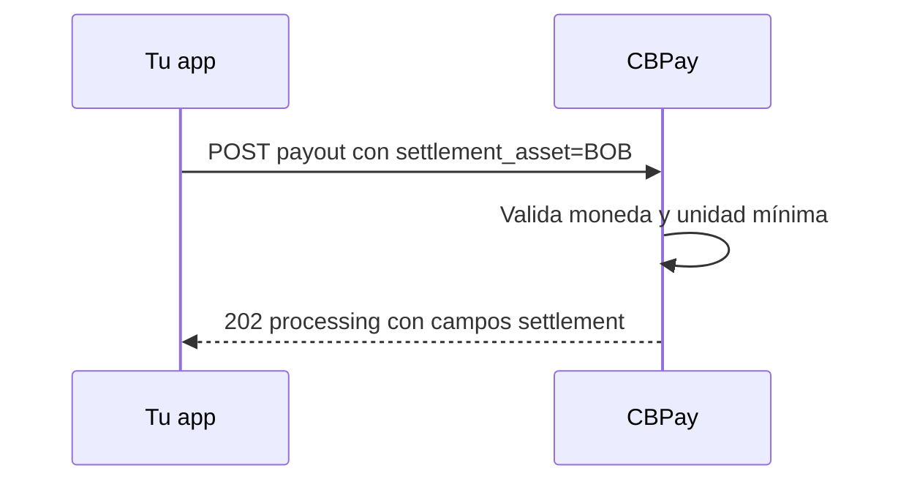

> **Ambientes:** Test `https://cryptobank.qbank.cl/platform` (`pk_test_...`) - Live `https://api.qbank.cl/platform` (`pk_...`).

> **Nota**
Esta página cubre settlement en la misma moneda para BOB, MXN y ARS. No
convierte un saldo fiat en otra moneda fiat.
Un payout puede debitar un saldo fiat local cuando la moneda del payout y
`settlement_asset` son iguales. La tasa de settlement es `"1"` y los spreads
de settlement son cero. Las comisiones configuradas en USDT se convierten con
la cotización bloqueada y se redondean hacia arriba a la unidad mínima de la
moneda del payout.



```bash
curl -X POST https://api.qbank.cl/platform/v1/payouts \
  -H "Authorization: Bearer <token>" \
  -H "Content-Type: application/json" \
  -H "Idempotency-Key: payout-bob-001" \
  -d '{
    "country": "BO",
    "currency": "BOB",
    "method": "bank_transfer",
    "local_amount": "100.00",
    "settlement_asset": "BOB",
    "beneficiary": {
      "name": "Ana Pérez",
      "country_code": "BO",
      "bank_code": "0016",
      "account_number": "1234567890",
      "account_type": "checking"
    },
    "idempotency_key": "payout-bob-001"
  }'
```

```json
{
  "payout_id": "7b2e…",
  "country": "BO",
  "currency": "BOB",
  "local_amount": "100.00",
  "settlement_asset": "BOB",
  "settlement_amount": "100.01",
  "settlement_rate": "1",
  "settlement_spread": "0",
  "platform_settlement_spread": "0",
  "status": "processing",
  "funds_debited": true
}
```

El beneficiario recibe `100.00 BOB`; los `0.01 BOB` adicionales son la
comisión configurada, convertida y redondeada hacia arriba en moneda local.
Si el payout falla, el `settlement_amount` retenido se reembolsa sin cambios.

`GET /v1/rates` marca los assets fiat locales con `same_currency_only: true`:

```json
{
  "settlement": {
    "default_asset": "USDT",
    "assets": [
      {
        "asset": "BOB",
        "available": true,
        "settlement_rate": "1",
        "same_currency_only": true
      }
    ]
  }
}
```

El settlement cross-fiat se rechaza. Por ejemplo, un payout MXN no puede
debitar un saldo BOB:

```json
{
  "error": "pricing_unavailable",
  "message": "fiat settlement is only available in the payout currency"
}
```

Para BOB, MXN y ARS, los montos con más de dos decimales responden
`400 invalid_amount`; por ejemplo, `"100.001"`. Usa la unidad mínima de la
moneda del payout: CBPay no redondea silenciosamente el monto local.

Consulta [Errores](https://docs.cbpayapp.com/es/errores) para el contrato público de errores.

#### ¿Puedo debitar BOB para un payout MXN?
No. En esta versión el settlement cross-fiat no es una conversión FX.
Elige la moneda del payout u otro asset de settlement soportado.
#### ¿Se aplican spreads al fiat de la misma moneda?
No. Usa tasa identidad y spreads de settlement cero. Las comisiones configuradas
siguen cobrándose y se convierten a fiat.
