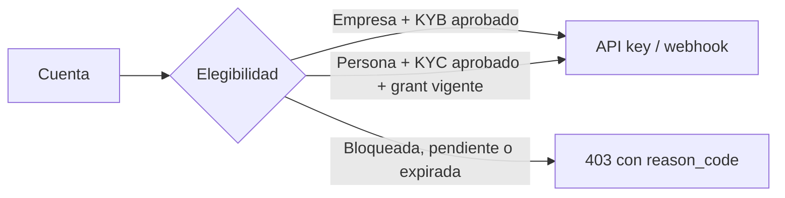

Las integraciones de nivel cuenta tienen un gate explícito. Una empresa puede
usar API keys y webhooks de cuenta cuando su KYB está aprobado. Una persona
solo puede usarlos cuando un administrador de la organización le otorga un
grant vigente; además debe tener el KYC aprobado.

> **Nota**
Construye primero con `https://cryptobank.qbank.cl/platform` y credenciales
`pk_test_...`. Cambia a `https://api.qbank.cl/platform` y credenciales live
solo después de verificar el flujo.


## Consulta la elegibilidad

Consulta el estado antes de crear credenciales. La respuesta expone las
fechas del grant, pero no la razón interna escrita por el administrador.

```bash
curl https://api.qbank.cl/platform/v1/integration-status \
  -H "Authorization: Bearer <account-token>"
```

Respuesta de una empresa elegible:

```json
{ "eligible": true }
```

Respuesta de una persona elegible con grant:

```json
{
  "eligible": true,
  "grant": {
    "granted_at": "2026-09-18T14:00:00Z",
    "expires_at": "2026-12-31T23:59:59Z"
  }
}
```

Sin grant vigente:

```json
{ "eligible": false, "reason_code": "integration_company_only" }
```

`integration_kyb_required` indica que la verificación propia aún no está
aprobada. `account_blocked` indica que el estado no es `active`.

## Blocklist de dominios durante el alta

Los dominios activos de la blocklist se rechazan en:

- `POST /v1/auth/register` para registro con password;
- `POST /v1/auth/oauth` cuando se crearía una cuenta nueva con el email
  verificado por el proveedor; y
- `POST /v1/me/email/change` antes de guardar el email pendiente.

El dominio se normaliza a minúsculas, se elimina el punto final y se
convierte IDN a ASCII. El match es exacto por dominio:

```json
{
  "error": "email_domain_blocked",
  "message": "this email domain is not allowed for registration"
}
```

Un login OAuth ya vinculado continúa funcionando; el bloqueo aplica al camino
de creación de una cuenta nueva.

## Emite una API key de cuenta

El endpoint exige una sesión JWT humana. Una API key no puede emitir otra.
Según la política de la organización, también debes enviar
`X-OTP-Token` después de completar el desafío `api_key_create`.

```bash
curl -X POST https://api.qbank.cl/platform/v1/api-keys \
  -H "Authorization: Bearer <human-session-token>" \
  -H "X-OTP-Token: <otp-token>" \
  -H "Content-Type: application/json" \
  -d '{ "label": "production-backend" }'
```

```json
{
  "api_key_id": "7f6e5d4c-3b2a-1908-a7b6-c5d4e3f2a1b0",
  "key_id": "a1b2c3d4e5f60718",
  "token": "pk_a1b2c3d4e5f60718.k9J2mX4pQ7wR5tY8uZ0aB3cD6eF1gH2i",
  "label": "production-backend",
  "note": "store this token now; it cannot be retrieved again"
}
```

El token se muestra una sola vez. Guárdalo en un gestor de secretos, nunca en
el navegador ni en el código fuente.

## Crea y administra un webhook de cuenta

Crear un webhook usa el mismo gate y exige el OTP `webhook_manage`:

```bash
curl -X POST https://api.qbank.cl/platform/v1/webhooks/subscriptions \
  -H "Authorization: Bearer <human-session-token>" \
  -H "X-OTP-Token: <otp-token>" \
  -H "Content-Type: application/json" \
  -d '{
    "event_type": "payout_status_changed",
    "callback_url": "https://api.example.com/webhooks/cbpay",
    "secret": "a-secret-of-at-least-16-chars"
  }'
```

```json
{
  "id": "5f3a1b2c-4d5e-6f70-8192-a3b4c5d6e7f8",
  "event_type": "payout_status_changed",
  "callback_url": "https://api.example.com/webhooks/cbpay",
  "status": "active",
  "created_at": "2026-09-18T14:05:00Z",
  "secret_stored": true
}
```

Lista con `GET /v1/webhooks/subscriptions`. El secreto nunca se devuelve.
Para deshabilitar o reactivar:

```bash
curl -X PATCH https://api.qbank.cl/platform/v1/webhooks/subscriptions/{subscriptionID} \
  -H "Authorization: Bearer <human-session-token>" \
  -H "X-OTP-Token: <otp-token>" \
  -H "Content-Type: application/json" \
  -d '{ "status": "active" }'
```

Deshabilitar siempre está permitido para la cuenta dueña. Reactivar exige
elegibilidad vigente y el OTP `webhook_manage`. La operación es idempotente y
solo afecta eventos futuros; las entregas ya encoladas siguen su curso.

Las suscripciones org-wide y las operaciones administrativas de grants y
reconciliación están en las guías privadas de admin y Qbank.

## Errores

| HTTP | `error` | Qué hacer |
|---:|---|---|
| 400 | `email_domain_blocked` | Usa un dominio permitido o solicita revisar la blocklist. |
| 400 | `invalid_secret` | Usa un secreto de webhook de 16 a 256 caracteres. |
| 403 | `session_required` | Usa una sesión JWT humana; una API key no crea credenciales. |
| 403 | `integration_company_only` | Completa el grant de persona o usa una empresa con KYB aprobado. |
| 403 | `integration_kyb_required` | Completa y aprueba KYC/KYB. |
| 403 | `account_blocked` | Solicita que el administrador devuelva la cuenta a `active`. |
| 403 | `otp_required` | Verifica el desafío OTP correspondiente y repite la solicitud. |

Consulta el [catálogo de errores](https://docs.cbpayapp.com/es/errores) y [seguridad y 2FA](https://docs.cbpayapp.com/es/seguridad-2fa).

#### ¿Una persona puede usar una API key?
Sí, después de que un administrador emita un grant vigente para esa persona.
También requiere KYC aprobado y cuenta activa.
#### ¿Una empresa necesita grant?
No. Una empresa es elegible con KYB aprobado (`kyc_status: approved`).
#### ¿Qué pasa si se rechaza el KYB o se bloquea la cuenta?
Las API keys de cuenta se revocan y los webhooks de cuenta se deshabilitan
automáticamente. El administrador puede ejecutar la reconciliación para
comprobar el estado.
#### ¿Puedo recuperar el token después?
No. Se muestra una sola vez. Emite un reemplazo y revoca la credencial anterior.
