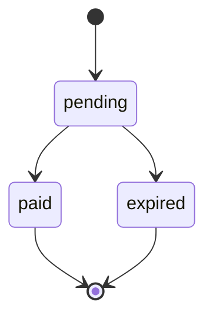

> **Ambientes:** Test `https://cryptobank.qbank.cl/platform` (`pk_test_...`) - Live `https://api.qbank.cl/platform` (`pk_...`).

Los payins QR permiten crear un cobro que el cliente completa con su app
bancaria. Usa una clave de idempotencia cuando el cliente pueda reintentar
después de un timeout o una respuesta de red ambigua.



## Crear un payin QR

Envía `method: "qr"` a `POST /v1/payins`. La clave es opcional y puede viajar
en el body JSON o en el header `Idempotency-Key`.

```bash
curl -X POST https://api.qbank.cl/platform/v1/payins \
  -H "Authorization: Bearer <token>" \
  -H "Content-Type: application/json" \
  -d '{
    "country": "BO",
    "currency": "BOB",
    "method": "qr",
    "amount": "700.00",
    "description": "Recarga app",
    "idempotency_key": "qr-bo-700-20261002-001",
    "expires_in": 3600
  }'
```

Respuesta `201`:

```json
{
  "payin_id": "9c2a1b2c-3d4e-5f60-7a8b-9c0d1e2f3a4b",
  "status": "pending",
  "charge": {
    "charge_id": "c9d8e7f6-a5b4-c3d2-e1f0-a9b8c7d6e5f4",
    "our_reference": "QR-778812",
    "qr_payload": "<contenido del QR>",
    "status": "pending"
  }
}
```

Muestra el contenido QR o el `qr_image_url` que devuelve la API. Cuando el
cliente paga, la cuenta se acredita automáticamente. Consulta el estado actual
con `GET /v1/payins/{payinID}`.

## Reintentos idempotentes

`idempotency_key` es opcional para payins QR. Envíala en el body JSON o en el
header `Idempotency-Key`. Si envías ambas, se usa el valor del body. La
plataforma aplica internamente un namespace por cuenta; el integrador manda la
clave tal cual.

La identidad de la solicitud incluye país, moneda, método y monto numérico.
El canal QR no forma parte de la identidad del replay: la misma clave reproduce el mismo cobro independientemente del canal.
Por ejemplo, `"100"` y `"100.00"` son equivalentes. `description` es texto de
presentación y no forma parte de la identidad del replay.

La primera solicitud crea un solo cobro. Un reintento con la misma clave y un
payload equivalente devuelve el objeto original con `idempotency_hit: true`;
no crea otro cobro:

```json
{
  "payin_id": "9c2a1b2c-3d4e-5f60-7a8b-9c0d1e2f3a4b",
  "status": "pending",
  "charge": {
    "charge_id": "c9d8e7f6-a5b4-c3d2-e1f0-a9b8c7d6e5f4",
    "status": "pending"
  },
  "idempotency_hit": true
}
```

La forma con header es equivalente:

```bash
curl -X POST https://api.qbank.cl/platform/v1/payins \
  -H "Authorization: Bearer <token>" \
  -H "Idempotency-Key: qr-bo-700-20261002-001" \
  -H "Content-Type: application/json" \
  -d '{"country":"BO","currency":"BOB","method":"qr","amount":"700.00","description":"Recarga app"}'
```

Si reutilizas la misma clave con otro país, moneda, método o monto, la API
responde `409 idempotency_conflict`:

```json
{
  "error": "idempotency_conflict",
  "message": "this idempotency key was used with a different payload"
}
```

Un cobro expirado o pagado se reproduce tal cual. La respuesta conserva el
objeto original; usa `GET /v1/payins/{payinID}` para consultar su estado vivo.

El core y la plataforma responden `400 invalid_idempotency_key` cuando la clave
del integrador supera 256 caracteres o contiene retornos de carro/saltos de
línea. La plataforma también rechaza con el mismo código si su namespace de
cuenta del lado servidor hace que la clave resultante supere 256 caracteres.
Ese namespace es invisible para el integrador: envía la clave sin modificar.

## Errores

| HTTP | Código | Qué hacer |
| --- | --- | --- |
| 400 | `invalid_idempotency_key` | Reduce la clave a 256 caracteres o menos y elimina caracteres de control. |
| 409 | `idempotency_conflict` | Repite el payload original o genera una clave nueva para un cobro nuevo. |

## Preguntas frecuentes

#### ¿Puedo cambiar la descripción al reintentar?
Sí. La descripción es texto de presentación y no forma parte de la identidad
del replay.
#### ¿Qué hago si el cliente pagó mientras mi solicitud expiró?
Reintenta con la misma clave y consulta el `payin_id` devuelto con
`GET /v1/payins/{payinID}`. No crees una clave nueva para la misma operación.
