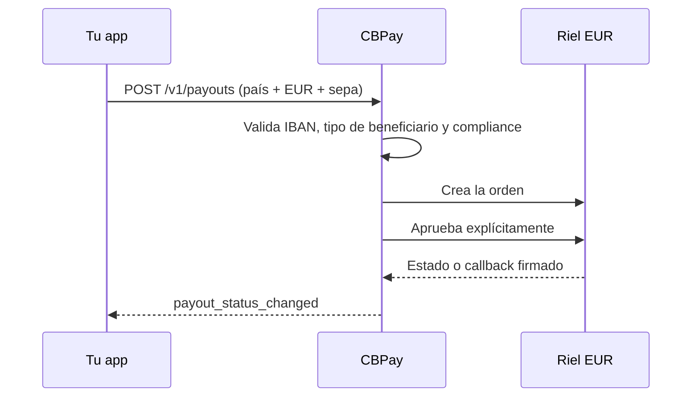

> **Ambientes:** Test `https://cryptobank.qbank.cl/platform` (`pk_test_...`) - Live `https://api.qbank.cl/platform` (`pk_...`).

Usa esta guía cuando el beneficiario reciba EUR mediante el método de payout
`sepa`. El catálogo es provider-agnostic: expone país, `EUR` y `sepa`, mientras
la cuenta usa el pricing e idempotencia normal de payouts.



## Corredor de enrutamiento

V1 registra un único corredor: `country=EU`, `currency=EUR` y `method=sepa`.
`EU` es el código de catálogo para Europa, no el país real del beneficiario.
El país real sale de las dos primeras letras del IBAN normalizado; el IBAN
debe pertenecer al conjunto admitido por SEPA Instant.

`GB` queda fuera de SEPA Instant V1: un IBAN británico falla rápido con HTTP
400 antes del despacho porque `sepaInstReachable=false`. SEPA Credit Transfer
para GB es un alcance futuro separado. `GET /v1/payouts/methods` devuelve la
única fila `EU`/`EUR`/`sepa` cuando el corredor está habilitado.

## Contrato del beneficiario

El objeto `beneficiary` debe incluir:

| Campo | Regla |
|---|---|
| `beneficiary_type` | Valor cerrado obligatorio: `individual` o `corporate`. |
| `iban` | Obligatorio; se normalizan espacios, se valida ISO 13616 mod-97 y el país debe pertenecer a SEPA. |
| `bic` | BIC ISO 9362 opcional, de 8 u 11 caracteres. |
| `given_name` + `first_surname` | Nombre estructurado obligatorio para personas; ambos deben estar presentes. |
| `name` | Obligatorio para empresa. Para persona, un valor de varias palabras puede separarse en nombre y apellido; un monónimo se rechaza. |

Usa una sola clave de idempotencia para toda la operación. `description` es
opcional en la API, pero si se envía se normaliza para el wire SEPA: se pliegan
los diacríticos, se aplica el mapa europeo explícito de abajo, el resultado
debe caber en el charset corporativo del proveedor y queda limitado a **140
puntos de código Unicode**. Si todavía contiene un carácter fuera de ese
charset, la creación falla con `400 invalid_payload`. Si se omite, el adapter
genera una descripción SEPA interna válida.

Los nombres usan el mismo pliegue determinista antes de validar el charset:

| Entrada | Pliegue en el wire |
|---|---|
| tildes, diéresis y `ñ` | Letra latina base (`é` → `e`, `ñ` → `n`) |
| `ß`, `æ`, `œ`, `ø`, `å`, `ł`, `đ`, `þ`, `ð` | `ss`, `ae`, `oe`, `o`, `a`, `l`, `d`, `th`, `d` |
| Maltés `ħ`, `ċ`, `ġ`, `ż` | `h`, `c`, `g`, `z` |
| cualquier carácter restante fuera del charset | `400 invalid_payload` |

Una persona debe resolver a nombre y apellido. Los monónimos no se pueden
pagar como `individual` en V1; envía `given_name` y `first_surname`, o un
`name` de varias palabras.

## Crear un payout

```bash
curl -X POST https://api.qbank.cl/platform/v1/payouts \
  -H "Authorization: Bearer <token>" \
  -H "Content-Type: application/json" \
  -d '{
    "country": "EU",
    "currency": "EUR",
    "method": "sepa",
    "amount": "100.00",
    "beneficiary": {
      "beneficiary_type": "individual",
      "given_name": "Elena",
      "first_surname": "Fuentes",
      "iban": "DE89370400440532013000",
      "bic": "COBADEFFXXX"
    },
    "description": "Factura 2026-0916",
    "idempotency_key": "sepa-eu-20260917-001"
  }'
```

La respuesta es el recurso de payout habitual:

```json
{
  "payout_id": "7d5c2f0a-1e9b-4a6d-8f3c-0b2a1d9e8c7f",
  "country": "EU",
  "currency": "EUR",
  "method": "sepa",
  "local_amount": "100.00",
  "status": "processing",
  "status_code": "approved",
  "funds_debited": true,
  "bank_reference": ""
}
```

El create y el approve explícito del proveedor son pasos internos. No crees
un payout de reemplazo mientras este esté `processing`; ante un retry del
cliente usa la misma clave de idempotencia.

## Estados y returns

| Señal del proveedor | Resultado público | Efecto financiero |
|---|---|---|
| `created`, `pending` o desconocido | `processing` | Sigue abierto para reconciliación; no se reenvía automáticamente. |
| `settled` | `completed` | Se consume el hold. |
| `declined` o `canceled` | `failed` | Se aplica el reembolso existente de payout fallido. |
| Notificación de return | `failed`, `status_code: reversed` | El payout ya completado se revierte por el camino de refund existente. |

Suscríbete a `payout_status_changed`. SEPA no agrega un webhook nuevo: el
callback se verifica y entra al mismo pipeline de estados.

## Errores

| HTTP | Código o resultado | Solución |
|---:|---|---|
| 400 | `invalid_payload` | Corrige EUR, IBAN/nombres o las reglas de charset SEPA de la descripción y del beneficiario. |
| 400 | `payout_corridor_unsupported` | Confirma que la única fila `EU`/EUR/`sepa` esté en el catálogo y que el país del IBAN sea compatible. Un IBAN GB se rechaza con 400 antes del despacho. |
| 422 | payout `failed` / `core_rejected` | Corrige el beneficiario y crea una operación nueva con una clave nueva. |
| 503 | `payout_provider_failed` o `channel_unavailable` | Lee el payout existente; si es ambiguo, reintenta solo con la misma clave. |

#### ¿El BIC es obligatorio?
  No. El IBAN es obligatorio; el BIC es opcional.
#### ¿Puedo enviar USD por este método?
  No. `sepa` es exclusivamente EUR y se rechaza antes del despacho.
#### ¿Un return crea un webhook nuevo?
  No. `payout_status_changed` lleva `status_code: reversed` y el resultado
  normal del reembolso.
