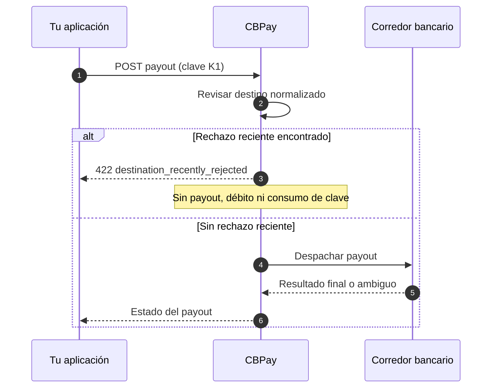

> **Ambientes:** Test `https://cryptobank.qbank.cl/platform` (`pk_test_...`) - Live `https://api.qbank.cl/platform` (`pk_...`).

Consulta el [catálogo público de errores](https://docs.cbpayapp.com/es/errors) para ver el contrato completo.

## Qué protege este flujo

Algunos corredores bancarios protegen un destino después de un rechazo reciente
del banco. Cuando el mismo destino normalizado fue rechazado recientemente,
CBPay detiene el siguiente create antes de crear el payout, debitar el saldo o
consumir la clave de idempotencia.

La protección se acota a la cuenta y a la combinación normalizada de
`bank_code`, `account_number` y `tax_id`. Cambiar mayúsculas o formato no la
evade.



## Secuencia segura

1. Si la primera respuesta es ambigua, repite la solicitud exacta con la misma
   `idempotency_key`. Devuelve el recurso original con
   `idempotency_hit: true`; nunca crea un segundo payout.
2. Si la respuesta es `destination_recently_rejected`, la clave original no se
   consumió. Revisa el rechazo bancario y decide si corresponde reintentar el
   destino.
3. Un reintento deliberado usa una clave de idempotencia **nueva** y
   `options.destination_retry_ack` con el ID del payout rechazado más reciente.
4. Reutilizar la clave anterior con opciones cambiadas devuelve
   `409 idempotency_conflict`; nunca modifica la operación original.
5. Un destino sin rechazo reciente, o un payout de otro corredor, sigue su
   validación y despacho normal.

El acuse es una decisión explícita del operador, no un segundo intento
automático.

## Request de reintento deliberado

```json
{
  "country": "CL",
  "currency": "CLP",
  "method": "bank_transfer",
  "amount": "1000.00",
  "beneficiary": {
    "name": "Example Recipient",
    "bank_code": "012",
    "account_number": "123456789",
    "tax_id": "11111111-1"
  },
  "options": {
    "destination_retry_ack": "<prior_case_id>"
  },
  "idempotency_key": "payout-retry-0001"
}
```

El acuse debe identificar el caso rechazado más reciente de la misma cuenta y
del mismo destino normalizado. No copies un ID de caso de otra cuenta o
destino.

Para el catálogo completo de errores, consulta [Errores](https://docs.cbpayapp.com/es/errors).

## Ejemplos de respuesta

### Rechazo reciente

```json
{
  "error": "destination_recently_rejected",
  "message": "destination was rejected by the bank on 2026-01-15 (prior case <prior_case_id>, code <prior_code>); retry with a new idempotency_key and options.destination_retry_ack=<prior_case_id> to confirm"
}
```

El mensaje incluye la fecha UTC del rechazo, el ID del caso anterior y su
código. La respuesta pública no expone el proveedor.

### Opciones cambiadas con la clave anterior

```json
{
  "error": "idempotency_conflict",
  "message": "the idempotency key was already used with a different request"
}
```

## Estados y acciones

| Respuesta o estado | Significado | Acción |
| --- | --- | --- |
| `422 destination_recently_rejected` | Existe un rechazo reciente para el mismo destino normalizado. No se creó payout y la clave sigue disponible. | Revisa el rechazo; repite sin cambios o reintenta deliberadamente con clave nueva y acuse. |
| `409 idempotency_conflict` | La clave se reutilizó con otra solicitud u opciones. | Conserva la operación original; usa una clave nueva solo para una operación realmente nueva. |
| `processing` | El resultado todavía no es final. | Lee el payout y espera el webhook/estado final; no crees otro payout. |
| `completed` | El payout llegó a un estado final exitoso. | No requiere reintento. |
| `failed` | El payout falló y el débito siguió el camino normal de fallo. | Lee el detalle y corrige la solicitud antes de iniciar otra operación. |

## Preguntas frecuentes

#### ¿El 422 crea un payout?
No. La guardia corre antes de insertar el payout y antes del débito. Tampoco
consume la clave de idempotencia enviada.
#### ¿Puedo reintentar con la misma clave después del 422?
Sí, si estás repitiendo exactamente la solicitud original. Un reintento
deliberado después de revisar el rechazo debe usar clave nueva y el acuse.
#### ¿Por qué cambiar solo las opciones devuelve 409?
Las opciones forman parte del payload de idempotencia. Reutilizar una clave con
opciones distintas es otra solicitud, por eso CBPay la rechaza en vez de
modificar silenciosamente la operación original.
#### ¿Aplica a todos los corredores de payouts?
No. La protección se aplica solo donde el corredor la habilita. Los demás
rieles y destinos sin rechazo reciente siguen su validación y despacho normal.
