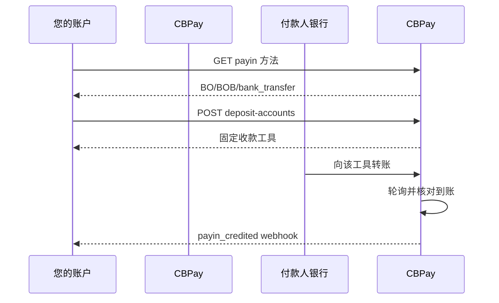

> **环境：** 测试 `https://cryptobank.qbank.cl/platform` (`pk_test_...`) - 正式 `https://api.qbank.cl/platform` (`pk_...`).

## 产品说明

BOB 虚拟收款账户是绑定到一个 CBPay 账户的固定收款目的地。付款人向
该目的地发起普通的玻利维亚诺银行转账；CBPay 检测到账、核对银行报告的
账户，并通过标准 payin 流程入账。

该账户仅用于收款。它不是钱包，不会创建支付会话，付款人也不需要填写
公告转账参考号。



## 1. 确认走廊

在应用中启用付款选项前，始终读取实时目录：

```bash
curl https://api.qbank.cl/platform/v1/payins/methods \
  -H "Authorization: Bearer <token>"
```

相关记录为：

```json
{
  "country": "BO",
  "currency": "BOB",
  "method": "bank_transfer",
  "delivery": "polling"
}
```

目录是唯一事实来源。即使 API 合同存在，组织也可能尚未启用该走廊。

## 2. 创建或修复收款账户

账户通常会在创建时自动获得 BOB 收款工具。已有账户缺少工具时，也可以
调用以下接口修复：

```bash
curl -X POST https://api.qbank.cl/platform/v1/payins/deposit-accounts \
  -H "Authorization: Bearer <token>" \
  -H "Content-Type: application/json" \
  -d '{
    "country": "BO",
    "currency": "BOB",
    "method": "bank_transfer",
    "alias": "Operations BOB"
  }'
```

响应 `201`：

```json
{
  "instrument_id": "1f4a…",
  "account_id": "9b1d…",
  "country": "BO",
  "currency": "BOB",
  "method": "bank_transfer",
  "instrument": "7014227171",
  "details": {
    "account_number": "7014227171",
    "status": "ACTIVA"
  },
  "status": "active",
  "created_at": "2026-09-09T20:00:00Z"
}
```

将 `instrument` 作为收款账号提供给付款人。`instrument_id` 是 CBPay
的稳定标识；不要用 UUID 替换收款账号。

每个账户/国家/币种/方法只有一个活动收款账户。再次创建不会生成第二个
目的地。供应商返回缺失或含糊时，系统会保留可核对状态，不会静默重试。

## 3. 列出收款工具

列表已分页，并隐藏尚未得到真实收款号码的 provisioning claim：

```bash
curl "https://api.qbank.cl/platform/v1/payins/deposit-accounts?page=1&page_size=50" \
  -H "Authorization: Bearer <token>"
```

```json
{
  "page": 1,
  "page_size": 50,
  "deposit_accounts": [
    {
      "instrument_id": "1f4a…",
      "account_id": "9b1d…",
      "country": "BO",
      "currency": "BOB",
      "method": "bank_transfer",
      "instrument": "7014227171",
      "status": "active",
      "created_at": "2026-09-09T20:00:00Z"
    }
  ]
}
```

## 4. 接收并核对转账

此模式不使用 `POST /v1/payins` 公告。付款人向 `instrument` 转入
BOB。系统在有限日期窗口内轮询银行；已完成的到账会按银行参考号、ACH
订单号或确定性备用键去重。

到账匹配后，订阅 `payin_credited`，并使用 payin 资源读取最终金额和状态：

```bash
curl "https://api.qbank.cl/platform/v1/payins?country=BO&status=credited&from=2026-09-01&to=2026-09-10&page=1&page_size=50" \
  -H "Authorization: Bearer <token>"
```

适用标准 payin 费用和汇率规则。公开 API 不暴露银行供应商专属对象。

## BOB payout

BOB payout 继续使用与供应商无关的合同：

```bash
curl -X POST https://api.qbank.cl/platform/v1/payouts \
  -H "Authorization: Bearer <token>" \
  -H "Idempotency-Key: bo-payout-2026-001" \
  -H "Content-Type: application/json" \
  -d '{
    "country": "BO",
    "currency": "BOB",
    "method": "bank_transfer",
    "amount": "1382.00",
    "beneficiary": {
      "name": "Juan Quispe Mamani",
      "tax_id": "4567890",
      "bank_code": "1016",
      "account_number": "1234567890"
    },
    "description": "Supplier payment"
  }'
```

组织配置决定内部使用的 rail 版本。该选择不是客户可控制的字段，并会保存在
操作中，使后续轮询继续使用正确的版本。响应和 webhook 保持 provider-agnostic。

## 状态与恢复

| 状态 | 含义 | 操作 |
|---|---|---|
| `active` | 收款账户可以提供给付款人 | 使用 `instrument` |
| `pending` | provisioning 或核对仍在进行 | 不要创建第二个账户 |
| `credited` | 转账已核对并入账 | 处理 `payin_credited` |
| `unassigned` | 到账无法路由到唯一账户 | 在运营页面中处理 |

超时后先读取列表。即使响应丢失，供应商也可能已经接受第一次请求。

## 错误

| HTTP | Code | 操作 |
|---:|---|---|
| 400 | `payin_corridor_unsupported` | 重新读取 `GET /v1/payins/methods`；走廊未启用 |
| 401 | `unauthorized` | 更新账户凭证 |
| 403 | `account_blocked` | 由组织运营方激活账户 |
| 422 | `deposit_account_limit_reached` | 使用现有工具；每个走廊只有一个目的地 |
| 502 | `deposit_account_failed` | 重试前先读取列表；不要假定供应商没有创建 |
| 502 | `core_unavailable` | 服务恢复后重试相同的逻辑操作 |
| 502 | `core_invalid_response` | 保留 claim 进行核对，持续失败时联系运营 |

## 常见问题

#### 同一账户可以供多个 CBPay 账户使用吗？
不可以。目的地绑定到一个 CBPay 账户和一个组织。只向该账户的付款人提供
对应工具。
#### 付款人需要 CBPay 账户吗？
不需要。付款人使用自己的银行转账流程。CBPay 只需要收款工具处于活动状态，
并且银行报告到账。
#### 可以删除或轮换账户吗？
不可以。该走廊的工具不可变更。若银行报告异常，请联系运营方，不要盲目创建替代账户。
#### 转账什么时候入账？
该走廊使用轮询。最终时间取决于银行何时登记该笔流水；核对完成后才会发送 webhook。
