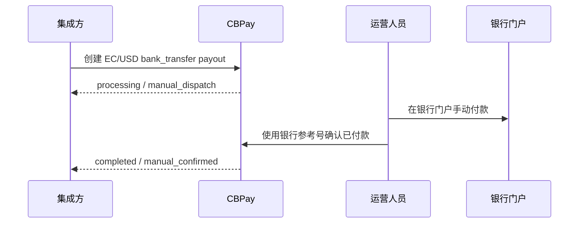

> **环境：** 测试 `https://cryptobank.qbank.cl/platform` (`pk_test_...`) - 正式 `https://api.qbank.cl/platform` (`pk_...`).

## 适用范围

该通道仅适用于 `country=EC`、`currency=USD` 和
`method=bank_transfer`。它使用人工调度模式：payout 保持
`processing`，并带有 `status_code=manual_dispatch`，直到授权运营人员在
银行门户完成付款并确认结果。该路由不会自动调用或对账银行。

供应商选择和凭据属于部署配置，不属于 CBPay 的公开合同。

## 环境顺序

先在 staging 中使用模拟通道和合成收款人测试此通道。只有 staging
通过后，才能在生产环境验证相同的集成。生产环境验证需要运营数据，以及
对环境和测试范围的明确授权。

## 流程



## 创建并读取 payout

使用标准 payout 接口和合成收款人：

```http
POST /v1/payouts
Authorization: Bearer <API_KEY>
Content-Type: application/json
Idempotency-Key: ec-manual-<unique-key>
```

```json
{
  "country": "EC",
  "currency": "USD",
  "method": "bank_transfer",
  "amount": "125.00",
  "beneficiary": {
    "name": "Example Recipient",
    "document_value": "0900000000",
    "bank_code": "000000",
    "account_number": "0000000000",
    "account_type": "CACC",
    "country_code": "EC",
    "sender_name": "Example Sender"
  },
  "description": "Invoice 1001",
  "idempotency_key": "ec-manual-<unique-key>"
}
```

金额必须为 USD `1.00` 至 `10000.00`（含边界），并且按数值最多两位
小数。使用十进制字符串，不使用浮点数。

```http
GET /v1/payouts/{payoutID}
Authorization: Bearer <API_KEY>
```

厄瓜多尔手动通道生成的银行参考号格式为 `ECM` 加 13 位连续数字。这是该通道
的参考号格式，并非所有银行参考号的通用限制。创建响应通常包含：

```json
{
  "payout_id": "00000000-0000-4000-8000-000000000001",
  "status": "processing",
  "status_code": "manual_dispatch",
  "idempotency_hit": false
}
```

## 确认银行付款

核心运营人员确认已人工支付的 payout：

```http
POST /v1/ops/payouts/{payoutID}/confirm-manual-paid
Authorization: Bearer <CORE_ADMIN_KEY>
Content-Type: application/json
Idempotency-Key: confirm-ec-<unique-key>
```

平台管理员使用核心代理路由：

```http
POST /v1/admin/core/payouts/{payoutID}/confirm-manual-paid
Authorization: Bearer <PLATFORM_ADMIN_KEY>
Content-Type: application/json
Idempotency-Key: confirm-ec-<unique-key>
```

组织管理员使用组织代理路由：

```http
POST /v1/org/treasury/manual-payouts/{payoutID}/confirm-manual-paid
Authorization: Bearer <ORG_ADMIN_KEY>
Content-Type: application/json
Idempotency-Key: confirm-ec-<unique-key>
```

请求体包含 `bank_reference`、`paid_amount` 和 `reason`。通过
`POST /v1/ops/payouts/{payoutID}/confirm-manual-paid` 确认时必须提供
`Idempotency-Key`（推荐使用 header，也可以在 JSON body 中发送
`idempotency_key`）。缺少 key 时，接口返回 `400
idempotency_key_required`。如果请求超时，先重新读取 payout；如果状态仍不
确定，必须使用同一个 key 和完全相同的证据重试，绝不能盲目发送或生成新
key。使用相同证据 replay 会返回原始结果并带有 `idempotency_hit: true`；
证据不同则返回 `409 idempotency_conflict`。成功响应返回带有人工确认终态
的 payout 资源。

## 人工 payin

对于已公告的 `EC/USD/push/bank_transfer` payin，拥有
`org_operations`/`ops:write` 权限的组织运营人员确认收款：

```http
POST /v1/payins/{payinID}/confirm-received
Authorization: Bearer <ORG_ADMIN_KEY>
Content-Type: application/json
```

```json
{
  "bank_reference": "ECM0000000000001",
  "received_amount": "125.00"
}
```

该确认接口不使用客户端提供的幂等键。它只确认已有 payin，不会创建第二笔。
请求超时后先读取 payin；如果仍为待处理状态，使用相同的
`bank_reference` 和 `received_amount` 重试。如果已使用相同证据完成入账，
重试会返回原始结果并 `idempotency_hit: true`；证据不同则返回
`409 invalid_state`。

## 入金指令

读取已有 payin instrument 的入金指令：

```http
GET /v1/payins/deposit-instructions
Authorization: Bearer <API_KEY>
```

响应保持 provider-clean，只返回该账户和通道适用的指令。不要从 payout
推断银行信息。

对于厄瓜多尔银行代码，使用实时目录：

```http
GET /v1/payouts/banks?country=EC
Authorization: Bearer <API_KEY>
```

响应格式为 `{ "items": [{ "code": "...", "name": "..." }], "meta": {
"retrieved": 1 } }`，其中 `retrieved` 是返回的条目数量。将返回的 `code`
用作 `beneficiary.bank_code`。

## 运营规则

- 运营人员在银行门户付款，并记录银行参考号。
- 银行操作出现不确定结果时，不要使用新 key 重新发送。
- timeout 后先读取资源；重试只能使用同一个 key。
- 以上示例均为合成数据；只能替换为经过授权的运营数据。

## 状态与错误

| 状态或代码 | 含义 | 操作 |
|---|---|---|
| `processing` + `manual_dispatch` | payout 等待运营人员完成银行操作。 | 只在银行门户付款一次，然后确认已有 payout。 |
| `completed` + `manual_confirmed` | 运营人员已确认银行付款。 | 重新读取 payout 并保留银行参考号。 |
| `invalid_payload` | 必填字段、金额、账户或确认字段无效。 | 修正请求；不要为同一操作创建替代请求。 |
| `idempotency_conflict` | 同一 key 搭配不同数据或不兼容状态被重复使用。 | 读取原资源；只有真正的新操作才使用新 key。 |
| `treasury_check_unavailable` | 无法完成 payin 的 ownership 或资金库冲突检查。 | 不要贷记 payin；依赖恢复后再使用同一 key 重试。 |
| `deposit_settled_treasury_trade` | 银行参考号属于资金库结算。 | 不要将其分配或贷记为客户 payin。 |

请参阅[完整错误目录](https://docs.cbpayapp.com/zh/errors)，了解通用响应格式和错误处理规则。

## 常见问题

#### CBPay 会自动发送厄瓜多尔银行转账吗？
    不会。运营人员完成银行操作，然后在 CBPay 中确认已有 payout。
#### `manual_dispatch` 是什么意思？
    这表示 payout 仍在处理中，等待授权运营人员完成并确认银行操作。
#### timeout 后应该怎么做？
    先读取 payout。如果结果仍不确定，只能使用相同的幂等 key 重试原请求。
    在确认银行结果前，不能使用新 key 再次提交银行转账。
