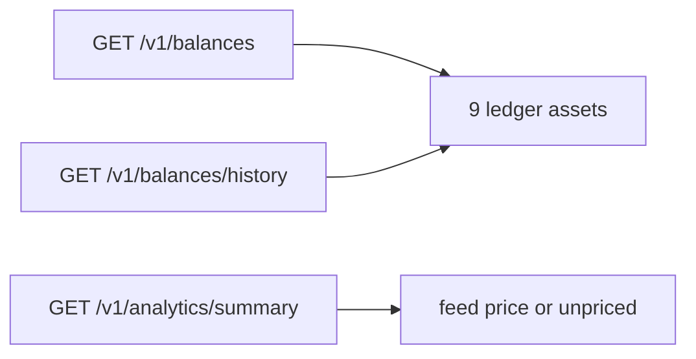

> **环境：** 测试 `https://cryptobank.qbank.cl/platform` (`pk_test_...`) - 正式 `https://api.qbank.cl/platform` (`pk_...`).

CBPay 账户现在支持三种法币账本资产：**BOB**、**MXN** 和 **ARS**。它们
是独立余额，使用两位小数（最小单位）存储，并与 USDT、USDC、BTC、GOLD、
SILVER 和 PLATINUM 一起返回。



## 法币资产出现在哪里

- `GET /v1/balances`：始终返回九种账本资产，包括余额为零的行。法币使用
  两位小数，例如 `"125.40"`。
- `GET /v1/balances/history`：为每种法币提供每日序列。序列跟踪
  `available`，当前快照包含 held。
- `GET /v1/analytics/summary`：有余额或交易时包含法币。USD 估值使用组织
  汇率源（`1 / 本地货币每 USD`）；没有有效汇率时标记为 `unpriced`，不
  会把它加入 USD 总额。

```json
{
  "account_id": "9b1deb4d-3b7d-4bad-9bdd-2b0d7b3dcb6d",
  "balances": [
    { "asset": "BOB", "available": "15000.00", "held": "0.00" },
    { "asset": "MXN", "available": "0.00", "held": "0.00" },
    { "asset": "ARS", "available": "0.00", "held": "0.00" }
  ]
}
```

## 转账

`POST /v1/transfers` 支持相同资产的内部转账。法币转账保留两位小数，
不会隐式转换为 USDT 或其他货币。

## v1 产品限制

账本登记法币并不代表所有产品都可以消费它：

| 产品 | v1 中的 BOB/MXN/ARS |
|---|---|
| 余额、history 和 analytics | 支持 |
| 相同资产的内部转账 | 支持 |
| payout settlement asset 和组织默认值 | 接受；法币执行在法币结算定价上线前返回 `503 pricing_unavailable` |
| Swaps | 返回 `400 invalid_pair` |
| Checkout | 作为 settlement asset 返回 `invalid_asset` |
| POS | 作为 settlement asset 返回 `invalid_asset` |
| Cards | 返回 `400 spending_asset_unavailable` |

这是有意的分层：余额可以先存在账本中，定价或外部结算路径可以稍后上线。

## 错误与精度

金额使用十进制字符串。`1.50` BOB 表示 150 个最小单位；`1.234` BOB、
MXN 或 ARS 会被拒绝。法币 settlement 即使格式正确，在法币 payout
settlement 路径上线前仍可能返回 `503 pricing_unavailable`。

#### 增加法币会改变默认 settlement asset 吗？
不会。现有账户保留当前默认值。只有在资产启用且产品 gate 接受时才会使用法币。
#### 可以用法币余额支付卡片消费吗？
不可以。v1 卡片拒绝法币 spending asset；余额仍可被上表中的支持产品使用。
