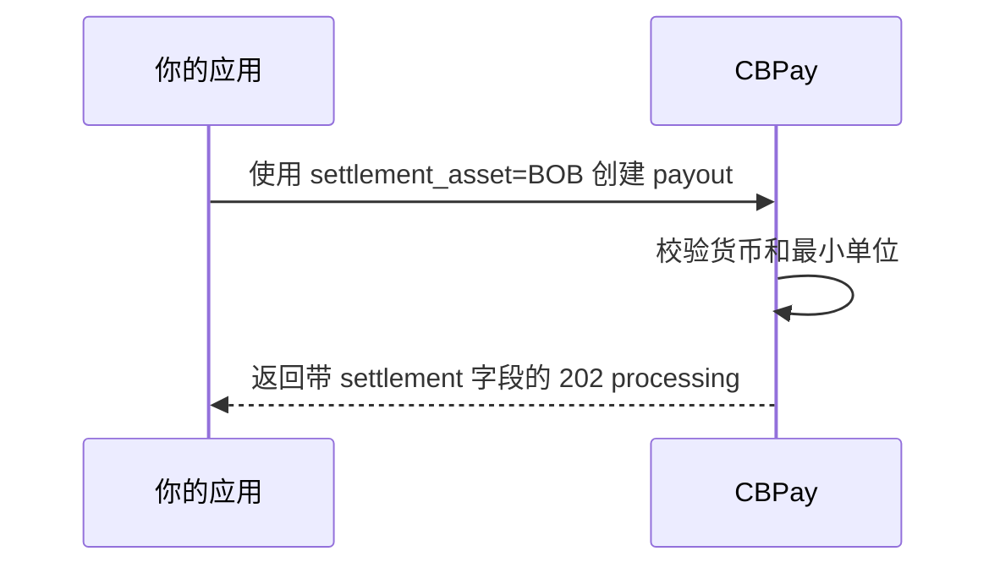

> **环境：** 测试 `https://cryptobank.qbank.cl/platform` (`pk_test_...`) - 正式 `https://api.qbank.cl/platform` (`pk_...`).

> **注**
本页介绍 BOB、MXN 和 ARS 的同币种结算。不支持将一种法币余额转换为另一种
法币。
当 payout 货币与 `settlement_asset` 相同时，payout 可以从本地法币余额
扣款。settlement rate 为 `"1"`，settlement spread 为零。以 USDT 配置的
费用会按锁定报价换算为 payout 货币，并向上取整到该货币的最小单位。



```bash
curl -X POST https://api.qbank.cl/platform/v1/payouts \
  -H "Authorization: Bearer <token>" \
  -H "Content-Type: application/json" \
  -H "Idempotency-Key: payout-bob-001" \
  -d '{
    "country": "BO",
    "currency": "BOB",
    "method": "bank_transfer",
    "local_amount": "100.00",
    "settlement_asset": "BOB",
    "beneficiary": {
      "name": "Ana Pérez",
      "country_code": "BO",
      "bank_code": "0016",
      "account_number": "1234567890",
      "account_type": "checking"
    },
    "idempotency_key": "payout-bob-001"
  }'
```

```json
{
  "payout_id": "7b2e…",
  "country": "BO",
  "currency": "BOB",
  "local_amount": "100.00",
  "settlement_asset": "BOB",
  "settlement_amount": "100.01",
  "settlement_rate": "1",
  "settlement_spread": "0",
  "platform_settlement_spread": "0",
  "status": "processing",
  "funds_debited": true
}
```

收款人收到 `100.00 BOB`；额外的 `0.01 BOB` 是已配置的费用，按本地
货币换算并向上取整。若 payout 失败，冻结的 `settlement_amount` 会原额
退回。

`GET /v1/rates` 会将本地法币资产标记为 `same_currency_only: true`：

```json
{
  "settlement": {
    "default_asset": "USDT",
    "assets": [
      {
        "asset": "BOB",
        "available": true,
        "settlement_rate": "1",
        "same_currency_only": true
      }
    ]
  }
}
```

系统会拒绝 cross-fiat settlement。例如，MXN payout 不能从 BOB 余额扣款：

```json
{
  "error": "pricing_unavailable",
  "message": "fiat settlement is only available in the payout currency"
}
```

对于 BOB、MXN 和 ARS，超过两位小数的金额会返回 `400 invalid_amount`；
例如 `"100.001"`。请使用 payout 货币的最小单位，CBPay 不会静默四舍五入
本地金额。

请参阅[错误](../errors)了解公开错误契约。

#### 可以从 BOB 余额支付 MXN payout 吗？
不可以。本版本的 cross-fiat settlement 不是 FX 转换路径。请选择 payout
货币或其他受支持的 settlement asset。
#### 同币种法币会收取 settlement spread 吗？
不会。同币种法币使用等额 rate 和零 settlement spread。已配置的费用仍会
收取并转换为法币。
