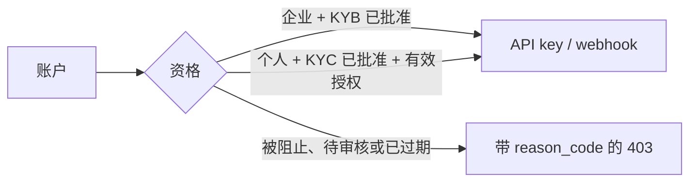

账户级集成有明确的资格门槛。企业账户在 KYB 审批通过后可以使用 API
密钥和账户 Webhook。个人账户只有在组织管理员授予有效集成授权，并且
KYC 已审批通过后才可以使用。

> **注**
开发时先使用 `https://cryptobank.qbank.cl/platform` 和 `pk_test_...` 凭证。
验证流程后再切换到 `https://api.qbank.cl/platform` 与正式凭证。


## 查询集成资格

创建凭证前先查询。响应会返回授权时间，但不会泄露管理员内部原因。

```bash
curl https://api.qbank.cl/platform/v1/integration-status \
  -H "Authorization: Bearer <account-token>"
```

企业账户：

```json
{ "eligible": true }
```

带有效授权的个人账户：

```json
{
  "eligible": true,
  "grant": {
    "granted_at": "2026-09-18T14:00:00Z",
    "expires_at": "2026-12-31T23:59:59Z"
  }
}
```

没有有效授权：

```json
{ "eligible": false, "reason_code": "integration_company_only" }
```

`integration_kyb_required` 表示账户身份验证尚未批准；`account_blocked`
表示账户状态不是 `active`。

## 注册时的邮箱域名黑名单

启用的黑名单域名会在以下流程被拒绝：

- 密码注册 `POST /v1/auth/register`；
- OAuth 新账户创建 `POST /v1/auth/oauth`（仅当供应商确认了邮箱）；以及
- 保存待定新邮箱之前的 `POST /v1/me/email/change`。

域名会被转为小写、删除末尾点并进行 IDN 转换；匹配是完整域名匹配：

```json
{
  "error": "email_domain_blocked",
  "message": "this email domain is not allowed for registration"
}
```

已经绑定的 OAuth 身份仍可正常登录；黑名单只影响新账户创建流程。

## 创建账户 API 密钥

账户级接口要求人工 JWT 会话。API key 不能创建另一把 API key。根据组织
策略，还需要完成 `api_key_create` OTP 挑战并发送 `X-OTP-Token`。

```bash
curl -X POST https://api.qbank.cl/platform/v1/api-keys \
  -H "Authorization: Bearer <human-session-token>" \
  -H "X-OTP-Token: <otp-token>" \
  -H "Content-Type: application/json" \
  -d '{ "label": "production-backend" }'
```

```json
{
  "api_key_id": "7f6e5d4c-3b2a-1908-a7b6-c5d4e3f2a1b0",
  "key_id": "a1b2c3d4e5f60718",
  "token": "pk_a1b2c3d4e5f60718.k9J2mX4pQ7wR5tY8uZ0aB3cD6eF1gH2i",
  "label": "production-backend",
  "note": "store this token now; it cannot be retrieved again"
}
```

明文 token 只返回一次。请放入密钥管理器，不要放在浏览器或源码中。

## 创建和管理账户 Webhook

创建账户 Webhook 使用同一资格门槛，并要求 `webhook_manage` OTP：

```bash
curl -X POST https://api.qbank.cl/platform/v1/webhooks/subscriptions \
  -H "Authorization: Bearer <human-session-token>" \
  -H "X-OTP-Token: <otp-token>" \
  -H "Content-Type: application/json" \
  -d '{
    "event_type": "payout_status_changed",
    "callback_url": "https://api.example.com/webhooks/cbpay",
    "secret": "a-secret-of-at-least-16-chars"
  }'
```

```json
{
  "id": "5f3a1b2c-4d5e-6f70-8192-a3b4c5d6e7f8",
  "event_type": "payout_status_changed",
  "callback_url": "https://api.example.com/webhooks/cbpay",
  "status": "active",
  "created_at": "2026-09-18T14:05:00Z",
  "secret_stored": true
}
```

使用 `GET /v1/webhooks/subscriptions` 查看订阅。密钥不会返回。使用
`PATCH /v1/webhooks/subscriptions/{subscriptionID}` 发送
`{"status":"disabled"}` 或 `{"status":"active"}`。停用始终允许；重新启用
需要当前资格和 `webhook_manage` OTP。操作幂等，并且只影响未来事件，已排队
的投递仍会继续。

组织级订阅和管理员授权/对账操作请查看私有管理员文档与 Qbank 内部指南。

## 集成错误

| HTTP | `error` | 处理方式 |
|---:|---|---|
| 400 | `email_domain_blocked` | 使用允许的邮箱域名，或请求管理员检查黑名单。 |
| 400 | `invalid_secret` | Webhook secret 必须为 16 到 256 个字符。 |
| 403 | `session_required` | 使用人工 JWT 会话；API key 不能创建凭证。 |
| 403 | `integration_company_only` | 为个人账户完成授权，或使用 KYB 已批准的企业账户。 |
| 403 | `integration_kyb_required` | 完成并批准 KYC/KYB。 |
| 403 | `account_blocked` | 请求管理员将账户恢复为 `active`。 |
| 403 | `otp_required` | 完成对应 OTP 挑战后重试。 |

参见[错误目录](https://docs.cbpayapp.com/zh/errors)和[安全与 2FA](https://docs.cbpayapp.com/zh/security-2fa)。

#### 个人账户可以使用 API key 吗？
可以，但管理员必须先为个人账户创建有效集成授权；账户还必须处于 active
并且 KYC 已批准。
#### 企业账户需要授权吗？
不需要。企业账户的 KYB 批准后即可使用。
#### KYB 被拒或账户被阻止时会发生什么？
账户级 API key 会被撤销，账户 Webhook 会被停用。管理员可以运行组织对账
接口确认最终状态。
#### 之后可以再次读取 token 吗？
不可以。明文 token 只显示一次；丢失后请创建新 key 并撤销旧 key。
