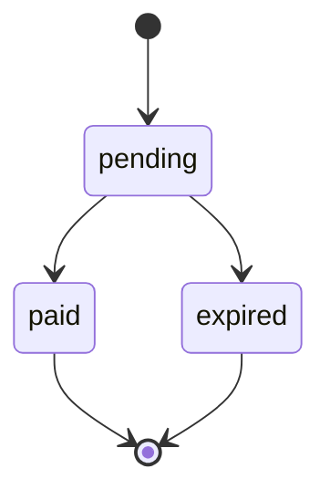

> **环境：** 测试 `https://cryptobank.qbank.cl/platform` (`pk_test_...`) - 正式 `https://api.qbank.cl/platform` (`pk_...`).

QR payin 允许客户使用其银行 App 完成付款。当客户端可能在超时或网络
响应不明确后重试时，请使用幂等键。



## 创建 QR payin

向 `POST /v1/payins` 发送 `method: "qr"`。幂等键为可选字段，可以放在
JSON body 中，也可以放在 `Idempotency-Key` 请求头中。

```bash
curl -X POST https://api.qbank.cl/platform/v1/payins \
  -H "Authorization: Bearer <token>" \
  -H "Content-Type: application/json" \
  -d '{
    "country": "BO",
    "currency": "BOB",
    "method": "qr",
    "amount": "700.00",
    "description": "App top-up",
    "idempotency_key": "qr-bo-700-20261002-001",
    "expires_in": 3600
  }'
```

响应 `201`：

```json
{
  "payin_id": "9c2a1b2c-3d4e-5f60-7a8b-9c0d1e2f3a4b",
  "status": "pending",
  "charge": {
    "charge_id": "c9d8e7f6-a5b4-c3d2-e1f0-a9b8c7d6e5f4",
    "our_reference": "QR-778812",
    "qr_payload": "<QR content>",
    "status": "pending"
  }
}
```

向客户展示 QR 内容或 API 返回的 `qr_image_url`。客户付款后，账户会自动
入账。使用 `GET /v1/payins/{payinID}` 查询当前状态。

## 幂等重试

QR payin 的 `idempotency_key` 为可选字段。可将它放在 JSON body 中，也
可以放在 `Idempotency-Key` 请求头中。如果两者同时存在，使用 body 中的
值。平台会在服务端按账户对 key 加 namespace；集成方发送的 key 不会被
修改。

请求身份包括国家、货币、方式和数值金额。例如，`"100"` 与 `"100.00"`
等价。`description` 只是展示文本，不属于 replay 身份。
QR 渠道不属于 replay 身份：相同 key 会重放同一笔 charge，与渠道无关。

第一次请求只创建一笔 charge。使用相同 key 和等价 payload 重试时，API
返回原始对象并带有 `idempotency_hit: true`，不会创建第二笔 charge：

```json
{
  "payin_id": "9c2a1b2c-3d4e-5f60-7a8b-9c0d1e2f3a4b",
  "status": "pending",
  "charge": {
    "charge_id": "c9d8e7f6-a5b4-c3d2-e1f0-a9b8c7d6e5f4",
    "status": "pending"
  },
  "idempotency_hit": true
}
```

请求头形式等价：

```bash
curl -X POST https://api.qbank.cl/platform/v1/payins \
  -H "Authorization: Bearer <token>" \
  -H "Idempotency-Key: qr-bo-700-20261002-001" \
  -H "Content-Type: application/json" \
  -d '{"country":"BO","currency":"BOB","method":"qr","amount":"700.00","description":"App top-up"}'
```

如果同一个 key 对应的国家、货币、方式或金额发生变化，API 返回
`409 idempotency_conflict`：

```json
{
  "error": "idempotency_conflict",
  "message": "this idempotency key was used with a different payload"
}
```

已过期或已支付的 charge 仍会按原对象 replay。响应保留原始对象；使用
`GET /v1/payins/{payinID}` 查询实时状态。

核心和平台都会在集成方 key 超过 256 个字符或包含回车/换行时返回
`400 invalid_idempotency_key`。如果平台在服务端添加的账户 namespace
使最终 key 超过 256 个字符，平台也会返回相同的错误码。该 namespace
对集成方不可见：请原样发送 key。

## 错误

| HTTP | Code | 处理方式 |
| --- | --- | --- |
| 400 | `invalid_idempotency_key` | 将 key 缩短到 256 个字符以内，并移除控制字符。 |
| 409 | `idempotency_conflict` | 重试原始 payload，或为新的 charge 生成新 key。 |

## 常见问题

#### 重试时可以修改 description 吗？
可以。description 只是展示文本，不属于 replay 身份。
#### 如果请求超时时客户已经付款怎么办？
使用相同 key 重试，然后使用返回的 `payin_id` 调用
`GET /v1/payins/{payinID}`。同一笔操作不要生成新 key。
