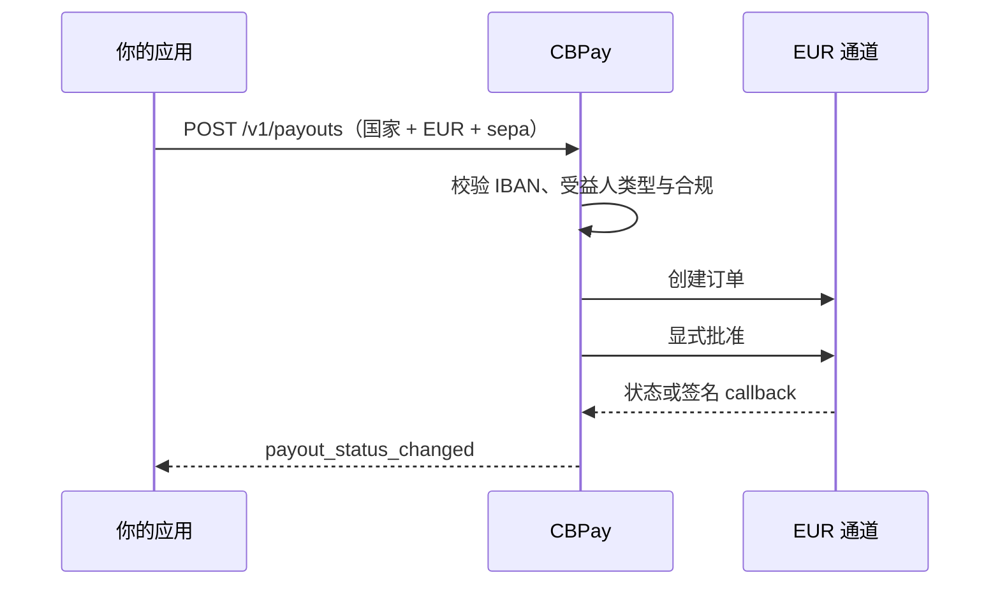

> **环境：** 测试 `https://cryptobank.qbank.cl/platform` (`pk_test_...`) - 正式 `https://api.qbank.cl/platform` (`pk_...`).

当收款人通过 `sepa` 方法接收 EUR 时使用本指南。目录保持
provider-agnostic：它公开国家、`EUR` 和 `sepa`，账户扣款则沿用普通
payout 定价和幂等合约。



## 路由走廊

V1 只注册一个路由走廊：`country=EU`、`currency=EUR`、
`method=sepa`。`EU` 是欧洲的目录路由代码，不是受益人的实际国家。
实际国家取自规范化 IBAN 的前两个字母；IBAN 必须属于支持 SEPA Instant
的国家集合。

`GB` 不在 SEPA Instant V1：英国 IBAN 会因为
`sepaInstReachable=false` 在派发前快速返回 HTTP 400。英国的 SEPA
Credit Transfer 属于未来的独立范围。走廊启用时，
`GET /v1/payouts/methods` 返回唯一的 `EU`/`EUR`/`sepa` 行。

## Beneficiary 合约

`beneficiary` 必须包含：

| 字段 | 规则 |
|---|---|
| `beneficiary_type` | 必填闭合集合：`individual` 或 `corporate`。 |
| `iban` | 必填；去除空格，执行 ISO 13616 mod-97，并要求国家属于 SEPA。 |
| `bic` | 可选 ISO 9362 BIC，8 或 11 个字符。 |
| `given_name` + `first_surname` | 个人必填的结构化姓名；两个字段都必须存在。 |
| `name` | 企业必填。个人可使用多词值拆分名字和姓氏；单名会被拒绝。 |

整笔操作使用一个幂等键。`description` 在 API 边界可选；如果发送，
adapter 会先为 SEPA wire 规则规范化：折叠变音符号，应用下方的欧洲字符
映射，结果必须符合 provider 的 corporate charset，并限制为 **140 个
Unicode code points**。折叠后仍含有不允许字符时，创建返回
`400 invalid_payload`。省略时，adapter 会生成有效的内部 SEPA 描述。

姓名在 charset 校验前使用相同的确定性折叠：

| 输入 | Wire 折叠 |
|---|---|
| 重音、分音符和 `ñ` | 拉丁基础字母（`é` → `e`，`ñ` → `n`） |
| `ß`、`æ`、`œ`、`ø`、`å`、`ł`、`đ`、`þ`、`ð` | `ss`、`ae`、`oe`、`o`、`a`、`l`、`d`、`th`、`d` |
| 马耳他字符 `ħ`、`ċ`、`ġ`、`ż` | `h`、`c`、`g`、`z` |
| 其余不在 provider charset 中的字符 | `400 invalid_payload` |

个人必须解析出名字和姓氏。V1 不支持以单名作为 `individual` 付款；
请发送 `given_name` 与 `first_surname`，或发送包含多个词的 `name`。

## 创建 payout

```bash
curl -X POST https://api.qbank.cl/platform/v1/payouts \
  -H "Authorization: Bearer <token>" \
  -H "Content-Type: application/json" \
  -d '{
    "country": "EU",
    "currency": "EUR",
    "method": "sepa",
    "amount": "100.00",
    "beneficiary": {
      "beneficiary_type": "individual",
      "given_name": "Elena",
      "first_surname": "Fuentes",
      "iban": "DE89370400440532013000",
      "bic": "COBADEFFXXX"
    },
    "description": "Invoice 2026-0916",
    "idempotency_key": "sepa-eu-20260917-001"
  }'
```

响应沿用普通 payout 资源：

```json
{
  "payout_id": "7d5c2f0a-1e9b-4a6d-8f3c-0b2a1d9e8c7f",
  "country": "EU",
  "currency": "EUR",
  "method": "sepa",
  "local_amount": "100.00",
  "status": "processing",
  "status_code": "approved",
  "funds_debited": true,
  "bank_reference": ""
}
```

Provider create 与显式 approve 是内部步骤。该 payout 为
`processing` 时不要创建替代操作；客户端重试必须使用同一个幂等键。

## EUR 资金来源与付款人身份

对于客户账户，每笔 `sepa` payout 都必须解析到一个已分配且 active、
purpose 为 `funding_usdt` 的虚拟 IBAN。这是客户 payout 的入金用途；EUR
Banking 提现使用独立的 `banking_eur` 用途。

需要选择某个具体的 active `funding_usdt` 虚拟 IBAN 时，在顶层发送
`source_virtual_iban_id`：

```json
{
  "country": "EU",
  "currency": "EUR",
  "method": "sepa",
  "amount": "100.00",
  "source_virtual_iban_id": "2f8c1d4e-1111-4b22-8a33-000000000001",
  "beneficiary": {
    "beneficiary_type": "individual",
    "given_name": "Elena",
    "first_surname": "Fuentes",
    "iban": "DE89370400440532013000",
    "bic": "COBADEFFXXX"
  },
  "idempotency_key": "sepa-eu-20260922-001"
}
```

- 只有一个 active 的 `funding_usdt` 虚拟 IBAN 时，省略该字段会确定性地
  选择它。
- 没有 active 来源时返回 `422 funding_account_required`。
- 有多个 active 来源时，在发送所选 UUID 前返回
  `422 ambiguous_source_viban`。
- 明确指定的 UUID 不属于该账户或不是 active 时，返回
  `404 not_found` 或 `422 funding_account_required`。

付款人身份由服务端从所选 vIBAN 持久化的 `registrant` 写入：个人使用名和
姓，企业使用注册公司名称及注册信息。调用方提交的 `payer` 或
`cj_payer_*` 字段不能替换该身份。

对于没有可用持久化 registrant 的 active legacy 行，平台会从当前已验证
profile 推导付款人姓名。若 profile 暂时无法读取，返回
`503 funding_account_unavailable`；若最终身份不完整，返回
`422 registrant_incomplete`。

此流程没有按 vIBAN 设置的金额上限。Payout 从账户正常的 USDT 结算余额
扣款；`BANK_EUR` 仅用于 EUR Banking 操作，不用于客户 payout。

> **注**
这道来源门控上线前创建的 payout hold 属于 grandfathered 记录：继续使用
原有 dispatch 与 reconciliation 流程，不会被追溯拒绝。
来源检查在任何扣款或调用 provider 前执行。若来源查询暂时不可用，请使用
相同的幂等键重试。

## 幂等与来源选择边界情况

来源 vIBAN 属于 payout 意图的一部分。如果两次顺序请求之间 active vIBAN
集合发生变化，使用同一幂等键重试仍返回原 payout。如果并发请求观察到
不同的来源集合，则返回 `409 idempotency_conflict`；两种结果都安全，
不会创建第二笔扣款。不要使用新键猜测结果。

同一幂等键不能同时表示默认来源和明确的 `source_virtual_iban_id`：
这种 replay 返回 `409 idempotency_conflict`。严格比较可以避免静默更换
付款账户。

## 状态与 return

| Provider 信号 | 公共 payout 结果 | 财务含义 |
|---|---|---|
| `created`、`pending` 或未知 | `processing` | 保持打开等待对账；不自动重发。 |
| `settled` | `completed` | 消耗 hold。 |
| `declined` 或 `canceled` | `failed` | 使用既有失败 payout 退款路径。 |
| Return notification | `failed`，`status_code: reversed` | 已完成 payout 通过既有退款路径冲正。 |

订阅 `payout_status_changed`。SEPA 不新增 webhook；provider callback
经过校验后进入同一个 payout 状态 pipeline。

## 错误

| HTTP | 代码或结果 | 处理方式 |
|---:|---|---|
| 400 | `invalid_payload` | 修正 EUR、IBAN/姓名，或 description 与 beneficiary 的 SEPA charset 规则。 |
| 400 | `payout_corridor_unsupported` | 确认实时目录包含唯一的 `EU`/EUR/`sepa` 行，且 IBAN 国家受支持。GB IBAN 会在派发前以 400 拒绝。 |
| 422 | payout `failed` / `core_rejected` | 修正 beneficiary，并使用新幂等键创建新操作。 |
| 503 | `payout_provider_failed` 或 `channel_unavailable` | 先读取原 payout；不确定时只用相同幂等键重试。 |

#### BIC 是必填的吗？
  不是。IBAN 必填，BIC 可选。
#### 可以通过该方法发送 USD 吗？
  不可以。`sepa` 仅支持 EUR，并在派发前拒绝其他币种。
#### Return 会创建新的 webhook 吗？
  不会。`payout_status_changed` 携带 `status_code: reversed` 和正常退款结果。
