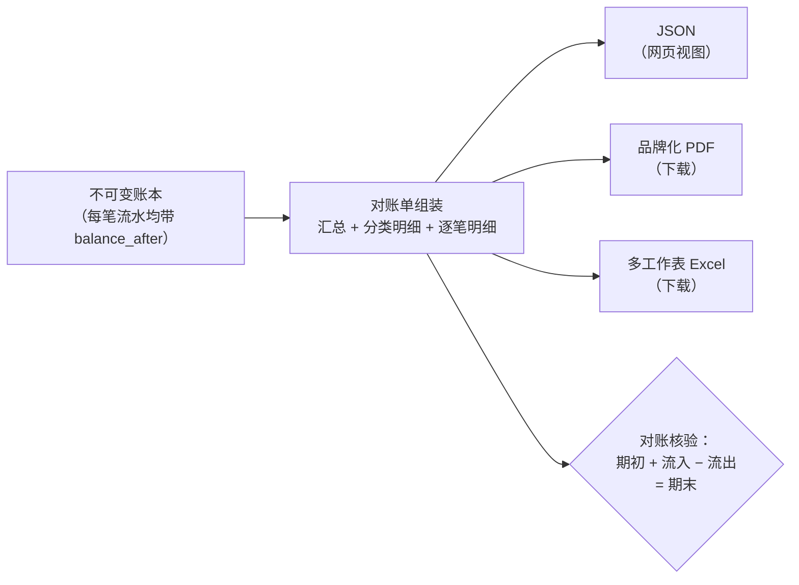

> **环境：** 测试 `https://cryptobank.qbank.cl/platform` (`pk_test_...`) - 正式 `https://api.qbank.cl/platform` (`pk_...`).

对账单将一个账户在某个期间内的**所有**流水 — 出款、入款、加密货币充值与提现、内部转账、银行卡消费、余额兑换、银行业务操作和服务费 — 合并为一份可审计的文档。同一个端点提供三种格式：

| 格式 | 用途 | 请求方式 |
|---|---|---|
| `json`（默认） | 在你的网页/应用中渲染对账单 | `format=json` |
| `pdf` | 带 CBPay 品牌的正式文档 | `format=pdf` |
| `xlsx` | 按分区分工作表、带筛选和数值单元格的 Excel | `format=xlsx` |



## 请求对账单

```bash
# JSON for your front end
curl "https://api.qbank.cl/platform/v1/reports/statement?from=2026-01-01&to=2026-07-07" \
  -H "Authorization: Bearer <token>"

# Downloadable PDF (CBPay branding)
curl -OJ "https://api.qbank.cl/platform/v1/reports/statement?from=2026-01-01&to=2026-07-07&format=pdf" \
  -H "Authorization: Bearer <token>"

# Downloadable Excel
curl -OJ "https://api.qbank.cl/platform/v1/reports/statement?from=2026-01-01&to=2026-07-07&format=xlsx" \
  -H "Authorization: Bearer <token>"
```

- `from` / `to`：`YYYY-MM-DD` 格式的日期，均含当日，按贵组织时区。最大范围：400 天。
- 响应字段 `period.timezone` 返回组织实际的 IANA 时区（例如 `America/New_York`），不会固定写成 UTC。
- `lang=en|es|zh`：PDF/Excel 的语言（默认 `en`）。同时带 `Content-Language`。
- 文件以 `Content-Disposition: attachment` 送达。文件名随 locale（`statement_…` / `cartola_…` / `对账单_…`）。

## 包含哪些内容

```json
{
  "account": { "account_id": "…", "display_name": "Example Company SpA", "type": "company" },
  "period": { "from": "2026-01-01", "to": "2026-07-07", "timezone": "America/New_York" },
  "generated_at": "2026-07-07T15:00:00Z",
  "summary": {
    "opening_balance": "0.000000",
    "total_in": "985633.540000",
    "total_out": "38099.870000",
    "net_change": "947533.670000",
    "closing_balance": "947533.670000",
    "balanced": true,
    "counts": { "payouts": 51, "payins": 12, "crypto_deposits": 18, "transfers": 4 },
    "fees_by_service": { "payout": "15.300000", "funding": "897.550000" },
    "total_fees": "912.850000"
  },
  "breakdown": {
    "by_product": [ { "product": "payouts", "count": 51, "usdt_in": "0.000000", "usdt_out": "38099.870000", "fees": "15.300000" } ],
    "by_country": [ { "flow": "payouts", "country": "BO", "currency": "BOB", "count": 14, "local_amount": "28748.58", "usdt_amount": "2902.210000" } ],
    "by_currency": [ { "currency": "BOB", "payout_local": "28748.58", "payin_local": "700.00" } ],
    "by_month": [ { "month": "2026-01", "usdt_in": "985633.540000", "usdt_out": "35100.000000" } ]
  },
  "payouts": [ { "created_at": "…", "payout_id": "…", "country": "BO", "beneficiary": "Juan Quispe", "local_amount": "90.00", "fx_rate": "6.91", "usdt_amount": "13.024600", "fee": "0.300000", "fee_percent": "0.200000", "fee_fixed": "0.100000", "total_debit": "13.324600", "status": "completed", "bank_reference": "00761123456" } ],
  "payins": [ { "…": "…" } ],
  "card_transactions": [ { "created_at": "…", "transaction_id": "…", "card_id": "…", "kind": "purchase", "merchant": "AMAZON.COM", "amount_usd": "25.00", "spend_asset": "USDT", "spend_amount": "25.000000", "status": "settled" } ],
  "swaps": [ { "created_at": "…", "swap_id": "…", "from_asset": "USDT", "to_asset": "BTC", "from_amount": "10.000000", "to_amount": "0.00015433", "rate": "0.00001543", "status": "completed" } ],
  "banking_operations": [ { "created_at": "…", "operation_id": "…", "direction": "out", "type": "wire", "currency": "USD", "amount": "150.00", "counterparty": "Acme Inc", "status": "completed" } ],
  "assets": [
    {
      "asset": "GOLD",
      "opening_balance": "0.000000",
      "total_in": "12.500000",
      "total_out": "2.000000",
      "net_change": "10.500000",
      "closing_balance": "10.500000",
      "balanced": true,
    }
  ],
  "crypto_deposits": [ { "chain": "tron", "asset": "USDT", "tx_id": "…", "usdt_gross": "100.000000", "fee": "1.000000", "usdt_credited": "99.000000", "balance_after": "99.000000" } ],
  "crypto_withdrawals": [ { "…": "…" } ],
  "transfers": [ { "direction": "sent", "counterparty": "Ana Perez", "asset": "USDT", "amount": "25.000000" } ],
  "service_charges": [ { "type": "banking_fee", "service": "banking_customer", "fee_model": "fixed", "asset": "USDT", "amount": "-0.500000", "balance_after": "98.500000" } ],
}
```

分区：

1. **`summary`** — 期初余额、流入、流出、期末余额、按服务分类的手续费，以及 **USDT 余额**（运营货币）的 `balanced` 标志。
2. **`assets`** — 每个有活动或余额的非 USDT 币种各有一个已对账的分区（USDC、BTC、GOLD，以及若使用 Banking，则包括你银行账户的 `BANK_USD`/`BANK_EUR` 镜像）：期初/期末余额、流入、流出和各自的 `balanced` 标志，按各币种的精度呈现；客户端视图不含原始明细，各资产的原始明细仅见于 org-admin 对账单。如果你只使用 USDT，此分区为空。
3. **`breakdown`** — 按产品、按国家（出款和入款，含本地金额和 USDT）、按法币币种和按月份。
4. **按产品的明细** — 出款（收款人、汇率和扣款）、入款（按模式）、加密货币（含 `tx_id` 及其 `asset`）、转账（含对手方和 `asset`）、银行卡消费（`card_transactions`，含商户和消费余额）、余额兑换（`swaps`）、银行业务操作（`banking_operations`）和服务费（含退款）。
5. **产品分区与审计路径** — 客户对账单省略原始账本 `movements`、各资产的 `assets[].movements` 以及 `summary.counts.movements`。请按产品分区核对，并使用费用和加密货币充值中的 `balance_after`。如需深入审计，请使用 org-admin 对账单或 `GET /v1/movements`。

> **注**
**透明的手续费。** 在出款、入款和加密货币提现中，当手续费由百分比和固定部分组成时，对账单会将其拆分为 `fee_percent` 和 `fee_fixed`（两者之和精确等于 `fee`）。独立收费（合规、钱包、银行业务、身份核验和银行卡）始终是固定金额，并包含实际收费的 `asset`（仅 USDT 的手续费汇总使用 USDT），同时带有 `fee_model: "fixed"`；PDF/Excel 将其标记为 **Fixed Com**。
## 如何对账（给你的会计）

对账单满足精确的会计恒等式，不进行舍入：

```text
期初余额 + 总流入 − 总流出 = 期末余额
```

- `balanced: true` 表示 USDT 汇总以及每个 `assets` 分区分别与账本相符。
  不同资产的余额绝不会相加。
- 每个产品分区使用自己的金额和状态进行核对。费用和加密货币充值
  都带有 `balance_after`，因此可以核验其对相应余额的影响，无需依赖
  原始账本导出。
- 客户对账单有意省略原始 USDT 账本的 `movements`、
  `assets[].movements` 以及 `summary.counts.movements`。如需深入审计，
  组织管理员可以使用管理员对账单，或使用分页账本视图
  `GET /v1/movements`。
- 一个期间的期末余额与下一个期间的期初余额一致。
- `from`/`to` 区间按组织时区（`period.timezone`）解释，但每笔操作的明细时间戳均为 UTC（JSON 为带 `Z` 的 RFC3339；PDF/Excel 中为“日期（UTC）”列）。
- 手续费不会隐藏：每笔操作分别显示总额、手续费和净额；
  `fees_by_service` 按设计仅汇总 USDT 手续费。
- XLSX 工作表名称会根据请求的 `lang`（`en`、`es` 或 `zh`）本地化；
  若分区存在，Crypto、Segregated、Cards、Swaps、Banking 和 Margins
  工作表也会随之本地化。
- Excel 的 **Payouts** 工作表带有 **Bank ref** 列（位于参考/摘要列之后），内容为收款银行在确认付款后分配的交易 id。对账单 PDF 有意省略该列（表格密度考虑）——单笔付款回执中会显示。

## 面向管理员（组织管理员）

CBPay 团队可以生成其任一账户的对账单：

```bash
curl "https://api.qbank.cl/platform/v1/accounts/{accountID}/reports/statement?from=2026-01-01&to=2026-07-07&format=pdf" \
  -H "X-API-Key: <pk_org_admin>"
```

管理员视图还包含该期间的额外运营信息（详见管理文档）。

## 错误

| HTTP | `error` | 原因 |
|---|---|---|
| 400 | `invalid_range` | 日期缺失/无效、`to` 早于 `from`，或范围超过 400 天 |
| 400 | `invalid_format` | `format` 不是 `json`、`pdf`、`xlsx` 之一 |
| 404 | `not_found` | 账户不存在（仅组织管理员） |
## 常见问题

#### 对账单多久生成一次？
按需生成 —— 每次请求都根据你传入的 `from`/`to` 区间（两者必填，
`YYYY-MM-DD`，组织时区）从账本实时构建。
#### balanced: true 是什么意思？
每种资产独立核对：`期初 + 入账 − 出账 = 期末`，覆盖 USDT、USDC、BTC、
GOLD 和 banking 镜像。任一资产不平时该标志为 `false` —— 请报告给你的
CBPay 团队。
#### 为什么我会看到 BANK_USD / BANK_EUR 余额？
它们在对账单中镜像你的 banking 资金，使账户能够完整重建。权威余额始终
以银行为准（`GET /v1/banking/accounts/{id}/balance`）；这些镜像余额永远
不可支出。
#### 有哪些可用格式？
JSON（集成）、PDF 和 XLSX —— 后两者均带有你组织的品牌标识。使用
`Accept` 请求头或端点的格式参数。
#### fee_model: fixed 是什么？
独立服务收费（验证、筛查、钱包服务）为纯固定费用，在对账单中标注为
"Fixed Com" —— 区别于百分比+固定的交易型手续费。
#### 可以验证单笔流水吗？
可以 —— 每笔操作都有带公开验证码的[凭证](https://docs.cbpayapp.com/zh/guides/receipts)；任何人
无需认证即可验证。
## 账单中的争议

如果期间创建了案件，账单会包含 `disputes[]`。每项包含 `created_at`、
`dispute_id`、`kind`、`status`、`disputed_usdt`、`held_usdt`、可选
`case_number` 和 `deadline_at`。预防性冻结只记录一次；provider
chargeback 是独立的金融扣账。
