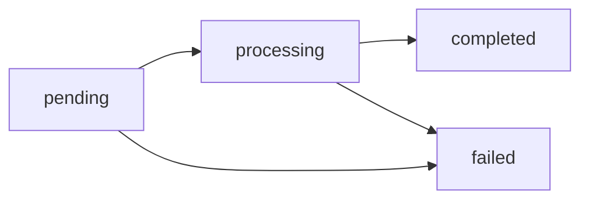

## 十个相互独立的虚拟余额

每个账户持有**十个虚拟余额，每个资产一个**：

| 资产 | 说明 | 小数位 | 入金方式 |
|---|---|---|---|
| `USD` | 美元 — **主余额** | 2 | 法币收款（payin）、兑换、内部转账、调整 |
| `USDT` | 美元稳定币 — 既有主余额 | 6 | 法币收款（payin）、链上充值（TRON/以太坊）、内部转账 |
| `USDC` | 美元稳定币 | 6 | 链上充值（以太坊）、内部转账 |
| `BTC` | 比特币 | 8（聪） | 链上充值、运营方入账与内部转账 |
| `GOLD` | 由托管方背书的纯金克数 | 6 | 运营方入账与内部转账 |
| `SILVER` | 由托管方背书的纯银克数 | 6 | 运营方入账与内部转账 |
| `PLATINUM` | 由托管方背书的纯铂克数 | 6 | 运营方入账与内部转账 |
| `BOB` | 玻利维亚诺 — 本地留存 | 2 | 带本地留存的法币收款、内部转账、调整 |
| `MXN` | 墨西哥比索 — 本地留存 | 2 | 带本地留存的法币收款、内部转账、调整 |
| `ARS` | 阿根廷比索 — 本地留存 | 2 | 带本地留存的法币收款、内部转账、调整 |

它们完全相互独立：永远不会混合，也永远不会自动换算。（`BANK_USD`
和 `BANK_EUR` 是单独的银行镜像余额 — 参见
[银行服务](/zh/guides/banking)。）

`GET /v1/balances` 始终返回全部十个余额（尚未使用的资产返回零），
金额均为**十进制字符串**：

```json
{
  "account_id": "…",
  "balances": [
    { "asset": "USD", "available": "1000.00", "held": "0.00" },
    { "asset": "USDT", "available": "125.430000", "held": "10.000000" },
    { "asset": "USDC", "available": "50.000000", "held": "0.000000" },
    { "asset": "BTC", "available": "0.00060000", "held": "0.00000000" },
    { "asset": "GOLD", "available": "12.500000", "held": "0.000000" },
    { "asset": "SILVER", "available": "0.000000", "held": "0.000000" },
    { "asset": "PLATINUM", "available": "0.000000", "held": "0.000000" },
    { "asset": "BOB", "available": "0.00", "held": "0.00" },
    { "asset": "MXN", "available": "0.00", "held": "0.00" },
    { "asset": "ARS", "available": "0.00", "held": "0.00" }
  ]
}
```

<Note>
在内部，每笔金额都以其资产的最小单位（分、微 USDT、聪、微克）存储为
整数，并使用精确的有理数运算进行计算。不存在浮点数，也不存在累积的
舍入误差。
</Note>

**USD 是新账户的主余额**：出款（payout）、法币收款（payin）与服务费
默认使用 USD，除非账户另有配置。在 USD 默认之前创建的账户带有显式的
USDT 设置并继续以 USDT 运作。空的资产设置会规范化为 USD。

## 选择用哪个余额付款

**出款**与**服务费**（KYC、钱包创建、银行服务）可以从您十个余额中的
任意一个扣款。定价流程不变：操作始终以 USDT 报价，最后再按当时的
**有效结算价格**将总额换算为所选资产。

- **账户级默认值**：调用 `PUT /v1/settlement` 并传入
  `{"default_settlement_asset": "BTC"}`。此后，每笔出款与服务费都从
  BTC 余额中扣除（前提是该余额足以覆盖金额；不会级联到其他余额）。
- **单笔操作覆盖**：在 `POST /v1/payouts`（或 QR confirm）中发送
  `settlement_asset`，即可仅用另一个余额支付该笔操作，而不改动默认设置。

```bash
# Set BTC as the default paying balance
curl -X PUT "https://api.qbank.cl/platform/v1/settlement" \
  -H "Authorization: Bearer <token>" -H "Content-Type: application/json" \
  -d '{"default_settlement_asset": "BTC"}'
```

多资产结算规则：

| 规则 | 详情 |
|---|---|
| 执行价格 | BTC 和 GOLD 使用链上执行价格源（而非参考价格）。若价格源过期或不可用，操作返回 `503 pricing_unavailable` — 绝不会在可疑价格上执行。 |
| 扣款、冻结与退款 | 三者都发生在所选资产上。若出款失败，将退还**精确的** `settlement_amount` — 绝不重新报价。 |
| 幂等性 | 使用相同的幂等键重放会返回原始金额；价格绝不会重新计算。 |
| 单笔操作限额 | 波动性资产（BTC/GOLD/SILVER/PLATINUM）设有单笔操作限额（等值 USDT，可在 `GET /v1/settlement` 中查看）；超出时返回 `422 settlement_limit_exceeded`。 |
| 账户级每日限额 | 波动性资产还设有 24 小时滚动交易量上限（见 `GET /v1/settlement` 中的 `volatile_daily_limit_usdt`）；超出时返回 `422 settlement_daily_limit_exceeded`。请改用 USD/USDT/USDC 结算或稍后重试。 |
| USD | 是新账户的默认余额；显式 USDT 的 既有账户保持不变。USD 与 USDT 按 1:1 结算，精确到分。 |

`GET /v1/rates` 的 `settlement` 区块显示每个资产的有效价格（已含点差），
供您在操作前估算；出款响应中会记录 `settlement_asset`、
`settlement_amount` 和 `settlement_rate` 以供审计。

## 选择收款入账到哪个余额

对于新账户，**收款**（QR、银行转账、collect、银行卡）直接以 USD 分入账，
精度为 2 位小数。带有显式 USDT 设置的 既有账户保持 USDT。若配置其他
`default_payin_asset`，净额按真实价格走入账后的转换流程，不收取额外 swap
点差；收款已经支付手续费和汇率。适用普通兑换的相同限额。

```bash
# Credit my payins in USDC
curl -X PUT "https://api.qbank.cl/platform/v1/settlement" \
  -H "Authorization: Bearer <token>" -H "Content-Type: application/json" \
  -d '{"default_payin_asset": "USDC"}'
```

| 规则 | 详情 |
|---|---|
| 入账后兑换 | 收款先入账到账户的主资产（新账户为 USD，既有账户为 USDT），兑换随即作为一笔 swap 运行（您会在对账单中看到 `swap_out`/`swap_in`）。 |
| 价格与限额 | 兑换**按真实价格执行，不收取兑换点差**（不存在双重成本：收款已支付其手续费与汇率）。适用波动性资产（BTC/GOLD/SILVER/PLATINUM）的单笔/24 小时限额。 |
| 兑换失败时 | 收款保持以主资产入账，`conversion_status: pending_retry`，系统自动重试 — 资金绝不丢失、绝不重复兑换。 |
| Checkout 与 POS | 每个链接保留创建时选择的 `settlement_asset`；此配置不会再次兑换它们。**未**指定 `settlement_asset` 创建的链接会使用您的 `default_payin_asset`。 |
| 展示范围 | 当发生兑换时，`GET /v1/payins`、详情接口与 `payin_credited` webhook 会包含 `settlement_asset` 和 `conversion_status`。 |

## `available` 与 `held`

每个余额都有自己的两个计数器：

| 字段 | 含义 |
|---|---|
| `available` | 可用于操作的余额 |
| `held` | 被进行中的操作（待处理的出款与提现）预留的金额 |

当您创建出款或提现时，扣款金额（`amount + fee`）会离开
`available` 并停留在 `held` 中，直到操作到达最终状态：

- **`completed`** → 冻结被消耗；资金已转出。
- **`failed`** → 全部扣款（金额 + 手续费）退回 `available`。

## 外汇换算（法币 ↔ USDT，按报价）

法币操作在执行时按**您账户的汇率**以 USDT 报价（即
`GET /v1/rates` 返回的汇率，以 USD 为基准）：出款使用 `rate`，
收款使用 `payin_rate`。换算在扣款时**向上**取整，在入账时
**向下**取整，差额最多为 1 微 USDT。报价总额随后以结算资产
扣款（或入账）— USD 主账户按 1:1 以 USD 分结算。

示例 — 一笔 50,000 CLP 的出款，汇率为 950.25：

```
usdt_amount = ceil(50000 / 950.25 × 10^6) / 10^6 = 52.618258 USDT
total_debit = usdt_amount + fee
```

示例 — 一笔 50,000 CLP 的收款，`payin_rate` 为 955.10：

```
usdt_gross    = floor(50000 / 955.10 × 10^6) / 10^6 = 52.350539 USDT
usdt_credited = usdt_gross − fee
```

所用汇率会记录在对象上（`fx_rate`）以供审计。

## 参考价格与结算价格

`GET /v1/rates` 包含一个 `asset_prices` 区块，提供每个币种的
**USD 参考价格**（BTC 按单位；GOLD、SILVER 和 PLATINUM 按克；
USD、USDT 和 USDC 约定为 1），用于在界面上为您的余额估值；
还包含一个 `settlement` 区块，提供若您用该资产支付某笔操作时
余额将按其估值的**有效价格**（已含点差）：

```json
{
  "asset_prices": {
    "USD": { "currency": "USD", "unit": "usd", "price": "1" },
    "USDT": { "currency": "USD", "unit": "usdt", "price": "1" },
    "USDC": { "currency": "USD", "unit": "usdc", "price": "1" },
    "BTC": { "currency": "USD", "unit": "btc", "price": "109853.24",
             "updated_at": "2026-07-07T11:59:41Z",
             "settlement_grade": true },
    "GOLD": { "currency": "USD", "unit": "gram", "price": "107.5341",
              "updated_at": "2026-07-07T09:12:05Z",
              "settlement_grade": true },
    "SILVER": { "currency": "USD", "unit": "gram", "price": "1.2345",
                "updated_at": "2026-07-07T09:12:05Z",
                "settlement_grade": true },
    "PLATINUM": { "currency": "USD", "unit": "gram", "price": "45.6789",
                  "updated_at": "2026-07-07T09:12:05Z",
                  "settlement_grade": true }
  },
  "settlement": {
    "default_asset": "USD",
    "assets": [
      { "asset": "USD", "available": true, "settlement_rate": "1" },
      { "asset": "USDT", "available": true, "settlement_rate": "1" },
      { "asset": "USDC", "available": true, "settlement_rate": "0.99900000" },
      { "asset": "BTC", "available": true, "settlement_rate": "109029.34070000" },
      { "asset": "GOLD", "available": true, "settlement_rate": "106.99642950" }
    ]
  }
}
```

`settlement_grade: true` 表示价格足够新鲜，可用于执行操作；若变为
`false`，以该资产付款将返回 `503 pricing_unavailable`，直到价格恢复。

## 不可变账本

每笔资金变动都会产生一条不可变的账目记录，并带有变动后的余额
（`balance_after`），以**变动所属币种**计。您的完整历史记录位于
`GET /v1/movements`（可用 `?asset=` 按币种筛选）：

| `type` | 含义 |
|---|---|
| `payin_credit` | 法币收款入账 |
| `payout_debit` / `payout_refund` | 出款扣款 / 失败时退款 |
| `transfer_in` / `transfer_out` | 收到 / 发出的内部转账 |
| `funding` | 链上充值入账（USDT 或 USDC，各自入到自己的余额） |
| `withdrawal_debit` / `withdrawal_refund` | 链上提现 / 失败时退款 |
| `compliance_fee` / `compliance_refund` | KYC/KYB 服务费 / 退款 |
| `wallet_creation_fee` / `wallet_creation_refund` | 钱包创建费 / 退款 |
| `adjustment` | CBPay 的人工调整（已审计） |

```bash
curl "https://api.qbank.cl/platform/v1/movements?type=payout_debit&from=2026-07-01&to=2026-07-07&page_size=20" \
  -H "Authorization: Bearer <token>"

# Only the GOLD balance movements
curl "https://api.qbank.cl/platform/v1/movements?asset=GOLD&from=2026-07-01&to=2026-07-07" \
  -H "Authorization: Bearer <token>"
```

所有列表接口（`/v1/movements`、`/v1/payouts`、`/v1/payins`、
`/v1/crypto/transactions`、`/v1/banking/operations`）都支持分页
（`page`、`page_size` 最大 200）以及 `from`/`to` 日期筛选
（YYYY-MM-DD，组织时区，闭区间）。

## 操作状态

出款与加密货币提现遵循相同的生命周期：



最终状态（`completed`/`failed`）通过 [webhook](/zh/webhooks) 送达；
无需轮询。

### 由托管方支持的金属余额

`GOLD`、`SILVER` 与 `PLATINUM` 是由托管方支持、以精炼金属克数记录且
保留六位小数的 ledger-only 余额。Settlement 与 swap 使用价格预言机和
固定的 `31.1034768` 克/金衡盎司换算；这不代表存在链上金属充值、提现
或消费通道。
