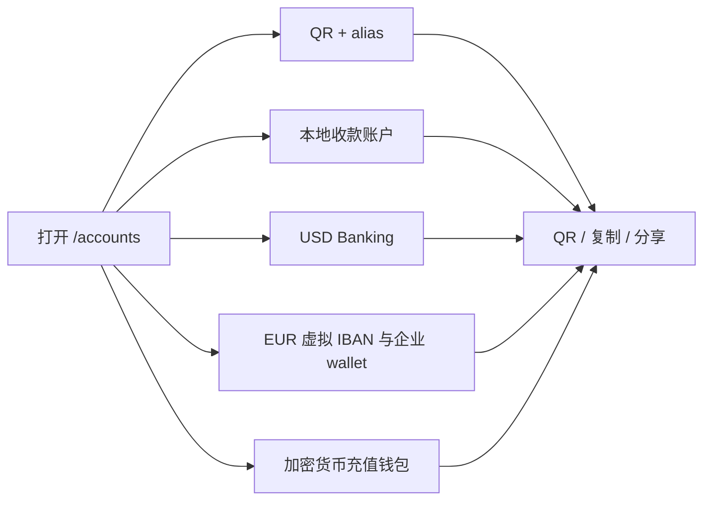

import { EnvUrls } from "/snippets/env-urls.jsx";

<EnvUrls lang="zh" />

## 集中查看收款信息

**我的账户**是账户门户中的收款目的地目录。打开 `/accounts`，它位于
侧边栏 **存款** 的下方。页面会集中显示 QR 收款身份、本地收款账户、
Banking 目的地、EUR 工具和加密货币充值钱包。

页面不会把含义不同的余额合并在一起。银行账户仍是银行账户，虚拟 IBAN
仍是路由工具，加密货币充值钱包仍是区块链地址。发送资金、提现和查看
对账单请继续使用对应产品页面。

如果目的地或读取操作返回错误，请查看[公开错误目录](/zh/errors)，了解
错误代码和恢复动作。

<Steps>
<Step title="打开我的账户">
在门户侧边栏选择 **我的账户**。**Wallets** 是原来 **我的钱包** 的新
显示名称；底层钱包和地址不变。
</Step>
<Step title="选择收款目的地">
打开与付款人所用 rail 对应的分区。每张卡都会显示目的地状态以及可以
安全分享给付款人的信息。
</Step>
<Step title="复制、显示或分享">
使用卡片操作显示 QR、复制收款值或分享收款信息。只分享本次付款对应的
目的地：账户或地址绑定到你的 CBPay 账户，不能与其他账户互换。
</Step>
</Steps>

## 每个分区显示什么

| 分区 | 显示内容 | 使用场景 |
|---|---|---|
| **QR 与 alias** | 品牌 QR 图片、支付 payload 和可选账户 alias。QR 用于识别你的账户并接收转账。 | 付款人使用 CBPay QR 流程时展示 QR。 |
| **本地收款账户** | 国家、币种、方式、收款 instrument、状态和创建时间。启用后包括 MXN CLABE 与 BOB 银行转账目的地。 | 复制 CLABE 或 BOB 账户号码，让付款人发起银行转账。 |
| **Banking USD** | 已启用的 USD 银行账户、名称、币种和状态，以及详情中提供的收款要求（例如账户号、routing 或 SWIFT 数据）。 | 向付款人发送 wire 或 SWIFT 收款指引。 |
| **EUR 虚拟 IBAN** | purpose（`funding_usdt` 或 `banking_eur`）、币种、状态，以及分配后显示的 IBAN。Banking EUR 工具还可能显示已对账的 `received_total`。 | 将 EUR 资金路由到正确 purpose，避免把充值地址误认为可用余额。 |
| **企业钱包** | 已验证企业的预留状态、order reference、wallet UUID、IBAN 和可用时的激活时间。详情提供实时余额和按日期查询的操作。 | 用于企业 Banking 活动的专用 EUR wallet。 |
| **Wallets** | 网络、资产、地址、钱包类型、只接收状态和创建时间。支持的充值组合包括 TRON/USDT、Ethereum/USDT、Ethereum/USDC 和 Bitcoin/BTC。 | 发起链上充值前复制区块链地址或显示 QR。 |

页面使用门户其他位置相同的账户范围资源：
`GET /v1/me/qr`、`GET /v1/payins/deposit-accounts`、
`GET /v1/banking/accounts`、`GET /v1/banking/virtual-ibans`、
`GET /v1/banking/company-wallets` 和 `GET /v1/crypto/wallets`。这是导航与
分享页面，不是新的 API contract。

## 诚实的空状态与处理中状态

- **没有 QR：**账户没有可用 QR token。页面不会伪造 QR，也不会把占位图
  当作可收款目的地。
- **没有 CLABE 或 BOB 账户：**本地收款目的地只有在个人 KYC 或企业 KYB
  审核通过后才会配置。审核进行中、走廊未启用或已有 claim 时，分区可能
  暂时为空，直到 reconcile 完成。
- **Banking USD 为空：**先完成 Banking profile 和 verification，再等待已
  启用的 USD 账户出现。账户缺失不等于余额为零。
- **EUR 为 `pending_approval` 或 `pending`：**请求仍在 reconcile。不要因
  第一次读取尚未 active 就创建第二个虚拟 IBAN 或企业 wallet。
- **加密货币地址不完整：**新审核通过的账户可能仍在配置充值钱包。刷新
  页面，等地址出现后再使用。额外的运营钱包属于独立的 segregated
  wallets 产品。

如果卡片暂时读取失败，请刷新该卡片并保留已有请求或目的地。不要为了猜测
一次不明确操作的结果而创建第二个账户、钱包或虚拟 IBAN。

## 常见问题

<AccordionGroup>
<Accordion title="这里列出的都是钱包吗？">
不是。页面集中展示 QR 身份、银行账户、虚拟 IBAN、企业 Banking wallet
和链上充值地址。它们的余额和操作规则仍然分开。
</Accordion>
<Accordion title="为什么注册后没有 CLABE 或 BOB 账户？">
仅完成注册不会配置这些目的地。账户必须先通过 KYC 或 KYB。审核通过
后，正常审批流程会触发配置；现有账户也可以由运营人员进行 reconcile。
</Accordion>
<Accordion title="可以分享这里显示的信息吗？">
可以，分享预期付款对应的 QR 或收款信息。不要分享 session token、内部
ID，也不要从其他 CBPay 账户复制目的地。付款人发送前请确认国家、币种
和方式。
</Accordion>
<Accordion title="为什么目的地显示 pending？">
配置或与 provider 的 reconcile 仍在进行。保留原请求，不要使用新 key
创建第二个请求。目的地可用后页面才会显示收款值。
</Accordion>
<Accordion title="把“我的钱包”改成 Wallets 会改变地址吗？">
不会。这只是门户显示名称变化。钱包 ID、地址、资产和只接收行为都保持
不变。
</Accordion>
</AccordionGroup>
