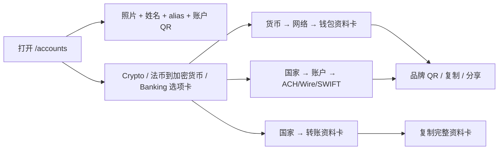

import { EnvUrls } from "/snippets/env-urls.jsx";

<EnvUrls lang="zh" />

## 集中查看收款信息

**我的账户**是账户门户中的收款目的地目录。打开 `/accounts`，它位于
侧边栏 **存款** 的下方。页面会把账户身份、加密货币充值钱包、法币
收款账户和 Banking 目的地集中在一个视图中。

页面不会把含义不同的余额合并在一起。银行账户仍是银行账户，虚拟 IBAN
仍是路由工具，加密货币充值钱包仍是区块链地址。发送资金、提现和查看
对账单请继续使用对应产品页面。

如果目的地或读取操作返回错误，请查看[公开错误目录](/zh/errors)，了解
错误代码和恢复动作。

## CBPAY hero 与三个账户选项卡

页面顶部显示账户的 **CBPAY** hero。账户有资料照片和姓名时会显示它们，
同时显示永久 alias 和账户 QR。Hero 使用现有的 `GET /v1/me/qr` 响应；
账户没有 QR 时不会伪造。

hero 下方有三个选项卡：

- **Crypto**（`?tab=crypto`）：先选择加密货币，再选择网络，只查看所选
  充值钱包，并显示带品牌标识的 QR。
-  将加密货币直接存入你每个网络的钱包。
- **法币到加密货币**（`?tab=fiat`）：选择国家，查看该国家每个账户的
  **转账资料卡**。法币到加密货币资料卡不会显示 QR。
-  将法币存入你的收款信息，自动转换为余额中的加密货币。
- **Banking**（`?tab=banking`）：选择国家，查看 Banking 账户。美国账户
  有 **ACH**、**Wire** 和 **SWIFT** 子选项卡；欧洲显示 Banking 虚拟
  IBAN 和企业 wallet。
-  以你名义开立的银行账户，余额为当地法币。

**这些账户只属于你：专属持有，不与他人共用。**

当图标表示网络时，页面使用网络自己的图标：TRON 使用红色 TRON 标志，
Ethereum 使用蓝色以太坊菱形；代币图标仍表示资产。

选项卡和目的地会反映在 URL 中：

- `/accounts?tab=crypto&sel=USDT:tron`
- `/accounts?tab=fiat&sel=BO`
- `/accounts?tab=banking&sel=US:<account_id>:ach`
- `/accounts?tab=banking&sel=EU`

未知或格式错误的值会安全地回退到默认值；不会暴露其他账户，也不会创建
新的目的地。



<Steps>
<Step title="打开我的账户">
在门户侧边栏选择 **我的账户**。**Wallets** 是原来 **我的钱包** 的新
显示名称；底层钱包和地址不变。
</Step>
<Step title="选择选项卡和目的地">
选择 **Crypto**、**法币到加密货币** 或 **Banking**，然后选择页面显示的货币、国家、
账户或美国通道。可以使用 `?tab=&sel=` deep-link 保存当前视图。
</Step>
<Step title="复制或分享正确的信息">
Crypto 和 Banking 资料卡可以显示带组织品牌标识的 QR、复制单个字段或
分享所选通道。法币到加密货币资料卡没有 QR：使用**复制全部**复制完整的转账资料，
包括持有人、银行、可用时的 NIT 和收款号码。
</Step>
</Steps>

## 每个选项卡显示什么

| 选项卡 | 包含内容 | 可以分享什么 |
|---|---|---|
| **Crypto** | 先选择资产，再选择网络。资料卡只显示所选钱包、地址、网络、只接收状态和创建时间。包括 TRON/USDT、Ethereum/USDT、Ethereum/USDC 与 Bitcoin/BTC。 | 所选区块链地址或带组织标识的 QR。 |
| **法币到加密货币** | 选择 **MX**、**BO** 或 **EU**。MX/BO 账户显示持有人、返回时的 `bank_name`、BO 返回时的 `merchant_nit`，以及 CLABE 或账户号码。EU 显示充值虚拟 IBAN（`purpose: funding_usdt`）。法币到加密货币选项卡**没有 QR**。 | 使用**复制全部**复制完整转账资料，或确认状态后分享充值 IBAN。 |
| **Banking** | 选择 **US** 或 **EU**。US 账户按 ACH、Wire 和 SWIFT 子选项卡显示可用的收款字段。EU 显示 Banking 虚拟 IBAN（`purpose: banking_eur`）和 EUR 企业 wallet。资料卡在有数据时显示账户/IBAN、routing 或 SWIFT、状态和激活信息。 | 所选 Banking 通道（有数据时包含品牌 QR），或已激活的 EUR 目的地。 |

QR 与 alias 仍显示在选项卡上方的 CBPAY hero 中。QR 用于识别账户并接收
转账，alias 是可选项。页面只显示 API 返回的字段，不会伪造持有人、银行、
NIT 或账户号码。

页面使用门户其他位置相同的账户范围资源：
`GET /v1/me/qr`、`GET /v1/payins/deposit-accounts`、
`GET /v1/banking/accounts`、`GET /v1/banking/virtual-ibans`、
`GET /v1/banking/company-wallets` 和 `GET /v1/crypto/wallets`。这是导航与
分享页面，不是新的 API contract。

## 诚实的空状态与处理中状态

- **没有 hero QR：**账户没有可用 QR token。页面不会伪造 QR，也不会把
  占位图当作可收款目的地。
- **法币到加密货币按设计没有 QR：**请使用转账资料卡和**复制全部**。法币到加密货币中没有
  QR 不代表配置失败。
- **没有 CLABE 或 BOB 账户：**本地收款目的地只有在个人 KYC 或企业 KYB
  审核通过后才会配置。审核进行中、走廊未启用或已有 claim 时，分区可能
  暂时为空，直到 reconcile 完成。
- **Banking USD 为空：**先完成 Banking profile 和 verification，再等待已
  启用的 USD 账户出现。账户缺失不等于余额为零。
- **EUR 为 `pending_approval` 或 `pending`：**请求仍在 reconcile。不要因
  第一次读取尚未 active 就创建第二个虚拟 IBAN 或企业 wallet。
- **加密货币地址不完整：**新审核通过的账户可能仍在配置充值钱包。刷新
  页面，等地址出现后再使用。额外的运营钱包属于独立的 segregated
  wallets 产品。

如果卡片暂时读取失败，请刷新该卡片并保留已有请求或目的地。不要为了猜测
一次不明确操作的结果而创建第二个账户、钱包或虚拟 IBAN。

## 常见问题

<AccordionGroup>
<Accordion title="这里列出的都是钱包吗？">
不是。页面集中展示 QR 身份、银行账户、虚拟 IBAN、企业 Banking wallet
和链上充值地址。它们的余额和操作规则仍然分开。
</Accordion>
<Accordion title="为什么注册后没有 CLABE 或 BOB 账户？">
仅完成注册不会配置这些目的地。账户必须先通过 KYC 或 KYB。审核通过
后，正常审批流程会触发配置；现有账户也可以由运营人员进行 reconcile。
</Accordion>
<Accordion title="可以分享这里显示的信息吗？">
可以，分享所选 Crypto 或 Banking QR，或者使用**复制全部**复制 Fiat
转账资料卡。不要分享 session token、内部 ID，也不要从其他 CBPay 账户
复制目的地。付款人发送前请确认国家、币种和方式。
</Accordion>
<Accordion title="为什么目的地显示 pending？">
配置或与 provider 的 reconcile 仍在进行。保留原请求，不要使用新 key
创建第二个请求。目的地可用后页面才会显示收款值。
</Accordion>
<Accordion title="把“我的钱包”改成 Wallets 会改变地址吗？">
不会。这只是门户显示名称变化。钱包 ID、地址、资产和只接收行为都保持
不变。
</Accordion>
<Accordion title="为什么没有显示银行名称或 BO 商户 NIT？">
这些字段是可选的。MX 收款通道返回 `bank_name` 时页面才显示；BO/BOB
通道返回 `merchant_nit` 时页面才显示。字段缺失时不会猜测或伪造值，只
复制 API 实际返回的信息。
</Accordion>
</AccordionGroup>

## 争议冻结余额

`GET /v1/balances` 的 USDT item 可能包含 `disputed`，表示开放争议当前
冻结的精确金额：

```json
{ "asset": "USDT", "available": "900.000000", "held": "100.000000", "disputed": "100.000000" }
```

{/* banking-fase2-fiat-hold:2026-09-24 */}

## 本地保留标志

管理员可通过 `PATCH /v1/accounts/{accountID}` 发送 `{"fiat_hold_local":true}`。GET 返回该标志，只影响未来入账。
