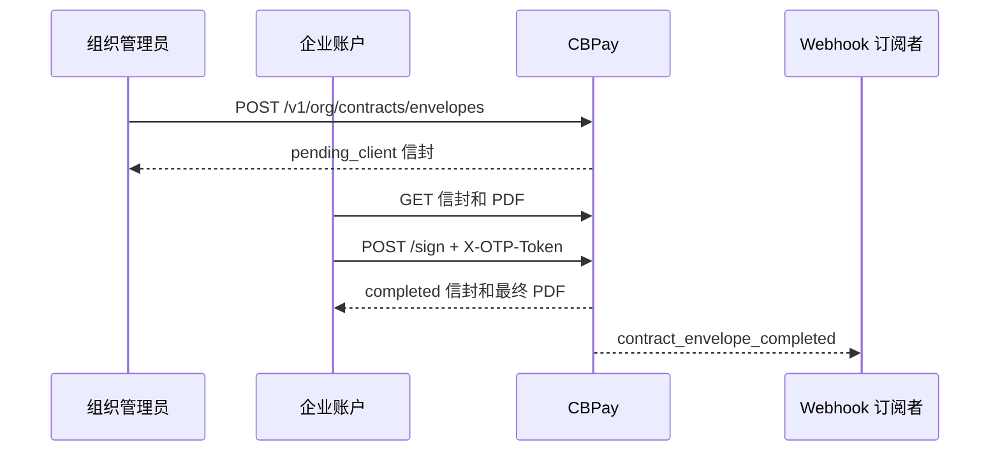

Grupo CB 主协议是 CBPay 为已验证企业账户生成的预填充文件。创建信封前，
CBPay 会解析企业法定身份、已验证地址、已启用服务、费率以及当前 CBPay
签名。如果必填数据没有可信来源，系统不会创建信封。

签署仪式必须由企业账户的 owner 或 operator 人工完成，并要求明确同意和
一次性新 OTP。API key 不能用于签署。

测试请求请使用 `https://cryptobank.qbank.cl/platform`；只有生产环境使用
`https://api.qbank.cl/platform`。



## 资格与状态

账户必须是已激活且 KYB 已批准的企业账户。信封按组织和账户隔离；访问
其他账户的 ID 会返回 `404 not_found`。

| 状态 | 含义 | 下一步 |
|---|---|---|
| `pending_client` | CBPay 已冻结预签署文件，客户尚未完成仪式。 | 查看并签署，或让组织管理员 void/reissue。 |
| `completed` | 签名、同意和 OTP claim 成功，最终 PDF 已生成。 | 查看或下载最终文件；不可 void。 |
| `voided` | 组织管理员为待签署信封记录原因并取消。 | 需要修正时签发新信封。 |

系统不存在 `draft` 或通用的 `pending` 状态。

当 `lang=en` 时，组织必须设置 `contract_counsel_approved_en=true`。西班牙语
签发不需要该英文 counsel gate。模板版本为 `v13.1`，模板哈希和 CBPay
签名版本会冻结在信封快照中。

## 签署仪式

<Steps>
  <Step title="列出并打开信封">
    调用 `GET /v1/me/contracts/envelopes`，再调用
    `GET /v1/me/contracts/envelopes/{envelopeID}`。列表支持 `page` 和
    `page_size`（默认 50，最大 200）。详情包含 append-only 时间线。

```bash
curl "https://api.qbank.cl/platform/v1/me/contracts/envelopes?page=1&page_size=50" \
  -H "Authorization: Bearer <CBPAY_TOKEN>"
```
  </Step>

  <Step title="签署前下载文件">
    `GET /v1/me/contracts/{envelopeID}/pdf` 返回 PDF 二进制。保存并检查
    法定名称、地址、服务和费率。文件已由 CBPay 预签名，但在仪式完成前
    仍然是 `pending_client`。

```bash
curl -o contrato-marco.pdf \
  "https://api.qbank.cl/platform/v1/me/contracts/envelopes/<ENVELOPE_ID>/pdf" \
  -H "Authorization: Bearer <CBPAY_TOKEN>"
```
  </Step>

  <Step title="提交签署人身份和同意">
    签署人姓名和职务放在 JSON 中。`consent` 必须是 JSON 布尔值 `true`。
    OTP **不是** JSON 中的 `code` 字段；请将新的一次性 token 放在
    `X-OTP-Token` header 中。

```bash
curl -X POST \
  "https://api.qbank.cl/platform/v1/me/contracts/envelopes/<ENVELOPE_ID>/sign" \
  -H "Authorization: Bearer <CBPAY_TOKEN>" \
  -H "Content-Type: application/json" \
  -H "X-OTP-Token: <FRESH_SINGLE_USE_OTP_TOKEN>" \
  -d '{
    "signer_name": "Jordan Lee",
    "signer_title": "Chief Executive Officer",
    "consent": true
  }'
```
  </Step>

  <Step title="确认完成">
    成功响应会将信封返回为 `completed`。再次读取资源并下载 PDF，保存
    `final_hash`。`contract_envelope_completed` 事件发送给 org-admin
    audience。
  </Step>
</Steps>

## 响应示例

列表响应：

```json
{
  "items": [
    {
      "id": "7c9e2f1a-4b3c-4d5e-8f60-1a2b3c4d5e6f",
      "account_id": "8d0f1a2b-3c4d-4e5f-9012-6a7b8c9d0e1f",
      "template_version": "v13.1",
      "lang": "zh",
      "status": "pending_client",
      "doc_hash": "sha256-of-the-presigned-pdf",
      "cb_signature_id": "a1b2c3d4-e5f6-4a7b-8c9d-0e1f2a3b4c5d",
      "created_at": "2026-10-01T14:00:00Z",
      "updated_at": "2026-10-01T14:00:00Z"
    }
  ],
  "page": 1,
  "page_size": 50
}
```

完成响应：

```json
{
  "id": "7c9e2f1a-4b3c-4d5e-8f60-1a2b3c4d5e6f",
  "account_id": "8d0f1a2b-3c4d-4e5f-9012-6a7b8c9d0e1f",
  "template_version": "v13.1",
  "lang": "zh",
  "status": "completed",
  "doc_hash": "sha256-of-the-presigned-pdf",
  "final_hash": "sha256-of-the-final-pdf",
  "signer_name": "Jordan Lee",
  "signer_title": "Chief Executive Officer",
  "signer_email": "jordan@example.com",
  "signed_at": "2026-10-01T14:03:12Z",
  "otp_channel": "otp",
  "created_at": "2026-10-01T14:00:00Z",
  "updated_at": "2026-10-01T14:03:12Z"
}
```

## 完成事件

订阅 `contract_envelope_completed` 来更新组织管理员的信封队列。该事件
只发送给 org-admin；账户会通过 email 收到最终 PDF，并可以通过自己的
信封 endpoint 读取。

```json
{
  "event_type": "contract_envelope_completed",
  "account_id": "8d0f1a2b-3c4d-4e5f-9012-6a7b8c9d0e1f",
  "payload": {
    "envelope_id": "7c9e2f1a-4b3c-4d5e-8f60-1a2b3c4d5e6f",
    "final_hash": "sha256-of-the-final-pdf",
    "signer": "Jordan Lee"
  }
}
```

签署时间和语言仍可从信封详情读取。不要用 email 到达作为完成判据；应
使用事件和资源状态。

## 错误与解决方案

| HTTP | Code | 原因与解决方案 |
|---|---|---|
| 400 | `idempotency_key_required` | body 或 `Idempotency-Key` header 缺少 key；发送稳定的 key。 |
| 400 | `invalid_idempotency_key` | key 超过 256 个字符；缩短后重试。 |
| 403 | `contract_counsel_required` | 缺少英文 counsel 批准；批准英文模板或使用 `lang=es`。 |
| 403 | `human_session_required` | API key 不能签署；改用人工 member session。 |
| 403 | `account_blocked` | 账户未激活；请组织管理员处理账户状态。 |
| 401 | `invalid_otp` | OTP 缺失、过期或已使用；申请新的 token 并放入 `X-OTP-Token`。 |
| 404 | `not_found` | 信封不存在或属于其他账户；使用自己列表中的 ID。 |
| 409 | `contract_invalid_state` | 信封已完成或已 void；不要重复仪式。 |
| 422 | `invalid_lang` | 只使用 `es` 或 `en`。 |
| 422 | `contract_account_ineligible` | 账户不是 KYB 已批准的活动企业账户。 |
| 422 | `contract_unfillable` | 缺少可信数据；修正资料后签发新信封。 |
| 422 | `invalid_consent` | body 必须包含 `"consent": true`。 |
| 422 | `invalid_signer` | 姓名和职务不能为空，且每项最多 120 个字符。 |
| 502 | `storage_failed` | 私有存储失败；先读取并对账信封，再创建新的 key。 |
| 503 | `storage_unavailable` | 私有存储不可用；恢复后再重试。 |

## 常见问题

<AccordionGroup>
  <Accordion title="个人账户可以签署吗？">
    不可以。必须是已激活且 KYB 已批准的企业账户，签署人必须是 owner
    或 operator member。
  </Accordion>
  <Accordion title="可以把 OTP 放在 JSON 中吗？">
    不可以。当前 handler 从 `X-OTP-Token` header 读取新的一次性 token。
    JSON `code` 不是当前签署合同的一部分。
  </Accordion>
  <Accordion title="如果 PDF 有空白字段怎么办？">
    信封返回 `contract_unfillable`；CBPay 不会发出必填字段未解析的签名 PDF。
  </Accordion>
  <Accordion title="已完成的信封可以 void 吗？">
    不可以。`completed` 是终态。只有 `pending_client` 可以带原因 void，
    然后重新签发。
  </Accordion>
  <Accordion title="可以重试签署吗？">
    可以使用同一信封和新的 OTP。原子 claim 会阻止第二次签署；完成的信封
    返回 `contract_invalid_state`。
  </Accordion>
</AccordionGroup>

