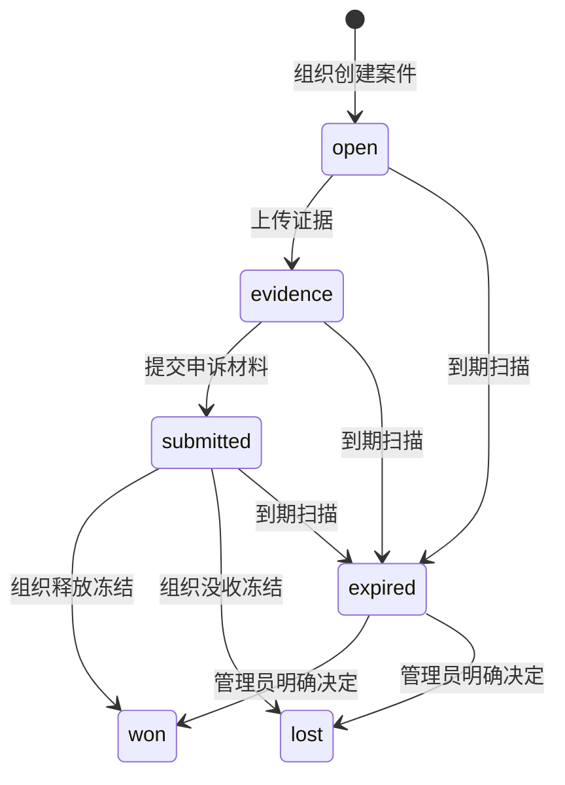

import { EnvUrls } from "/snippets/env-urls.jsx";

<EnvUrls lang="zh" />

CBPay 向付款所属账户提供争议与欺诈案件信息。账户可以读取案件、查看
不可变时间线、上传证据并下载组织生成的证据包。只有组织管理员可以
打开、提交或解决案件。

<Note>
账户 API 不能作出决定。成功上传只会新增不可变证据版本，不会改变案件结果。
</Note>

## 生命周期



案件到期后冻结仍然存在。到期只是运营信号，不会自动移动资金。

## 列出案件

```bash
curl "https://api.qbank.cl/platform/v1/disputes?from=2026-09-01&to=2026-09-30&page=1&page_size=50&status=open"   -H "Authorization: Bearer $ACCOUNT_TOKEN"
```

服务器始终按账户隔离数据；支持 `status`、`kind`、`from`、`to`、`page`
和 `page_size`。

```json
{
  "page": 1,
  "page_size": 50,
  "disputes": [
    {
      "dispute_id": "7c9e6679-7425-40de-944b-e07fc1f90ae7",
      "account_id": "5c4b3a29-1111-4222-8333-444455556666",
      "kind": "dispute",
      "status": "evidence",
      "currency": "USD",
      "disputed_usdt": "100.000000",
      "held_usdt": "100.000000",
      "underfunded": false,
      "case_number": "CASE-2026-00041",
      "source": "import",
      "opened_by": "admin:2c1...",
      "created_at": "2026-09-19T12:00:00Z",
      "updated_at": "2026-09-19T12:05:00Z",
      "deadline_at": "2026-10-01T00:00:00Z"
    }
  ]
}
```

## 详情、上传和下载证据

`GET /v1/disputes/{id}` 返回案件、`items`、`timeline` 和 `evidence`。
原始支付 payload 不会放入响应。

```bash
curl "https://api.qbank.cl/platform/v1/disputes/7c9e6679-7425-40de-944b-e07fc1f90ae7/evidence"   -H "Authorization: Bearer $ACCOUNT_TOKEN"
```

上传 PDF、PNG 或 JPG，最大 10 MB，multipart 字段必须叫 `file`：

```bash
curl -X POST "https://api.qbank.cl/platform/v1/disputes/7c9e6679-7425-40de-944b-e07fc1f90ae7/evidence"   -H "Authorization: Bearer $ACCOUNT_TOKEN"   -F "file=@receipt.pdf;type=application/pdf"
```

```json
{
  "evidence_id": "1f2...",
  "version": 2,
  "kind": "merchant_doc",
  "sha256": "b4e2...",
  "bytes": 482110,
  "created_at": "2026-09-19T12:10:00Z"
}
```

```bash
curl "https://api.qbank.cl/platform/v1/disputes/7c9e6679-7425-40de-944b-e07fc1f90ae7/evidence/2/download"   -H "Authorization: Bearer $ACCOUNT_TOKEN" -o evidence-v2.pdf
```

## Webhook

通过常规 webhook 订阅 `dispute_status_changed`：

```json
{
  "event": "opened",
  "dispute_id": "7c9e6679-7425-40de-944b-e07fc1f90ae7",
  "kind": "dispute",
  "status": "open",
  "account_id": "5c4b3a29-1111-4222-8333-444455556666",
  "disputed_usdt": "100.000000",
  "held_usdt": "100.000000",
  "case_number": "CASE-2026-00041",
  "deadline_at": "2026-10-01T00:00:00Z"
}
```

按 webhook event ID 去重。该事件只报告状态变化，不会替账户批准或拒绝案件。

## 错误

| HTTP | 代码 | 处理 |
|---:|---|---|
| 400 | `invalid_range` | 使用 `YYYY-MM-DD` 的 `from` 和 `to`。 |
| 400 | `invalid_payload` | 发送 multipart 文件和允许的 content type。 |
| 404 | `not_found` | 确认案件属于当前账户。 |
| 409 | `invalid_state` | 案件已关闭或不接受证据。 |
| 503 | `storage_unavailable` | 稍后重试上传，不要创建新案件。 |

完整错误请查看[错误目录](/zh/errors)。

## FAQ

<AccordionGroup>
<Accordion title="账户 API 可以释放或没收案件吗？">
不可以。决定属于组织管理员，并受 `disputes:write` 和双人审批保护。
</Accordion>
<Accordion title="案件到期会自动释放冻结吗？">
不会。扫描器只把案件设为 `expired` 并记录事件。
</Accordion>
<Accordion title="提交案件后还能上传证据吗？">
可以。`open`、`evidence` 和 `submitted` 接受账户证据；won、lost 和
expired 已关闭。
</Accordion>
</AccordionGroup>
