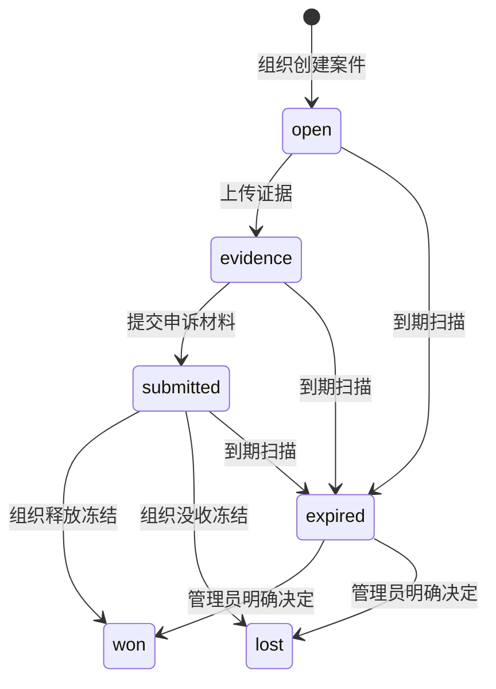

import { EnvUrls } from "/snippets/env-urls.jsx";

<EnvUrls lang="zh" />

CBPay 向付款所属账户提供争议与欺诈案件信息。账户可以读取案件、查看
不可变时间线、上传证据并下载组织生成的证据包。只有组织管理员可以
打开、提交或解决案件。

<Note>
账户 API 不能作出决定。成功上传只会新增不可变证据版本，不会改变案件结果。
</Note>

## 证据包内容

组织生成证据包后，账户可以下载与案件关联的同一份私有、需要认证的 PDF。
它包含类型化 payin 字段、账本/FIFO 证据和外部资金支出 reference。

对于卡 payin，证据包包含面向处理器的卡交易（交易 reference、授权、金额/
币种/日期、经过掩码的卡片详情、发卡方/国家、3DS、AVS/CVV、决策引擎
结果、设备 fingerprint 以及经过掩码的付款人上下文）。FIFO 支出包含
withdrawal 或 payout ID、资产/币种、状态、目标地址或银行 reference，
以及可用时的交易 hash。商户已验证的 KYB/KYC 身份会按处理器代表商户的
需要完整包含；付款人仍然经过掩码。原始 payin payload 和 PAN 相邻字段
不会包含在内。

## 按标识符打开案件

组织管理员可以从粘贴的标识符列表批量打开案件。去除空格并删除完全
重复的值后，列表必须包含 1–100 个非空唯一值。标识符可以是 payin ID、
幂等键、短引用、`qbank_reference` 或 `qbank_payin_id`。

两个接口都需要组织权限 `disputes:write`。Preview 只读：不会创建案件、
冻结资金或发送 webhook。

### 1. 预览列表

```bash
curl -X POST "https://api.qbank.cl/platform/v1/org/disputes/batch-preview" \
  -H "Authorization: Bearer $ADMIN_TOKEN" \
  -H "Content-Type: application/json" \
  -d '{
    "identifiers": [
      "9b8a7c6d-5e4f-4a3b-8c2d-1e0f9a8b7c6d",
      "payin-reference-2026-00041",
      "copied-value-with-no-match"
    ]
  }'
```

响应将唯一匹配与无法解析为单个 payin 的值分开。`ambiguous` 值最多包含
五个候选，每个候选包含 `payin_id`、`currency`、`local_amount` 和
`credited_at`。

```json
{
  "matched": [
    {
      "input": "9b8a7c6d-5e4f-4a3b-8c2d-1e0f9a8b7c6d",
      "payin_id": "9b8a7c6d-5e4f-4a3b-8c2d-1e0f9a8b7c6d",
      "account_id": "5c4b3a29-1111-4222-8333-444455556666",
      "method": "card",
      "currency": "USD",
      "local_amount": "100.00",
      "credited_usdt": "100.000000",
      "status": "credited",
      "has_open_case": false
    }
  ],
  "unmatched": [
    {
      "input": "copied-value-with-no-match",
      "reason": "not_found"
    }
  ]
}
```

预览也可能显示暂时不符合打开条件的 payin。确认前检查 `status` 和
`has_open_case`：batch-open 只会打开已 credited 且没有开放案件的 payin。

单笔打开案件和手动绑定导入行同样只接受状态为 `credited` 的 payin。
否则返回 `409 payin_not_credited`，不会创建冻结；batch 和导入流程会按项目
或行报告该情况。

### 2. 确认打开

发送相同标识符或完整粘贴列表，并提供一个 batch 幂等键。`kind` 默认是
`dispute`，也可以是 `fraud_hold`。

```bash
curl -X POST "https://api.qbank.cl/platform/v1/org/disputes/batch-open" \
  -H "Authorization: Bearer $ADMIN_TOKEN" \
  -H "Content-Type: application/json" \
  -H "Idempotency-Key: disputes-batch-2026-09-19-001" \
  -d '{
    "identifiers": [
      "9b8a7c6d-5e4f-4a3b-8c2d-1e0f9a8b7c6d",
      "payin-reference-2026-00041",
      "copied-value-with-no-match"
    ],
    "kind": "dispute",
    "idempotency_key": "disputes-batch-2026-09-19-001"
  }'
```

服务器会再次解析每个标识符，绝不信任客户端提交的 payin 或账户 ID。
每个已 credited 的 payin 都使用由 batch key 与 payin ID 派生的独立幂等键。

```json
{
  "results": [
    {
      "input": "9b8a7c6d-5e4f-4a3b-8c2d-1e0f9a8b7c6d",
      "payin_id": "9b8a7c6d-5e4f-4a3b-8c2d-1e0f9a8b7c6d",
      "status": "opened",
      "dispute_id": "7c9e6679-7425-40de-944b-e07fc1f90ae7"
    },
    {
      "input": "payin-reference-2026-00041",
      "payin_id": "6d5c4b3a-2f1e-4d3c-8b2a-1e0f9a8b7c6d",
      "status": "skipped",
      "reason": "case_already_open"
    },
    {
      "input": "copied-value-with-no-match",
      "status": "skipped",
      "reason": "not_found"
    }
  ],
  "summary": {
    "opened": 1,
    "skipped": 2,
    "failed": 0
  }
}
```

请求有效后，batch 响应始终为 `200`。`case_already_open`、`not_found`、
`ambiguous` 和 `not_credited` 都是逐项的 `skipped` 结果；金额无效或打开
失败是逐项的 `failed` 结果。使用相同 key 重放时，原始项目会以
`opened` 和 `idempotency_hit: true` 返回，不会创建第二个冻结。

空列表、空值、无效 `kind` 或超过 100 个唯一标识符都会返回
`invalid_payload`；不存在单独的顶层 `too_many` 错误码。缺少幂等键返回
`idempotency_key_required`，缺少组织 scope 返回 `org_required`。

## 生命周期



案件到期后冻结仍然存在。到期只是运营信号，不会自动移动资金。

## 列出案件

```bash
curl "https://api.qbank.cl/platform/v1/disputes?from=2026-09-01&to=2026-09-30&page=1&page_size=50&status=open"   -H "Authorization: Bearer $ACCOUNT_TOKEN"
```

服务器始终按账户隔离数据；支持 `status`、`kind`、`from`、`to`、`page`
和 `page_size`。

```json
{
  "page": 1,
  "page_size": 50,
  "disputes": [
    {
      "dispute_id": "7c9e6679-7425-40de-944b-e07fc1f90ae7",
      "account_id": "5c4b3a29-1111-4222-8333-444455556666",
      "kind": "dispute",
      "status": "evidence",
      "currency": "USD",
      "disputed_usdt": "100.000000",
      "held_usdt": "100.000000",
      "underfunded": false,
      "case_number": "CASE-2026-00041",
      "source": "import",
      "opened_by": "admin:2c1...",
      "created_at": "2026-09-19T12:00:00Z",
      "updated_at": "2026-09-19T12:05:00Z",
      "deadline_at": "2026-10-01T00:00:00Z"
    }
  ]
}
```

## 详情、上传和下载证据

`GET /v1/disputes/{id}` 返回案件、`items`、`timeline` 和 `evidence`。
原始支付 payload 不会放入响应。

```bash
curl "https://api.qbank.cl/platform/v1/disputes/7c9e6679-7425-40de-944b-e07fc1f90ae7/evidence"   -H "Authorization: Bearer $ACCOUNT_TOKEN"
```

上传 PDF、PNG 或 JPG，最大 10 MB，multipart 字段必须叫 `file`：

```bash
curl -X POST "https://api.qbank.cl/platform/v1/disputes/7c9e6679-7425-40de-944b-e07fc1f90ae7/evidence"   -H "Authorization: Bearer $ACCOUNT_TOKEN"   -F "file=@receipt.pdf;type=application/pdf"
```

```json
{
  "evidence_id": "1f2...",
  "version": 2,
  "kind": "merchant_doc",
  "sha256": "b4e2...",
  "bytes": 482110,
  "created_at": "2026-09-19T12:10:00Z"
}
```

```bash
curl "https://api.qbank.cl/platform/v1/disputes/7c9e6679-7425-40de-944b-e07fc1f90ae7/evidence/2/download"   -H "Authorization: Bearer $ACCOUNT_TOKEN" -o evidence-v2.pdf
```

## Webhook

通过常规 webhook 订阅 `dispute_status_changed`：

```json
{
  "event": "opened",
  "dispute_id": "7c9e6679-7425-40de-944b-e07fc1f90ae7",
  "kind": "dispute",
  "status": "open",
  "account_id": "5c4b3a29-1111-4222-8333-444455556666",
  "disputed_usdt": "100.000000",
  "held_usdt": "100.000000",
  "case_number": "CASE-2026-00041",
  "deadline_at": "2026-10-01T00:00:00Z"
}
```

按 webhook event ID 去重。该事件只报告状态变化，不会替账户批准或拒绝案件。

## 错误

| HTTP | 代码 | 处理 |
|---:|---|---|
| 400 | `invalid_range` | 使用 `YYYY-MM-DD` 的 `from` 和 `to`。 |
| 400 | `invalid_payload` | 发送 multipart 文件和允许的 content type。 |
| 404 | `not_found` | 确认案件属于当前账户。 |
| 409 | `invalid_state` | 案件已关闭或不接受证据。 |
| 503 | `storage_unavailable` | 稍后重试上传，不要创建新案件。 |

完整错误请查看[错误目录](/zh/errors)。

## FAQ

<AccordionGroup>
<Accordion title="账户 API 可以释放或没收案件吗？">
不可以。决定属于组织管理员，并受 `disputes:write` 和双人审批保护。
</Accordion>
<Accordion title="案件到期会自动释放冻结吗？">
不会。扫描器只把案件设为 `expired` 并记录事件。
</Accordion>
<Accordion title="提交案件后还能上传证据吗？">
可以。`open`、`evidence` 和 `submitted` 接受账户证据；won、lost 和
expired 已关闭。
</Accordion>
</AccordionGroup>

{/* banking-fase2-fiat-hold:2026-09-24 */}

## 本地法币

`credit_asset` 为 BOB、MXN、ARS 时返回 `409 dispute_fiat_unsupported`，不创建案件或冻结。批量跳过为 `fiat_unsupported`，导入标记 `payin holds local fiat (unsupported)`。
