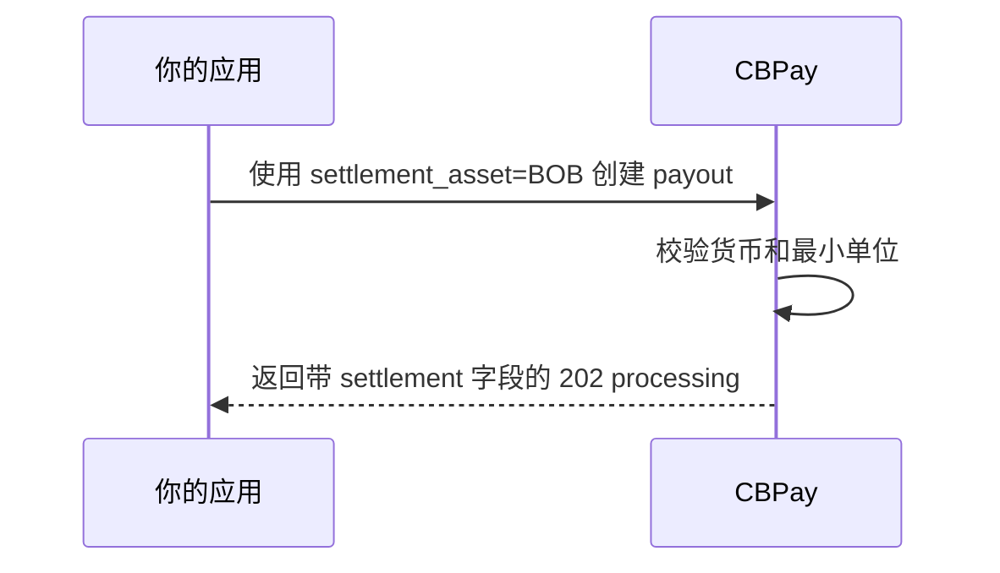

import { EnvUrls } from "/snippets/env-urls.jsx";

<EnvUrls lang="zh" />

<Note>
本页介绍 BOB、MXN 和 ARS 的同币种结算。不支持将一种法币余额转换为另一种
法币。
</Note>

当 payout 货币与 `settlement_asset` 相同时，payout 可以从本地法币余额
扣款。settlement rate 为 `"1"`，settlement spread 为零。以 USDT 配置的
费用会按锁定报价换算为 payout 货币，并向上取整到该货币的最小单位。



```bash
curl -X POST https://api.qbank.cl/platform/v1/payouts \
  -H "Authorization: Bearer <token>" \
  -H "Content-Type: application/json" \
  -H "Idempotency-Key: payout-bob-001" \
  -d '{
    "country": "BO",
    "currency": "BOB",
    "method": "bank_transfer",
    "local_amount": "100.00",
    "settlement_asset": "BOB",
    "beneficiary": {
      "name": "Ana Pérez",
      "country_code": "BO",
      "bank_code": "0016",
      "account_number": "1234567890",
      "account_type": "checking"
    },
    "idempotency_key": "payout-bob-001"
  }'
```

```json
{
  "payout_id": "7b2e…",
  "country": "BO",
  "currency": "BOB",
  "local_amount": "100.00",
  "settlement_asset": "BOB",
  "settlement_amount": "100.01",
  "settlement_rate": "1",
  "settlement_spread": "0",
  "platform_settlement_spread": "0",
  "status": "processing",
  "funds_debited": true
}
```

收款人收到 `100.00 BOB`；额外的 `0.01 BOB` 是已配置的费用，按本地
货币换算并向上取整。若 payout 失败，冻结的 `settlement_amount` 会原额
退回。

`GET /v1/rates` 会将本地法币资产标记为 `same_currency_only: true`：

```json
{
  "settlement": {
    "default_asset": "USD",
    "assets": [
      {
        "asset": "BOB",
        "available": true,
        "settlement_rate": "1",
        "same_currency_only": true
      }
    ]
  }
}
```

系统会拒绝 cross-fiat settlement。例如，MXN payout 不能从 BOB 余额扣款：

```json
{
  "error": "pricing_unavailable",
  "message": "fiat settlement is only available in the payout currency"
}
```

对于 BOB、MXN 和 ARS，超过两位小数的金额会返回 `400 invalid_amount`；
例如 `"100.001"`。请使用 payout 货币的最小单位，CBPay 不会静默四舍五入
本地金额。

请参阅[错误](../errors)了解公开错误契约。

<AccordionGroup>
<Accordion title="可以从 BOB 余额支付 MXN payout 吗？">
不可以。本版本的 cross-fiat settlement 不是 FX 转换路径。请选择 payout
货币或其他受支持的 settlement asset。
</Accordion>
<Accordion title="同币种法币会收取 settlement spread 吗？">
不会。同币种法币使用等额 rate 和零 settlement spread。已配置的费用仍会
收取并转换为法币。
</Accordion>
</AccordionGroup>

## USD 作为主账本资产

新账户创建时，`settlement_asset` 与 `payin_settlement_asset` 的默认值为
`USD`。已有账户如果明确使用 `USDT`，仍保持该设置；进行中的操作
不会重新报价。

USD 账本金额使用美分（两位小数）。直接入账、扣账、费用以及支持 USD
资产字段的 payout、checkout、POS 和卡片流程使用 USD。USD 与 USDT 之间
的 swap 按 1:1 计价，不使用 FX 预言机。BOB、MXN、ARS 仍是独立的法币
账本资产；v1 中这些资产的 money-out 定价仍不可用。

USD 主账户的 payin 直接入账时，响应包含 `credit_asset: USD` 以及以美分
表示的 fiat 入账金额；`usdt_credited` 仍用于 USD 等值报表。争议 hold
跟随实际入账资产：新的 USD 入账使用 `hold_asset: USD`，既有 USDT
案件仍使用 USDT。`disputed` 与 `held` 使用 hold 资产的单位；
`disputed_usdt` 与 `held_usdt` 是归一化后的等值字段。
