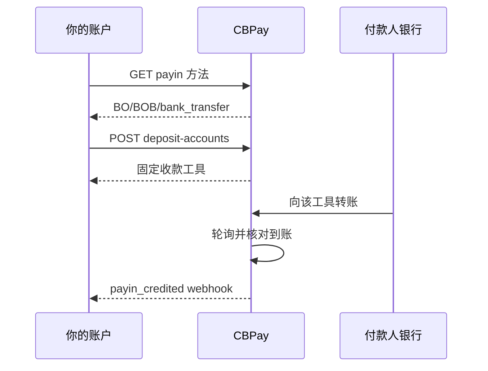

import { EnvUrls } from "/snippets/env-urls.jsx";

<EnvUrls lang="zh" />

**资金账户**是某一本地币种的充值目的地，其唯一工作就是收款：每笔到账
都会自动转换为USD——你的主余额。它是 deposit account 的默认
`purpose: "fondeo"`：按走廊创建一个，并把 instrument（账号、CLABE、
别名、IBAN）分享给你的付款人。

如果你需要**保留**本地法币用于 payout 而不是转换，那就是
[Banking](/zh/guides/banking)：用 `purpose: "banking"` 再创建一个目的地。
资金账户负责转换，Banking 负责保留。

## 资金账户 vs Banking

对于本地法币走廊（`BO/BOB`、`MX/MXN`、`AR/ARS`），每个 payin 目的地都
带一个 `purpose`，决定入账资金的去向：

| Purpose | 含义 |
|---|---|
| `fondeo`（默认） | **资金账户。**所有到账自动转换为USD——你的主余额。 |
| `banking` | **Banking 账户。**入账法币按本地币种保留，用于 payout，每个币种有独立余额。 |

不带 purpose 创建的目的地保留历史 `fondeo` 行为。banking purpose 仅支持
`BO/BOB/bank_transfer`、`MX/MXN/bank_transfer` 和 `AR/ARS/bank_transfer`；
其余一律是资金账户。

## 按币种的资金账户

### 🇦🇷 ARS — 阿根廷比索

通过专用 CVU 收款。CVU 在创建时使用**你选择的**银行别名
（`bank_alias` 必填）。入账比索自动转换为USD——你的主余额。

完整 deposit account 契约见 [payins](/zh/guides/payins)；要付款出去见
[payouts](/zh/guides/payouts)。

### 🇧🇴 BOB — 玻利维亚诺

通过专用银行转账账户收款。入账 BOB 自动转换为USD——你的主余额。

要付款出去（BOB 或 USD 银行转账，外加 QR），见
[payouts](/zh/guides/payouts) 中的玻利维亚页签。

### 🇲🇽 MXN — 墨西哥比索

通过专用 CLABE 收款。入账 MXN 自动转换为USD——你的主余额。

完整 deposit account 契约见 [payins](/zh/guides/payins)；要付款出去见
[payouts](/zh/guides/payouts)。

### 🇪🇺 EUR — 欧元

通过 `funding_usdt` 虚拟 IBAN 收款：入账欧元自动转换为USD——你的主
余额。（而 `banking_eur` IBAN 保留 `BANK_EUR` 用于 SEPA payout——那是
[Banking](/zh/guides/banking)。）

在 [Banking](/zh/guides/banking) 中申请和读取 IBAN；要付款出去见
[SEPA Instant payouts](/zh/guides/sepa-instant-payouts)。

## 资金流程



1. **确认走廊**（`GET /v1/payins/methods`）——在应用中启用付款选项前，
始终读取实时目录。
2. **创建或修复收款账户**（`POST /v1/payins/deposit-accounts`）——已验证
账户自动获得第一个目的地；企业可在已启用的走廊中添加更多。
3. **分享 instrument**——付款人发起普通的银行转账。
4. **接收到账**——CBPay 核对银行到账并发出 `payin_credited`；净额记入
USD——你的主余额。

该模式没有公告步骤：付款人永远不需要填写 `POST /v1/payins` 参考号。

## 1. 确认走廊

在应用中启用付款选项前，始终读取实时目录：

```bash
curl https://api.qbank.cl/platform/v1/payins/methods \
  -H "Authorization: Bearer <token>"
```

相关记录为：

```json
{
  "country": "BO",
  "currency": "BOB",
  "method": "bank_transfer",
  "delivery": "polling"
}
```

目录是唯一事实来源。即使 API 合同存在，组织也可能尚未启用该走廊。

## 2. 创建或修复收款账户

只有在账户自身的验证通过后，平台才会提供初始收款工具：
个人需要 KYC，企业需要 KYB。注册本身不会创建充值账户。已通过验证的
账户缺少工具时，也可以调用以下接口修复：

```bash
curl -X POST https://api.qbank.cl/platform/v1/payins/deposit-accounts \
  -H "Authorization: Bearer <token>" \
  -H "Content-Type: application/json" \
  -d '{
    "country": "BO",
    "currency": "BOB",
    "method": "bank_transfer"
  }'
```

响应 `201`：

```json
{
  "instrument_id": "1f4a…",
  "account_id": "9b1d…",
  "country": "BO",
  "currency": "BOB",
  "method": "bank_transfer",
  "instrument": "<receiving-account-number>",
  "details": {
    "account_number": "<receiving-account-number>",
    "alias": "CBPay Example BOB 20260919",
    "merchant_nit": "123456789",
    "bank_name": "Example Receiving Bank",
    "status": "ACTIVA"
  },
  "status": "active",
  "created_at": "2026-09-09T20:00:00Z"
}
```

将 `instrument` 作为收款账号提供给付款人。`instrument_id` 是 CBPay
的稳定标识；不要用 UUID 替换收款账号。返回时，`details.alias`、
`details.merchant_nit` 和 `details.bank_name` 是转账资料卡的展示字段；
缺失的可选字段不会被推断。

个人账户在每个国家/币种/方法上最多只有一个活动充值账户。企业账户只有
在已启用的走廊中才能创建不可变的额外目的地；目前支持的额外走廊是 `MX/MXN/bank_transfer`、`BO/BOB/bank_transfer` 和 `AR/ARS/bank_transfer`。每个目的地仍绑定到
同一个 CBPay 账户，到账按目的地 instrument 进行匹配。

验证通过后，账户的第一个走廊工具会自动提供。前面的请求也可
用于修复验证通过后缺失的工具。收款账户展示字段是可选的，不会被推断。该 BOB 流程不会创建用户选择的银行别名；AR/ARS 银行别名是 payins 指南中的独立契约。企业创建额外 BOB 目的地时，每个
目的地都必须使用新的幂等键：

```bash
curl -X POST https://api.qbank.cl/platform/v1/payins/deposit-accounts \
  -H "Authorization: Bearer <token>" \
  -H "Idempotency-Key: company-bob-001" \
  -H "Content-Type: application/json" \
  -d '{
    "country": "BO",
    "currency": "BOB",
    "method": "bank_transfer",
    "idempotency_key": "company-bob-001"
  }'
```

新 key 返回 `201` 和新的目的地。重放已完成的相同 key 返回 `200`、原始
instrument 以及 `idempotency_hit: true`；仍在处理中的并发重放可能返回
`409 idempotency_conflict`。供应商返回缺失或含糊时，系统会保留可核对
状态，不会静默重试。

## 3. 列出收款工具

列表已分页，并隐藏尚未得到真实收款号码的创建认领：

```bash
curl "https://api.qbank.cl/platform/v1/payins/deposit-accounts?page=1&page_size=50" \
  -H "Authorization: Bearer <token>"
```

```json
{
  "page": 1,
  "page_size": 50,
  "deposit_accounts": [
    {
      "instrument_id": "1f4a…",
      "account_id": "9b1d…",
      "country": "BO",
      "currency": "BOB",
      "method": "bank_transfer",
      "instrument": "<receiving-account-number>",
      "status": "active",
      "created_at": "2026-09-09T20:00:00Z"
    }
  ]
}
```

## 4. 接收并核对转账

此模式不使用 `POST /v1/payins` 公告。付款人向 `instrument` 转入
BOB。系统在有限日期窗口内轮询银行；已完成的到账会按银行参考号、ACH
订单号或确定性备用键去重。

到账匹配后，订阅 `payin_credited`，并使用 payin 资源读取最终金额和状态：

```bash
curl "https://api.qbank.cl/platform/v1/payins?country=BO&status=credited&from=2026-09-01&to=2026-09-10&page=1&page_size=50" \
  -H "Authorization: Bearer <token>"
```

适用标准 payin 费用和汇率规则。公开 API 不暴露银行供应商专属对象。

### 已入账 push 的工具与付款人字段

已入账 payin 仍通过普通列表/详情资源提供。若入账落在专用账户，请使用
`instrument_id` 与 `instrument`（`account_number`、`purpose`、`status`）
进行对账，也可用 `?instrument_id=<uuid>` 筛选列表。新入账还可能带有
`payer_source: "bank_event"` 和银行报告的 `payer` 区块。银行未报告的数据
会省略，历史付款人不会被补造，现有 screening 可能使入账进入审核。

## 状态与恢复

| 状态 | 含义 | 操作 |
|---|---|---|
| `active` | 收款账户可以提供给付款人 | 使用 `instrument` |
| `pending` | 配给或核对仍在进行 | 不要创建第二个账户 |
| `credited` | 转账已核对并入账 | 处理 `payin_credited` |
| `unassigned` | 到账无法路由到唯一账户 | 在运营页面中处理 |

超时后先读取列表。即使响应丢失，供应商也可能已经接受第一次请求。

## 错误

| HTTP | Code | 操作 |
|---:|---|---|
| 400 | `payin_corridor_unsupported` | 重新读取 `GET /v1/payins/methods`；走廊未启用 |
| 401 | `unauthorized` | 更新账户凭证 |
| 403 | `account_blocked` | 由组织运营方激活账户 |
| 422 | `deposit_account_limit_reached` | 使用现有工具；每个走廊只有一个目的地 |
| 502 | `deposit_account_failed` | 重试前先读取列表；不要假定供应商没有创建 |
| 502 | `core_unavailable` | 服务恢复后重试相同的逻辑操作 |
| 502 | `core_invalid_response` | 保留 claim 进行核对，持续失败时联系运营 |

## 常见问题

<AccordionGroup>
<Accordion title="同一账户可以供多个 CBPay 账户使用吗？">
不可以。目的地绑定到一个 CBPay 账户和一个组织。只向该账户的付款人提供
对应工具。
</Accordion>
<Accordion title="付款人需要 CBPay 账户吗？">
不需要。付款人使用自己的银行转账流程。CBPay 只需要收款工具处于活动状态，
并且银行报告到账。
</Accordion>
<Accordion title="可以删除或轮换账户吗？">
不可以。该走廊的工具不可变更。若银行报告异常，请联系运营方，不要盲目创建替代账户。
</Accordion>
<Accordion title="转账什么时候入账？">
该走廊使用轮询。最终时间取决于银行何时登记该笔流水；核对完成后才会发送 webhook。
</Accordion>
<Accordion title="资金账户还是 Banking——我需要哪一个？">
当每笔充值都应记入USD（你的主余额）时，选择默认的资金账户。当你需要为
payout 保留 BOB、MXN 或 ARS 本地余额时，选择带 `purpose: "banking"` 的
[Banking](/zh/guides/banking)。
</Accordion>
</AccordionGroup>
