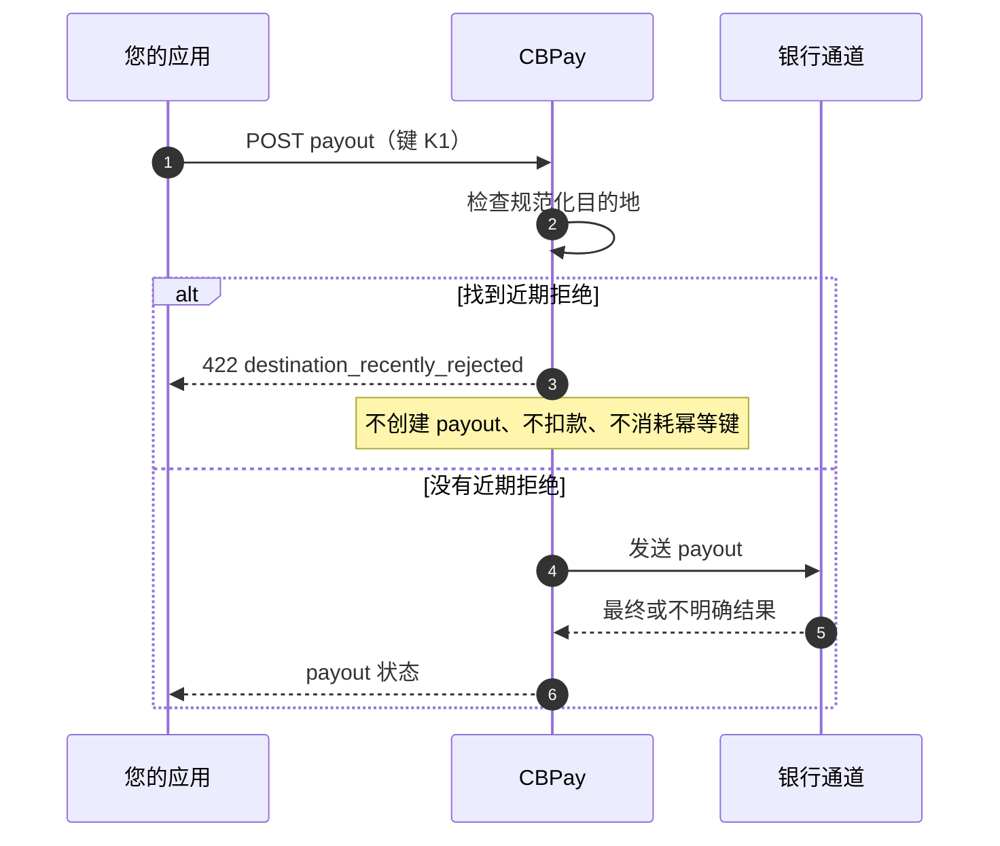

import { EnvUrls } from "/snippets/env-urls.jsx";

<EnvUrls lang="zh" />

完整错误契约请参阅[公开错误目录](/zh/errors)。

## 此保护机制的作用

部分银行通道会在银行近期拒绝某个目的地后保护该目的地。如果同一规范化
目的地最近被拒绝，CBPay 会在创建 payout、扣除余额或消耗幂等键之前停止
后续创建请求。

保护范围由账户以及规范化后的 `bank_code`、`account_number` 和 `tax_id`
组合确定。改变大小写或格式不能绕过保护。



## 安全处理顺序

1. 如果首次响应不明确，使用相同的 `idempotency_key` 完整重放原请求。
   这会返回原资源并带有 `idempotency_hit: true`，不会创建第二个 payout。
2. 如果响应为 `destination_recently_rejected`，原始幂等键没有被消耗。
   查看银行拒绝信息，并决定是否需要重试该目的地。
3. 明确重试必须使用**新的**幂等键，并将
   `options.destination_retry_ack` 设置为最近一次被拒 payout 的 ID。
4. 使用旧键但修改选项会返回 `409 idempotency_conflict`，不会改变原操作。
5. 没有近期拒绝的目的地以及其他通道继续走正常的校验和发送流程。

确认值代表明确的运营决定，而不是第二次自动尝试。

## 明确重试的请求

```json
{
  "country": "CL",
  "currency": "CLP",
  "method": "bank_transfer",
  "amount": "1000.00",
  "beneficiary": {
    "name": "Example Recipient",
    "bank_code": "012",
    "account_number": "123456789",
    "tax_id": "11111111-1"
  },
  "options": {
    "destination_retry_ack": "<prior_case_id>"
  },
  "idempotency_key": "payout-retry-0001"
}
```

确认值必须匹配同一账户、同一规范化目的地最近一次的拒绝案例。不要复制
其他账户或目的地的案例 ID。

## 响应示例

### 近期拒绝

```json
{
  "error": "destination_recently_rejected",
  "message": "destination was rejected by the bank on 2026-01-15 (prior case <prior_case_id>, code <prior_code>); retry with a new idempotency_key and options.destination_retry_ack=<prior_case_id> to confirm"
}
```

消息包含 UTC 拒绝日期、之前的案例 ID 和代码。公开响应不会暴露供应商身份。

### 使用旧键修改选项

```json
{
  "error": "idempotency_conflict",
  "message": "the idempotency key was already used with a different request"
}
```

## 状态与处理方式

| 响应或状态 | 含义 | 处理方式 |
| --- | --- | --- |
| `422 destination_recently_rejected` | 同一规范化目的地存在近期拒绝。未创建 payout，幂等键仍可用。 | 查看拒绝信息；原样重放，或使用新键和确认值明确重试。 |
| `409 idempotency_conflict` | 同一键被用于不同请求或选项。 | 保留原操作；只有真正的新操作才使用新键。 |
| `processing` | 结果尚未最终确定。 | 读取 payout 并等待最终 webhook/状态；不要创建新的 payout。 |
| `completed` | payout 已达到成功终态。 | 不需要重试。 |
| `failed` | payout 失败，扣款已按正常失败流程处理。 | 读取失败详情，修正请求后再开始新操作。 |

## 常见问题

<AccordionGroup>
<Accordion title="422 会创建 payout 吗？">
不会。保护机制在插入 payout 和扣款之前执行，也不会消耗提交的幂等键。
</Accordion>

<Accordion title="收到 422 后可以使用相同的键重试吗？">
可以，但只能用于完整重放原请求。查看拒绝后要明确重试时，必须使用新键和
确认值。
</Accordion>

<Accordion title="为什么只修改选项也会返回 409？">
选项属于幂等 payload 的一部分。使用同一键提交不同选项代表另一项请求，因此
CBPay 会拒绝它，而不会静默修改原操作。
</Accordion>

<Accordion title="所有 payout 通道都适用吗？">
不适用。保护机制只在启用它的通道上执行。其他通道以及没有近期拒绝的目的地
继续使用原有的校验和发送流程。
</Accordion>
</AccordionGroup>

